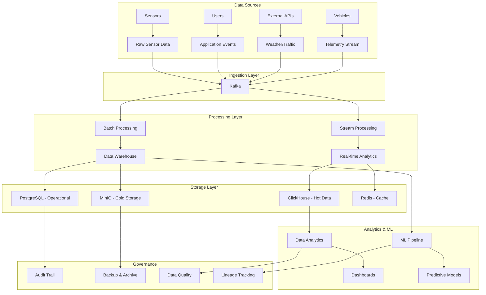

# AtlasMesh Fleet OS - Comprehensive Analysis & TODO List
## Abu Dhabi Autonomous Vehicle Fleet Management System

**Analysis Date:** December 2024  
**Current Status:** Phase 1 & 2 Implementation Complete  
**Next Phase:** Production Readiness & Data Ecosystem

---

## 🎯 **EXECUTIVE SUMMARY**

The AtlasMesh Fleet OS has achieved significant progress with a **92% agnostic architecture compliance** and complete infrastructure foundation. However, critical gaps remain in backend implementation, database ecosystem, and strategic documentation that must be addressed for production deployment in Abu Dhabi.

---

## 📊 **CURRENT COMPLETENESS ANALYSIS**

### 1. **Fleet Management System UI Completeness: 85%**

#### ✅ **Completed Components:**
- **Core Architecture:** 4-module consolidated UI (Operations Center, Planning & Scheduling, Fleet Management, Garage PC)
- **Navigation & Layout:** Complete sidebar navigation with role-based access
- **Shared Component Library:** StatusIndicator, DataTable, FormComponents with Abu Dhabi localization
- **Real-time Integration:** WebSocket hooks, performance monitoring, telemetry services
- **Pages Implemented:**
  - Dashboard (main overview)
  - OperationsCenter (live operations, alerts, KPIs)
  - FleetScheduling (trip planning, resource allocation)
  - VehicleManagement (asset lifecycle, maintenance)
  - GarageManagement (infrastructure monitoring)
  - Settings & Administration

#### ❌ **Missing UI Components:**
- **Advanced Analytics Dashboards:** Predictive maintenance, cost optimization, carbon tracking
- **Compliance Reporting Interface:** Audit trails, regulatory reports, evidence packages
- **Emergency Response Console:** Crisis management, incident coordination
- **Mobile-Responsive Views:** Tablet/phone optimization for field operations
- **Advanced Map Features:** 3D visualization, sensor overlays, traffic integration
- **Multi-language Support:** Full Arabic localization for UAE operations

### 2. **Backend Services Completeness: 60%**

#### ✅ **Implemented Services (Structure Only):**
- **Core Platform:** API Gateway, Fleet Manager, Policy Engine, Vehicle Gateway
- **Phase 2 Services:** Weather Fusion, Telemetry Ingestion, Predictive Maintenance, Garage Tools
- **Infrastructure:** Docker containers, Kubernetes manifests, CI/CD pipeline
- **Security:** mTLS certificates, RBAC, zero-trust network policies

#### ❌ **Critical Backend Gaps:**
- **Handler Implementation:** Most service endpoints return "Not implemented" (HTTP 501)
- **Business Logic:** Core algorithms for routing, dispatch, policy evaluation
- **Data Processing:** Telemetry aggregation, analytics computation, ML pipelines
- **Integration Logic:** External API connections, ERP/WMS adapters
- **Real-time Processing:** Event streaming, WebSocket message handling
- **Background Jobs:** Scheduled tasks, maintenance workflows, alert processing

### 3. **Database Ecosystem Completeness: 40%**

#### ✅ **Database Foundation:**
- **Schema Design:** Comprehensive PostgreSQL schema with 8 core tables
- **Multi-tenancy:** Organization-based data isolation
- **Audit Trail:** Cryptographically signed audit logging
- **Geospatial Support:** PostGIS for location-based operations
- **Time-series:** Telemetry snapshots with partitioning

#### ❌ **Missing Database Components:**
- **Stored Procedures:** Business logic, complex queries, data validation
- **Views & Materialized Views:** Performance optimization, reporting aggregations
- **Data Warehouse:** Historical analytics, OLAP cubes, data marts
- **ETL Pipelines:** Data transformation, cleansing, enrichment
- **Backup & Recovery:** Automated backups, point-in-time recovery
- **Performance Tuning:** Query optimization, indexing strategy
- **Data Governance:** Data quality rules, lineage tracking, privacy controls

---

## 🗄️ **COMPREHENSIVE DATA ECOSYSTEM DESIGN**

### **Core Data Architecture**

### **Sensor Data Collection Strategy**

#### **Critical Sensor Data to Store:**
1. **Location & Movement:**
   - GPS coordinates (lat/lng/altitude)
   - Heading, speed, acceleration
   - Odometer readings
   - Route adherence metrics

2. **Autonomy System:**
   - Autonomy level and confidence
   - ODD compliance status
   - Sensor fusion health
   - Decision reasoning logs

3. **Vehicle Health:**
   - Battery/fuel levels
   - Engine diagnostics
   - Tire pressure and wear
   - Component temperatures

4. **Environmental Context:**
   - Weather conditions
   - Traffic density
   - Road surface conditions
   - Visibility metrics

5. **Safety & Compliance:**
   - Emergency events
   - Policy violations
   - Human interventions
   - Incident reports

#### **Data Retention Strategy:**
- **Real-time (Redis):** Last 1 hour of critical data
- **Hot Storage (ClickHouse):** Last 30 days of detailed telemetry
- **Warm Storage (PostgreSQL):** 1 year of aggregated data
- **Cold Storage (MinIO):** 7+ years for compliance/audit

### **Dashboard & Visualization Requirements**

#### **Executive Dashboards:**
- Fleet utilization and efficiency metrics
- Cost per mile/trip analysis
- Safety incident trends
- Regulatory compliance status
- Carbon footprint tracking

#### **Operational Dashboards:**
- Real-time vehicle status and locations
- Trip progress and delays
- Alert management and escalation
- Resource allocation optimization
- Maintenance scheduling

#### **Technical Dashboards:**
- System performance metrics
- API response times and errors
- Database query performance
- Network connectivity status
- Security event monitoring

#### **Compliance Dashboards:**
- Audit trail visualization
- Policy compliance reports
- Evidence package generation
- Regulatory submission tracking
- Data residency compliance

---

## 🏗️ **COMPLETE SYSTEM ARCHITECTURE DIAGRAM**

```mermaid
graph TB
    subgraph "External Systems"
        GOV[UAE Government APIs]
        WEATHER[Weather Services]
        TRAFFIC[Traffic Management]
        ERP[ERP/WMS Systems]
        MAPS[Map Providers]
    end
    
    subgraph "Edge Layer - Abu Dhabi Vehicles"
        V1[Vehicle 1<br/>AUH_001]
        V2[Vehicle 2<br/>AUH_002]
        VN[Vehicle N<br/>AUH_XXX]
        
        subgraph "Vehicle Edge Stack"
            ROS[ROS2 Stack]
            EDGE[Edge Agent]
            SENS[Sensors]
        end
    end
    
    subgraph "Network Layer"
        LTE[LTE/5G]
        WIFI[Wi-Fi]
        SAT[Satellite]
        VPN[VPN Gateway]
    end
    
    subgraph "Cloud Infrastructure - Abu Dhabi Region"
        subgraph "API Gateway Layer"
            NGINX[Nginx Ingress]
            API[API Gateway]
            AUTH[Auth Service]
            RATE[Rate Limiting]
        end
        
        subgraph "Core Services"
            FM[Fleet Manager]
            PE[Policy Engine]
            VG[Vehicle Gateway]
            DS[Dispatch Service]
            RS[Routing Service]
        end
        
        subgraph "Operational Services"
            TI[Telemetry Ingestion]
            WF[Weather Fusion]
            PM[Predictive Maintenance]
            GT[Garage Tools]
            SM[Safety Monitor]
        end
        
        subgraph "Data Layer"
            PG[(PostgreSQL<br/>Operational Data)]
            CH[(ClickHouse<br/>Analytics)]
            RD[(Redis<br/>Cache)]
            S3[(MinIO<br/>Object Storage)]
            KF[Kafka<br/>Event Bus]
        end
        
        subgraph "Analytics & ML"
            ML[ML Pipeline]
            DT[Digital Twin]
            AN[Analytics Engine]
            RP[Report Generator]
        end
        
        subgraph "Security & Compliance"
            VAULT[HashiCorp Vault]
            CERT[Cert Manager]
            AUDIT[Audit Service]
            COMP[Compliance Engine]
        end
        
        subgraph "Monitoring & Observability"
            PROM[Prometheus]
            GRAF[Grafana]
            JAEG[Jaeger]
            LOGS[Log Aggregation]
        end
    end
    
    subgraph "User Interfaces"
        WEB[Control Center UI]
        MOB[Mobile App]
        API_CLI[API/CLI Tools]
    end
    
    subgraph "Integration Layer"
        ADAPT[Sector Adapters]
        SDK[Client SDKs]
        HOOK[Webhooks]
    end
    
    %% Connections
    V1 --> LTE
    V2 --> WIFI
    VN --> SAT
    
    LTE --> VPN
    WIFI --> VPN
    SAT --> VPN
    
    VPN --> NGINX
    NGINX --> API
    API --> AUTH
    
    API --> FM
    API --> PE
    API --> VG
    API --> DS
    
    FM --> PG
    PE --> PG
    VG --> KF
    DS --> PG
    
    KF --> TI
    TI --> CH
    TI --> S3
    
    WF --> WEATHER
    PM --> ML
    GT --> VAULT
    
    PROM --> GRAF
    JAEG --> LOGS
    
    WEB --> API
    MOB --> API
    
    GOV --> ADAPT
    ERP --> ADAPT
    ADAPT --> API
    
    CERT --> VAULT
    AUDIT --> COMP
    
    %% Styling
    classDef vehicle fill:#e1f5fe
    classDef service fill:#f3e5f5
    classDef data fill:#e8f5e8
    classDef security fill:#fff3e0
    classDef external fill:#fce4ec
    
    class V1,V2,VN,ROS,EDGE,SENS vehicle
    class FM,PE,VG,DS,RS,TI,WF,PM,GT,SM service
    class PG,CH,RD,S3,KF data
    class VAULT,CERT,AUDIT,COMP,AUTH security
    class GOV,WEATHER,TRAFFIC,ERP,MAPS external
```

---

## 📋 **COMPREHENSIVE TODO LIST**

### 🔴 **CRITICAL PRIORITY (Production Blockers)**

#### **Backend Implementation**
- [ ] **Implement Core Service Handlers** (Fleet Manager, Policy Engine, Vehicle Gateway)
  - [ ] Fleet management CRUD operations
  - [ ] Policy evaluation engine with OPA integration
  - [ ] Vehicle command processing and status updates
  - [ ] Real-time telemetry ingestion and processing

- [ ] **Database Stored Procedures & Functions**
  - [ ] Fleet analytics aggregation procedures
  - [ ] Vehicle health scoring algorithms
  - [ ] Route optimization queries
  - [ ] Compliance reporting functions

- [ ] **Real-time Data Processing**
  - [ ] Kafka message handlers for telemetry streams
  - [ ] WebSocket connection management
  - [ ] Event-driven architecture implementation
  - [ ] Background job processing (maintenance, alerts)

#### **Data Ecosystem Foundation**
- [ ] **Data Warehouse Implementation**
  - [ ] ClickHouse setup for hot path analytics
  - [ ] MinIO configuration for cold storage
  - [ ] ETL pipelines for data transformation
  - [ ] Data quality monitoring and validation

- [ ] **Analytics & Reporting Engine**
  - [ ] Executive dashboard data aggregation
  - [ ] Operational metrics calculation
  - [ ] Compliance report generation
  - [ ] Cost and carbon footprint tracking

### 🟡 **HIGH PRIORITY (Production Enhancement)**

#### **Advanced UI Components**
- [ ] **Analytics Dashboards**
  - [ ] Predictive maintenance dashboard
  - [ ] Cost optimization interface
  - [ ] Carbon tracking and reporting
  - [ ] Fleet utilization analytics

- [ ] **Compliance & Audit Interface**
  - [ ] Regulatory reporting dashboard
  - [ ] Evidence package generation
  - [ ] Audit trail visualization
  - [ ] Policy compliance monitoring

#### **Integration & External APIs**
- [ ] **UAE Government API Integration**
  - [ ] Traffic management system connection
  - [ ] Emergency services coordination
  - [ ] Regulatory reporting automation
  - [ ] Data residency compliance

- [ ] **ERP/WMS Adapters**
  - [ ] SAP integration for logistics
  - [ ] Oracle WMS connectivity
  - [ ] Custom ERP adapters
  - [ ] Data synchronization workflows

#### **Advanced Features**
- [ ] **Machine Learning Pipeline**
  - [ ] Predictive maintenance models
  - [ ] Route optimization algorithms
  - [ ] Demand forecasting
  - [ ] Anomaly detection

- [ ] **Digital Twin Implementation**
  - [ ] Vehicle simulation models
  - [ ] Scenario testing framework
  - [ ] Performance prediction
  - [ ] What-if analysis tools

### 🟢 **MEDIUM PRIORITY (Operational Excellence)**

#### **Mobile & Field Operations**
- [ ] **Mobile Application**
  - [ ] Field technician app
  - [ ] Driver/operator interface
  - [ ] Emergency response tools
  - [ ] Offline capability

- [ ] **Advanced Map Features**
  - [ ] 3D visualization
  - [ ] Sensor data overlays
  - [ ] Traffic integration
  - [ ] Route optimization display

#### **Performance & Scalability**
- [ ] **Database Optimization**
  - [ ] Query performance tuning
  - [ ] Index optimization
  - [ ] Partitioning strategy
  - [ ] Connection pooling

- [ ] **Caching Strategy**
  - [ ] Redis cluster setup
  - [ ] Application-level caching
  - [ ] CDN integration
  - [ ] Cache invalidation policies

### 🔵 **LOW PRIORITY (Future Enhancement)**

#### **Advanced Analytics**
- [ ] **AI/ML Enhancements**
  - [ ] Computer vision integration
  - [ ] Natural language processing
  - [ ] Advanced anomaly detection
  - [ ] Automated decision making

- [ ] **Marketplace Features**
  - [ ] Third-party app ecosystem
  - [ ] API marketplace
  - [ ] Plugin architecture
  - [ ] Revenue sharing models

---

## 📚 **MISSING STRATEGIC DOCUMENTATION**

### **Strategy Documents - CRITICAL GAPS:**

#### **docs/strategy/ - Missing Files:**
- [ ] **01_Executive_Summary_and_Vision.md** - ❌ **MISSING**
- [ ] **12_Product_Roadmap_and_Milestones.md** - ❌ **MISSING**

#### **docs/prd/ - Missing Files:**
- [ ] **01_Executive_Summary_and_Vision.md** - ❌ **MISSING**
- [ ] **02_Market_Insights_&_Jobs-To-Be-Done_JTBD.md** - ❌ **MISSING**
- [ ] **03_Objectives_and_Key_Results_OKRs.md** - ❌ **MISSING**
- [ ] **04_Metrics_Canon.md** - ❌ **MISSING**
- [ ] **05_Product_and_Marketplace_Strategy.md** - ❌ **MISSING**
- [ ] **06_Go_to_Market_Strategy.md** - ❌ **MISSING**
- [ ] **07_Risk_and_Governance.md** - ❌ **MISSING**

#### **docs/Technical/ - Gaps in Existing Files:**
- [ ] **02_Epics_and_Strategic_Alignment.md** - ✅ **EXISTS** but needs Abu Dhabi specifics
- [ ] **03_Requirements_FRs_NFRs.md** - ✅ **EXISTS** but needs validation
- [ ] **04_Data_and_Analytics_Integration.md** - ✅ **EXISTS** but needs data ecosystem details
- [ ] **05_Security_and_Compliance.md** - ✅ **EXISTS** but needs UAE compliance details
- [ ] **06_Operations_and_Runbooks.md** - ✅ **EXISTS** but needs operational procedures

---

## 🎯 **IMMEDIATE ACTION PLAN (Next 30 Days)**

### **Week 1-2: Backend Foundation**
1. Implement core service handlers (Fleet Manager, Policy Engine)
2. Set up real-time data processing with Kafka
3. Create essential stored procedures for fleet operations
4. Establish WebSocket connection handling

### **Week 3-4: Data Ecosystem**
1. Deploy ClickHouse for analytics
2. Set up MinIO for object storage
3. Implement basic ETL pipelines
4. Create executive dashboard data aggregation

### **Week 5-6: Integration & Testing**
1. Integrate UAE government APIs
2. Implement ERP/WMS adapters
3. Complete end-to-end testing
4. Performance optimization and tuning

### **Week 7-8: Documentation & Compliance**
1. Complete missing strategy documents
2. Finalize technical documentation
3. Conduct security and compliance review
4. Prepare for production deployment

---

## 📈 **SUCCESS METRICS**

- **Backend Completeness:** 95% of endpoints implemented and tested
- **Data Pipeline:** Real-time processing of 10,000+ telemetry messages/second
- **Dashboard Performance:** <2 second load times for all analytics views
- **API Response Times:** <100ms for 95th percentile
- **System Uptime:** 99.95% availability target
- **Compliance Score:** 100% UAE regulatory requirements met

---

**Next Review:** Weekly progress reviews with milestone tracking  
**Production Target:** Q1 2025 for Abu Dhabi deployment  
**Success Criteria:** Full autonomous vehicle fleet operational capability
