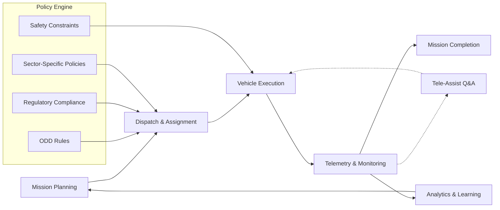
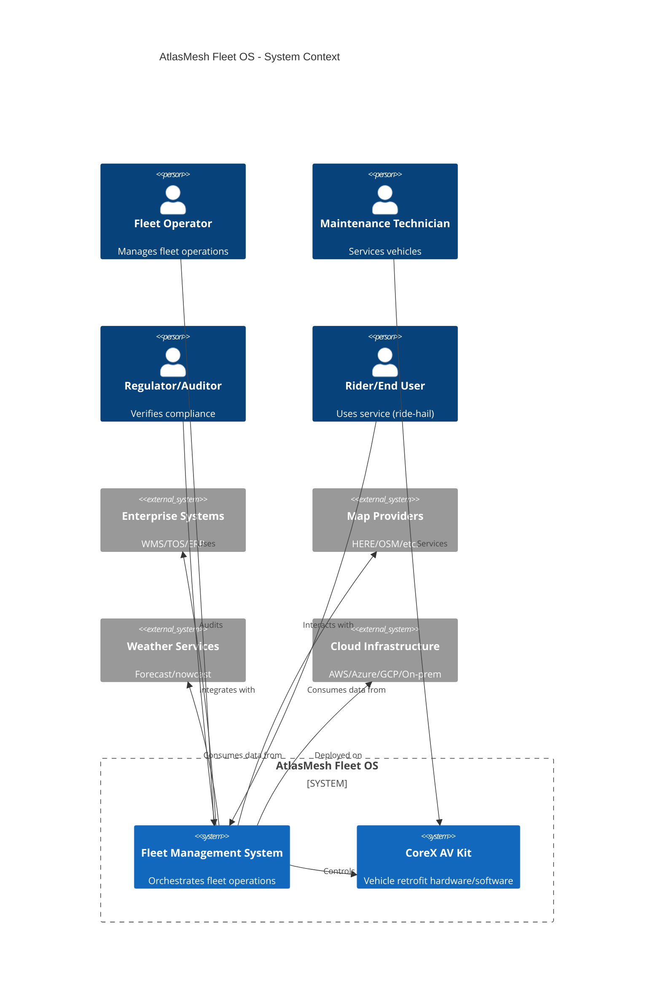

# AtlasMesh Fleet OS

**AtlasMesh Fleet OS** is a **vehicle-, platform-, sector- and sensor-agnostic** operating system for Level-4 autonomous fleets operating in harsh and regulated environments. It combines an AV retrofit kit (CoreX) with a comprehensive fleet management system to enable safe, efficient, and compliant autonomous operations across defense, mining, logistics, and ride-hail sectors.

[](LICENSE)
[](https://github.com/atlasmesh/fleet-os/actions)
[](docs/safety/safety_case_structure.md)
[](docs/README.md)

## What Sets Us Apart

- **Agnostic by Design**: One codebase, many overlays (sector/vehicle/city/tenant) - no forks
- **Safety & Compliance as Code**: Evidence-gated releases with auditable bundles
- **Extreme Weather Resilience**: Heat, dust, GPS-denied operation with graceful degradation
- **Adapter Marketplace**: Certified connectors for WMS/TOS/ERP with contract tests
- **Offline-First**: Up to 45-60 minutes of autonomy continuity with store-and-forward logs

## End-to-End Flow



## Key Features

### Core Platform
- **Policy Engine**: Rules-as-code for dispatch, ROE, degraded modes, and ODD limits
- **Trip Service**: Idempotent, sector-neutral lifecycle with FSM
- **Dispatch & Rebalancing**: Assignment/pooling with oscillation damping
- **Routing & ETA**: Constraint-aware routing with GNSS-deny resilience
- **Energy Manager**: SOC forecasts, charger queues and tariff optimization

### Operations & Safety
- **Fleet Health & Alerts**: Live KPIs and SLOs with runbooks
- **Predictive Maintenance**: RUL models driving work orders
- **Evidence Engine**: Safety bundles and audit kits for regulators
- **Weather Fusion**: Multi-source weather with credibility/freshness tradeoffs
- **Geospatial DB**: Data provenance tracking with lineage

### User Interfaces
- **Control Center**: Map-first operations console with trip timeline
- **Vehicle Management**: Fleet-wide health monitoring and management
- **Garage PC**: Bay/drive status, bulk OTA, and pre-provisioning
- **Tele-Assist**: Q&A interface (no direct driving) with assist budgets

### Integration & Security
- **Adapter SDK**: Certified connectors for enterprise systems
- **OTA Manager**: Signed, staged, and attested updates
- **V2X/PKI**: Secure vehicle-to-everything communication
- **Telemetry Ingest**: Schema-validated data pipeline

## Architecture & Tech Stack

### System Context (C4)



### Technology Stack

| Component | Technologies |
|-----------|-------------|
| **Backend Services** | Go, Rust, Python, Node.js |
| **Frontend** | React, TypeScript, WebGL |
| **Data Pipeline** | Kafka, Avro/Protobuf, dbt |
| **Storage** | PostgreSQL, TimescaleDB, S3/MinIO |
| **ML/Analytics** | PyTorch, MLflow, Feast |
| **Deployment** | Kubernetes, Helm, Terraform |
| **Observability** | Prometheus, Grafana, OpenTelemetry |
| **Security** | mTLS, Vault, SPIFFE/SPIRE |
| **Policy** | OPA/Rego, Cedar |

## Repository Structure

```
atlasmesh-fleet-os/
├─ README.md                             # This file
├─ ROADMAP.md                            # Canonical, living roadmap
├─ CONTRIBUTING.md                       # Contribution guidelines
├─ CODEOWNERS                            # Per-folder owners
├─ LICENSE                               # BUSL 1.1
├─ SECURITY.md                           # Security policy
├─ .github/                              # GitHub workflows and templates
├─ ADR/                                  # Architecture Decision Records
├─ docs/                                 # Documentation
│  ├─ Strategy/                          # Vision, market, OKRs, product strategy
│  ├─ Technical/                         # Architecture, requirements, APIs
│  ├─ prd/use-cases/                     # Use case specifications by sector
│  ├─ architecture/                      # Diagrams and technical designs
│  ├─ runbooks/                          # Operational procedures
│  ├─ safety/                            # Safety case documentation
│  ├─ compliance/                        # Regulatory compliance
│  └─ rfcs/                              # Request for Comments
├─ deploy/                               # Deployment configurations
├─ configs/                              # Configuration overlays
│  ├─ base/                              # Base configurations
│  ├─ sectors/                           # Sector-specific overlays
│  ├─ vehicles/                          # Vehicle-specific configurations
│  ├─ cities/                            # City/region configurations
│  └─ tenants/                           # Client-specific configurations
├─ rules/                                # Policy-as-code definitions
├─ services/                             # Core microservices
├─ adapters/                             # Integration adapters
├─ edge/                                 # Edge/vehicle components
├─ data/                                 # Data contracts and pipelines
├─ ml/                                   # Machine learning models
├─ sim/                                  # Simulation and digital twin
├─ ui/                                   # User interfaces
├─ tests/                                # Test suites
├─ compliance/                           # Compliance artifacts
├─ security/                             # Security artifacts
└─ tools/                                # Development tools
```

## Roadmap

| Phase | Timeline | Focus | Milestones |
|-------|----------|-------|------------|
| **P0: Scaffold** | Q1 | Repo, docs, CI basics, diagrams | README v1, Strategy docs, CI green |
| **P1: PRD depth** | Q1-Q2 | Use-case catalogs, policy/config overlays | 60+ use cases, 12 specs, hazards register |
| **P2: Sim/Twin Gates** | Q2 | Scenario bank, CI gates | 20 scenarios per sector passing in CI |
| **P3: Pilot Readiness** | Q2-Q3 | Site playbooks, compliance kits | Pilot checklists complete, dry run passed |
| **P4: Sector Pilots** | Q3-Q4 | Defense, mining, logistics, ride-hail pilots | Y1 promises met, metrics validated |

See [ROADMAP.md](ROADMAP.md) for the detailed roadmap and release plan.

## Prerequisites

- Docker 20.10+
- Kubernetes 1.24+ (for production deployment)
- Go 1.21+
- Node.js 18+
- Python 3.10+
- Rust 1.70+ (optional)

## Environment Setup

1. Clone the repository:
   ```bash
   git clone https://github.com/atlasmesh/fleet-os.git
   cd fleet-os
   ```

2. Run the bootstrap script:
   ```bash
   ./scripts/bootstrap.sh
   ```

3. Set up environment variables:
   ```bash
   cp configs/env/.env.example configs/env/.env
   # Edit .env with your configuration
   ```

## Running Locally

Start the core services with demo data:

```bash
./scripts/run_local.sh
```

This will:
- Start required services in Docker containers
- Seed demo data (vehicles, trips, maps)
- Launch the Control Center UI at http://localhost:3000

For sector-specific configurations:

```bash
./scripts/run_local.sh --sector defense
./scripts/run_local.sh --sector mining
./scripts/run_local.sh --sector logistics
./scripts/run_local.sh --sector ride-hail
```

## Testing

Run the test suite:

```bash
make test
```

Run specific test categories:

```bash
make test-unit        # Unit tests
make test-contract    # Contract tests for adapters
make test-integration # Integration tests
make test-e2e         # End-to-end tests
make test-sim         # Simulation tests
```

## Contributing

Please read [CONTRIBUTING.md](CONTRIBUTING.md) for details on our code of conduct, branch naming conventions, commit message format, and pull request process.

Key points:
- Fork the repository and create a feature branch
- Follow the coding style and documentation standards
- Add tests for new functionality
- Update documentation as needed
- Submit a pull request with a clear description

## Security

See [SECURITY.md](SECURITY.md) for details on:
- Vulnerability disclosure policy
- Security SLAs
- Reporting process
- PGP key for encrypted communication

## Compliance

AtlasMesh Fleet OS is designed to help meet regulatory requirements across sectors:

- ISO 26262 / ISO 21448 (SOTIF) for functional safety
- UNECE R155/R156 for cybersecurity and software updates
- ISO 21434 for automotive cybersecurity
- Data residency and privacy regulations

Compliance artifacts are generated automatically as part of the release process and stored in the `compliance/` directory.

## License

This project is licensed under the Business Source License 1.1 - see the [LICENSE](LICENSE) file for details.

## Contact

- Website: [atlasmesh.io](https://atlasmesh.io)
- Email: [info@atlasmesh.io](mailto:info@atlasmesh.io)
