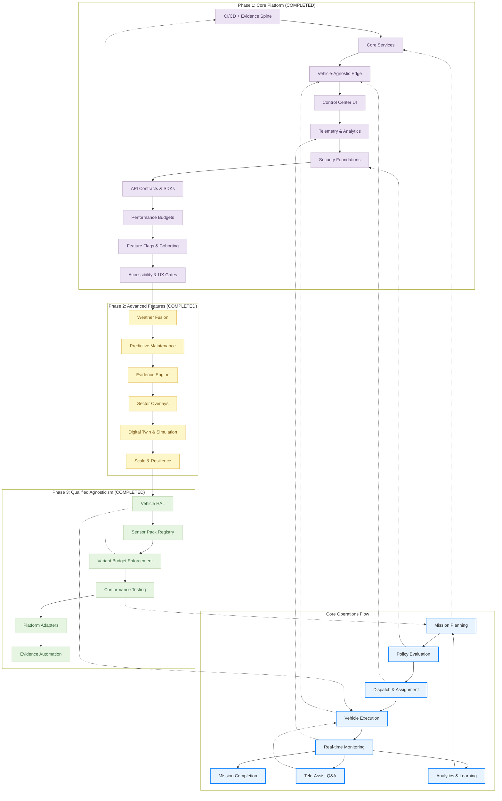
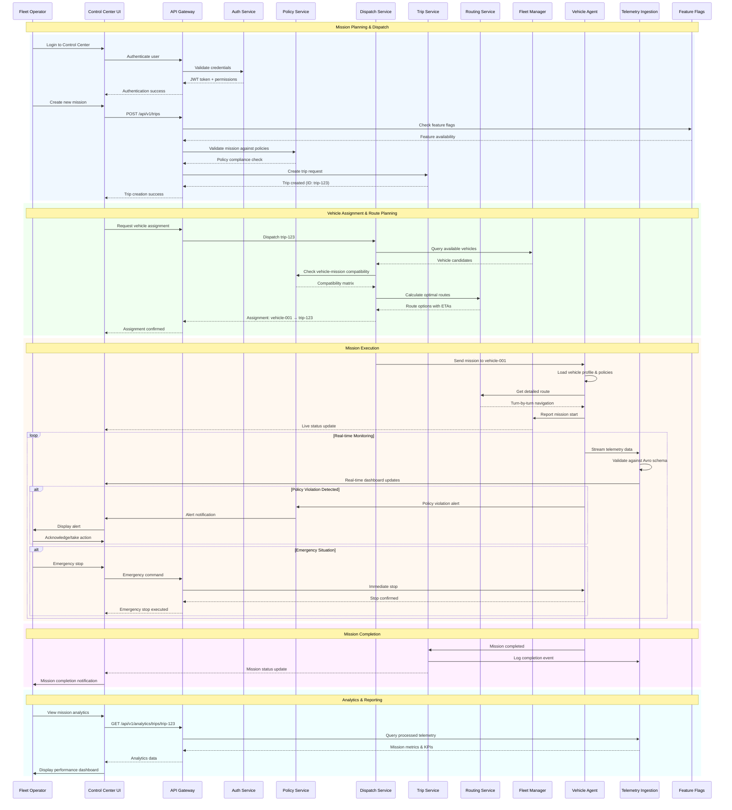
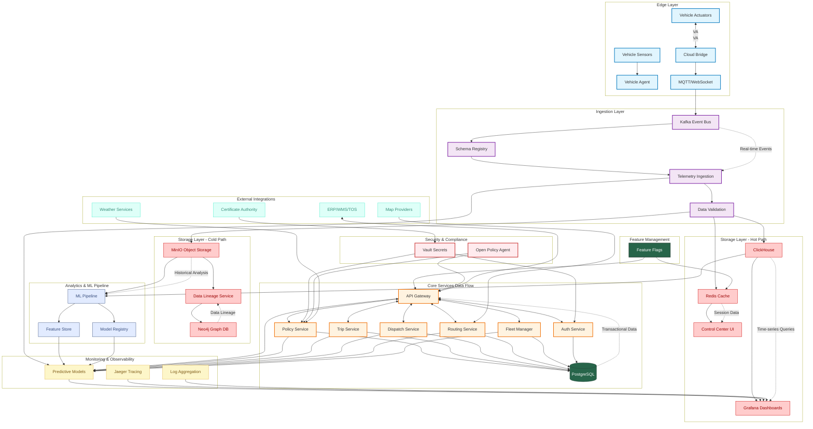
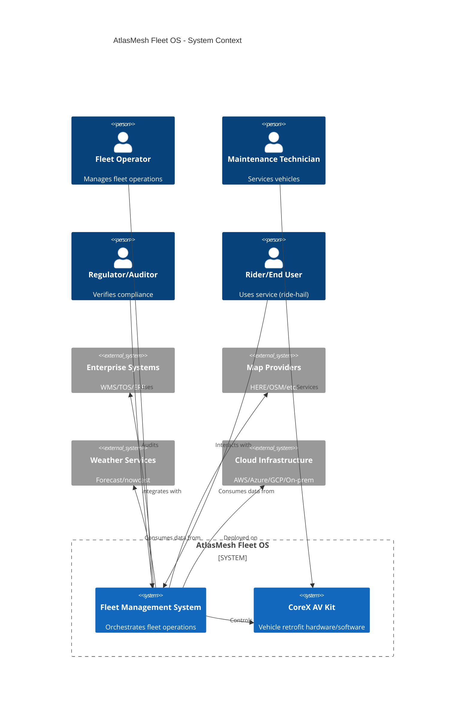
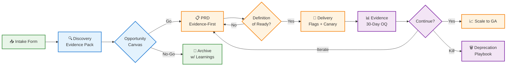

<div align="center">

# 🚗 AtlasMesh Fleet OS

**Engineering-Grounded Qualified Agnosticism for Level-4 Autonomous Fleets**

[](LICENSE)
[](https://github.com/atlasmesh/fleet-os/actions)
[](docs/safety/safety_case_structure.md)
[](docs/README.md)
[](docs/strategy/PM_COP_MAPPING.md)

</div>

---
<div align="center">
    
*The Universal AV Fleet Management system That Actually Works - One Codebase, Any Vehicle, Every Sector, Any Cloud*  🚀
<br>

| 🎯 **[What Makes AtlasMesh Different](#-what-makes-atlasmesh-different)** | ✨ **[Key Features](#-key-features)** | 🚙 **[Roadmap](#-roadmap)** | 🚀 **[Quick Start](#-quick-start)** |
|:---:|:---:|:---:|:---:|
| **Core Value Proposition** | **Technical Capabilities** | **Development Timeline** | **Get Started in Minutes** |

| 🏃‍♂️ **[Running Locally](#-running-locally)** | 🧪 **[Testing](#-testing)** | 🛡️ **[PM Framework](#product-management-framework)** | 📚 **[Documentation](#documentation)**  |
|:---:|:---:|:---:|:---:|
| **Local Development** | **Test Suite & Conformance** | **Product Management** | **Technical Documentation** |

</div>

---

## 🎯 What Makes AtlasMesh Different?

AtlasMesh Fleet OS implements **qualified agnosticism** - a pragmatic, engineering-grounded approach to autonomous fleet management. Rather than claiming universal compatibility, we achieve **bounded agnosticism** through:

<div align="center">

| 🚛 **Vehicle-Agnostic** | 🏭 **Sector-Agnostic** | ☁️ **Platform-Agnostic** | 📊 **Variant Budget** |
|:---:|:---:|:---:|:---:|
| ≤5% code delta | ≥90% code reuse | 100% conformance | Automated tracking |
| Certified profiles | Policy overlays | Contract-driven | CI/CD gates |

</div>

**Multi-Sector Support**: Defense → Mining → Logistics → Ride-hail  
**Multi-Platform**: Azure EKS → AWS EKS → On-prem K3s  
**Multi-Vehicle**: Terminal Tractors → Mine Hauls → UGVs → Passenger Vehicles 

---
## 🚨 **What's the Actual Need?**

Autonomous and semi-autonomous operations are scaling across **multiple vehicle types, sectors, and infrastructures**—but ops today are stitched together with single-OEM tools, bespoke scripts, and manual evidence collection. That creates five systemic gaps:

<div align="center">

| 🎯 **1. Fragmented Control** | 📋 **2. Safety & Compliance Drag** | 🏗️ **3. Site Onboarding Friction** | 👥 **4. Operator Overload** | 🔒 **5. Vendor/Platform Lock-in** |
|:---:|:---:|:---:|:---:|:---:|
| **Problem** | **Problem** | **Problem** | **Problem** | **Problem** |
| No single place to monitor, command, and troubleshoot mixed fleets | Evidence and policy conformance are manual, slow, and error-prone | Every new depot/city/sector feels "custom," inflating cost and time-to-value | Alerts, assists, and incidents lack context; triage is slow; handovers are risky | Cloud/provider specifics and vehicle peculiarities creep into the app layer |

</div>

**🎯 Bottom line:** Operators need a **single, autonomy-grade Fleet OS** that runs mixed fleets safely, proves compliance automatically, and scales across sectors and platforms without forking core code.

---

## 💎 **Value Proposition**

**AtlasMesh Fleet OS** is the **autonomy-grade, agnostic Fleet Operating System** that lets you operate **mixed-OEM, multi-sector fleets** with **built-in safety, compliance evidence, and site-ready tooling**—without forking your core.

### 🏗️ **The 7 Value Pillars (with Measurable Outcomes)**

<div align="center">

| 🎯 **1. Agnostic by Design** | 🛡️ **2. Safety & Compliance, Automated** | 🚀 **3. Live Operations that Scale** | 🏗️ **4. Rapid Site Onboarding** |
|:---:|:---:|:---:|:---:|
| **Outcome** | **Outcome** | **Outcome** | **Outcome** |
| New model/sector onboarded in **≤4–6 weeks** with zero core forks | **100% audit-ready** builds; evidence pack creation **↓ 80–90%** effort | **Assist rate ≤ 2 / 1,000 km**; **availability ≥ 99.0–99.5%** | First-site time-to-ops **≤ 90 days**; additional sites **≤ 30–45 days** |

| 💰 **5. Cost & Performance Control** | 🚀 **6. Developer & Partner Velocity** | 🤝 **7. Trust & Transparency** |
|:---:|:---:|:---:|
| **Outcome** | **Outcome** | **Outcome** |
| **TCO ↓ 15–25%**, energy spend **↓ 10–15%**, MTTR **≤ 1 hour** | Feature lead time **↓ 30–40%**; rollback ≤ **15 minutes** | Operator SUS **≥ 80**, faster investigations, fewer escalations |

</div>

### 🎯 **Business Impact You Can Commit To**

<div align="center">

| ⏰ **Time-to-Deploy** | 💰 **OpEx Reduction** | 📊 **Availability** | 📋 **Compliance** | 🚀 **Engineering** |
|:---:|:---:|:---:|:---:|:---:|
| ≤ 90 days (then ≤ 45 days) | 15–25% via assists ↓, energy/predictive maintenance | ≥ 99.0% (path to 99.5%) | Evidence generation **days → hours** | +30–40% without quality regressions |

</div>
---

## ✨ What Sets Us Apart

<div align="center">

| 🎯 **Qualified Agnosticism** | 🧪 **Programmatic Proof** | 🛡️ **Safety as Code** | 🔗 **Contract-Driven** | 🧪 **Multi-Dimensional** |
|:---:|:---:|:---:|:---:|:---:|
| Engineering-grounded bounded abstraction | 3-vehicle demo, 2-sector pilot | Automated evidence generation | Vehicle HAL, sector policies | Vehicle × Sector × Platform |
| ≤5% code delta enforcement | 90-180 day validation | ISO 26262/SOTIF/R155/R156 | Platform adapters | Test matrix with priority execution |

</div>

### 🚀 **Key Differentiators**

- **🎯 Evidence-First Product Management**: No PRD without evidence pack (5-7 interviews + telemetry + sim)
- **📊 Automated Variant Budget**: Real-time tracking with CI/CD gates and CCB workflow
- **🛡️ Safety-Certified**: Per-vehicle ISO 26262/SOTIF compliance with automated evidence
- **🌍 Extreme Weather Ready**: 55°C desert operations with thermal derating and dust protocols
- **🔄 Continuous Validation**: Multi-dimensional test matrix (3 vehicles × 4 sectors × 3 platforms = 36 critical paths)

## Overall Project Flow



## User Journey - Complete System Interactions



## Data Flow Diagram - Complete Platform Data Movement



## 🚀 Key Features

<div align="center">

### 🎯 **Qualified Agnosticism Services** *(Phase 3 - Completed)*

| 🚛 **Vehicle HAL** | 📊 **Variant Budget** | 🧪 **Conformance Testing** | 📦 **Sensor Packs** | ☁️ **Platform Adapters** |
|:---:|:---:|:---:|:---:|:---:|
| Profile-driven hardware abstraction | Automated delta tracking | Multi-dimensional test matrix | Certified packs (Rugged/Urban/Highway) | Storage/messaging/security abstraction |
| Terminal Tractor, Mine Haul, UTV | ≤5% code delta enforcement | 3×4×3 = 36 critical paths | Calibration automation | Azure/AWS/on-prem |

</div>

### 🏗️ **Core Platform**

<div align="center">

| ⚖️ **Policy Engine** | 🚌 **Trip Service** | 🎯 **Dispatch & Rebalancing** | 🗺️ **Routing & ETA** | ⚡ **Energy Manager** |
|:---:|:---:|:---:|:---:|:---:|
| Rules-as-code for dispatch | Idempotent, sector-neutral lifecycle | Assignment/pooling with oscillation damping | Constraint-aware routing | SOC forecasts, charger queues |
| ROE, degraded modes, ODD limits | FSM-based state management | Real-time optimization | GNSS-deny resilience | Tariff optimization |

</div>

### 🛡️ **Operations & Safety**

<div align="center">

| 📊 **Fleet Health** | 🔧 **Predictive Maintenance** | 📋 **Evidence Engine** | 🌤️ **Weather Fusion** | 🗺️ **Geospatial DB** |
|:---:|:---:|:---:|:---:|:---:|
| Live KPIs and SLOs | RUL models driving work orders | Safety bundles and audit kits | Multi-source weather | Data provenance tracking |
| Runbooks integration | Predictive analytics | Regulatory compliance | Credibility/freshness tradeoffs | Lineage tracking |

</div>

### 🖥️ **User Interfaces**

<div align="center">

| 🎮 **Control Center** | 🚛 **Vehicle Management** | 🔧 **Garage PC** | 🆘 **Tele-Assist** |
|:---:|:---:|:---:|:---:|
| Map-first operations console | Fleet-wide health monitoring | Bay/drive status, bulk OTA | Q&A interface (no direct driving) |
| Trip timeline visualization | Real-time diagnostics | Pre-provisioning | Assist budgets |

</div>

### 🔗 **Integration & Security**

<div align="center">

| 🔌 **Adapter SDK** | 📱 **OTA Manager** | 🔐 **V2X/PKI** | 📊 **Telemetry Ingest** |
|:---:|:---:|:---:|:---:|
| Certified connectors | Signed, staged, attested updates | Secure vehicle-to-everything | Schema-validated data pipeline |
| Enterprise systems | Automatic rollback | PKI-based authentication | Real-time processing |

</div>

## Architecture & Tech Stack

### System Context (C4)



### Technology Stack

| Component | Technologies |
|-----------|-------------|
| **Backend Services** | Go, Rust, Python, Node.js |
| **Frontend** | React, TypeScript, WebGL |
| **Data Pipeline** | Kafka, Avro/Protobuf, dbt |
| **Storage** | PostgreSQL, TimescaleDB, S3/MinIO |
| **ML/Analytics** | PyTorch, MLflow, Feast |
| **Deployment** | Kubernetes, Helm, Terraform |
| **Observability** | Prometheus, Grafana, OpenTelemetry |
| **Security** | mTLS, Vault, SPIFFE/SPIRE |
| **Policy** | OPA/Rego, Cedar |

## Repository Structure

```
atlasmesh-fleet-os/
├─ README.md                             # This file
├─ CONTRIBUTING.md                       # Contribution guidelines
├─ CODEOWNERS                            # Per-folder owners
├─ LICENSE                               # BUSL 1.1
├─ SECURITY.md                           # Security policy
├─ PRODUCTION_RUNBOOK.md                 # Production operations guide
├─ .github/                              # GitHub workflows and templates
├─ docs/                                 # Documentation
│  ├─ Strategy/                          # Vision, OKRs, Product strategy, Personas, Financials,  GTM, Roadmap
│  ├─ Technical/                         # Architecture, Epics, requirements(FRs, NFRs), APIs
│  │  ├─ 01_Architecture.md              # System architecture
│  │  ├─ 08_Qualified_Agnosticism.md     # Qualified agnosticism guide
│  │  ├─ 09_Five_Constraining_Realities.md  # Technical constraints
│  │  ├─ 10_Feasibility_Scorecard.md     # Feasibility analysis
│  │  ├─ 11_Agnostic_By_Contract.md      # Contract boundaries
│  │  ├─ 12_Cross_Department_Checklist.md   # Organizational checklist
│  │  ├─ 13_Programmatic_Proof_Points.md    # 90-180 day validation plan
│  │  └─ 14_Architecture_Reality_Check.md   # Implementation guide
│  ├─ ADR/                               # Architecture Decision Records
│  │  ├─ 0011-qualified-agnosticism.md   # ADR for qualified agnosticism
│  │  ├─ 0012-variant-budget-enforcement.md  # ADR for variant budgets
│  │  └─ 0013-conformance-testing.md     # ADR for conformance testing
│  ├─ use-cases/                         # Use case specifications by sector
│  ├─ architecture/                      # Diagrams and technical designs
│  ├─ diagrams/                          # ERDs, DFDs, Business flows, Sequence diagrams
│  └─ troubleshooting/                   # Troubleshooting guides
├─ configs/                              # Configuration overlays
│  ├─ base/                              # Base configurations
│  ├─ sectors/                           # Sector-specific overlays
│  ├─ vehicles/                          # Vehicle profiles (YAML)
│  │  ├─ terminal_tractor_v2.yaml        # Terminal Tractor profile
│  │  └─ mine_haul_400t.yaml             # Mine Haul truck profile
│  ├─ sensor-packs/                      # Sensor pack definitions (NEW)
│  │  ├─ schema.json                     # Sensor pack schema
│  │  ├─ rugged-a.json                   # Rugged Pack A (mining/defense)
│  │  ├─ urban-b.json                    # Urban Pack B (ride-hail/transit)
│  │  └─ highway-c.json                  # Highway Pack C (logistics)
│  ├─ cities/                            # City/region configurations
│  ├─ odd/                               # ODD rules by sector
│  └─ nfrs/                              # Non-functional requirements
├─ services/                             # 50+ microservices
│  ├─ vehicle-hal/                       # Vehicle Hardware Abstraction Layer (NEW)
│  ├─ variant-budget/                    # Variant Budget Enforcement (NEW)
│  ├─ conformance-testing/               # Conformance Testing Framework (NEW)
│  ├─ sensor-pack-registry/              # Sensor Pack Registry (NEW)
│  ├─ platform-adapters/                 # Platform Adapters (NEW)
│  ├─ policy-engine/                     # Policy Engine (Enhanced for sector overlays)
│  ├─ sector-overlays/                   # Sector Overlay Management
│  ├─ fleet-manager/                     # Fleet management
│  ├─ vehicle-gateway/                   # Vehicle communication
│  ├─ auth-service/                      # Authentication & authorization
│  └─ ... 40+ more services
├─ edge/                                 # Edge/vehicle components
│  ├─ vehicle-agent/                     # ROS2-based vehicle agent
│  ├─ cloud-bridge/                      # Cloud communication bridge
│  └─ ota-manager/                       # Over-the-air update manager
├─ ui/                                   # User interfaces
│  └─ control-center/                    # React-based control center
├─ testing/                              # Test suites
│  ├─ conformance/                       # Conformance test runner (NEW)
│  │  └─ runner.py                       # Multi-dimensional test matrix
│  ├─ e2e/                               # End-to-end tests
│  ├─ integration/                       # Integration tests
│  ├─ performance/                       # Performance tests
│  └─ chaos/                             # Chaos engineering tests
├─ database/                             # Database schemas and migrations
├─ infrastructure/                       # Infrastructure as code
└─ tools/                                # Development tools
```

## 🚚 Roadmap 🚙

<div align="center">

### 📅 **Development Phases**

| 🏗️ **Phase 1** | 🚀 **Phase 2** | 🎯 **Phase 3** | 🌟 **Phase 4** |
|:---:|:---:|:---:|:---:|
| **Months 1-6** | **Months 7-12** | **Months 13-18** | **Months 19-24** |
| Core Platform | Advanced Features | Qualified Agnosticism | Programmatic Validation |
| ✅ **COMPLETED** | ✅ **COMPLETED** | ✅ **COMPLETED** | 🔄 **IN PROGRESS** |

</div>

### 🎯 **Phase 3 Deliverables** *(Completed)*

<div align="center">

| 🚛 **Vehicle HAL** | 📦 **Sensor Packs** | 📊 **Variant Budget** | 🧪 **Conformance Testing** | ☁️ **Platform Adapters** | 📚 **Documentation** |
|:---:|:---:|:---:|:---:|:---:|:---:|
| Certified profiles | 3 certified packs | Automated delta tracking | Multi-dimensional matrix | Storage/messaging abstraction | 7 new docs + 3 ADRs |
| Terminal Tractor V2 | Rugged-A, Urban-B, Highway-C | CI/CD enforcement | 3×4×3 = 36 critical paths | Azure/AWS/on-prem | Complete technical docs |

</div>

### 🚀 **Phase 4 Milestones** *(90-180 Days)*

<div align="center">

| 🚗 **3-Vehicle Demo** | 🏭 **2-Sector Pilot** | ☁️ **2-Cloud Deploy** | 🔄 **Pack Swap** | 📋 **Evidence Bundle** |
|:---:|:---:|:---:|:---:|:---:|
| UTV + Terminal Tractor + Mine Haul | Defense + Mining overlays | Azure EKS + on-prem K3s | Rugged-A ↔ Urban-B | Automated regulatory compliance |
| ≥95% code reuse | ≥90% code share | 100% conformance | ≤30min swap time | Compliance artifacts |

</div>

> 📖 **Detailed Roadmap**: [Product Roadmap](docs/strategy/12_Product_Roadmap_and_Milestones.md) with PM CoP cadence and release plan

## 🛠️ Prerequisites

<div align="center">

| 🐳 **Docker** | ☸️ **Kubernetes** | 🐹 **Go** | 🟢 **Node.js** | 🐍 **Python** | 🦀 **Rust** |
|:---:|:---:|:---:|:---:|:---:|:---:|
| 20.10+ | 1.24+ (production) | 1.21+ | 18+ | 3.10+ | 1.70+ (optional) |

</div>

## 🚀 Quick Start

### 1️⃣ **Clone & Setup**

```bash
git clone https://github.com/atlasmesh/fleet-os.git
cd fleet-os
./scripts/bootstrap.sh
```

### 2️⃣ **Configure Environment**

```bash
cp configs/env/.env.example configs/env/.env
# Edit .env with your configuration
```

### 3️⃣ **Start Development Environment**

```bash
./scripts/run_local.sh
```

**This will start:**
- 🎮 Control Center UI: http://localhost:3000
- 📱 Mobile App: http://localhost:3001  
- 🔌 API Gateway: http://localhost:8080
- 📊 Grafana Dashboard: http://localhost:3001
- 📈 Prometheus Metrics: http://localhost:9090

## 🏃‍♂️ Running Locally

### **Full Stack Demo**

```bash
# Start all services with demo data
./scripts/run_local.sh
```

**This will:**
- 🐳 Start required services in Docker containers
- 🌱 Seed demo data (vehicles, trips, maps)
- 🎮 Launch the Control Center UI at http://localhost:3000

### **🏭 Sector-Specific Configurations**

<div align="center">

| 🛡️ **Defense** | ⛏️ **Mining** | 📦 **Logistics** | 🚗 **Ride-hail** |
|:---:|:---:|:---:|:---:|
| `--sector defense` | `--sector mining` | `--sector logistics` | `--sector ride-hail` |
| Military protocols | Heavy-duty operations | Supply chain optimization | Passenger transport |

</div>

```bash
./scripts/run_local.sh --sector defense
./scripts/run_local.sh --sector mining
./scripts/run_local.sh --sector logistics
./scripts/run_local.sh --sector ride-hail
```

## 🧪 Testing

### **Comprehensive Test Suite**

```bash
# Run all tests
make test
```

### **📊 Test Categories**

<div align="center">

| 🧪 **Unit Tests** | 📋 **Contract Tests** | 🔗 **Integration** | 🎯 **E2E Tests** | 🎮 **Simulation** | ✅ **Conformance** |
|:---:|:---:|:---:|:---:|:---:|:---:|
| `make test-unit` | `make test-contract` | `make test-integration` | `make test-e2e` | `make test-sim` | `make test-conformance` |
| Service logic | Adapter contracts | Cross-service | Full workflows | Scenario testing | Multi-dimensional |

</div>

```bash
make test-unit        # Unit tests
make test-contract    # Contract tests for adapters
make test-integration # Integration tests
make test-e2e         # End-to-end tests
make test-sim         # Simulation tests
make test-conformance # Multi-dimensional conformance testing (NEW)
```

### 🎯 **Qualified Agnosticism Conformance Testing**

**Multi-dimensional test matrix (3×4×3 = 36 critical paths)**

```bash
# Dry run to validate configuration
python testing/conformance/runner.py --dry-run

# Execute full conformance suite
python testing/conformance/runner.py

# Run specific priority level
python testing/conformance/runner.py --priority critical
python testing/conformance/runner.py --priority high
```

### **📊 Test Matrix Dimensions**

<div align="center">

| 🚛 **3 Vehicles** | 🏭 **4 Sectors** | ☁️ **3 Platforms** | 🎯 **36 Critical Paths** |
|:---:|:---:|:---:|:---:|
| ClassA_LightIndustrial | Defense | Azure EKS | Full test coverage |
| ClassB_HeavyDuty | Mining | AWS EKS | Priority execution |
| ClassC_Mining | Logistics | On-prem K3s | Evidence generation |
| | Ride-hail | | |

</div>

**📋 Evidence Output**: `testing/conformance/output/conformance_results_*.json`

## 🤝 Contributing

We welcome contributions! Please read [CONTRIBUTING.md](CONTRIBUTING.md) for details on our code of conduct, branch naming conventions, commit message format, and pull request process.

### **🚀 Quick Start for Contributors**

<div align="center">

| 🔀 **Fork & Branch** | 📝 **Code Standards** | 🧪 **Testing** | 📚 **Documentation** | 🔄 **Pull Request** |
|:---:|:---:|:---:|:---:|:---:|
| Fork repo → feature branch | Follow style guides | Write tests for new code | Update docs as needed | Clear description + tests |

</div>

### **📋 Key Requirements**

- ✅ Fork the repository and create a feature branch
- ✅ Follow the coding style and documentation standards  
- ✅ Add tests for new functionality
- ✅ Update documentation as needed
- ✅ Submit a pull request with a clear description

## 🔒 Security

<div align="center">

| 🛡️ **Vulnerability Disclosure** | ⏱️ **Security SLAs** | 📧 **Reporting Process** | 🔐 **PGP Encryption** |
|:---:|:---:|:---:|:---:|
| Coordinated disclosure | 24h response time | security@atlasmesh.io | Public key available |
| Responsible reporting | 7d patch timeline | Encrypted communication | Signed releases |

</div>

**📋 Full Details**: [SECURITY.md](SECURITY.md)

## 🛡️ Compliance & Safety Certification

AtlasMesh Fleet OS is designed to meet regulatory requirements across all supported sectors through **automated evidence generation**:

### **🚗 Automotive Safety Standards**

<div align="center">

| 📋 **ISO 26262** | 🎯 **ISO 21448 (SOTIF)** | 🔐 **UNECE R155** | 🔄 **UNECE R156** | 🛡️ **ISO 21434** |
|:---:|:---:|:---:|:---:|:---:|
| Functional safety | Safety of intended functionality | Cybersecurity requirements | Software update security | Automotive cybersecurity |
| Per-vehicle certification | Scenario-based validation | mTLS, PKI, threat modeling | Signed OTA, rollback | Engineering lifecycle |

</div>

### **🏭 Sector-Specific Compliance**

<div align="center">

| 🛡️ **Defense** | ⛏️ **Mining** | 📦 **Logistics** | 🚗 **Ride-hail** |
|:---:|:---:|:---:|:---:|
| NIST 800-53 | MSHA Part 56 | DOT regulations | Dubai RTA |
| Common Criteria | ISO 19296 | FMCSA compliance | Abu Dhabi DOT |
| STIG compliance | Mining machinery safety | | Local transport authority |

</div>

### **🔒 Data Privacy & Residency**

<div align="center">

| 🇪🇺 **GDPR** | 🇦🇪 **UAE PDPL** | 🎯 **Purpose Binding** | 🌍 **Data Residency** |
|:---:|:---:|:---:|:---:|
| European data protection | UAE Personal Data Protection | Data pipeline controls | Regional deployment |
| | | DPIA workflows | Compliance carve-outs |

</div>

### **🤖 Automated Evidence Generation**

**Compliance artifacts are generated automatically as part of the release process:**

<div align="center">

| 🛡️ **Safety Case Deltas** | 🎯 **SOTIF Validation** | 🔐 **Cybersecurity Evidence** | 📋 **Audit Trail** |
|:---:|:---:|:---:|:---:|
| Per-vehicle profile evidence | Scenario coverage & validation | UN R155/R156 compliance | Cryptographically signed logs |
| | | | |

</div>

**📦 Evidence Bundle Export**: One-click regulatory package export in `testing/conformance/output/`

## 📄 License

<div align="center">

**This project is licensed under the Business Source License 1.1**

📋 **Full License Details**: [LICENSE](LICENSE) file

</div>

## Product Management Framework

**AtlasMesh follows an evidence-first, outcome-driven product management framework** that ensures all features are strategically aligned, safely implemented, and measurably successful.

### **Framework Flow**



### **10 Ground Rules**
1. **Evidence before opinion** - No PRD without evidence pack (5-7 interviews + telemetry + sim)
2. **Traceability is mandatory** - Every FR/NFR → OKRs → Tests → SLIs → Evidence
3. **Agnostic by contract** - Profiles, packs, policies—not forks
4. **Variant budget is a constraint** - ≤5% code delta, ≤25% test delta per dimension
5. **Rollout ≠ release** - Flags, canaries, kill-switches required
6. **Safety & compliance are features** - They have owners, SLIs, gates
7. **Design is operational** - UI must perform under stress (WCAG 2.2 AA)
8. **Post-launch learning required** - 30-day OQ review closes loop
9. **Async excellence** - Comment in docs, decide in meetings
10. **Respect the clock** - Timeboxed reviews, documented decisions

### **PM Community of Practice (CoP)**

**Charter**: Standardize product craft, enforce traceability, govern variant budgets  
**Cadence**: Weekly intake, bi-weekly discovery, monthly roadmap/craft reviews, quarterly strategy alignment  
**Decision Model**: DACI (Driver-Approver-Contributors-Informed) for all cross-team decisions

**Full Charter**: [PM CoP in Executive Summary](docs/strategy/01_Executive_Summary_and_Vision.md#product-management-community-of-practice-pm-cop)

### **Key Documents & Templates**

**Strategy & Planning**:
- **[OKRs](docs/strategy/03_Objectives_and_Key_Results_OKRs.md)** - Company objectives and key results
- **[Metrics Canon](docs/strategy/04_Metrics_Canon.md)** - Single source of truth for all metrics
- **[Product Roadmap](docs/strategy/12_Product_Roadmap_and_Milestones.md)** - 18-month roadmap with PM CoP cadence
- **[Decision Log (DACI)](docs/strategy/Decision_Log_DACI.md)** - All product decisions recorded

**Templates & Playbooks**:
- **[Intake Form](docs/strategy/templates/Intake_Form.yaml)** - Single funnel for all requests
- **[Opportunity Canvas](docs/strategy/templates/Opportunity_Canvas.md)** - Evidence-based discovery
- **[Evidence-First PRD](docs/strategy/templates/PRD_Evidence_First.md)** - Comprehensive PRD template
- **[30-Day OQ Review](docs/strategy/templates/OQ_Review.md)** - Outcome quality assessment

**Playbooks**:
- **[Discovery](docs/strategy/playbooks/Discovery_Playbook.md)** - Evidence pack requirements
- **[Prioritization](docs/strategy/playbooks/Prioritization_Playbook.md)** - RICE × Safety × Variant-cost
- **[Beta Program](docs/strategy/playbooks/Beta_Program_Playbook.md)** - Safe rollout procedures
- **[Deprecation](docs/strategy/playbooks/Deprecation_Playbook.md)** - Feature sunset process

**Requirements & Governance**:
- **[Requirements (FRs/NFRs)](docs/Technical/03_Requirements_FRs_NFRs.md#2-functional-requirements-frs)** - With DoR/DoD checklists
- **[Epics & Alignment](docs/Technical/02_Epics_And_Strategic_Alignment.md)** - Epic-to-OKR mapping
- **[Cross-Department Checklist](docs/Technical/12_Cross_Department_Checklist.md)** - No-loopholes governance

---

## Documentation

### Quick Links
- [**Architecture Overview**](docs/Technical/01_Architecture.md) - Complete system architecture
- [**Qualified Agnosticism Guide**](docs/Technical/08_Qualified_Agnosticism.md) - Implementation approach
- [**Feasibility Scorecard**](docs/Technical/10_Feasibility_Scorecard.md) - Detailed feasibility analysis
- [**Programmatic Proof Points**](docs/Technical/13_Programmatic_Proof_Points.md) - 90-180 day validation plan
- [**Service Registry**](docs/Technical/07_Service_Registry.md) - All 50+ microservices documented
- [**API Reference**](docs/api/API_REFERENCE.md) - Complete API documentation
- [**Deployment Guide**](docs/deployment/DEPLOYMENT_GUIDE.md) - Production deployment procedures

### Qualified Agnosticism Documentation
- [**Five Constraining Realities**](docs/Technical/09_Five_Constraining_Realities.md) - Physics, safety, ODD, sensors, regulations
- [**Agnostic By Contract**](docs/Technical/11_Agnostic_By_Contract.md) - Contract-driven boundaries
- [**Cross-Department Checklist**](docs/Technical/12_Cross_Department_Checklist.md) - Organizational alignment
- [**Architecture Reality Check**](docs/Technical/14_Architecture_Reality_Check.md) - Concrete implementation

### Architecture Decision Records
- [**ADR-0011: Qualified Agnosticism**](docs/ADR/0011-qualified-agnosticism.md) - Framework decision
- [**ADR-0012: Variant Budget Enforcement**](docs/ADR/0012-variant-budget-enforcement.md) - Automated enforcement
- [**ADR-0013: Conformance Testing**](docs/ADR/0013-conformance-testing.md) - Multi-dimensional validation

---

**AtlasMesh Fleet OS - Engineering-Grounded Qualified Agnosticism for Autonomous Fleets** 🚗🚚🚕🚌🚙🚘🚐🚛💨
