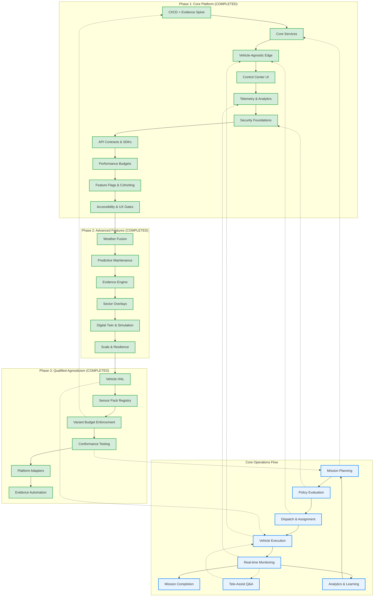
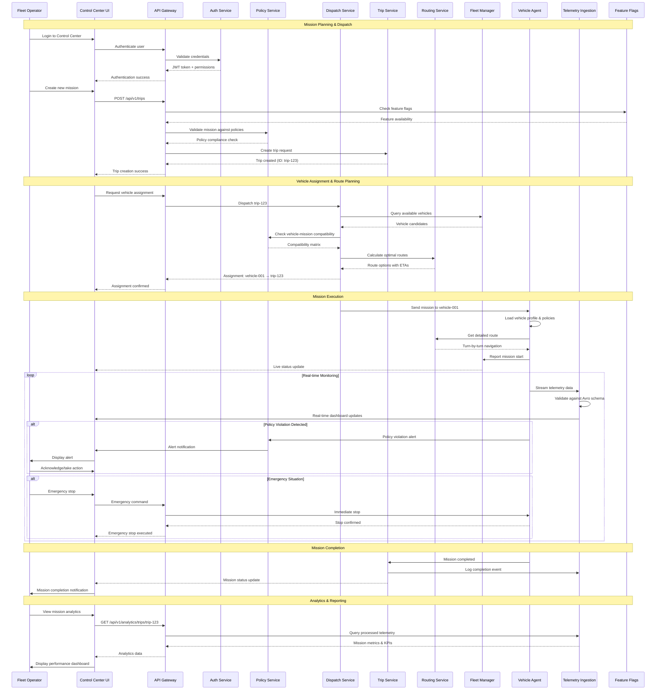
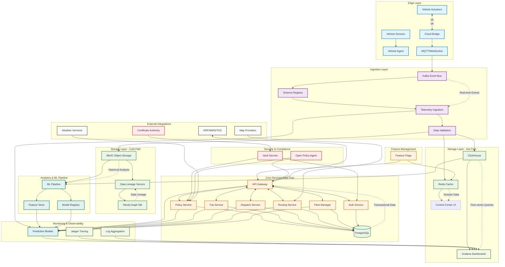
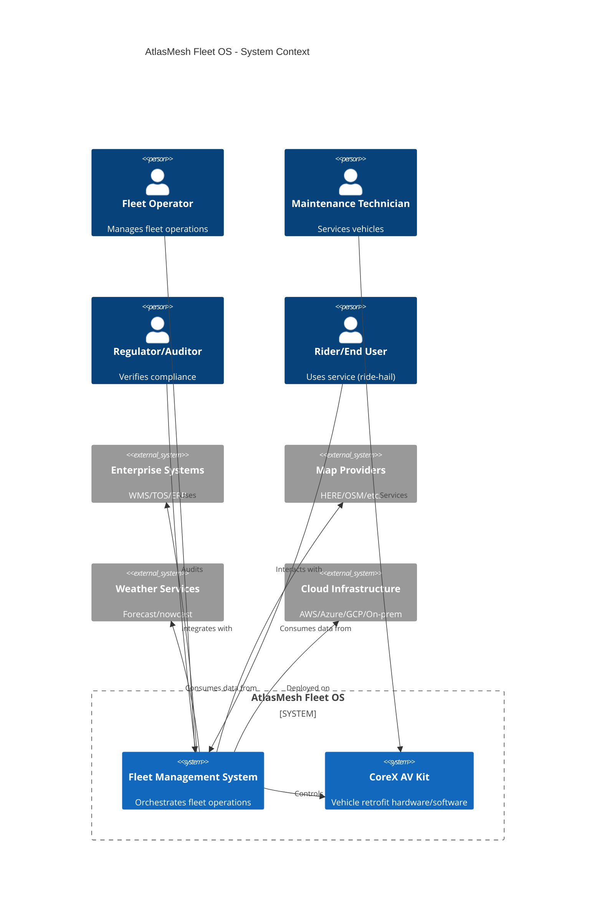

# AtlasMesh Fleet OS

**AtlasMesh Fleet OS** implements **qualified agnosticism** - a pragmatic, engineering-grounded operating system for Level-4 autonomous fleets. Rather than claiming universal compatibility, we achieve **bounded agnosticism** through:
- **Vehicle-Agnostic** (≤5% code delta): Class/model-bounded with certified profiles
- **Sector-Agnostic** (≥90% code reuse): Policy overlays for Defense → Mining → Logistics → Ride-hail
- **Platform-Agnostic** (100% conformance): Contract-driven infrastructure (Azure EKS → multi-cloud)
- **Variant Budget Enforcement**: Automated delta tracking with CI/CD gates and CCB workflow

[](LICENSE)
[](https://github.com/atlasmesh/fleet-os/actions)
[](docs/safety/safety_case_structure.md)
[](docs/README.md)

## What Sets Us Apart

- **Qualified Agnosticism**: Engineering-grounded bounded abstraction with automated variant budget enforcement (≤5% code delta)
- **Programmatic Proof Points**: 3-vehicle demo, 2-sector pilot, 2-cloud deploy validation within 90-180 days
- **Safety & Compliance as Code**: Automated evidence generation for ISO 26262/SOTIF/R155/R156
- **Contract-Driven Interfaces**: Vehicle HAL, sector policies, platform adapters with conformance testing
- **Multi-Dimensional Validation**: Vehicle × Sector × Platform test matrix with priority-based execution

## Overall Project Flow



## User Journey - Complete System Interactions



## Data Flow Diagram - Complete Platform Data Movement



## Key Features

### Qualified Agnosticism Services (Phase 3)
- **Vehicle HAL**: Profile-driven hardware abstraction (Terminal Tractor, Mine Haul, UTV, Defense, Passenger, Transit)
- **Variant Budget**: Automated delta tracking with ≤5% code delta enforcement and CI/CD gates
- **Conformance Testing**: Multi-dimensional test matrix (3 vehicles × 4 sectors × 3 platforms = 36 critical paths)
- **Sensor Pack Registry**: Certified packs (Rugged-A, Urban-B, Highway-C) with calibration automation
- **Platform Adapters**: Storage/messaging/security abstraction for Azure/AWS/on-prem

### Core Platform
- **Policy Engine**: Rules-as-code for dispatch, ROE, degraded modes, ODD limits, and sector overlays
- **Trip Service**: Idempotent, sector-neutral lifecycle with FSM
- **Dispatch & Rebalancing**: Assignment/pooling with oscillation damping
- **Routing & ETA**: Constraint-aware routing with GNSS-deny resilience
- **Energy Manager**: SOC forecasts, charger queues, and tariff optimization

### Operations & Safety
- **Fleet Health & Alerts**: Live KPIs and SLOs with runbooks
- **Predictive Maintenance**: RUL models driving work orders
- **Evidence Engine**: Safety bundles and audit kits for regulators
- **Weather Fusion**: Multi-source weather with credibility/freshness tradeoffs
- **Geospatial DB**: Data provenance tracking with lineage

### User Interfaces
- **Control Center**: Map-first operations console with trip timeline
- **Vehicle Management**: Fleet-wide health monitoring and management
- **Garage PC**: Bay/drive status, bulk OTA, and pre-provisioning
- **Tele-Assist**: Q&A interface (no direct driving) with assist budgets

### Integration & Security
- **Adapter SDK**: Certified connectors for enterprise systems
- **OTA Manager**: Signed, staged, and attested updates
- **V2X/PKI**: Secure vehicle-to-everything communication
- **Telemetry Ingest**: Schema-validated data pipeline

## Architecture & Tech Stack

### System Context (C4)



### Technology Stack

| Component | Technologies |
|-----------|-------------|
| **Backend Services** | Go, Rust, Python, Node.js |
| **Frontend** | React, TypeScript, WebGL |
| **Data Pipeline** | Kafka, Avro/Protobuf, dbt |
| **Storage** | PostgreSQL, TimescaleDB, S3/MinIO |
| **ML/Analytics** | PyTorch, MLflow, Feast |
| **Deployment** | Kubernetes, Helm, Terraform |
| **Observability** | Prometheus, Grafana, OpenTelemetry |
| **Security** | mTLS, Vault, SPIFFE/SPIRE |
| **Policy** | OPA/Rego, Cedar |

## Repository Structure

```
atlasmesh-fleet-os/
├─ README.md                             # This file
├─ CONTRIBUTING.md                       # Contribution guidelines
├─ CODEOWNERS                            # Per-folder owners
├─ LICENSE                               # BUSL 1.1
├─ SECURITY.md                           # Security policy
├─ PRODUCTION_RUNBOOK.md                 # Production operations guide
├─ .github/                              # GitHub workflows and templates
├─ docs/                                 # Documentation
│  ├─ strategy/                          # Vision, market, OKRs, product strategy
│  ├─ Technical/                         # Architecture, requirements, APIs
│  │  ├─ 01_Architecture.md              # System architecture
│  │  ├─ 08_Qualified_Agnosticism.md     # Qualified agnosticism guide
│  │  ├─ 09_Five_Constraining_Realities.md  # Technical constraints
│  │  ├─ 10_Feasibility_Scorecard.md     # Feasibility analysis
│  │  ├─ 11_Agnostic_By_Contract.md      # Contract boundaries
│  │  ├─ 12_Cross_Department_Checklist.md   # Organizational checklist
│  │  ├─ 13_Programmatic_Proof_Points.md    # 90-180 day validation plan
│  │  └─ 14_Architecture_Reality_Check.md   # Implementation guide
│  ├─ ADR/                               # Architecture Decision Records
│  │  ├─ 0011-qualified-agnosticism.md   # ADR for qualified agnosticism
│  │  ├─ 0012-variant-budget-enforcement.md  # ADR for variant budgets
│  │  └─ 0013-conformance-testing.md     # ADR for conformance testing
│  ├─ prd/use-cases/                     # Use case specifications by sector
│  ├─ architecture/                      # Diagrams and technical designs
│  ├─ diagrams/                          # Mermaid diagrams-as-code
│  └─ troubleshooting/                   # Troubleshooting guides
├─ configs/                              # Configuration overlays
│  ├─ base/                              # Base configurations
│  ├─ sectors/                           # Sector-specific overlays
│  ├─ vehicles/                          # Vehicle profiles (YAML)
│  │  ├─ terminal_tractor_v2.yaml        # Terminal Tractor profile
│  │  └─ mine_haul_400t.yaml             # Mine Haul truck profile
│  ├─ sensor-packs/                      # Sensor pack definitions (NEW)
│  │  ├─ schema.json                     # Sensor pack schema
│  │  ├─ rugged-a.json                   # Rugged Pack A (mining/defense)
│  │  ├─ urban-b.json                    # Urban Pack B (ride-hail/transit)
│  │  └─ highway-c.json                  # Highway Pack C (logistics)
│  ├─ cities/                            # City/region configurations
│  ├─ odd/                               # ODD rules by sector
│  └─ nfrs/                              # Non-functional requirements
├─ services/                             # 50+ microservices
│  ├─ vehicle-hal/                       # Vehicle Hardware Abstraction Layer (NEW)
│  ├─ variant-budget/                    # Variant Budget Enforcement (NEW)
│  ├─ conformance-testing/               # Conformance Testing Framework (NEW)
│  ├─ sensor-pack-registry/              # Sensor Pack Registry (NEW)
│  ├─ platform-adapters/                 # Platform Adapters (NEW)
│  ├─ policy-engine/                     # Policy Engine (Enhanced for sector overlays)
│  ├─ sector-overlays/                   # Sector Overlay Management
│  ├─ fleet-manager/                     # Fleet management
│  ├─ vehicle-gateway/                   # Vehicle communication
│  ├─ auth-service/                      # Authentication & authorization
│  └─ ... 40+ more services
├─ edge-stack/                           # Edge/vehicle components
│  └─ vehicle-agent/                     # ROS2-based vehicle agent
├─ ui/                                   # User interfaces
│  └─ control-center/                    # React-based control center
├─ testing/                              # Test suites
│  ├─ conformance/                       # Conformance test runner (NEW)
│  │  └─ runner.py                       # Multi-dimensional test matrix
│  ├─ e2e/                               # End-to-end tests
│  ├─ integration/                       # Integration tests
│  ├─ performance/                       # Performance tests
│  └─ chaos/                             # Chaos engineering tests
├─ database/                             # Database schemas and migrations
├─ infrastructure/                       # Infrastructure as code
└─ tools/                                # Development tools
```

## Roadmap

| Phase | Timeline | Focus | Milestones | Status |
|-------|----------|-------|------------|--------|
| **Phase 1** | Months 1-6 | Core Platform, Safety Framework, Edge Stack | Trip service, dispatch, routing, policy engine, control center | ✅ **COMPLETED** |
| **Phase 2** | Months 7-12 | Advanced Features, Production Readiness | Weather fusion, PdM, evidence engine, digital twin | ✅ **COMPLETED** |
| **Phase 3** | Months 13-18 | Qualified Agnosticism Implementation | Vehicle HAL, sensor packs, variant budget, conformance testing | ✅ **COMPLETED** |
| **Phase 4** | Months 19-24 | Programmatic Validation & Scale | 3-vehicle demo, 2-sector pilot, 2-cloud deploy, evidence bundle | 🔄 **IN PROGRESS** |

**Key Deliverables (Phase 3 - Completed)**:
- ✅ Vehicle HAL with certified profiles (Terminal Tractor V2, Mine Haul 400T)
- ✅ Sensor Pack Registry with 3 certified packs (Rugged-A, Urban-B, Highway-C)
- ✅ Variant Budget service with automated delta tracking and CI/CD enforcement
- ✅ Conformance Testing framework with multi-dimensional test matrix
- ✅ Platform Adapters for storage/messaging/security abstraction
- ✅ Complete technical documentation (7 new docs + 3 ADRs)

**Next Milestones (Phase 4 - 90-180 Days)**:
- 🎯 3-Vehicle Demo: UTV + Terminal Tractor + Mine Haul (≥95% code reuse)
- 🎯 2-Sector Pilot: Defense + Mining overlays (≥90% code share)
- 🎯 2-Cloud Deploy: Azure EKS + on-prem K3s (100% conformance)
- 🎯 Pack Swap: Rugged-A ↔ Urban-B (≤30min swap time)
- 🎯 Evidence Bundle: Automated regulatory compliance artifacts

See [Product Roadmap](docs/strategy/12_Product_Roadmap_and_Milestones.md) for the detailed roadmap and release plan.

## Prerequisites

- Docker 20.10+
- Kubernetes 1.24+ (for production deployment)
- Go 1.21+
- Node.js 18+
- Python 3.10+
- Rust 1.70+ (optional)

## Environment Setup

1. Clone the repository:
   ```bash
   git clone https://github.com/atlasmesh/fleet-os.git
   cd fleet-os
   ```

2. Run the bootstrap script:
   ```bash
   ./scripts/bootstrap.sh
   ```

3. Set up environment variables:
   ```bash
   cp configs/env/.env.example configs/env/.env
   # Edit .env with your configuration
   ```

## Running Locally

Start the core services with demo data:

```bash
./scripts/run_local.sh
```

This will:
- Start required services in Docker containers
- Seed demo data (vehicles, trips, maps)
- Launch the Control Center UI at http://localhost:3000

For sector-specific configurations:

```bash
./scripts/run_local.sh --sector defense
./scripts/run_local.sh --sector mining
./scripts/run_local.sh --sector logistics
./scripts/run_local.sh --sector ride-hail
```

## Testing

Run the test suite:

```bash
make test
```

Run specific test categories:

```bash
make test-unit        # Unit tests
make test-contract    # Contract tests for adapters
make test-integration # Integration tests
make test-e2e         # End-to-end tests
make test-sim         # Simulation tests
make test-conformance # Multi-dimensional conformance testing (NEW)
```

### Qualified Agnosticism Conformance Testing

Run the multi-dimensional conformance test matrix:

```bash
# Dry run to validate configuration
python testing/conformance/runner.py --dry-run

# Execute full conformance suite (3 vehicles × 4 sectors × 3 platforms = 36 tests)
python testing/conformance/runner.py

# Run specific priority level
python testing/conformance/runner.py --priority critical
python testing/conformance/runner.py --priority high
```

**Test Matrix Dimensions:**
- **Vehicles**: ClassA_LightIndustrial, ClassB_HeavyDuty, ClassC_Mining
- **Sectors**: defense, mining, logistics, ride_hail
- **Platforms**: azure_eks, aws_eks, on_prem_k3s

**Evidence Output**: `testing/conformance/output/conformance_results_*.json`

## Contributing

Please read [CONTRIBUTING.md](CONTRIBUTING.md) for details on our code of conduct, branch naming conventions, commit message format, and pull request process.

Key points:
- Fork the repository and create a feature branch
- Follow the coding style and documentation standards
- Add tests for new functionality
- Update documentation as needed
- Submit a pull request with a clear description

## Security

See [SECURITY.md](SECURITY.md) for details on:
- Vulnerability disclosure policy
- Security SLAs
- Reporting process
- PGP key for encrypted communication

## Compliance & Safety Certification

AtlasMesh Fleet OS is designed to meet regulatory requirements across all supported sectors through **automated evidence generation**:

### Automotive Safety Standards
- **ISO 26262**: Functional safety (per-vehicle model certification with automated evidence)
- **ISO 21448 (SOTIF)**: Safety of intended functionality (scenario-based validation)
- **UNECE R155**: Cybersecurity requirements (mTLS, PKI, threat modeling)
- **UNECE R156**: Software update security (signed OTA, rollback, attestation)
- **ISO 21434**: Automotive cybersecurity engineering

### Sector-Specific Compliance
- **Defense**: NIST 800-53, Common Criteria, STIG compliance
- **Mining**: MSHA Part 56, ISO 19296 (mining machinery safety)
- **Logistics**: DOT regulations, FMCSA compliance
- **Ride-hail**: Local transportation authority requirements (Dubai RTA, Abu Dhabi DOT)

### Data Privacy & Residency
- **GDPR**: European data protection regulation
- **UAE PDPL**: UAE Personal Data Protection Law
- **Purpose Binding**: Data pipeline controls with DPIA workflows
- **Data Residency**: Regional deployment carve-outs for compliance

### Automated Evidence Generation
Compliance artifacts are generated automatically as part of the release process:
- **Safety Case Deltas**: Per-vehicle profile evidence generation
- **SOTIF Validation**: Scenario coverage and validation evidence
- **Cybersecurity Evidence**: UN R155/R156 compliance documentation
- **Audit Trail**: Cryptographically signed decision logs

**Evidence Bundle Export**: One-click regulatory package export in `testing/conformance/output/`

## License

This project is licensed under the Business Source License 1.1 - see the [LICENSE](LICENSE) file for details.

## Documentation

### Quick Links
- **[Architecture Overview](docs/Technical/01_Architecture.md)** - Complete system architecture
- **[Qualified Agnosticism Guide](docs/Technical/08_Qualified_Agnosticism.md)** - Implementation approach
- **[Feasibility Scorecard](docs/Technical/10_Feasibility_Scorecard.md)** - Detailed feasibility analysis
- **[Programmatic Proof Points](docs/Technical/13_Programmatic_Proof_Points.md)** - 90-180 day validation plan
- **[Service Registry](docs/Technical/07_Service_Registry.md)** - All 50+ microservices documented
- **[API Reference](docs/api/API_REFERENCE.md)** - Complete API documentation
- **[Deployment Guide](docs/deployment/DEPLOYMENT_GUIDE.md)** - Production deployment procedures

### Qualified Agnosticism Documentation
- **[Five Constraining Realities](docs/Technical/09_Five_Constraining_Realities.md)** - Physics, safety, ODD, sensors, regulations
- **[Agnostic By Contract](docs/Technical/11_Agnostic_By_Contract.md)** - Contract-driven boundaries
- **[Cross-Department Checklist](docs/Technical/12_Cross_Department_Checklist.md)** - Organizational alignment
- **[Architecture Reality Check](docs/Technical/14_Architecture_Reality_Check.md)** - Concrete implementation

### Architecture Decision Records
- **[ADR-0011: Qualified Agnosticism](docs/ADR/0011-qualified-agnosticism.md)** - Framework decision
- **[ADR-0012: Variant Budget Enforcement](docs/ADR/0012-variant-budget-enforcement.md)** - Automated enforcement
- **[ADR-0013: Conformance Testing](docs/ADR/0013-conformance-testing.md)** - Multi-dimensional validation

## Contact

- Website: [atlasmesh.io](https://atlasmesh.io)
- Email: [info@atlasmesh.io](mailto:info@atlasmesh.io)
- Documentation: [docs.atlasmesh.io](https://docs.atlasmesh.io)

---

**AtlasMesh Fleet OS - Engineering-Grounded Qualified Agnosticism for Autonomous Fleets** 🚗💨
