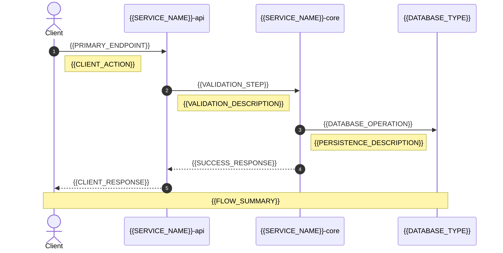

# {{SERVICE_NAME}}

> **TL;DR:** {{SERVICE_DESCRIPTION}}

<!-- BEGIN:DIAGRAM-STRIP -->
<p align="center">
  <a href="{{C4_DIAGRAM_PATH}}">
    
  </a>
  <a href="{{SEQUENCE_DIAGRAM_PATH}}">
    
  </a>
  <a href="{{DATA_DIAGRAM_PATH}}">
    
  </a>
</p>

**📊 Visual Overview:** *Where it fits* • *How it talks* • *What it owns*
<!-- END:DIAGRAM-STRIP -->

## 🔗 **Contracts & APIs**

| Type | Specification | Description |
|------|---------------|-------------|
| **REST API** | [`{{OPENAPI_PATH}}`]({{OPENAPI_PATH}}) | {{API_DESCRIPTION}} |
| **Events** | [`{{EVENTS_PATH}}`]({{EVENTS_PATH}}) | {{EVENTS_DESCRIPTION}} |
| **Database** | [`{{SCHEMA_PATH}}`]({{SCHEMA_PATH}}) | {{DATABASE_DESCRIPTION}} |

## ⚡ **How it works** *(10-second tour)*



## 🚀 **Quick Start**

### **Development**
```bash
# Start service locally
make dev.{{SERVICE_SLUG}}

# Run tests
make test.{{SERVICE_SLUG}}

# Debug mode
make debug.{{SERVICE_SLUG}}
```

### **Production**
```bash
# Deploy to environment
make deploy.{{SERVICE_SLUG}} ENV={{ENVIRONMENT}}

# Health check
curl {{HEALTH_ENDPOINT}}

# Metrics
curl {{METRICS_ENDPOINT}}
```

## 📈 **SLOs & Performance**

| Metric | Target | Current | Trend |
|--------|--------|---------|-------|
| **P95 Latency** | {{LATENCY_TARGET}} | {{LATENCY_CURRENT}} | {{LATENCY_TREND}} |
| **Availability** | {{AVAILABILITY_TARGET}} | {{AVAILABILITY_CURRENT}} | {{AVAILABILITY_TREND}} |
| **Error Rate** | {{ERROR_RATE_TARGET}} | {{ERROR_RATE_CURRENT}} | {{ERROR_RATE_TREND}} |
| **Throughput** | {{THROUGHPUT_TARGET}} | {{THROUGHPUT_CURRENT}} | {{THROUGHPUT_TREND}} |

**Error Budget:** {{ERROR_BUDGET}} | **Burn Rate:** {{BURN_RATE}}

## 🏗️ **Architecture**

### **Key Components**
- **{{COMPONENT_1}}** - {{COMPONENT_1_DESCRIPTION}}
- **{{COMPONENT_2}}** - {{COMPONENT_2_DESCRIPTION}}
- **{{COMPONENT_3}}** - {{COMPONENT_3_DESCRIPTION}}

### **Dependencies**
```mermaid
graph TB
    {{SERVICE_NAME}}[{{SERVICE_NAME}}]
    
    subgraph "Upstream Dependencies"
        {{UPSTREAM_1}}[{{UPSTREAM_1}}]
        {{UPSTREAM_2}}[{{UPSTREAM_2}}]
    end
    
    subgraph "Downstream Dependencies"
        {{DOWNSTREAM_1}}[{{DOWNSTREAM_1}}]
        {{DOWNSTREAM_2}}[{{DOWNSTREAM_2}}]
    end
    
    {{UPSTREAM_1}} --> {{SERVICE_NAME}}
    {{UPSTREAM_2}} --> {{SERVICE_NAME}}
    {{SERVICE_NAME}} --> {{DOWNSTREAM_1}}
    {{SERVICE_NAME}} --> {{DOWNSTREAM_2}}
    
    classDef service fill:#e1f5fe,stroke:#01579b,stroke-width:2px
    classDef upstream fill:#f3e5f5,stroke:#4a148c,stroke-width:2px
    classDef downstream fill:#e8f5e8,stroke:#1b5e20,stroke-width:2px
    
    class {{SERVICE_NAME}} service
    class {{UPSTREAM_1}},{{UPSTREAM_2}} upstream
    class {{DOWNSTREAM_1}},{{DOWNSTREAM_2}} downstream
```

## 🔧 **Configuration**

### **Environment Variables**
| Variable | Description | Default | Required |
|----------|-------------|---------|----------|
| `{{ENV_VAR_1}}` | {{ENV_VAR_1_DESC}} | `{{ENV_VAR_1_DEFAULT}}` | {{ENV_VAR_1_REQUIRED}} |
| `{{ENV_VAR_2}}` | {{ENV_VAR_2_DESC}} | `{{ENV_VAR_2_DEFAULT}}` | {{ENV_VAR_2_REQUIRED}} |

### **Feature Flags**
- `{{FEATURE_FLAG_1}}` - {{FEATURE_FLAG_1_DESC}}
- `{{FEATURE_FLAG_2}}` - {{FEATURE_FLAG_2_DESC}}

## 🛡️ **Security & Compliance**

### **Authentication & Authorization**
- **Authentication:** {{AUTH_METHOD}}
- **Authorization:** {{AUTHZ_METHOD}}
- **Encryption:** {{ENCRYPTION_METHOD}}

### **Compliance**
- **UAE AV Regulations:** {{UAE_COMPLIANCE}}
- **Data Privacy:** {{PRIVACY_COMPLIANCE}}
- **Safety Standards:** {{SAFETY_COMPLIANCE}}

## 📊 **Monitoring & Observability**

### **Dashboards**
- **Service Health:** [{{HEALTH_DASHBOARD_URL}}]({{HEALTH_DASHBOARD_URL}})
- **Performance:** [{{PERF_DASHBOARD_URL}}]({{PERF_DASHBOARD_URL}})
- **Business Metrics:** [{{BUSINESS_DASHBOARD_URL}}]({{BUSINESS_DASHBOARD_URL}})

### **Alerts**
- **Critical:** {{CRITICAL_ALERTS}}
- **Warning:** {{WARNING_ALERTS}}
- **Info:** {{INFO_ALERTS}}

### **Logs**
```bash
# View service logs
kubectl logs -f deployment/{{SERVICE_NAME}} -n {{NAMESPACE}}

# Search specific events
kubectl logs deployment/{{SERVICE_NAME}} -n {{NAMESPACE}} | grep "{{LOG_PATTERN}}"
```

## 🧪 **Testing**

### **Test Coverage**
- **Unit Tests:** {{UNIT_TEST_COVERAGE}}%
- **Integration Tests:** {{INTEGRATION_TEST_COVERAGE}}%
- **E2E Tests:** {{E2E_TEST_COVERAGE}}%

### **Test Commands**
```bash
# Unit tests
make test.unit.{{SERVICE_SLUG}}

# Integration tests  
make test.integration.{{SERVICE_SLUG}}

# Load tests
make test.load.{{SERVICE_SLUG}}

# Security tests
make test.security.{{SERVICE_SLUG}}
```

## 🔄 **CI/CD Pipeline**

### **Build Stages**
1. **Lint & Format** - Code quality checks
2. **Unit Tests** - Fast feedback loop
3. **Security Scan** - Vulnerability assessment
4. **Integration Tests** - Service contract validation
5. **Build & Push** - Container image creation
6. **Deploy** - Environment-specific deployment

### **Deployment Strategy**
- **Development:** {{DEV_DEPLOYMENT_STRATEGY}}
- **Staging:** {{STAGING_DEPLOYMENT_STRATEGY}}
- **Production:** {{PROD_DEPLOYMENT_STRATEGY}}

## 📚 **Documentation & Resources**

### **Technical Documentation**
- **ADR:** [`{{ADR_PATH}}`]({{ADR_PATH}}) - Architecture decisions
- **API Docs:** [`{{API_DOCS_PATH}}`]({{API_DOCS_PATH}}) - Detailed API reference
- **Runbooks:** [`{{RUNBOOKS_PATH}}`]({{RUNBOOKS_PATH}}) - Operational procedures

### **Development Resources**
- **Contributing:** [`CONTRIBUTING.md`](../../CONTRIBUTING.md)
- **Code Style:** [`STYLE_GUIDE.md`](../../STYLE_GUIDE.md)
- **Security:** [`SECURITY.md`](../../SECURITY.md)

## 🆘 **Support & Troubleshooting**

### **Common Issues**
| Issue | Symptoms | Solution |
|-------|----------|----------|
| {{ISSUE_1}} | {{SYMPTOMS_1}} | {{SOLUTION_1}} |
| {{ISSUE_2}} | {{SYMPTOMS_2}} | {{SOLUTION_2}} |

### **Getting Help**
- **On-call:** {{ONCALL_CONTACT}}
- **Slack:** {{SLACK_CHANNEL}}
- **Issues:** [GitHub Issues]({{GITHUB_ISSUES_URL}})

---

**📅 Last Updated:** {{LAST_UPDATED}} | **🔄 Auto-generated from:** [`{{MANIFEST_PATH}}`]({{MANIFEST_PATH}})

**🎯 Service Owner:** {{SERVICE_OWNER}} | **📧 Contact:** {{CONTACT_EMAIL}}
