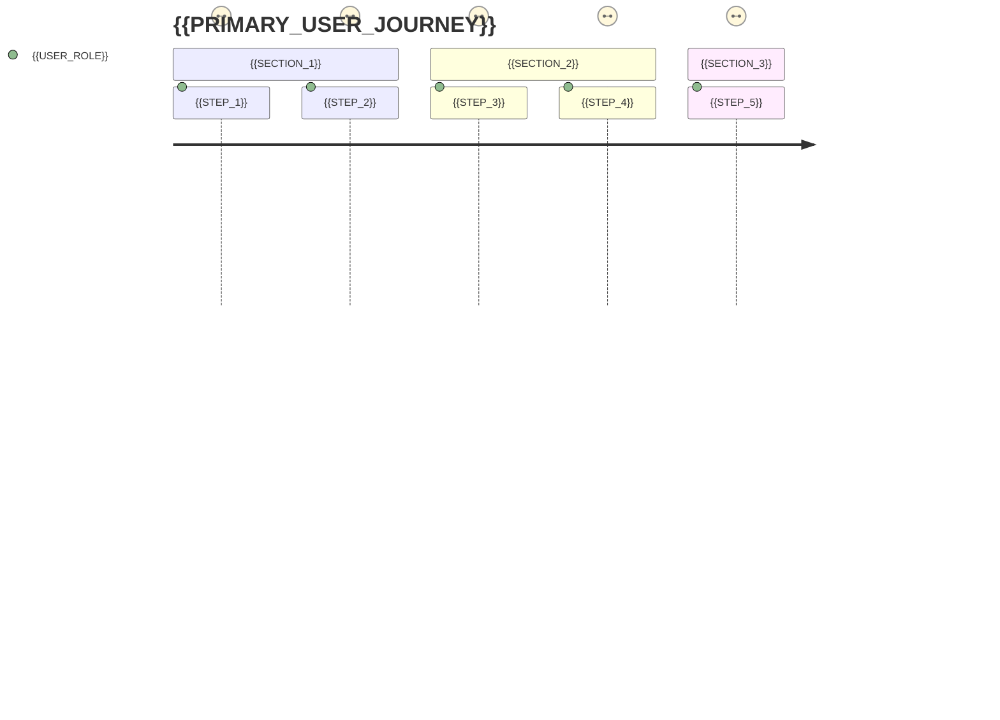

# {{UI_COMPONENT_NAME}}

> **TL;DR:** {{UI_DESCRIPTION}}

<!-- BEGIN:DIAGRAM-STRIP -->
<p align="center">
  <a href="{{UI_FLOW_PATH}}">
    
  </a>
  <a href="{{API_CALL_MAP_PATH}}">
    
  </a>
  <a href="{{COMPONENT_DEPS_PATH}}">
    
  </a>
</p>

**🎨 UI Overview:** *User flows* • *API calls* • *Component tree*
<!-- END:DIAGRAM-STRIP -->

## 🔗 **Integration Contracts**

| API Endpoint | Method | Purpose | Component |
|--------------|--------|---------|-----------|
| `{{API_ENDPOINT_1}}` | `{{METHOD_1}}` | {{PURPOSE_1}} | `{{COMPONENT_1}}` |
| `{{API_ENDPOINT_2}}` | `{{METHOD_2}}` | {{PURPOSE_2}} | `{{COMPONENT_2}}` |

## ⚡ **User Journey** *(Critical path)*



## 🚀 **Quick Start**

### **Development**
```bash
# Install dependencies
npm install

# Start development server
npm run dev

# Open in browser
open http://localhost:{{DEV_PORT}}

# Run Storybook
npm run storybook
```

### **Build & Deploy**
```bash
# Build for production
npm run build

# Preview production build
npm run preview

# Deploy to environment
npm run deploy:{{ENVIRONMENT}}
```

## 📈 **UX Metrics & Performance**

| Metric | Target | Current | Trend |
|--------|--------|---------|-------|
| **First Paint** | {{FP_TARGET}} | {{FP_CURRENT}} | {{FP_TREND}} |
| **Time to Interactive** | {{TTI_TARGET}} | {{TTI_CURRENT}} | {{TTI_TREND}} |
| **Bundle Size** | {{BUNDLE_TARGET}} | {{BUNDLE_CURRENT}} | {{BUNDLE_TREND}} |
| **Accessibility Score** | {{A11Y_TARGET}} | {{A11Y_CURRENT}} | {{A11Y_TREND}} |

**🎯 Core Web Vitals:** LCP {{LCP_SCORE}} | FID {{FID_SCORE}} | CLS {{CLS_SCORE}}

## 🏗️ **Component Architecture**

### **Component Tree**
```mermaid
graph TB
    subgraph "Pages"
        {{PAGE_1}}[{{PAGE_1}}]
        {{PAGE_2}}[{{PAGE_2}}]
    end
    
    subgraph "Layout Components"
        {{LAYOUT_1}}[{{LAYOUT_1}}]
        {{LAYOUT_2}}[{{LAYOUT_2}}]
    end
    
    subgraph "UI Components"
        {{UI_COMP_1}}[{{UI_COMP_1}}]
        {{UI_COMP_2}}[{{UI_COMP_2}}]
        {{UI_COMP_3}}[{{UI_COMP_3}}]
    end
    
    subgraph "Shared Components"
        {{SHARED_1}}[{{SHARED_1}}]
        {{SHARED_2}}[{{SHARED_2}}]
    end
    
    {{PAGE_1}} --> {{LAYOUT_1}}
    {{PAGE_2}} --> {{LAYOUT_2}}
    {{LAYOUT_1}} --> {{UI_COMP_1}}
    {{LAYOUT_1}} --> {{UI_COMP_2}}
    {{LAYOUT_2}} --> {{UI_COMP_3}}
    {{UI_COMP_1}} --> {{SHARED_1}}
    {{UI_COMP_2}} --> {{SHARED_2}}
    {{UI_COMP_3}} --> {{SHARED_1}}
    
    classDef page fill:#e3f2fd,stroke:#1976d2,stroke-width:2px
    classDef layout fill:#f3e5f5,stroke:#7b1fa2,stroke-width:2px
    classDef uiComp fill:#e8f5e8,stroke:#388e3c,stroke-width:2px
    classDef shared fill:#fff3e0,stroke:#f57c00,stroke-width:2px
    
    class {{PAGE_1}},{{PAGE_2}} page
    class {{LAYOUT_1}},{{LAYOUT_2}} layout
    class {{UI_COMP_1}},{{UI_COMP_2}},{{UI_COMP_3}} uiComp
    class {{SHARED_1}},{{SHARED_2}} shared
```

### **State Management**
- **Global State:** {{GLOBAL_STATE_TOOL}} ({{GLOBAL_STATE_DESC}})
- **Local State:** {{LOCAL_STATE_PATTERN}}
- **Server State:** {{SERVER_STATE_TOOL}} ({{SERVER_STATE_DESC}})

## 🎨 **Design System**

### **Theme Configuration**
```typescript
// {{THEME_FILE}}
export const theme = {
  colors: {
    primary: '{{PRIMARY_COLOR}}',
    secondary: '{{SECONDARY_COLOR}}',
    accent: '{{ACCENT_COLOR}}'
  },
  typography: {
    fontFamily: '{{FONT_FAMILY}}',
    fontSize: {{FONT_SIZE_SCALE}}
  },
  spacing: {{SPACING_SCALE}},
  breakpoints: {{BREAKPOINTS}}
}
```

### **Component Variants**
| Component | Variants | Usage |
|-----------|----------|-------|
| `{{COMP_1}}` | {{COMP_1_VARIANTS}} | {{COMP_1_USAGE}} |
| `{{COMP_2}}` | {{COMP_2_VARIANTS}} | {{COMP_2_USAGE}} |

## ♿ **Accessibility & Internationalization**

### **WCAG 2.2 AA Compliance**
- **Keyboard Navigation:** {{KEYBOARD_NAV_STATUS}}
- **Screen Reader:** {{SCREEN_READER_STATUS}}
- **Color Contrast:** {{COLOR_CONTRAST_RATIO}}
- **Focus Management:** {{FOCUS_MANAGEMENT}}

### **Internationalization**
```typescript
// Supported locales
const locales = [
  '{{LOCALE_1}}', // {{LOCALE_1_DESC}}
  '{{LOCALE_2}}', // {{LOCALE_2_DESC}}
]

// RTL Support
const rtlLocales = ['{{RTL_LOCALE_1}}', '{{RTL_LOCALE_2}}']
```

## 🔧 **Configuration**

### **Environment Variables**
| Variable | Description | Default |
|----------|-------------|---------|
| `{{UI_ENV_VAR_1}}` | {{UI_ENV_VAR_1_DESC}} | `{{UI_ENV_VAR_1_DEFAULT}}` |
| `{{UI_ENV_VAR_2}}` | {{UI_ENV_VAR_2_DESC}} | `{{UI_ENV_VAR_2_DEFAULT}}` |

### **Feature Flags**
```typescript
// {{FEATURE_FLAGS_FILE}}
export const features = {
  {{FEATURE_1}}: {{FEATURE_1_ENABLED}}, // {{FEATURE_1_DESC}}
  {{FEATURE_2}}: {{FEATURE_2_ENABLED}}, // {{FEATURE_2_DESC}}
}
```

## 📊 **Analytics & Monitoring**

### **User Analytics**
- **Page Views:** {{ANALYTICS_TOOL}} tracking
- **User Interactions:** {{INTERACTION_TRACKING}}
- **Conversion Funnels:** {{CONVERSION_TRACKING}}

### **Performance Monitoring**
```typescript
// {{MONITORING_CONFIG}}
export const monitoring = {
  errorTracking: '{{ERROR_TRACKING_TOOL}}',
  performanceMonitoring: '{{PERF_MONITORING_TOOL}}',
  userSessionRecording: '{{SESSION_RECORDING_TOOL}}'
}
```

## 🧪 **Testing Strategy**

### **Test Coverage**
- **Unit Tests:** {{UNIT_TEST_COVERAGE}}% ({{UNIT_TEST_TOOL}})
- **Component Tests:** {{COMPONENT_TEST_COVERAGE}}% ({{COMPONENT_TEST_TOOL}})
- **E2E Tests:** {{E2E_TEST_COVERAGE}}% ({{E2E_TEST_TOOL}})
- **Visual Regression:** {{VISUAL_TEST_TOOL}}

### **Testing Commands**
```bash
# Unit tests
npm run test:unit

# Component tests
npm run test:component

# E2E tests
npm run test:e2e

# Visual regression tests
npm run test:visual

# Accessibility tests
npm run test:a11y
```

## 🎭 **Storybook Documentation**

### **Component Stories**
- **{{STORY_1}}** - {{STORY_1_DESC}}
- **{{STORY_2}}** - {{STORY_2_DESC}}

### **Interactive Examples**
```bash
# Start Storybook
npm run storybook

# Build Storybook
npm run build-storybook

# Deploy Storybook
npm run deploy-storybook
```

## 🚀 **Deployment & CI/CD**

### **Build Pipeline**
1. **Lint & Format** - ESLint, Prettier
2. **Type Check** - TypeScript validation
3. **Unit Tests** - Jest/Vitest execution
4. **Build** - Vite/Webpack bundling
5. **E2E Tests** - Playwright/Cypress
6. **Deploy** - Environment-specific deployment

### **Environment Configuration**
| Environment | URL | Branch | Auto-Deploy |
|-------------|-----|--------|-------------|
| **Development** | {{DEV_URL}} | `{{DEV_BRANCH}}` | {{DEV_AUTO_DEPLOY}} |
| **Staging** | {{STAGING_URL}} | `{{STAGING_BRANCH}}` | {{STAGING_AUTO_DEPLOY}} |
| **Production** | {{PROD_URL}} | `{{PROD_BRANCH}}` | {{PROD_AUTO_DEPLOY}} |

---

**📅 Last Updated:** {{LAST_UPDATED}} | **⚛️ Framework:** {{UI_FRAMEWORK}} {{FRAMEWORK_VERSION}}

**🎯 UI Owner:** {{UI_OWNER}} | **📧 Contact:** {{CONTACT_EMAIL}}
