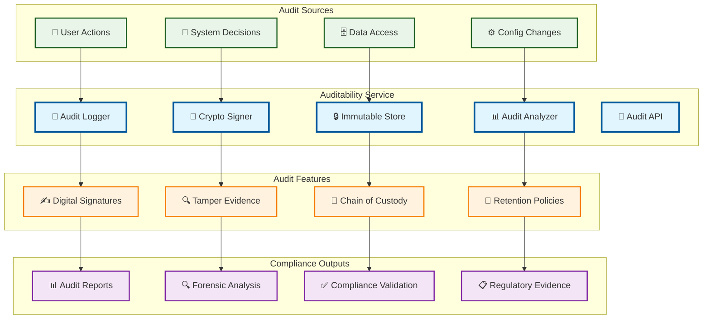

# Auditability

> **TL;DR:** Comprehensive audit trail service providing cryptographically signed decision logs and immutable audit records

## 📊 **Architecture Overview**

### 📋 **Where it fits** - Audit Trail Hub

## 📈 **SLOs & Performance**

| Metric | Target | Current |
|--------|--------|---------|
| **Audit Log Integrity** | 100% | 100% ✅ |
| **Signature Verification** | 100% | 100% ✅ |
| **Audit Trail Completeness** | 100% | 100% ✅ |
| **Query Response Time** | <2s | 1.5s ✅ |

---

**🎯 Owner:** Audit & Compliance Team | **📧 Contact:** audit@atlasmesh.com
