# Auditability

> **TL;DR:** Comprehensive audit trail service providing cryptographically signed decision logs and immutable audit records

## 📊 **Architecture Overview**

### 📋 **Where it fits** - Audit Trail Hub

```mermaid
graph TB
    subgraph "Audit Sources"
        UserActions[👤 User Actions]
        SystemDecisions[🤖 System Decisions]
        DataAccess[🗄️ Data Access]
        ConfigChanges[⚙️ Config Changes]
    end
    
    subgraph "Auditability Service"
        AuditLogger[📝 Audit Logger]
        CryptoSigner[🔐 Crypto Signer]
        ImmutableStore[🔒 Immutable Store]
        AuditAnalyzer[📊 Audit Analyzer]
        AuditAPI[🔌 Audit API]
    end
    
    subgraph "Audit Features"
        DigitalSignatures[✍️ Digital Signatures]
        TamperEvidence[🔍 Tamper Evidence]
        ChainOfCustody[🔗 Chain of Custody]
        RetentionPolicies[📅 Retention Policies]
    end
    
    subgraph "Compliance Outputs"
        AuditReports[📊 Audit Reports]
        ForensicAnalysis[🔍 Forensic Analysis]
        ComplianceValidation[✅ Compliance Validation]
        RegulatoryEvidence[📋 Regulatory Evidence]
    end
    
    UserActions --> AuditLogger
    SystemDecisions --> CryptoSigner
    DataAccess --> ImmutableStore
    ConfigChanges --> AuditAnalyzer
    
    AuditLogger --> DigitalSignatures
    CryptoSigner --> TamperEvidence
    ImmutableStore --> ChainOfCustody
    AuditAnalyzer --> RetentionPolicies
    
    DigitalSignatures --> AuditReports
    TamperEvidence --> ForensicAnalysis
    ChainOfCustody --> ComplianceValidation
    RetentionPolicies --> RegulatoryEvidence
    
    classDef source fill:#e8f5e8,stroke:#1b5e20,stroke-width:2px
    classDef audit fill:#e1f5fe,stroke:#01579b,stroke-width:3px
    classDef feature fill:#fff3e0,stroke:#f57c00,stroke-width:2px
    classDef output fill:#f3e5f5,stroke:#7b1fa2,stroke-width:2px
    
    class UserActions,SystemDecisions,DataAccess,ConfigChanges source
    class AuditLogger,CryptoSigner,ImmutableStore,AuditAnalyzer,AuditAPI audit
    class DigitalSignatures,TamperEvidence,ChainOfCustody,RetentionPolicies feature
    class AuditReports,ForensicAnalysis,ComplianceValidation,RegulatoryEvidence output
```

## 📈 **SLOs & Performance**

| Metric | Target | Current |
|--------|--------|---------|
| **Audit Log Integrity** | 100% | 100% ✅ |
| **Signature Verification** | 100% | 100% ✅ |
| **Audit Trail Completeness** | 100% | 100% ✅ |
| **Query Response Time** | <2s | 1.5s ✅ |

---

**🎯 Owner:** Audit & Compliance Team | **📧 Contact:** audit@atlasmesh.com
