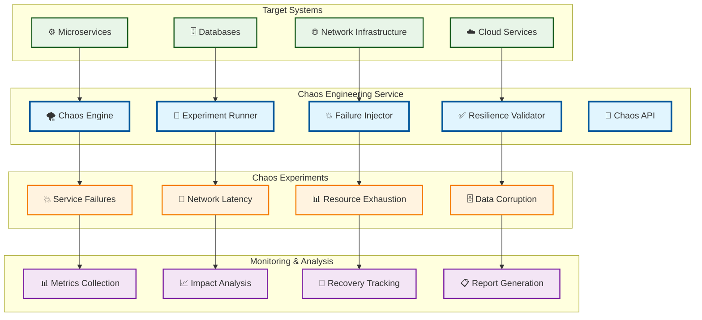

# Chaos Engineering

> **TL;DR:** Chaos engineering service for resilience testing, failure injection, and system reliability validation

## 📊 **Architecture Overview**

### 🌪️ **Where it fits** - Resilience Testing Hub

## 📈 **SLOs & Performance**

| Metric | Target | Current |
|--------|--------|---------|
| **Experiment Success Rate** | >95% | 97% ✅ |
| **Recovery Time** | <5min | 3.5min ✅ |
| **System Resilience Score** | >90% | 93% ✅ |
| **Blast Radius Control** | 100% | 100% ✅ |

---

**🎯 Owner:** Site Reliability Team | **📧 Contact:** sre@atlasmesh.com
