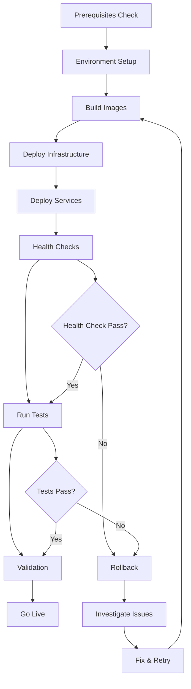

# AtlasMesh Fleet OS — Deployment Guide

## 📋 Notice

This document has been superseded by the comprehensive deployment guide. Please refer to:

**[📖 Complete Deployment Guide](deployment/DEPLOYMENT_GUIDE.md)**

The new guide includes:
- ✅ Multi-environment setup (SIT, UAT, Production)
- ✅ Infrastructure dependencies and configuration
- ✅ Security, monitoring, and performance tuning
- ✅ Troubleshooting and maintenance procedures
- ✅ Updated for all Phase 1 & Phase 2 services

---

## Legacy Content (Deprecated)

*The content below is kept for reference but may be outdated. Please use the new deployment guide.*

## 2) Prerequisites

### 2.1 System Requirements

| Component | Development | SIT | UAT | Production |
|-----------|-------------|-----|-----|------------|
| **CPU** | 4 cores | 8 cores | 16 cores | 32+ cores |
| **RAM** | 16 GB | 32 GB | 64 GB | 128+ GB |
| **Storage** | 100 GB SSD | 500 GB SSD | 1 TB SSD | 2+ TB NVMe |
| **Network** | 1 Gbps | 1 Gbps | 10 Gbps | 10+ Gbps |

### 2.2 Software Dependencies

```bash
# Required Software
- Docker Engine 24.0+
- Docker Compose 2.20+
- Git 2.40+
- curl 7.80+
- jq 1.6+

# Optional (for development)
- Node.js 18+
- Go 1.21+
- Python 3.11+
```

### 2.3 Environment Setup

```bash
# Clone the repository
git clone https://github.com/atlasmesh/fleet-os.git
cd fleet-os

# Make scripts executable
chmod +x scripts/*.sh

# Verify prerequisites
./scripts/validate-system.sh --help
```

## 3) Environment Configurations

### 3.1 Development Environment

**Purpose**: Local development and testing

```bash
# Quick start for development
make dev

# Or manual deployment
./scripts/deploy.sh development --build --logs

# Access points
- API Gateway: http://localhost:8080/v2
- Control Center: http://localhost:3000
- Grafana: http://localhost:3000 (admin/admin)
- Prometheus: http://localhost:9090
- Jaeger: http://localhost:16686
```

**Environment Variables** (create `.env.development`):
```bash
# Database Configuration
POSTGRES_PASSWORD=atlasmesh_dev_password
REDIS_PASSWORD=atlasmesh_dev_redis
CLICKHOUSE_PASSWORD=atlasmesh_dev_clickhouse
MINIO_ROOT_USER=atlasmesh
MINIO_ROOT_PASSWORD=atlasmesh_dev_minio

# Monitoring
GRAFANA_ADMIN_PASSWORD=admin
VAULT_ROOT_TOKEN=dev-only-token

# Service Configuration
LOG_LEVEL=debug
ENVIRONMENT=development
API_RATE_LIMIT_RPS=1000
TELEMETRY_SAMPLING_RATE=1.0
```

### 3.2 SIT Environment

**Purpose**: Integration testing and automated test execution

```bash
# Deploy SIT environment
./scripts/deploy.sh sit --build

# Run integration tests
./scripts/validate-system.sh sit --full

# Access points
- API Gateway: http://localhost:8081/v2
- Grafana: http://localhost:3001
- Test Results: ./logs/validation-report-sit-*.json
```

**Environment Variables** (create `environments/sit/.env.sit`):
```bash
# Use stronger passwords for SIT
POSTGRES_PASSWORD_SIT=${POSTGRES_PASSWORD_SIT}
REDIS_PASSWORD_SIT=${REDIS_PASSWORD_SIT}
CLICKHOUSE_PASSWORD_SIT=${CLICKHOUSE_PASSWORD_SIT}
MINIO_ROOT_PASSWORD_SIT=${MINIO_ROOT_PASSWORD_SIT}
GRAFANA_ADMIN_PASSWORD_SIT=${GRAFANA_ADMIN_PASSWORD_SIT}

# SIT Configuration
LOG_LEVEL=info
ENVIRONMENT=sit
API_RATE_LIMIT_RPS=500
TELEMETRY_SAMPLING_RATE=0.1
```

### 3.3 UAT Environment

**Purpose**: User acceptance testing with production-like setup

```bash
# Deploy UAT environment
./scripts/deploy.sh uat --build

# Run E2E tests
./scripts/validate-system.sh uat --full

# Access points
- Load Balancer: http://localhost (ports 80/443)
- Control Center: http://localhost:3003
- Grafana: http://localhost:3002
```

**Environment Variables** (create `environments/uat/.env.uat`):
```bash
# Production-like passwords (use secrets management)
POSTGRES_PASSWORD_UAT=${POSTGRES_PASSWORD_UAT}
POSTGRES_REPLICATION_PASSWORD_UAT=${POSTGRES_REPLICATION_PASSWORD_UAT}
REDIS_PASSWORD_UAT=${REDIS_PASSWORD_UAT}
GRAFANA_ADMIN_PASSWORD_UAT=${GRAFANA_ADMIN_PASSWORD_UAT}

# SMTP Configuration
SMTP_HOST=${SMTP_HOST}
SMTP_USER=${SMTP_USER}
SMTP_PASSWORD=${SMTP_PASSWORD}

# External Services
SENTRY_DSN_UAT=${SENTRY_DSN_UAT}
ANALYTICS_ID_UAT=${ANALYTICS_ID_UAT}

# UAT Configuration
LOG_LEVEL=warn
ENVIRONMENT=uat
API_RATE_LIMIT_RPS=1000
```

### 3.4 Production Environment

**Purpose**: Live production workloads

```bash
# Deploy production (requires proper secrets setup)
./scripts/deploy.sh production

# Run smoke tests
./scripts/validate-system.sh production --basic

# Monitor deployment
docker-compose -f environments/production/docker-compose.prod.yml logs -f
```

**Environment Variables** (use Docker secrets):
```bash
# All sensitive values via Docker secrets
POSTGRES_PASSWORD_PROD=${POSTGRES_PASSWORD_PROD}
REDIS_PASSWORD_PROD=${REDIS_PASSWORD_PROD}

# Backup Configuration
S3_BACKUP_BUCKET=${S3_BACKUP_BUCKET}
S3_ACCESS_KEY=${S3_ACCESS_KEY}
S3_SECRET_KEY=${S3_SECRET_KEY}

# Production Configuration
LOG_LEVEL=error
ENVIRONMENT=production
VERSION=${VERSION:-latest}
```

## 4) Deployment Procedures

### 4.1 Standard Deployment Flow



### 4.2 Step-by-Step Deployment

#### Step 1: Pre-deployment Validation
```bash
# Validate system prerequisites
./scripts/validate-system.sh development --basic

# Check Docker resources
docker system df
docker system prune -f  # Clean up if needed
```

#### Step 2: Environment Preparation
```bash
# Create environment-specific configuration
cp environments/development/.env.development.template .env.development
# Edit .env.development with appropriate values

# Validate configuration
./scripts/deploy.sh development --help
```

#### Step 3: Infrastructure Deployment
```bash
# Deploy core infrastructure first
docker-compose up -d postgres redis zookeeper kafka

# Wait for infrastructure readiness
./scripts/validate-system.sh development --basic
```

#### Step 4: Service Deployment
```bash
# Deploy all services
./scripts/deploy.sh development --build

# Monitor deployment
docker-compose logs -f --tail=100
```

#### Step 5: Post-deployment Validation
```bash
# Comprehensive system validation
./scripts/validate-system.sh development --full

# Performance validation
./scripts/validate-system.sh development --performance

# Security validation
./scripts/validate-system.sh development --security
```

## 5) Monitoring & Observability

### 5.1 Health Monitoring

```bash
# Real-time health monitoring
watch -n 5 'curl -s http://localhost:8080/v2/health | jq'

# Service status overview
docker-compose ps

# Resource utilization
docker stats --no-stream
```

### 5.2 Log Management

```bash
# View aggregated logs
docker-compose logs -f

# Service-specific logs
docker-compose logs -f api-gateway
docker-compose logs -f policy-engine

# Log analysis
grep ERROR logs/deploy-*.log
grep WARNING logs/validation-*.log
```

### 5.3 Metrics & Dashboards

**Prometheus Metrics**: http://localhost:9090
- System metrics: CPU, memory, disk, network
- Application metrics: Request rates, latencies, errors
- Business metrics: Trip completion rates, fleet utilization

**Grafana Dashboards**: http://localhost:3000
- Fleet Operations Dashboard
- System Performance Dashboard
- SLO Monitoring Dashboard
- Security Events Dashboard

### 5.4 Alerting

```yaml
# Alert Rules (Prometheus)
groups:
  - name: atlasmesh.rules
    rules:
      - alert: HighErrorRate
        expr: rate(http_requests_total{status=~"5.."}[5m]) > 0.1
        for: 2m
        labels:
          severity: critical
        annotations:
          summary: "High error rate detected"
          
      - alert: ServiceDown
        expr: up == 0
        for: 1m
        labels:
          severity: critical
        annotations:
          summary: "Service {{ $labels.instance }} is down"
```

## 6) Backup & Recovery

### 6.1 Backup Procedures

```bash
# Database backup
docker-compose exec postgres pg_dump -U atlasmesh_dev atlasmesh_dev > backup-$(date +%Y%m%d).sql

# Configuration backup
tar -czf config-backup-$(date +%Y%m%d).tar.gz \
  docker-compose.yml \
  .env.* \
  environments/ \
  config/

# Volume backup
docker run --rm -v atlasmesh_postgres_data:/data -v $(pwd)/backups:/backup alpine \
  tar -czf /backup/postgres-data-$(date +%Y%m%d).tar.gz -C /data .
```

### 6.2 Recovery Procedures

```bash
# Database recovery
docker-compose exec -T postgres psql -U atlasmesh_dev atlasmesh_dev < backup-20240115.sql

# Volume recovery
docker run --rm -v atlasmesh_postgres_data:/data -v $(pwd)/backups:/backup alpine \
  tar -xzf /backup/postgres-data-20240115.tar.gz -C /data

# Service restart after recovery
docker-compose restart postgres
./scripts/validate-system.sh development --basic
```

## 7) Troubleshooting

### 7.1 Common Issues

#### Issue: Services failing to start
```bash
# Check logs
docker-compose logs service-name

# Check resource usage
docker stats

# Check network connectivity
docker network ls
docker network inspect atlasmesh-network
```

#### Issue: Database connection failures
```bash
# Check PostgreSQL status
docker-compose exec postgres pg_isready -U atlasmesh_dev

# Check connection from service
docker-compose exec api-gateway nc -zv postgres 5432

# Reset database if needed
docker-compose down postgres
docker volume rm atlasmesh_postgres_data
docker-compose up -d postgres
```

#### Issue: High memory usage
```bash
# Check memory usage by service
docker stats --format "table {{.Container}}\t{{.CPUPerc}}\t{{.MemUsage}}"

# Adjust resource limits in docker-compose.yml
services:
  service-name:
    deploy:
      resources:
        limits:
          memory: 2G
```

### 7.2 Performance Issues

#### Issue: Slow API responses
```bash
# Check API performance
./scripts/validate-system.sh development --performance

# Monitor request latencies
curl -w "@curl-format.txt" -s -o /dev/null http://localhost:8080/v2/health

# Check database query performance
docker-compose exec postgres psql -U atlasmesh_dev -c "
  SELECT query, mean_time, calls 
  FROM pg_stat_statements 
  ORDER BY mean_time DESC 
  LIMIT 10;"
```

#### Issue: High CPU usage
```bash
# Identify CPU-intensive containers
docker stats --format "table {{.Container}}\t{{.CPUPerc}}" | sort -k2 -nr

# Check application profiling
curl http://localhost:8080/debug/pprof/profile?seconds=30 > cpu.prof

# Scale services if needed
docker-compose up -d --scale api-gateway=3
```

### 7.3 Network Issues

#### Issue: Service discovery problems
```bash
# Check service registration
docker-compose exec api-gateway nslookup policy-engine

# Verify network configuration
docker network inspect atlasmesh-network

# Test inter-service connectivity
docker-compose exec api-gateway curl -f http://policy-engine:8091/health
```

## 8) Security Considerations

### 8.1 Production Security Checklist

- [ ] Use Docker secrets for sensitive data
- [ ] Enable TLS/SSL for all external endpoints
- [ ] Configure proper firewall rules
- [ ] Set up log aggregation and monitoring
- [ ] Enable audit logging
- [ ] Regular security updates
- [ ] Vulnerability scanning
- [ ] Access control and RBAC
- [ ] Network segmentation
- [ ] Backup encryption

### 8.2 Security Configuration

```yaml
# Docker secrets configuration
secrets:
  postgres_password:
    external: true
  redis_password:
    external: true
  jwt_secret:
    external: true

services:
  postgres:
    secrets:
      - postgres_password
    environment:
      POSTGRES_PASSWORD_FILE: /run/secrets/postgres_password
```

## 9) Scaling & Performance Optimization

### 9.1 Horizontal Scaling

```bash
# Scale API Gateway
docker-compose up -d --scale api-gateway=3

# Scale specific services
docker-compose up -d --scale policy-engine=2 --scale trip-service=2

# Load balancer configuration (nginx.conf)
upstream api_backend {
    server api-gateway-1:8080;
    server api-gateway-2:8080;
    server api-gateway-3:8080;
}
```

### 9.2 Performance Tuning

```yaml
# Database optimization
postgres:
  environment:
    POSTGRES_SHARED_BUFFERS: 2GB
    POSTGRES_EFFECTIVE_CACHE_SIZE: 6GB
    POSTGRES_WORK_MEM: 256MB
    POSTGRES_MAINTENANCE_WORK_MEM: 512MB

# Redis optimization
redis:
  command: >
    redis-server 
    --maxmemory 4gb
    --maxmemory-policy allkeys-lru
    --save 900 1

# Kafka optimization
kafka:
  environment:
    KAFKA_JVM_PERFORMANCE_OPTS: "-Xmx4g -Xms4g"
    KAFKA_NUM_PARTITIONS: 24
    KAFKA_DEFAULT_REPLICATION_FACTOR: 3
```

## 10) Maintenance Procedures

### 10.1 Regular Maintenance

```bash
# Weekly maintenance script
#!/bin/bash

# Update system packages
sudo apt update && sudo apt upgrade -y

# Clean Docker resources
docker system prune -f
docker volume prune -f

# Rotate logs
find logs/ -name "*.log" -mtime +7 -delete

# Database maintenance
docker-compose exec postgres psql -U atlasmesh_dev -c "VACUUM ANALYZE;"

# Backup
./scripts/backup.sh

# Health check
./scripts/validate-system.sh production --basic
```

### 10.2 Updates & Upgrades

```bash
# Rolling update procedure
1. Deploy to staging environment
2. Run full test suite
3. Deploy to production with zero-downtime
4. Monitor metrics and logs
5. Rollback if issues detected

# Zero-downtime deployment
docker-compose up -d --scale api-gateway=2 api-gateway-new
# Wait for health check
docker-compose stop api-gateway-old
docker-compose rm api-gateway-old
```

This comprehensive deployment guide ensures successful deployment and operation of AtlasMesh Fleet OS across all environments.
