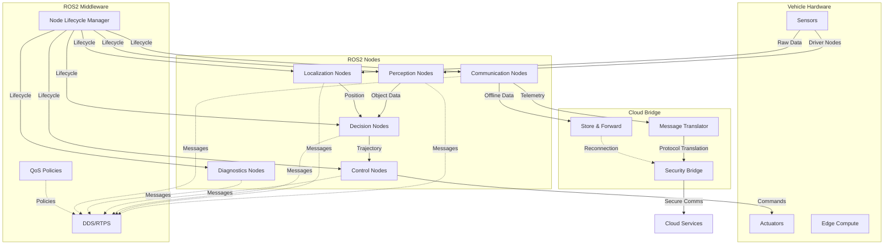
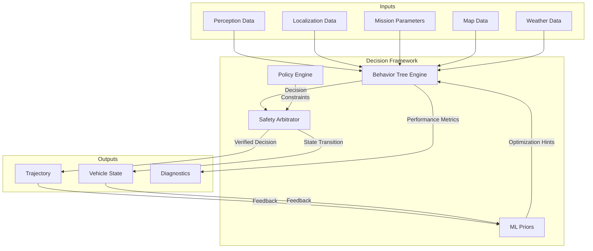
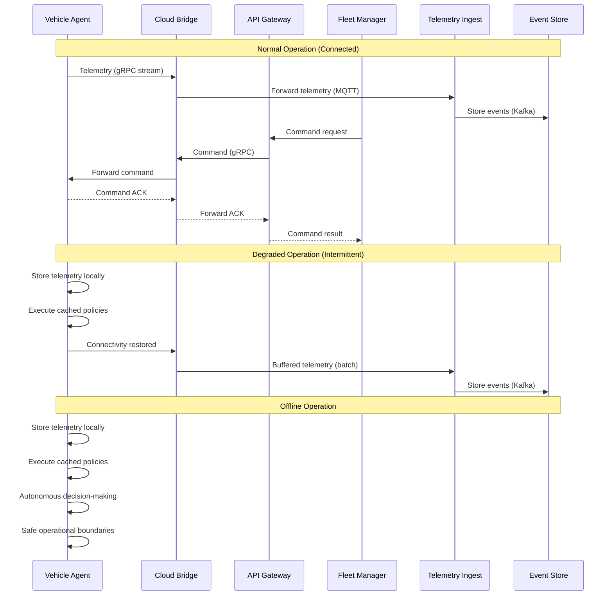

# AtlasMesh Fleet OS — Architecture

## 1) System Context (C4 Model)

AtlasMesh Fleet OS operates as a comprehensive platform that orchestrates autonomous fleet operations across multiple sectors. The system context diagram below illustrates the high-level interactions between AtlasMesh and external entities.


## 2) Container Diagram (Services & Components)

The container diagram below shows the major components of the AtlasMesh Fleet OS and their interactions.

```mermaid
C4Container
    title AtlasMesh Fleet OS - Container Diagram

    Person(operator, "Fleet Operator", "Manages fleet operations")
    
    System_Boundary(atlasmesh, "AtlasMesh Fleet OS") {
        Container(control_center, "Control Center UI", "React, TypeScript", "Web interface for fleet operations")
        Container(api_gateway, "API Gateway", "Go, gRPC", "Entry point for all API requests")
        
        Container_Boundary(core_services, "Core Services") {
            Container(trip_service, "Trip Service", "Go", "Trip lifecycle management")
            Container(dispatch, "Dispatch Service", "Go, Python", "Assignment and scheduling")
            Container(routing, "Routing Service", "Rust, C++", "Route planning and optimization")
            Container(policy_engine, "Policy Engine", "Go, Rego", "Rules evaluation and enforcement")
            Container(fleet_manager, "Fleet Manager", "Go", "Vehicle lifecycle and health")
        }
        
        Container_Boundary(operational_services, "Operational Services") {
            Container(energy_manager, "Energy Manager", "Python", "Energy optimization and charging")
            Container(predictive_maint, "Predictive Maintenance", "Python, PyTorch", "RUL models and work orders")
            Container(weather_fusion, "Weather Fusion", "Python", "Multi-source weather integration")
            Container(alerts_incident, "Alerts & Incidents", "Go", "Alert management and response")
        }
        
        Container_Boundary(data_services, "Data Services") {
            Container(telemetry_ingest, "Telemetry Ingest", "Go, Kafka", "Data ingestion and validation")
            Container(analytics_api, "Analytics API", "Python, dbt", "KPI calculation and reporting")
            Container(map_service, "Map Service", "Go, PostGIS", "Geospatial data management")
        }
        
        Container_Boundary(security_services, "Security Services") {
            Container(authn_authz, "AuthN/AuthZ", "Go, OIDC", "Authentication and authorization")
            Container(ota_manager, "OTA Manager", "Rust", "Secure software updates")
            Container(v2x_service, "V2X Service", "Rust, C", "Vehicle-to-everything communication")
        }
        
        Container_Boundary(integration_services, "Integration Services") {
            Container(adapter_sdk, "Adapter SDK", "TypeScript, Go", "Integration framework")
            Container(adapter_registry, "Adapter Registry", "Go", "Adapter management and discovery")
        }
        
        Container_Boundary(edge_components, "Edge Components") {
            Container(vehicle_agent, "Vehicle Agent", "Rust, C++", "On-vehicle control and monitoring")
            Container(tele_assist, "Tele-Assist Client", "Rust, WebRTC", "Remote assistance interface")
            Container(diag_agent, "Diagnostics Agent", "Rust", "Vehicle diagnostics and logging")
        }
        
        ContainerDb(event_store, "Event Store", "Kafka, TimescaleDB", "Event sourcing and time-series data")
        ContainerDb(config_store, "Config Store", "PostgreSQL, Redis", "Configuration and state")
        ContainerDb(geo_store, "Geospatial Store", "PostGIS, S3", "Maps and geospatial data")
    }
    
    System_Ext(enterprise, "Enterprise Systems", "WMS/TOS/ERP")
    System_Ext(maps, "Map Providers", "HERE/OSM/etc.")
    System_Ext(weather, "Weather Services", "Forecast/nowcast")
    
    Rel(operator, control_center, "Uses")
    Rel(control_center, api_gateway, "API calls", "HTTPS")
    
    Rel(api_gateway, trip_service, "Routes requests", "gRPC")
    Rel(api_gateway, fleet_manager, "Routes requests", "gRPC")
    Rel(api_gateway, analytics_api, "Routes requests", "gRPC")
    
    Rel(trip_service, dispatch, "Creates assignments", "gRPC")
    Rel(dispatch, routing, "Requests routes", "gRPC")
    Rel(dispatch, policy_engine, "Evaluates rules", "gRPC")
    
    Rel(fleet_manager, vehicle_agent, "Controls", "MQTT/gRPC")
    Rel(fleet_manager, ota_manager, "Initiates updates", "gRPC")
    
    Rel(vehicle_agent, telemetry_ingest, "Sends telemetry", "MQTT")
    Rel(telemetry_ingest, event_store, "Stores events", "Kafka")
    
    Rel(tele_assist, vehicle_agent, "Provides assistance", "WebRTC/gRPC")
    
    Rel(weather_fusion, weather, "Consumes data", "HTTPS/MQTT")
    Rel(map_service, maps, "Consumes data", "HTTPS")
    
    Rel(adapter_sdk, enterprise, "Integrates with", "Custom protocols")
    
    Rel_Back(analytics_api, event_store, "Analyzes data", "SQL/Spark")
    Rel(core_services, config_store, "Reads/writes configuration", "SQL/Redis")
    Rel(map_service, geo_store, "Manages geospatial data", "PostGIS/S3")
```

## 3) Component Architecture Principles

AtlasMesh Fleet OS is built on the following architectural principles:

### 3.1 Agnostic by Design

The system is designed to be agnostic across multiple dimensions:

- **Vehicle-agnostic**: Abstracted drive-by-wire interfaces, sensor fusion, and vehicle capabilities
- **Platform-agnostic**: Cloud-neutral deployment, containerized services, infrastructure as code
- **Sector-agnostic**: Policy-driven behavior, configurable workflows, domain-specific overlays
- **Sensor-agnostic**: Abstracted sensor interfaces, fusion algorithms, and degraded mode operations
- **Map-agnostic**: Multiple map provider support, provenance tracking, freshness/credibility tradeoffs
- **Weather-agnostic**: Multi-source weather data fusion, confidence scoring, and fallback strategies
- **Comms-agnostic**: Multi-layer communication stack, store-and-forward capabilities, offline operation

### 3.2 Service-Oriented Architecture

The system follows a service-oriented architecture with the following characteristics:

- **Microservices**: Bounded contexts with clear interfaces and responsibilities
- **Event-driven**: Event sourcing for state changes, event-based integration patterns
- **API-first**: Well-defined APIs with versioning, contract tests, and documentation
- **Stateless services**: Externalized state for scalability and resilience
- **Idempotent operations**: Safe retries and exactly-once semantics where needed

### 3.3 Security & Compliance by Design

Security and compliance are fundamental to the architecture:

- **Zero-trust networking**: mTLS for all service communication, SPIFFE/SPIRE for identity
- **Policy as code**: OPA/Rego policies for authorization and business rules
- **Evidence generation**: Automated safety case artifacts, audit trails, and compliance documentation
- **Secure by default**: Least privilege, encryption in transit and at rest, secrets management
- **Verifiable builds**: Reproducible builds, signed artifacts, SBOM generation

## 4) Data Flow Architecture

The diagram below illustrates the key data flows within the AtlasMesh Fleet OS:


### 4.1 ROS2-Based Edge Architecture



### 4.2 Behavior Tree Decision Framework



## 5) Deployment Architecture

AtlasMesh Fleet OS supports multiple deployment topologies to accommodate different operational requirements:

### 5.1 Cloud-Based Deployment


### 5.2 Hybrid Deployment


### 5.3 Air-Gapped Deployment


## 6) Failure Domains & Resilience

AtlasMesh Fleet OS is designed with resilience in mind, with the following failure domains and mitigation strategies:

### 6.1 Communication Failures

| Failure Mode | Impact | Mitigation |
|--------------|--------|------------|
| Cloud connectivity loss | Remote monitoring and control unavailable | Edge autonomy for 45-60 minutes; store-and-forward telemetry |
| V2V/V2X disruption | Reduced coordination between vehicles | Independent operation modes; conservative safety parameters |
| GPS/GNSS denial | Position uncertainty | Multi-modal localization (SLAM, visual, inertial); degraded operation modes |

### 6.2 Service Failures

| Failure Mode | Impact | Mitigation |
|--------------|--------|------------|
| Trip Service outage | New trips cannot be created | Existing trips continue; graceful degradation |
| Routing Service outage | New routes cannot be calculated | Cached routes used; simplified routing fallbacks |
| Policy Engine outage | Policy decisions unavailable | Conservative default policies; cached decisions |

### 6.3 Environmental Challenges

| Failure Mode | Impact | Mitigation |
|--------------|--------|------------|
| Extreme heat | Sensor and compute degradation | Thermal management; derating curves; shade-seeking behavior |
| Dust/sand storms | Sensor occlusion | Multi-modal sensing; cleaning systems; confidence-aware fusion |
| Heavy precipitation | Reduced visibility and traction | Weather-aware routing; speed adaptation; safe harbor protocols |

## 7) Key Interfaces & Integration Points

### 7.1 External Interfaces

| Interface | Purpose | Protocol | Notes |
|-----------|---------|----------|-------|
| Enterprise Adapter | Integration with WMS/TOS/ERP | REST/SOAP/EDI | Contract-tested; version-pinned |
| Map Provider | Geospatial data ingestion | REST/WMTS/Vector Tiles | Multi-provider; provenance tracking |
| Weather Service | Weather data ingestion | REST/MQTT | Multi-source fusion; confidence scoring |
| Regulatory Reporting | Compliance documentation | REST/SFTP | Jurisdiction-specific formats |

### 7.2 Internal Interfaces

| Interface | Purpose | Protocol | Notes |
|-----------|---------|----------|-------|
| Vehicle Control | Command and telemetry | MQTT/gRPC | Secure; efficient; resilient |
| Service-to-Service | Inter-service communication | gRPC | mTLS; observability; rate limiting |
| Event Bus | Event distribution | Kafka | Exactly-once; ordered; durable |
| Policy Evaluation | Rule enforcement | OPA/Rego | Versioned; auditable; testable |

### 7.3 Edge-Cloud Interface



### 7.4 Data Contracts

#### Vehicle Telemetry Contract

```json
{
  "$schema": "http://json-schema.org/draft-07/schema#",
  "title": "Vehicle Telemetry",
  "type": "object",
  "required": ["vehicle_id", "timestamp", "sequence", "position", "status"],
  "properties": {
    "vehicle_id": {
      "type": "string",
      "description": "Unique identifier for the vehicle"
    },
    "timestamp": {
      "type": "string",
      "format": "date-time",
      "description": "ISO 8601 timestamp of the telemetry data"
    },
    "sequence": {
      "type": "integer",
      "description": "Monotonically increasing sequence number"
    },
    "position": {
      "type": "object",
      "required": ["latitude", "longitude", "heading"],
      "properties": {
        "latitude": { "type": "number" },
        "longitude": { "type": "number" },
        "heading": { "type": "number" },
        "altitude": { "type": "number" },
        "speed": { "type": "number" },
        "accuracy": { "type": "number" }
      }
    },
    "status": {
      "type": "object",
      "required": ["operational_state", "energy_level"],
      "properties": {
        "operational_state": {
          "type": "string",
          "enum": ["READY", "BUSY", "CHARGING", "MAINTENANCE", "ERROR"]
        },
        "energy_level": { "type": "number", "minimum": 0, "maximum": 100 },
        "health_score": { "type": "number", "minimum": 0, "maximum": 100 },
        "assist_state": {
          "type": "string",
          "enum": ["NONE", "REQUESTED", "ACTIVE"]
        }
      }
    },
    "diagnostics": {
      "type": "object",
      "properties": {
        "cpu_usage": { "type": "number" },
        "memory_usage": { "type": "number" },
        "disk_usage": { "type": "number" },
        "temperature": { "type": "number" },
        "network_quality": { "type": "number" }
      }
    },
    "mission": {
      "type": "object",
      "properties": {
        "mission_id": { "type": "string" },
        "route_id": { "type": "string" },
        "progress": { "type": "number", "minimum": 0, "maximum": 100 },
        "eta": { "type": "string", "format": "date-time" }
      }
    }
  }
}
```

#### Vehicle Command Contract

```json
{
  "$schema": "http://json-schema.org/draft-07/schema#",
  "title": "Vehicle Command",
  "type": "object",
  "required": ["command_id", "vehicle_id", "timestamp", "command_type"],
  "properties": {
    "command_id": {
      "type": "string",
      "description": "Unique identifier for the command"
    },
    "vehicle_id": {
      "type": "string",
      "description": "Target vehicle identifier"
    },
    "timestamp": {
      "type": "string",
      "format": "date-time",
      "description": "ISO 8601 timestamp of the command"
    },
    "command_type": {
      "type": "string",
      "enum": [
        "ASSIGN_MISSION", "CANCEL_MISSION", "PAUSE", "RESUME", 
        "SAFE_STOP", "EMERGENCY_STOP", "CHANGE_OPERATIONAL_MODE", 
        "UPDATE_ROUTE", "DIAGNOSTICS", "OTA_UPDATE"
      ]
    },
    "priority": {
      "type": "string",
      "enum": ["LOW", "NORMAL", "HIGH", "CRITICAL"],
      "default": "NORMAL"
    },
    "expiration": {
      "type": "string",
      "format": "date-time",
      "description": "ISO 8601 timestamp when the command expires"
    },
    "payload": {
      "type": "object",
      "description": "Command-specific parameters"
    },
    "authentication": {
      "type": "object",
      "properties": {
        "issuer": { "type": "string" },
        "signature": { "type": "string" }
      }
    }
  }
}
```

## 8) Observability & Monitoring

AtlasMesh Fleet OS implements a comprehensive observability strategy:

- **Metrics**: Prometheus for service and business metrics; Grafana for dashboards
- **Logging**: Structured logging with correlation IDs; centralized log aggregation
- **Tracing**: OpenTelemetry for distributed tracing; Jaeger for visualization
- **Alerting**: Multi-tier alert definition; runbook integration; on-call rotation
- **SLOs**: Service Level Objectives with error budgets; SLI monitoring

## 9) Security Architecture

The security architecture follows defense-in-depth principles:

- **Identity**: SPIFFE/SPIRE for service identity; OIDC for user authentication
- **Access Control**: RBAC/ABAC with OPA; least privilege principle
- **Network Security**: mTLS for all traffic; network policies; segmentation
- **Data Protection**: Encryption at rest and in transit; key management
- **Supply Chain**: Verified builds; SBOM generation; vulnerability scanning
- **Incident Response**: Detection, containment, eradication, recovery procedures

## 10) Compliance Architecture

The compliance architecture ensures regulatory adherence:

- **Safety Case**: Automated evidence generation; traceability; verification
- **Regulatory Mapping**: Jurisdiction-specific requirements and documentation
- **Audit Trail**: Immutable event logs; decision provenance; access records
- **Privacy Controls**: Data minimization; purpose limitation; retention policies

## 11) Key Architectural Decisions

| ADR ID | Decision | Rationale | Alternatives Considered |
|--------|----------|-----------|-------------------------|
| ADR-0001 | Vehicle-Agnostic Architecture | Support multiple vehicle classes; reduce dependency on specific hardware | Vehicle-specific implementations; fork per vehicle type |
| ADR-0002 | Platform-Agnostic Architecture | Cloud-neutral deployment; avoid vendor lock-in | Cloud-specific optimizations; native services |
| ADR-0003 | Sector-Agnostic Architecture | Shared backbone with sector overlays; code reuse | Sector-specific forks; separate products |
| ADR-0004 | Sensor-Agnostic Architecture | Support multiple sensor configurations; certified packs | Hard-coded sensor integration; fixed sensor suite |
| ADR-0005 | Map-Source-Agnostic Architecture | Multiple map providers; provenance tracking | Single map provider; custom map format |
| ADR-0006 | Weather-Source-Agnostic Architecture | Multi-source weather fusion; confidence scoring | Single weather source; simple integration |
| ADR-0007 | Communications-Agnostic Architecture | Multi-path communications; offline-first | Single communication channel; cloud dependency |
| ADR-0008 | ROS2-Based Edge Stack | Industry standard; component isolation; real-time | Custom middleware; direct hardware access |
| ADR-0009 | Hybrid Decision Framework | Behavior trees + rules + ML; explainability | Pure ML approach; pure rule-based system |
| ADR-0010 | Simulation Strategy | CARLA + Gazebo; scenario-based validation | Single simulator; minimal simulation |
| ADR-011 | Event Sourcing | Audit trail; temporal queries; resilience | CRUD; synchronous APIs |
| ADR-012 | Policy as Code | Versioned rules; testable policies; separation of concerns | Hardcoded rules; config files |

## 12) Architecture Evolution & Roadmap

| Phase | Architectural Focus | Key Deliverables |
|-------|---------------------|------------------|
| Current | Core services; agnostic foundations | Trip service; dispatch; routing; policy engine |
| Next | Operational excellence; resilience | Advanced monitoring; chaos testing; recovery automation |
| Future | Advanced intelligence; self-optimization | ML-driven optimization; predictive operations; autonomous healing |

## 13) Architecture Governance

The architecture governance process ensures quality and alignment:

- **Architecture Review Board**: Weekly meetings; decision authority
- **RFC Process**: Formal proposal; review period; approval workflow
- **Architecture Principles**: Documented guidelines; compliance checks
- **Technical Debt Management**: Regular assessment; remediation planning
- **Innovation Pipeline**: Exploration; prototyping; evaluation; integration

## 14) References & Related Documents

- [System Requirements](03_Requirements_FRs_NFRs.md)
- [API Documentation](09_API_Documentation.md)
- [Security & Compliance](05_Security_and_Compliance.md)
- [Operations & Runbooks](06_Operations_and_Runbooks.md)
- [DevOps Pipeline](08_DevOps_Pipeline_and_Deployment.md)
- [Data & Analytics Integration](04_Data_and_Analytics_Integration.md)
- [Architecture Decision Records](../ADR/README.md)
