<div align="center">

## 🏗️ AtlasMesh Fleet Management System - Architecture

**Vehicle-Agnostic Fleet Management Platform for Autonomous Operations**

</div>

---

## 📋 Table of Contents

<div align="center">

| 🎯 **[Executive Summary](#-executive-summary-qualified-agnosticism)** | 🏗️ **[System Context](#%EF%B8%8F-1-system-context-c4-model)** | 🔧 **[Core Components](#-2-container-diagram-services--components)** | 📊 **[Data Architecture](#-4-data-flow-architecture)** |
|:---:|:---:|:---:|:---:|
| **Qualified Agnosticism** | **C4 Model Overview** | **System Components** | **Data Flow & Storage** |

| 🚀 **[Deployment](#-5-deployment-architecture)** | 🔒 **[Key Interfaces & Integration Points](#-7-key-interfaces--integration-points)** | 📈 **[Advanced Services](#-8-phase-2-advanced-services)** | 🧪 **[Fleet Management Architecture](#-13-fleet-management-architecture)** |
|:---:|:---:|:---:|:---:|
| **Infrastructure & Scaling** | **Security & Compliance** | **Observability Stack** | **Testing Framework** |

</div>

---

## 🎯 Executive Summary: Qualified Agnosticism

AtlasMesh Fleet Management System implements **"qualified agnosticism"** - a pragmatic approach to vehicle-agnostic, sector-agnostic, and platform-agnostic fleet management operations. Rather than claiming universal compatibility, we achieve **bounded agnosticism** through:

- **🚗 Vehicle-Agnostic**: Class/model-bounded with certified profiles (≤5% code delta)
- **🏢 Sector-Agnostic**: Policy overlays targeting ≥90% code reuse
- **☁️ Platform-Agnostic**: Contract-driven infrastructure with conformance testing

### 🎯 **Agnosticism Reality Check**

<div align="center">

| 🚙 **Vehicle-Agnostic** | 🏭 **Sector-Agnostic** | ☁️ **Platform-Agnostic** |
|:---:|:---:|:---:|
| **What "Yes" Looks Like** | **What "Yes" Looks Like** | **What "Yes" Looks Like** |
| Shared core; per-model profiles; HiL & track re-cert | Shared backbone; policy/UX overlays; evidence mappers | K8s-first; provider adapters; conformance suite |
| **Feasibility: Medium-High** | **Feasibility: High** | **Feasibility: High** |
| **Implementation: Vehicle HAL + Profile System** | **Implementation: Policy Engine + Sector Overlays** | **Implementation: Infrastructure Adapters** |

</div>

## 🏗️ **1) System Context (C4 Model)**

AtlasMesh Fleet Management System operates as a **vehicle-agnostic** platform that manages autonomous fleet operations across multiple vehicle classes, sectors, and infrastructure platforms. The system context diagram below illustrates the high-level interactions between AtlasMesh and external entities.

### **Two-Layer Architecture Overview**

AtlasMesh implements a **two-layer architecture** that separates fleet management from vehicle control:

1. **Cloud-Based Fleet Management Platform** - Centralized fleet operations, monitoring, and management
2. **Vehicle Agent (Edge Software)** - On-vehicle software that runs on customer-owned vehicles

This architecture enables customers to:
- **Retrofit existing vehicles** with autonomous capabilities
- **Maintain vehicle-agnostic** fleet management
- **Integrate with existing systems** (WMS, Mining FMS, etc.)
- **Scale operations** without vendor lock-in


## 🎯 **1.1) Qualified Agnosticism Architecture**

### Vehicle Hardware Abstraction Layer (HAL)

The Vehicle HAL enables **vehicle-agnostic** operations through config-driven profiles:

```mermaid
graph TB
    subgraph "Vehicle Classes"
        LightUTV[🚜 Light Industrial UTV]
        TerminalTractor[🚛 Terminal Tractor]
        MineHaul[⛏️ Mine Haul Truck]
        DefenseVehicle[🛡️ Defense Vehicle]
        RideHailSedan[🚗 Ride-hail Sedan]
        PublicBus[🚌 Public Transit Bus]
    end
    
    subgraph "Vehicle HAL"
        ProfileLoader[📋 Profile Loader]
        HALInterface[🔌 HAL Interface]
        SafetyMonitor[🛡️ Safety Monitor]
    end
    
    subgraph "Standardized Control"
        MotionPlanner[🗺️ Motion Planner]
        PathFollower[🛣️ Path Follower]
        VehicleController[🎮 Vehicle Controller]
    end
    
    LightUTV --> ProfileLoader
    TerminalTractor --> ProfileLoader
    MineHaul --> ProfileLoader
    DefenseVehicle --> ProfileLoader
    RideHailSedan --> ProfileLoader
    PublicBus --> ProfileLoader
    
    ProfileLoader --> HALInterface
    HALInterface --> SafetyMonitor
    SafetyMonitor --> MotionPlanner
    MotionPlanner --> PathFollower
    PathFollower --> VehicleController
    
    classDef vehicle fill:#e8f5e8,stroke:#1b5e20,stroke-width:2px
    classDef hal fill:#e1f5fe,stroke:#01579b,stroke-width:3px
    classDef control fill:#fff3e0,stroke:#f57c00,stroke-width:2px
    
    class LightUTV,TerminalTractor,MineHaul,DefenseVehicle,RideHailSedan,PublicBus vehicle
    class ProfileLoader,HALInterface,SafetyMonitor hal
    class MotionPlanner,PathFollower,VehicleController control

    style subGraph0 fill:transparent
    style subGraph1 fill:transparent
    style subGraph2 fill:transparent
```

### Variant Budget Enforcement

The Variant Budget system ensures **qualified agnosticism** stays within defined limits:

```mermaid
graph LR
    CodeChanges[📝 Code Changes] --> DeltaAnalyzer[📊 Delta Analyzer]
    DeltaAnalyzer --> BudgetChecker{Budget Check}
    
    BudgetChecker -->|≤5% Code Delta| BuildPass[✅ Build Pass]
    BudgetChecker -->|>5% Code Delta| BuildBlock[❌ Build Block]
    
    BuildBlock --> CCBReview[📋 CCB Review]
    CCBReview --> RefactorPlan[🔧 Refactor Plan]
    
    classDef pass fill:#e8f5e8,stroke:#388e3c,stroke-width:2px
    classDef block fill:#ffebee,stroke:#c62828,stroke-width:2px
    classDef process fill:#e1f5fe,stroke:#01579b,stroke-width:2px
    
    class BuildPass pass
    class BuildBlock,CCBReview,RefactorPlan block
    class CodeChanges,DeltaAnalyzer,BudgetChecker process
```

## 🔧 **2) Container Diagram (Services & Components)**

The container diagram below shows the major components of the AtlasMesh Fleet OS and their interactions, including the new qualified agnosticism services.

```mermaid
C4Container
    title AtlasMesh Fleet OS - Container Diagram

    Person(operator, "Fleet Operator", "Manages fleet operations")
    
    System_Boundary(atlasmesh, "AtlasMesh Fleet OS") {
        Container(control_center, "Control Center UI", "React, TypeScript", "Web interface for fleet operations")
        Container(api_gateway, "API Gateway", "Go, gRPC", "Entry point for all API requests")
        
        Container_Boundary(core_services, "Core Services") {
            Container(mission_management, "Mission Management", "Go", "Mission and trip lifecycle management")
            Container(dispatch, "Dispatch Service", "Go, Python", "Assignment and scheduling")
            Container(routing, "Routing Service", "Rust, C++", "Route planning and optimization")
            Container(policy_engine, "Policy Engine", "Go, Rego", "Rules evaluation and enforcement")
            Container(fleet_manager, "Fleet Manager", "Go", "Vehicle lifecycle and health")
        }
        
        Container_Boundary(operational_services, "Operational Services") {
            Container(energy_manager, "Energy Manager", "Python", "Energy optimization and charging")
            Container(predictive_maint, "Predictive Maintenance", "Go", "RUL models, feature store, work orders")
            Container(weather_fusion, "Weather Fusion", "Go", "Multi-source weather integration")
            Container(alerts_incident, "Alerts & Incidents", "Go", "Alert management and response")
        }
        
        Container_Boundary(data_services, "Data Services") {
            Container(telemetry_ingest, "Telemetry Ingest", "Go, Kafka", "Data ingestion and validation")
            Container(analytics_api, "Analytics API", "Python, dbt", "KPI calculation and reporting")
            Container(map_service, "Map Service", "Go, PostGIS", "Geospatial data management")
            Container(feature_store, "Feature Store & Registry", "Go", "ML features, model registry, drift detection")
            Container(telemetry_lakehouse, "Telemetry Lakehouse", "Go", "Hot/cold data paths, streaming ETL")
        }
        
        Container_Boundary(security_services, "Security Services") {
            Container(authn_authz, "AuthN/AuthZ", "Go, OIDC", "Authentication and authorization")
            Container(ota_manager, "OTA Manager", "Rust", "Secure software updates")
            Container(v2x_service, "V2X Service", "Rust, C", "Vehicle-to-everything communication")
            Container(key_secret_mgmt, "Key & Secret Management", "Go", "Vault/KMS, rotation SLAs, envelope encryption")
            Container(zero_trust_iam, "Zero-Trust IAM", "Go", "SPIFFE/SPIRE, mTLS, policy centralization")
        }
        
        Container_Boundary(integration_services, "Integration Services") {
            Container(adapter_sdk, "Adapter SDK", "TypeScript, Go", "Integration framework")
            Container(adapter_registry, "Adapter Registry", "Go", "Adapter management and discovery")
            Container(sector_overlays, "Sector Overlays", "Go", "Policy/UI tokens, ERP/WMS/TOS adapters")
            Container(tenant_entitlements, "Tenant Entitlements", "Go", "Token-based overlays, entitlement model")
        }
        
        Container_Boundary(compliance_services, "Compliance & Governance") {
            Container(evidence_engine, "Evidence Engine", "Go", "Continuous evidence, audit bundles")
            Container(auditability, "Auditability", "Go", "Cryptographic decision logs, retention automation")
        }
        
        Container_Boundary(simulation_services, "Simulation & Digital Twin") {
            Container(digital_twin_sim, "Digital Twin & Simulation", "Go", "Scenario bank, golden replays, fault injection")
        }
        
        Container_Boundary(edge_components, "Edge Components") {
            Container(vehicle_agent, "Vehicle Agent", "Rust, C++", "On-vehicle control and monitoring")
            Container(tele_assist, "Tele-Assist Client", "Rust, WebRTC", "Remote assistance interface")
            Container(diag_agent, "Diagnostics Agent", "Rust", "Vehicle diagnostics and logging")
        }
        
        ContainerDb(event_store, "Event Store", "Kafka, TimescaleDB", "Event sourcing and time-series data")
        ContainerDb(config_store, "Config Store", "PostgreSQL, Redis", "Configuration and state")
        ContainerDb(geo_store, "Geospatial Store", "PostGIS, S3", "Maps and geospatial data")
        ContainerDb(analytics_store, "Analytics Store", "ClickHouse, MinIO", "Hot/cold path analytics")
        ContainerDb(ml_store, "ML Store", "Neo4j, S3", "Feature store, model registry, lineage")
        ContainerDb(vault_store, "Vault Store", "HashiCorp Vault", "Secrets, keys, certificates")
    }
    
    System_Ext(enterprise, "Enterprise Systems", "WMS/TOS/ERP")
    System_Ext(maps, "Map Providers", "HERE/OSM/etc.")
    System_Ext(weather, "Weather Services", "Forecast/nowcast")
    
    Rel(operator, control_center, "Uses")
    Rel(control_center, api_gateway, "API calls", "HTTPS")
    
    Rel(api_gateway, mission_management, "Routes requests", "gRPC")
    Rel(api_gateway, fleet_manager, "Routes requests", "gRPC")
    Rel(api_gateway, analytics_api, "Routes requests", "gRPC")
    
    Rel(mission_management, dispatch, "Creates assignments", "gRPC")
    Rel(dispatch, routing, "Requests routes", "gRPC")
    Rel(dispatch, policy_engine, "Evaluates rules", "gRPC")
    
    Rel(fleet_manager, vehicle_agent, "Controls", "MQTT/gRPC")
    Rel(fleet_manager, ota_manager, "Initiates updates", "gRPC")
    
    Rel(vehicle_agent, telemetry_ingest, "Sends telemetry", "MQTT")
    Rel(telemetry_ingest, event_store, "Stores events", "Kafka")
    
    Rel(tele_assist, vehicle_agent, "Provides assistance", "WebRTC/gRPC")
    
    Rel(weather_fusion, weather, "Consumes data", "HTTPS/MQTT")
    Rel(map_service, maps, "Consumes data", "HTTPS")
    
    Rel(adapter_sdk, enterprise, "Integrates with", "Custom protocols")
    
    Rel_Back(analytics_api, event_store, "Analyzes data", "SQL/Spark")
    Rel(mission_management, config_store, "Reads/writes configuration", "SQL/Redis")
    Rel(map_service, geo_store, "Manages geospatial data", "PostGIS/S3")
    
    Rel(telemetry_lakehouse, analytics_store, "Manages hot/cold paths", "ClickHouse/MinIO")
    Rel(feature_store, ml_store, "Stores ML features/models", "Neo4j/S3")
    Rel(predictive_maint, feature_store, "Uses ML features", "gRPC")
    
    Rel(key_secret_mgmt, vault_store, "Manages secrets", "Vault API")
    Rel(zero_trust_iam, key_secret_mgmt, "Uses certificates", "gRPC")
    
    Rel(evidence_engine, event_store, "Collects evidence", "Kafka")
    Rel(auditability, evidence_engine, "Signs decisions", "gRPC")
    
    Rel(sector_overlays, tenant_entitlements, "Applies policies", "gRPC")
    Rel(digital_twin_sim, predictive_maint, "Validates models", "gRPC")

```

## 🏗️ **3) Component Architecture Principles**

AtlasMesh Fleet OS is built on the following architectural principles:

### 3.1 Agnostic by Design

The system is designed to be agnostic across multiple dimensions:

- **Vehicle-agnostic**: Abstracted drive-by-wire interfaces, sensor fusion, and vehicle capabilities
- **Platform-agnostic**: Cloud-neutral deployment, containerized services, infrastructure as code
- **Sector-agnostic**: Policy-driven behavior, configurable workflows, domain-specific overlays
- **Sensor-agnostic**: Abstracted sensor interfaces, fusion algorithms, and degraded mode operations
- **Map-agnostic**: Multiple map provider support, provenance tracking, freshness/credibility tradeoffs
- **Weather-agnostic**: Multi-source weather data fusion, confidence scoring, and fallback strategies
- **Comms-agnostic**: Multi-layer communication stack, store-and-forward capabilities, offline operation

### 3.2 Service-Oriented Architecture

The system follows a service-oriented architecture with the following characteristics:

- **Microservices**: Bounded contexts with clear interfaces and responsibilities
- **Event-driven**: Event sourcing for state changes, event-based integration patterns
- **API-first**: Well-defined APIs with versioning, contract tests, and documentation
- **Stateless services**: Externalized state for scalability and resilience
- **Idempotent operations**: Safe retries and exactly-once semantics where needed

### 3.3 Security & Compliance by Design

Security and compliance are fundamental to the architecture:

- **Zero-trust networking**: mTLS for all service communication, SPIFFE/SPIRE for identity
- **Policy as code**: OPA/Rego policies for authorization and business rules
- **Evidence generation**: Automated safety case artifacts, audit trails, and compliance documentation
- **Secure by default**: Least privilege, encryption in transit and at rest, secrets management
- **Verifiable builds**: Reproducible builds, signed artifacts, SBOM generation

## 📊 **4) Data Flow Architecture**

The diagram below illustrates the key data flows within the AtlasMesh Fleet OS:

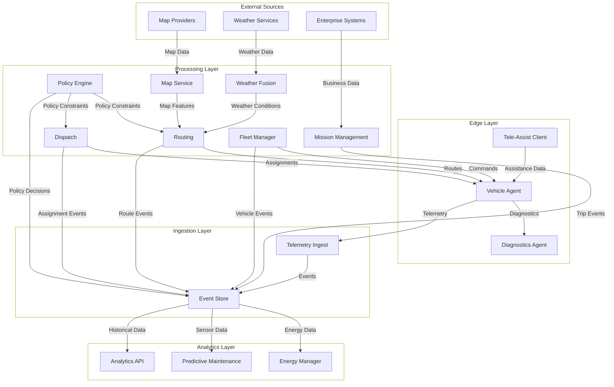

### 4.1 ROS2-Based Edge Architecture

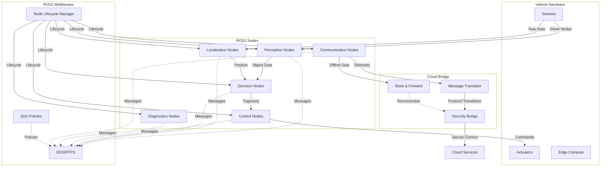

### 4.2 Behavior Tree Decision Framework

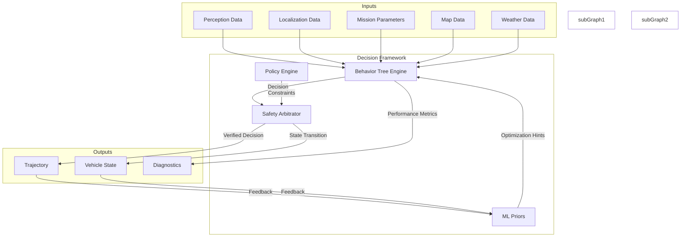

## 🚀 **5) Deployment Architecture**

AtlasMesh Fleet OS supports multiple deployment topologies to accommodate different operational requirements:

### 5.1 Cloud-Based Deployment

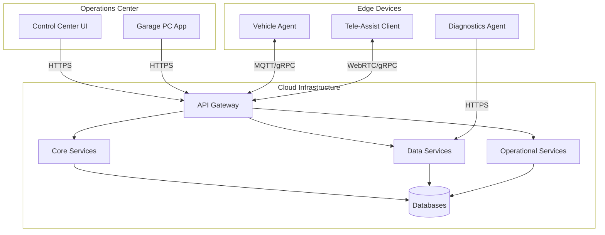

### 5.2 Hybrid Deployment

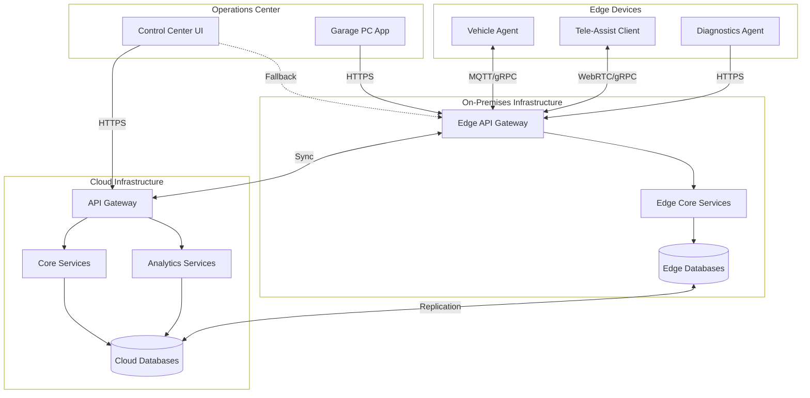

### 5.3 Air-Gapped Deployment

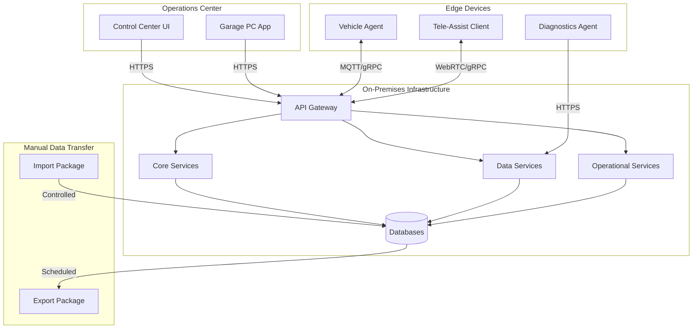

## 🛡️ **6) Failure Domains & Resilience**

AtlasMesh Fleet OS is designed with resilience in mind, with the following failure domains and mitigation strategies:

### 6.1 Communication Failures

| Failure Mode | Impact | Mitigation |
|--------------|--------|------------|
| Cloud connectivity loss | Remote monitoring and control unavailable | Edge autonomy for 45-60 minutes; store-and-forward telemetry |
| V2V/V2X disruption | Reduced coordination between vehicles | Independent operation modes; conservative safety parameters |
| GPS/GNSS denial | Position uncertainty | Multi-modal localization (SLAM, visual, inertial); degraded operation modes |

### 6.2 Service Failures

| Failure Mode | Impact | Mitigation |
|--------------|--------|------------|
| Mission Management outage | New missions cannot be created | Existing missions continue; graceful degradation |
| Routing Service outage | New routes cannot be calculated | Cached routes used; simplified routing fallbacks |
| Policy Engine outage | Policy decisions unavailable | Conservative default policies; cached decisions |

### 6.3 Environmental Challenges

| Failure Mode | Impact | Mitigation |
|--------------|--------|------------|
| Extreme heat | Sensor and compute degradation | Thermal management; derating curves; shade-seeking behavior |
| Dust/sand storms | Sensor occlusion | Multi-modal sensing; cleaning systems; confidence-aware fusion |
| Heavy precipitation | Reduced visibility and traction | Weather-aware routing; speed adaptation; safe harbor protocols |

## 🔗 **7) Key Interfaces & Integration Points**

### 7.1 External Interfaces

| Interface | Purpose | Protocol | Notes |
|-----------|---------|----------|-------|
| Enterprise Adapter | Integration with WMS/TOS/ERP | REST/SOAP/EDI | Contract-tested; version-pinned |
| Map Provider | Geospatial data ingestion | REST/WMTS/Vector Tiles | Multi-provider; provenance tracking |
| Weather Service | Weather data ingestion | REST/MQTT | Multi-source fusion; confidence scoring |
| Regulatory Reporting | Compliance documentation | REST/SFTP | Jurisdiction-specific formats |

### 7.2 Internal Interfaces

| Interface | Purpose | Protocol | Notes |
|-----------|---------|----------|-------|
| Vehicle Control | Command and telemetry | MQTT/gRPC | Secure; efficient; resilient |
| Service-to-Service | Inter-service communication | gRPC | mTLS; observability; rate limiting |
| Event Bus | Event distribution | Kafka | Exactly-once; ordered; durable |
| Policy Evaluation | Rule enforcement | OPA/Rego | Versioned; auditable; testable |

### 7.3 Edge-Cloud Interface

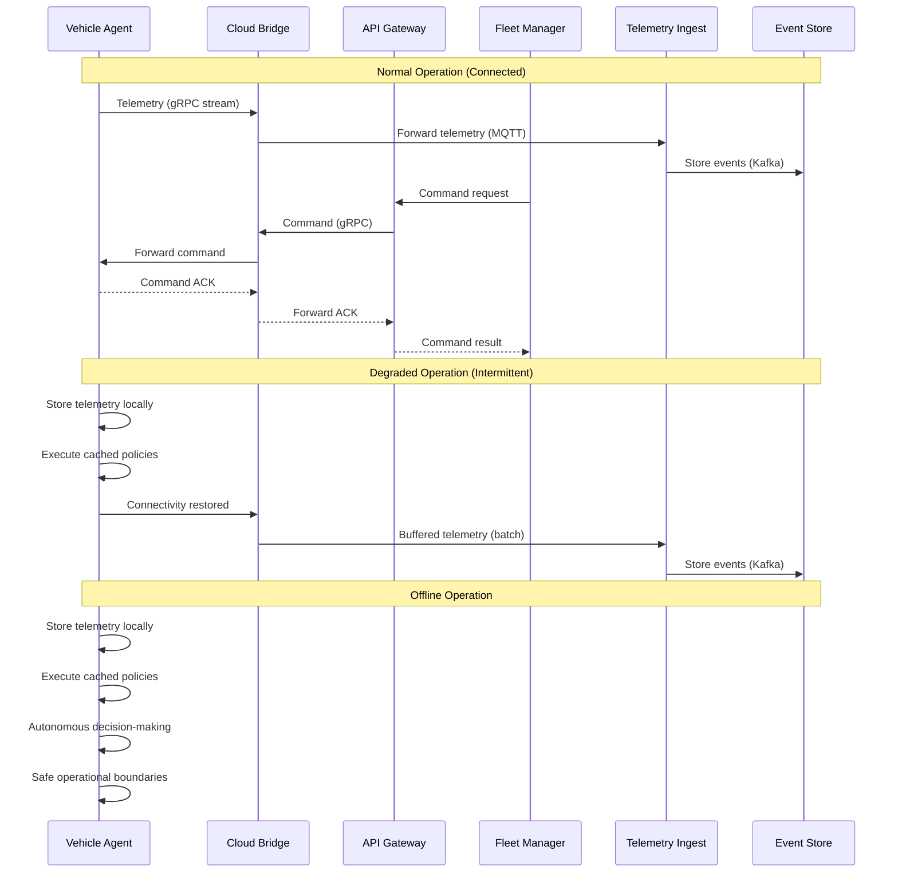

### 7.4 Data Contracts

#### Vehicle Telemetry Contract

```json
{
  "$schema": "http://json-schema.org/draft-07/schema#",
  "title": "Vehicle Telemetry",
  "type": "object",
  "required": ["vehicle_id", "timestamp", "sequence", "position", "status"],
  "properties": {
    "vehicle_id": {
      "type": "string",
      "description": "Unique identifier for the vehicle"
    },
    "timestamp": {
      "type": "string",
      "format": "date-time",
      "description": "ISO 8601 timestamp of the telemetry data"
    },
    "sequence": {
      "type": "integer",
      "description": "Monotonically increasing sequence number"
    },
    "position": {
      "type": "object",
      "required": ["latitude", "longitude", "heading"],
      "properties": {
        "latitude": { "type": "number" },
        "longitude": { "type": "number" },
        "heading": { "type": "number" },
        "altitude": { "type": "number" },
        "speed": { "type": "number" },
        "accuracy": { "type": "number" }
      }
    },
    "status": {
      "type": "object",
      "required": ["operational_state", "energy_level"],
      "properties": {
        "operational_state": {
          "type": "string",
          "enum": ["READY", "BUSY", "CHARGING", "MAINTENANCE", "ERROR"]
        },
        "energy_level": { "type": "number", "minimum": 0, "maximum": 100 },
        "health_score": { "type": "number", "minimum": 0, "maximum": 100 },
        "assist_state": {
          "type": "string",
          "enum": ["NONE", "REQUESTED", "ACTIVE"]
        }
      }
    },
    "diagnostics": {
      "type": "object",
      "properties": {
        "cpu_usage": { "type": "number" },
        "memory_usage": { "type": "number" },
        "disk_usage": { "type": "number" },
        "temperature": { "type": "number" },
        "network_quality": { "type": "number" }
      }
    },
    "mission": {
      "type": "object",
      "properties": {
        "mission_id": { "type": "string" },
        "route_id": { "type": "string" },
        "progress": { "type": "number", "minimum": 0, "maximum": 100 },
        "eta": { "type": "string", "format": "date-time" }
      }
    }
  }
}
```

#### Vehicle Command Contract

```json
{
  "$schema": "http://json-schema.org/draft-07/schema#",
  "title": "Vehicle Command",
  "type": "object",
  "required": ["command_id", "vehicle_id", "timestamp", "command_type"],
  "properties": {
    "command_id": {
      "type": "string",
      "description": "Unique identifier for the command"
    },
    "vehicle_id": {
      "type": "string",
      "description": "Target vehicle identifier"
    },
    "timestamp": {
      "type": "string",
      "format": "date-time",
      "description": "ISO 8601 timestamp of the command"
    },
    "command_type": {
      "type": "string",
      "enum": [
        "ASSIGN_MISSION", "CANCEL_MISSION", "PAUSE", "RESUME", 
        "SAFE_STOP", "EMERGENCY_STOP", "CHANGE_OPERATIONAL_MODE", 
        "UPDATE_ROUTE", "DIAGNOSTICS", "OTA_UPDATE"
      ]
    },
    "priority": {
      "type": "string",
      "enum": ["LOW", "NORMAL", "HIGH", "CRITICAL"],
      "default": "NORMAL"
    },
    "expiration": {
      "type": "string",
      "format": "date-time",
      "description": "ISO 8601 timestamp when the command expires"
    },
    "payload": {
      "type": "object",
      "description": "Command-specific parameters"
    },
    "authentication": {
      "type": "object",
      "properties": {
        "issuer": { "type": "string" },
        "signature": { "type": "string" }
      }
    }
  }
}
```

## 🚀 **8) Phase 2 Advanced Services**

AtlasMesh Fleet OS Phase 2 introduces advanced capabilities for production-scale operations:

### 8.1 Advanced Analytics & ML
- **Predictive Maintenance**: RUL models, feature store integration, work-order automation
- **Feature Store & Registry**: ML lifecycle management, drift detection, model versioning
- **Telemetry Lakehouse**: Hot/cold data paths, streaming ETL, cost optimization

### 8.2 Enhanced Security & Compliance
- **Zero-Trust IAM**: SPIFFE/SPIRE service identity, mTLS enforcement, policy centralization
- **Key & Secret Management**: Vault/KMS integration, rotation SLAs, envelope encryption
- **Evidence Engine**: Continuous evidence collection, automated audit bundles
- **Auditability**: Cryptographically signed decision logs, retention automation

### 8.3 Sector Customization & Multi-Tenancy
- **Sector Overlays**: Policy/UI tokens for sector-specific customizations without code forks
- **Tenant Entitlements**: Token-based entitlement model, multi-tenant isolation

### 8.4 Digital Twin & Simulation
- **Digital Twin & Simulation**: Scenario banks, golden replays, fault injection for robust testing

## 📈 **9) Observability & Monitoring**

AtlasMesh Fleet OS implements a comprehensive observability strategy:

- **Metrics**: Prometheus for service and business metrics; Grafana for dashboards
- **Logging**: Structured logging with correlation IDs; centralized log aggregation
- **Tracing**: OpenTelemetry for distributed tracing; Jaeger for visualization
- **Alerting**: Multi-tier alert definition; runbook integration; on-call rotation
- **SLOs**: Service Level Objectives with error budgets; SLI monitoring
- **Unified Observability**: Correlation IDs across all services, SLO dashboards, alert fatigue prevention

## 📡 **10) Eventing Backbone**

AtlasMesh Fleet OS uses a robust eventing architecture for system-wide communication:

- **Kafka Topics**: 16 specialized topics for different event types (vehicle events, fleet commands, system audits, DLQ patterns)
- **Schema Registry**: Avro schema management for message validation and evolution
- **Dead Letter Queues**: Comprehensive DLQ patterns for failed message processing
- **Event Bus Service**: Central event hub with routing, validation, and correlation ID propagation

## 🔒 **11) Security Architecture**

The security architecture follows defense-in-depth principles:

- **Identity**: SPIFFE/SPIRE for service identity; OIDC for user authentication
- **Access Control**: RBAC/ABAC with OPA; least privilege principle
- **Network Security**: mTLS for all traffic; network policies; segmentation
- **Data Protection**: Encryption at rest and in transit; key management
- **Supply Chain**: Verified builds; SBOM generation; vulnerability scanning
- **Incident Response**: Detection, containment, eradication, recovery procedures
- **Zero-Trust**: Service-to-service mTLS, policy centralization, continuous verification

## 📋 **12) Compliance Architecture**

The compliance architecture ensures regulatory adherence:

- **Safety Case**: Automated evidence generation; traceability; verification
- **Regulatory Mapping**: Jurisdiction-specific requirements and documentation
- **Audit Trail**: Immutable event logs; decision provenance; access records
- **Privacy Controls**: Data minimization; purpose limitation; retention policies
- **Evidence-as-Code**: Automated audit bundle generation with cryptographic signing

## 🚛 **13) Fleet Management Architecture**

### **13.1 Multi-Fleet Coordination Architecture**

```mermaid
graph TB
    subgraph "Multi-Fleet Coordination Layer"
        FleetOrchestrator[🚛 Fleet Orchestrator]
        CrossFleetManager[🔄 Cross-Fleet Manager]
        ResourcePool[💾 Resource Pool]
        FleetFederation[🌐 Fleet Federation]
    end
    
    subgraph "Fleet A (Defense)"
        FleetA[🛡️ Defense Fleet]
        VehiclesA[🚗 Vehicles A]
    end
    
    subgraph "Fleet B (Mining)"
        FleetB[⛏️ Mining Fleet]
        VehiclesB[🚛 Vehicles B]
    end
    
    subgraph "Fleet C (Logistics)"
        FleetC[🚛 Logistics Fleet]
        VehiclesC[📦 Vehicles C]
    end
    
    FleetOrchestrator --> CrossFleetManager
    CrossFleetManager --> ResourcePool
    CrossFleetManager --> FleetFederation
    
    FleetOrchestrator --> FleetA
    FleetOrchestrator --> FleetB
    FleetOrchestrator --> FleetC
    
    FleetA --> VehiclesA
    FleetB --> VehiclesB
    FleetC --> VehiclesC
    
    classDef coordinator fill:#e1f5fe,stroke:#01579b,stroke-width:2px
    classDef fleet fill:#f3e5f5,stroke:#4a148c,stroke-width:2px
    classDef vehicle fill:#e8f5e8,stroke:#1b5e20,stroke-width:2px
    
    class FleetOrchestrator,CrossFleetManager,ResourcePool,FleetFederation coordinator
    class FleetA,FleetB,FleetC fleet
    class VehiclesA,VehiclesB,VehiclesC vehicle

    style subGraph0 fill:transparent
    style subGraph1 fill:transparent
    style subGraph2 fill:transparent
    style subGraph3 fill:transparent
```

**Key Components:**
- **Fleet Orchestrator**: Central coordination across multiple fleets
- **Cross-Fleet Manager**: Handles inter-fleet resource sharing
- **Resource Pool**: Shared resource allocation and management
- **Fleet Federation**: Multi-tenant fleet isolation and coordination

### **13.2 Mission Management Architecture**

```mermaid
graph TB
    subgraph "Mission Management Layer"
        MissionPlanner[📋 Mission Planner]
        MissionTemplates[📄 Mission Templates]
        MissionOrchestrator[🎯 Mission Orchestrator]
        MissionScheduler[⏰ Mission Scheduler]
        MissionAnalytics[📊 Mission Analytics]
    end
    
    subgraph "Mission Types"
        SARMission[🔍 SAR Mission]
        CombatMission[⚔️ Combat Mission]
        LogisticsMission[📦 Logistics Mission]
        PatrolMission[🚔 Patrol Mission]
    end
    
    subgraph "Mission Execution"
        MissionExecutor[🚀 Mission Executor]
        MissionMonitor[👁️ Mission Monitor]
        MissionRollback[↩️ Mission Rollback]
    end
    
    MissionPlanner --> MissionTemplates
    MissionTemplates --> MissionOrchestrator
    MissionOrchestrator --> MissionScheduler
    MissionScheduler --> MissionAnalytics
    
    MissionOrchestrator --> SARMission
    MissionOrchestrator --> CombatMission
    MissionOrchestrator --> LogisticsMission
    MissionOrchestrator --> PatrolMission
    
    SARMission --> MissionExecutor
    CombatMission --> MissionExecutor
    LogisticsMission --> MissionExecutor
    PatrolMission --> MissionExecutor
    
    MissionExecutor --> MissionMonitor
    MissionMonitor --> MissionRollback
    
    classDef mission fill:#e1f5fe,stroke:#01579b,stroke-width:2px
    classDef type fill:#f3e5f5,stroke:#4a148c,stroke-width:2px
    classDef execution fill:#e8f5e8,stroke:#1b5e20,stroke-width:2px
    
    class MissionPlanner,MissionTemplates,MissionOrchestrator,MissionScheduler,MissionAnalytics mission
    class SARMission,CombatMission,LogisticsMission,PatrolMission type
    class MissionExecutor,MissionMonitor,MissionRollback execution

    style subGraph0 fill:transparent
    style subGraph1 fill:transparent
    style subGraph2 fill:transparent

```

**Key Components:**
- **Mission Planner**: Creates and configures missions
- **Mission Templates**: Reusable mission configurations
- **Mission Orchestrator**: Coordinates mission execution
- **Mission Scheduler**: Advanced mission scheduling
- **Mission Analytics**: Mission performance analysis

### **13.3 Fleet Optimization Architecture**

```mermaid
graph TB
    subgraph "Fleet Optimization Layer"
        OptimizationEngine[⚡ Optimization Engine]
        RebalancingEngine[⚖️ Rebalancing Engine]
        CostOptimizer[💰 Cost Optimizer]
        EnergyOptimizer[🔋 Energy Optimizer]
        CapacityOptimizer[📊 Capacity Optimizer]
    end
    
    subgraph "Optimization Algorithms"
        MLPredictor[🤖 ML Predictor]
        ConstraintSolver[🧮 Constraint Solver]
        GeneticAlgorithm[🧬 Genetic Algorithm]
        SimulatedAnnealing[❄️ Simulated Annealing]
    end
    
    subgraph "Optimization Targets"
        FleetUtilization[📈 Fleet Utilization]
        FleetCost[💵 Fleet Cost]
        FleetEnergy[⚡ Fleet Energy]
        FleetCapacity[📦 Fleet Capacity]
    end
    
    OptimizationEngine --> RebalancingEngine
    OptimizationEngine --> CostOptimizer
    OptimizationEngine --> EnergyOptimizer
    OptimizationEngine --> CapacityOptimizer
    
    RebalancingEngine --> MLPredictor
    CostOptimizer --> ConstraintSolver
    EnergyOptimizer --> GeneticAlgorithm
    CapacityOptimizer --> SimulatedAnnealing
    
    MLPredictor --> FleetUtilization
    ConstraintSolver --> FleetCost
    GeneticAlgorithm --> FleetEnergy
    SimulatedAnnealing --> FleetCapacity
    
    classDef optimization fill:#e1f5fe,stroke:#01579b,stroke-width:2px
    classDef algorithm fill:#f3e5f5,stroke:#4a148c,stroke-width:2px
    classDef target fill:#e8f5e8,stroke:#1b5e20,stroke-width:2px
    
    class OptimizationEngine,RebalancingEngine,CostOptimizer,EnergyOptimizer,CapacityOptimizer optimization
    class MLPredictor,ConstraintSolver,GeneticAlgorithm,SimulatedAnnealing algorithm
    class FleetUtilization,FleetCost,FleetEnergy,FleetCapacity target

    style subGraph0 fill:transparent
    style subGraph1 fill:transparent
    style subGraph2 fill:transparent
```

**Key Components:**
- **Optimization Engine**: Central optimization coordination
- **Rebalancing Engine**: Dynamic fleet rebalancing
- **Cost Optimizer**: Fleet cost optimization
- **Energy Optimizer**: Fleet energy management
- **Capacity Optimizer**: Fleet capacity optimization

### **13.4 Fleet Analytics Architecture**

```mermaid
graph TB
    subgraph "Fleet Analytics Layer"
        AnalyticsEngine[📊 Analytics Engine]
        HealthScorer[❤️ Health Scorer]
        EfficiencyCalculator[⚡ Efficiency Calculator]
        CapacityTracker[📦 Capacity Tracker]
        PerformanceAnalyzer[📈 Performance Analyzer]
        PredictiveEngine[🔮 Predictive Engine]
    end
    
    subgraph "Analytics Data Sources"
        TelemetryData[📡 Telemetry Data]
        OperationalData[⚙️ Operational Data]
        HistoricalData[📚 Historical Data]
        ExternalData[🌐 External Data]
    end
    
    subgraph "Analytics Outputs"
        HealthMetrics[❤️ Health Metrics]
        EfficiencyMetrics[⚡ Efficiency Metrics]
        CapacityMetrics[📦 Capacity Metrics]
        PerformanceMetrics[📈 Performance Metrics]
        PredictiveInsights[🔮 Predictive Insights]
    end
    
    AnalyticsEngine --> HealthScorer
    AnalyticsEngine --> EfficiencyCalculator
    AnalyticsEngine --> CapacityTracker
    AnalyticsEngine --> PerformanceAnalyzer
    AnalyticsEngine --> PredictiveEngine
    
    TelemetryData --> AnalyticsEngine
    OperationalData --> AnalyticsEngine
    HistoricalData --> AnalyticsEngine
    ExternalData --> AnalyticsEngine
    
    HealthScorer --> HealthMetrics
    EfficiencyCalculator --> EfficiencyMetrics
    CapacityTracker --> CapacityMetrics
    PerformanceAnalyzer --> PerformanceMetrics
    PredictiveEngine --> PredictiveInsights
    
    classDef analytics fill:#e1f5fe,stroke:#01579b,stroke-width:2px
    classDef data fill:#f3e5f5,stroke:#4a148c,stroke-width:2px
    classDef output fill:#e8f5e8,stroke:#1b5e20,stroke-width:2px
    
    class AnalyticsEngine,HealthScorer,EfficiencyCalculator,CapacityTracker,PerformanceAnalyzer,PredictiveEngine analytics
    class TelemetryData,OperationalData,HistoricalData,ExternalData data
    class HealthMetrics,EfficiencyMetrics,CapacityMetrics,PerformanceMetrics,PredictiveInsights output

    style subGraph0 fill:transparent
    style subGraph1 fill:transparent
    style subGraph2 fill:transparent

```

**Key Components:**
- **Analytics Engine**: Central analytics coordination
- **Health Scorer**: Fleet health scoring
- **Efficiency Calculator**: Fleet efficiency metrics
- **Capacity Tracker**: Fleet capacity utilization
- **Performance Analyzer**: Fleet performance analysis
- **Predictive Engine**: Fleet predictive analytics

### **13.5 Fleet Resource Management Architecture**

```mermaid
graph TB
    subgraph "Fleet Resource Management Layer"
        ResourceManager[💾 Resource Manager]
        AllocationEngine[🎯 Allocation Engine]
        OptimizationEngine[⚡ Optimization Engine]
        MonitoringEngine[👁️ Monitoring Engine]
        PlanningEngine[📋 Planning Engine]
        ForecastingEngine[🔮 Forecasting Engine]
    end
    
    subgraph "Resource Types"
        VehicleResources[🚗 Vehicle Resources]
        HumanResources[👥 Human Resources]
        InfrastructureResources[🏗️ Infrastructure Resources]
        FinancialResources[💰 Financial Resources]
    end
    
    subgraph "Resource Operations"
        ResourceAllocation[🎯 Resource Allocation]
        ResourceOptimization[⚡ Resource Optimization]
        ResourceMonitoring[👁️ Resource Monitoring]
        ResourcePlanning[📋 Resource Planning]
        ResourceForecasting[🔮 Resource Forecasting]
    end
    
    ResourceManager --> AllocationEngine
    ResourceManager --> OptimizationEngine
    ResourceManager --> MonitoringEngine
    ResourceManager --> PlanningEngine
    ResourceManager --> ForecastingEngine
    
    AllocationEngine --> VehicleResources
    OptimizationEngine --> HumanResources
    MonitoringEngine --> InfrastructureResources
    PlanningEngine --> FinancialResources
    ForecastingEngine --> VehicleResources
    
    VehicleResources --> ResourceAllocation
    HumanResources --> ResourceOptimization
    InfrastructureResources --> ResourceMonitoring
    FinancialResources --> ResourcePlanning
    VehicleResources --> ResourceForecasting
    
    classDef management fill:#e1f5fe,stroke:#01579b,stroke-width:2px
    classDef resource fill:#f3e5f5,stroke:#4a148c,stroke-width:2px
    classDef operation fill:#e8f5e8,stroke:#1b5e20,stroke-width:2px
    
    class ResourceManager,AllocationEngine,OptimizationEngine,MonitoringEngine,PlanningEngine,ForecastingEngine management
    class VehicleResources,HumanResources,InfrastructureResources,FinancialResources resource
    class ResourceAllocation,ResourceOptimization,ResourceMonitoring,ResourcePlanning,ResourceForecasting operation

    style subGraph0 fill:transparent
    style subGraph1 fill:transparent
    style subGraph2 fill:transparent
```

**Key Components:**
- **Resource Manager**: Central resource management
- **Allocation Engine**: Resource allocation logic
- **Optimization Engine**: Resource optimization
- **Monitoring Engine**: Resource monitoring
- **Planning Engine**: Resource planning
- **Forecasting Engine**: Resource forecasting

### **13.6 Fleet Performance Management Architecture**

```mermaid
graph TB
    subgraph "Fleet Performance Management Layer"
        PerformanceManager[📊 Performance Manager]
        MonitoringEngine[👁️ Monitoring Engine]
        OptimizationEngine[⚡ Optimization Engine]
        ReportingEngine[📋 Reporting Engine]
        AnalyticsEngine[📈 Analytics Engine]
        BenchmarkingEngine[🏆 Benchmarking Engine]
    end
    
    subgraph "Performance Metrics"
        SafetyMetrics[🛡️ Safety Metrics]
        EfficiencyMetrics[⚡ Efficiency Metrics]
        ReliabilityMetrics[🔧 Reliability Metrics]
        CostMetrics[💰 Cost Metrics]
        QualityMetrics[⭐ Quality Metrics]
    end
    
    subgraph "Performance Operations"
        PerformanceMonitoring[👁️ Performance Monitoring]
        PerformanceOptimization[⚡ Performance Optimization]
        PerformanceReporting[📋 Performance Reporting]
        PerformanceAnalytics[📈 Performance Analytics]
        PerformanceBenchmarking[🏆 Performance Benchmarking]
    end
    
    PerformanceManager --> MonitoringEngine
    PerformanceManager --> OptimizationEngine
    PerformanceManager --> ReportingEngine
    PerformanceManager --> AnalyticsEngine
    PerformanceManager --> BenchmarkingEngine
    
    MonitoringEngine --> SafetyMetrics
    OptimizationEngine --> EfficiencyMetrics
    ReportingEngine --> ReliabilityMetrics
    AnalyticsEngine --> CostMetrics
    BenchmarkingEngine --> QualityMetrics
    
    SafetyMetrics --> PerformanceMonitoring
    EfficiencyMetrics --> PerformanceOptimization
    ReliabilityMetrics --> PerformanceReporting
    CostMetrics --> PerformanceAnalytics
    QualityMetrics --> PerformanceBenchmarking
    
    classDef performance fill:#e1f5fe,stroke:#01579b,stroke-width:2px
    classDef metric fill:#f3e5f5,stroke:#4a148c,stroke-width:2px
    classDef operation fill:#e8f5e8,stroke:#1b5e20,stroke-width:2px
    
    class PerformanceManager,MonitoringEngine,OptimizationEngine,ReportingEngine,AnalyticsEngine,BenchmarkingEngine performance
    class SafetyMetrics,EfficiencyMetrics,ReliabilityMetrics,CostMetrics,QualityMetrics metric
    class PerformanceMonitoring,PerformanceOptimization,PerformanceReporting,PerformanceAnalytics,PerformanceBenchmarking operation

    style subGraph0 fill:transparent
    style subGraph1 fill:transparent
    style subGraph2 fill:transparent

```

**Key Components:**
- **Performance Manager**: Central performance management
- **Monitoring Engine**: Performance monitoring
- **Optimization Engine**: Performance optimization
- **Reporting Engine**: Performance reporting
- **Analytics Engine**: Performance analytics
- **Benchmarking Engine**: Performance benchmarking

## 🎯 **14) Key Architectural Decisions**

| ADR ID | Decision | Rationale | Alternatives Considered |
|--------|----------|-----------|-------------------------|
| ADR-0001 | Vehicle-Agnostic Architecture | Support multiple vehicle classes; reduce dependency on specific hardware | Vehicle-specific implementations; fork per vehicle type |
| ADR-0002 | Platform-Agnostic Architecture | Cloud-neutral deployment; avoid vendor lock-in | Cloud-specific optimizations; native services |
| ADR-0003 | Sector-Agnostic Architecture | Shared backbone with sector overlays; code reuse | Sector-specific forks; separate products |
| ADR-0004 | Sensor-Agnostic Architecture | Support multiple sensor configurations; certified packs | Hard-coded sensor integration; fixed sensor suite |
| ADR-0005 | Map-Source-Agnostic Architecture | Multiple map providers; provenance tracking | Single map provider; custom map format |
| ADR-0006 | Weather-Source-Agnostic Architecture | Multi-source weather fusion; confidence scoring | Single weather source; simple integration |
| ADR-0007 | Communications-Agnostic Architecture | Multi-path communications; offline-first | Single communication channel; cloud dependency |
| ADR-0008 | ROS2-Based Edge Stack | Industry standard; component isolation; real-time | Custom middleware; direct hardware access |
| ADR-0009 | Hybrid Decision Framework | Behavior trees + rules + ML; explainability | Pure ML approach; pure rule-based system |
| ADR-0010 | Simulation Strategy | CARLA + Gazebo; scenario-based validation | Single simulator; minimal simulation |
| ADR-011 | Event Sourcing | Audit trail; temporal queries; resilience | CRUD; synchronous APIs |
| ADR-012 | Policy as Code | Versioned rules; testable policies; separation of concerns | Hardcoded rules; config files |
| ADR-0013 | Multi-Fleet Coordination | Cross-fleet resource sharing; fleet federation | Single-fleet architecture; isolated fleets |
| ADR-0014 | Mission Management | Reusable mission templates; mission orchestration | Ad-hoc mission creation; manual coordination |
| ADR-0015 | Fleet Optimization | Dynamic optimization; multi-objective algorithms | Static configuration; single-objective optimization |
| ADR-0016 | Fleet Analytics | Comprehensive analytics; predictive insights | Basic reporting; reactive analytics |
| ADR-0017 | Fleet Resource Management | Centralized resource management; optimization | Decentralized resources; manual allocation |
| ADR-0018 | Fleet Performance Management | Continuous performance monitoring; optimization | Periodic reviews; manual optimization |

## 🗺️ **14) Architecture Evolution & Roadmap**

| Phase | Architectural Focus | Key Deliverables | Status |
|-------|---------------------|------------------|--------|
| Phase 1 | Core services; agnostic foundations | Mission management; dispatch; routing; policy engine; edge stack; UI | ✅ **COMPLETED** |
| Phase 2 | Advanced features; production readiness | Predictive maintenance; zero-trust security; evidence engine; digital twin | ✅ **COMPLETED** |
| Phase 3 | Qualified agnosticism implementation | Vehicle HAL; sensor packs; variant budget; conformance testing | ✅ **COMPLETED** |
| Phase 4 | Operational excellence; resilience | Chaos engineering; degraded modes; on-call runbooks; time sync | 🔄 **NEXT** |
| Future | Advanced intelligence; self-optimization | ML-driven optimization; predictive operations; autonomous healing | 📋 **PLANNED** |

## 🏛️ **15) Architecture Governance**

The architecture governance process ensures quality and alignment:

- **Architecture Review Board**: Weekly meetings; decision authority
- **RFC Process**: Formal proposal; review period; approval workflow
- **Architecture Principles**: Documented guidelines; compliance checks
- **Technical Debt Management**: Regular assessment; remediation planning
- **Innovation Pipeline**: Exploration; prototyping; evaluation; integration

## 📚 **16) References & Related Documents**

### Core Technical Documentation
- [System Requirements](03_Requirements_FRs_NFRs.md)
- [Security & Compliance](05_Security_and_Compliance.md)
- [Operations & Runbooks](06_Operations_and_Runbooks.md)
- [Data & Analytics Integration](04_Data_and_Analytics_Integration.md)
- [Architecture Decision Records](../ADR/README.md)

### Qualified Agnosticism Documentation
- [Qualified Agnosticism Overview](08_Qualified_Agnosticism.md)
- [Five Constraining Realities](09_Five_Constraining_Realities.md)
- [Feasibility Scorecard](10_Feasibility_Scorecard.md)
- [Agnostic By Contract](11_Agnostic_By_Contract.md)
- [Cross-Department Checklist](12_Cross_Department_Checklist.md)
- [Programmatic Proof Points](13_Programmatic_Proof_Points.md)
- [Architecture Reality Check](14_Architecture_Reality_Check.md)


## 🏛️ **15) Architecture Governance**

The architecture governance process ensures quality and alignment:

- **Architecture Review Board**: Weekly meetings; decision authority
- **RFC Process**: Formal proposal; review period; approval workflow
- **Architecture Principles**: Documented guidelines; compliance checks
- **Technical Debt Management**: Regular assessment; remediation planning
- **Innovation Pipeline**: Exploration; prototyping; evaluation; integration

## 📚 **16) References & Related Documents**

### Core Technical Documentation
- [System Requirements](03_Requirements_FRs_NFRs.md)
- [Security & Compliance](05_Security_and_Compliance.md)
- [Operations & Runbooks](06_Operations_and_Runbooks.md)
- [Data & Analytics Integration](04_Data_and_Analytics_Integration.md)
- [Architecture Decision Records](../ADR/README.md)

### Qualified Agnosticism Documentation
- [Qualified Agnosticism Overview](08_Qualified_Agnosticism.md)
- [Five Constraining Realities](09_Five_Constraining_Realities.md)
- [Feasibility Scorecard](10_Feasibility_Scorecard.md)
- [Agnostic By Contract](11_Agnostic_By_Contract.md)
- [Cross-Department Checklist](12_Cross_Department_Checklist.md)
- [Programmatic Proof Points](13_Programmatic_Proof_Points.md)
- [Architecture Reality Check](14_Architecture_Reality_Check.md)
