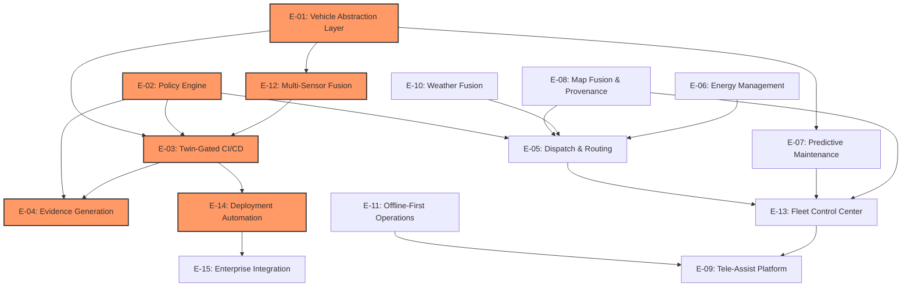

# AtlasMesh Fleet OS — Epics & Strategic Alignment

**Document Owner:** SVP Product & SVP Engineering  
**Last Updated:** 2025-09-16  
**Version:** 2.0  
**Status:** Authoritative Epic Definition  

This document maps high-level product epics to strategic objectives and customer problems, ensuring technical implementation directly addresses validated market needs. Each epic includes problem context, key features, strategic alignment, dependencies, and measurable success criteria.

## 0) Epic-to-Problem Mapping

AtlasMesh Fleet OS epics directly address the core problems identified in our [Problem Statement](../strategy/00_Problem_Statement_and_Solution.md):

| Core Problem | Primary Epic(s) | Secondary Epic(s) | Customer Impact |
|--------------|-----------------|------------------|-----------------|
| **Environmental Brittleness** | E-12 (Multi-Sensor Fusion), E-11 (Offline-First) | E-10 (Weather Fusion), E-08 (Map Fusion) | 98.5%+ uptime in harsh conditions |
| **Integration Hell** | E-01 (Vehicle Abstraction), E-15 (Enterprise Integration) | E-14 (Deployment Automation), E-13 (Fleet Control) | Weeks to deployment vs. months |
| **Compliance Nightmare** | E-04 (Evidence Generation), E-02 (Policy Engine) | E-03 (Twin-Gated CI/CD), E-09 (Tele-Assist) | Automated compliance evidence |
| **Vendor Lock-in** | E-01 (Vehicle Abstraction), E-08 (Map Fusion) | E-12 (Multi-Sensor Fusion), E-10 (Weather Fusion) | Strategic freedom across vendors |
| **Operational Inefficiency** | E-05 (Dispatch & Routing), E-06 (Energy Management) | E-07 (Predictive Maintenance), E-13 (Fleet Control) | 15%+ efficiency improvements |

## 1) Epic Overview & Strategic Mapping

| Epic ID | Epic Name | Description | Strategic Objectives | Primary Sectors | Priority | Business Impact Metrics | Verification Methodology | Failure Consequences |
| --- | --- | --- | --- | --- | --- | --- | --- | --- |
| E-01 | **Vehicle Abstraction Layer** | Enable multi-vehicle support through standardized interfaces and profiles | O-3 (Cost & Scale) | All | P0 | Vehicle onboarding time -75%; Maintenance cost -30%; Fleet diversity +200% | A/B testing vs. custom code; maintenance tracking; fleet composition analysis | Siloed vehicle implementations; scaling bottleneck; maintenance explosion |
| E-02 | **Policy Engine** | Implement rules-as-code for sector-specific constraints and behaviors | O-1, O-4 (Safety, Regulatory) | All | P0 | Regulatory approval time -50%; Policy update time -90%; Compliance violations -100% | Compliance audit; deployment metrics; incident analysis | Regulatory blocks; manual policy enforcement; inconsistent behavior |
| E-03 | **Twin-Gated CI/CD** | Establish scenario-based validation across the matrix | O-1 (Safety) | All | P0 | Production incidents -80%; Release confidence +90%; Release frequency +200% | Incident root cause analysis; developer survey; release cadence tracking | Safety incidents; release delays; quality regression |
| E-04 | **Evidence Generation** | Automate compliance evidence collection and bundling | O-1, O-4 (Safety, Regulatory) | All | P0 | Audit preparation time -85%; Compliance gaps -95%; Certification time -60% | Audit efficiency metrics; compliance gap analysis; certification timeline | Regulatory blocks; manual evidence collection; compliance violations |
| E-05 | **Dispatch & Routing** | Optimize fleet operations with multi-objective routing | O-3 (Cost & Scale) | All | P1 | Fleet utilization +15%; Empty miles -20%; Energy usage -10% | A/B testing; utilization metrics; cost analysis | Suboptimal resource usage; higher operational costs; missed SLAs |
| E-06 | **Energy Management** | Optimize charging, range, and energy costs | O-3 (Cost & Scale) | Mining, Ports, Ride-hail | P1 |
| E-07 | **Predictive Maintenance** | Reduce downtime through predictive analytics | O-3 (Cost & Scale) | Mining, Ports | P1 |
| E-08 | **Map Fusion & Provenance** | Enable multi-provider map usage with quality tracking | O-1, O-3 (Safety, Scale) | All | P1 |
| E-09 | **Tele-Assist Platform** | Provide remote assistance capabilities with audit trails | O-1, O-5 (Safety, UX) | All | P1 |
| E-10 | **Weather Fusion** | Integrate multiple weather sources with confidence scoring | O-1 (Safety) | All | P2 |
| E-11 | **Offline-First Operations** | Enable resilient operations in connectivity-challenged environments | O-1 (Safety) | Defense, Mining | P1 |
| E-12 | **Multi-Sensor Fusion** | Support different sensor packs with consistent perception | O-1, O-3 (Safety, Scale) | All | P0 |
| E-13 | **Fleet Control Center** | Provide unified operations interface with sector overlays | O-2, O-5 (Time-to-Value, UX) | All | P1 |
| E-14 | **Deployment Automation** | Streamline site setup and configuration | O-2 (Time-to-Value) | All | P1 |
| E-15 | **Enterprise Integration** | Connect with customer systems (ERP, WMS, TOS) | O-2, O-3 (Time-to-Value, Scale) | Mining, Ports | P2 |

*Priority: P0 = Critical Path, P1 = High Value, P2 = Important, P3 = Nice to Have*

## 2) Detailed Epic Breakdowns

### E-01: Vehicle Abstraction Layer

**Problem Context**: Customers operate mixed fleets (different OEMs, vehicle types, ages) but current AV solutions require custom code per vehicle, leading to 3-6 month integration cycles and $500K+ per vehicle type. Mining customers report: *"Each vehicle requires separate codebase - we can't scale this approach."*

**Customer Validation**: 
- **Ma'aden (Mining)**: "We have CAT, Komatsu, and Volvo trucks - need one system for all"
- **DP World (Logistics)**: "Port has 15+ vehicle types, custom integration is impossible"
- **UAE Armed Forces (Defense)**: "Mixed vehicle convoys need unified command and control"

**Description**: Create a standardized interface for vehicle control that abstracts away vehicle-specific details, enabling support for multiple vehicle classes and models without code forks. One platform handles UGVs, haul trucks, yard tractors, and passenger vehicles through configurable profiles.

**Key Features**:
- **Vehicle Profile System**: Mass, dimensions, dynamics, capability manifests
- **Drive-by-Wire Abstraction**: Unified API for steering, throttle, brake across all vehicle types
- **Controller Parameter Optimization**: Auto-tuning by vehicle class and operating conditions
- **Health Monitoring Standardization**: Common diagnostics interface across OEMs
- **Graceful Degradation Modes**: Vehicle-specific safe states and fallback behaviors
- **Hot-Swap Configuration**: Runtime vehicle profile changes without system restart

**Strategic Alignment**:
- **O-3 (Cost & Scale)**: Enables multi-vehicle fleets without code multiplication
- **O-2 (Time-to-Value)**: Rapid onboarding of new vehicle classes
- **O-1 (Safety)**: Consistent safety behaviors across vehicle types
- **Customer Problem Solved**: Eliminates "Integration Hell" - weeks vs. months to add vehicles

**Dependencies**:
- Vehicle manufacturer partnerships for CAN/J1939/Ethernet specifications
- Hardware interface standardization (CoreX retrofit kit)
- Test vehicles for profile development and validation
- Safety certification for abstraction layer

**Success Criteria**:
- **Technical**: Support for ≥4 vehicle classes (UGV, haul truck, yard tractor, passenger)
- **Business**: Zero vehicle-specific code in core platform
- **Operational**: <48 hour onboarding time for new vehicle models within existing class
- **Quality**: 95%+ parameter accuracy across all vehicle profiles
- **Customer**: 75% reduction in vehicle integration time vs. custom approach

**Risk Mitigation**:
- **Abstraction Overhead**: Extensive performance testing and optimization
- **Vehicle Diversity**: Modular profile system accommodates edge cases
- **Safety Compliance**: Independent safety assessment of abstraction layer

**Technical Implementation Path**: 
- `/edge/vehicle-agent/hal/*`
- `/configs/vehicles/*`
- `/services/fleet-health/diagnostics/*`

### E-02: Policy Engine

**Description**: Implement a rules-as-code system that defines sector-specific constraints, regulatory requirements, and operational behaviors without requiring code changes.

**Key Features**:
- Policy definition language and compiler
- Runtime policy evaluation
- Policy versioning and audit trails
- Jurisdiction packs for regional compliance
- Policy visualization and explanation

**Strategic Alignment**:
- Supports O-1 (Safety) through enforceable constraints
- Enables O-4 (Regulatory Trust) through transparent compliance
- Facilitates multi-sector operation (O-3)

**Dependencies**:
- Regulatory framework analysis
- Domain expert input for sector-specific rules
- Integration with decision points throughout the system

**Success Criteria**:
- Policy evaluation latency ≤10ms (p99)
- 100% of sector-specific constraints expressed as policies
- Zero compliance violations in audited deployments
- Policy update deployment ≤24 hours

**Technical Implementation Path**:
- `/rules/policy/*`
- `/services/policy-engine/*`
- `/ui/policy-editor/*`

### E-03: Twin-Gated CI/CD

**Description**: Establish a CI/CD pipeline that validates changes against a comprehensive set of scenarios across the full matrix of vehicles, sectors, weather conditions, and sensor packs.

**Key Features**:
- Scenario catalog with coverage metrics
- Automated scenario execution in CI
- Digital twin integration
- Matrix testing across variants
- Performance regression detection

**Strategic Alignment**:
- Critical for O-1 (Safety) through comprehensive validation
- Enables rapid, confident releases (O-2)
- Ensures consistent quality across variants (O-3)

**Dependencies**:
- Digital twin environment
- Scenario development framework
- Test infrastructure scaling

**Success Criteria**:
- 100% critical scenario coverage for each release
- CI execution time ≤4 hours for full matrix
- Zero safety-critical issues escaping to production
- Automated evidence generation for safety case

**Technical Implementation Path**:
- `/sim/scenario-bank/*`
- `/ci/pipelines/*`
- `/sim/twin-gates/*`

### E-04: Evidence Generation

**Description**: Automate the collection, verification, and bundling of compliance evidence throughout the development and operational lifecycle.

**Key Features**:
- Evidence collection hooks in CI/CD
- Operational telemetry with provenance
- Safety case generation and maintenance
- Regulatory mapping for different jurisdictions
- Audit-ready evidence bundles

**Strategic Alignment**:
- Essential for O-4 (Regulatory Trust)
- Supports O-1 (Safety) through systematic validation
- Reduces compliance overhead (O-2)

**Dependencies**:
- Regulatory requirements analysis
- Telemetry infrastructure
- Secure storage and verification

**Success Criteria**:
- 100% of releases with complete evidence bundles
- Evidence bundle generation time ≤1 hour
- Successful passage of external audits
- Automated traceability from requirements to evidence

**Technical Implementation Path**:
- `/compliance/evidence-collector/*`
- `/compliance/safety-case/*`
- `/services/telemetry/evidence/*`

### E-05: Dispatch & Routing

**Description**: Optimize fleet operations through intelligent dispatch and multi-objective routing that balances efficiency, safety, and customer service.

**Key Features**:
- Multi-objective route optimization
- Dynamic rebalancing
- Traffic and congestion awareness
- Mission-specific routing profiles
- Energy-aware path planning

**Strategic Alignment**:
- Drives O-3 (Cost & Scale) through operational efficiency
- Improves customer experience (O-5)
- Enables sector-specific optimizations

**Dependencies**:
- Map data integration
- Traffic data sources
- Historical performance data

**Success Criteria**:
- 10-15% reduction in idle time
- Route ETA accuracy within 8%
- Throughput improvements meeting sector KPIs
- Successful optimization across different fleet sizes

**Technical Implementation Path**:
- `/services/routing/*`
- `/services/dispatch/*`
- `/ml/models/rebalancing/*`

### E-06: Energy Management

**Description**: Optimize vehicle energy usage, charging schedules, and cost through predictive modeling and intelligent scheduling.

**Key Features**:
- Charge schedule optimization
- Range prediction and management
- Energy cost optimization
- Grid demand response integration
- Battery health monitoring

**Strategic Alignment**:
- Supports O-3 (Cost & Scale) through operational savings
- Improves availability (O-1) through predictable energy management
- Enhances sustainability metrics

**Dependencies**:
- Vehicle energy telemetry
- Charging infrastructure integration
- Utility rate information

**Success Criteria**:
- 10% reduction in energy costs
- 30% reduction in charging queue time
- Range prediction accuracy within 5%
- Zero mission failures due to energy issues

**Technical Implementation Path**:
- `/services/energy-manager/*`
- `/ml/models/energy/*`
- `/services/charger-integration/*`

### E-07: Predictive Maintenance

**Description**: Reduce unplanned downtime and maintenance costs through predictive analytics and condition monitoring.

**Key Features**:
- Component health monitoring
- Failure prediction models
- Maintenance schedule optimization
- Parts inventory forecasting
- Maintenance workflow integration

**Strategic Alignment**:
- Drives O-3 (Cost & Scale) through reduced downtime
- Improves fleet availability (O-1)
- Enhances operational predictability

**Dependencies**:
- Vehicle telemetry data
- Maintenance history
- Component specifications

**Success Criteria**:
- 20% reduction in unplanned downtime
- Predictive model accuracy ≥85%
- Maintenance cost reduction ≥15%
- Parts inventory optimization ≥10%

**Technical Implementation Path**:
- `/services/fleet-health/pdm/*`
- `/ml/models/maintenance/*`
- `/services/cmms-integration/*`

### E-08: Map Fusion & Provenance

**Description**: Enable the use of multiple map sources with quality tracking, conflict resolution, and provenance verification.

**Key Features**:
- Multi-provider map ingestion
- Semantic map representation
- Conflict detection and resolution
- Map update verification
- Provenance tracking and signatures

**Strategic Alignment**:
- Supports O-1 (Safety) through map quality assurance
- Enables multi-region operation (O-3)
- Reduces dependency on single providers

**Dependencies**:
- Map provider integrations
- Semantic map schema
- Verification infrastructure

**Success Criteria**:
- Map conflict MTTResolve ≤24h
- Zero safety incidents due to map issues
- 100% of map updates with provenance tracking
- Successful operation with multiple map providers

**Technical Implementation Path**:
- `/services/map-service/*`
- `/services/map-fusion/*`
- `/data/maps/schema/*`

### E-09: Tele-Assist Platform

**Description**: Provide remote assistance capabilities for autonomous vehicles with comprehensive audit trails and efficient operator workflows.

**Key Features**:
- Assist request triage and routing
- Operator interface with situational awareness
- Bandwidth-adaptive communications
- Assist decision recording and playback
- Operator performance metrics

**Strategic Alignment**:
- Supports O-1 (Safety) through human oversight
- Improves operator experience (O-5)
- Enables efficient scaling (O-3)

**Dependencies**:
- Communications infrastructure
- Operator training program
- Vehicle telemetry and visualization

**Success Criteria**:
- Assist RTT p50 <30s, p95 <90s
- Operator efficiency ≥10 assists/hour
- 100% of assists with complete audit trails
- Positive operator experience (SUS ≥80)

**Technical Implementation Path**:
- `/services/tele-assist/*`
- `/ui/assist-console/*`
- `/services/assist-analytics/*`

### E-10: Weather Fusion

**Description**: Integrate multiple weather data sources with confidence scoring to enable safe operation in varying environmental conditions.

**Key Features**:
- Multi-source weather data ingestion
- Confidence and freshness scoring
- Weather-aware routing and planning
- Environmental condition monitoring
- Weather event prediction and response

**Strategic Alignment**:
- Critical for O-1 (Safety) in harsh environments
- Enables operation in challenging conditions (O-3)
- Improves operational predictability

**Dependencies**:
- Weather data provider integrations
- Vehicle environmental sensors
- Site weather stations

**Success Criteria**:
- Weather fusion availability ≥99.5%
- Weather-related incidents trending down QoQ
- Successful operation in target environmental conditions
- Positive utility in route planning decisions

**Technical Implementation Path**:
- `/services/weather-fusion/*`
- `/services/environmental-monitoring/*`
- `/ml/models/weather/*`

### E-11: Offline-First Operations

**Description**: Enable resilient operations in connectivity-challenged environments through local decision-making, store-and-forward telemetry, and graceful degradation.

**Key Features**:
- Local autonomy budgets
- Store-and-forward telemetry
- Offline map usage
- Communications path management
- Graceful service degradation

**Strategic Alignment**:
- Essential for O-1 (Safety) in remote environments
- Enables operation in defense and mining sectors (O-3)
- Improves overall system resilience

**Dependencies**:
- Edge computing infrastructure
- Local storage capacity
- Prioritization framework for limited bandwidth

**Success Criteria**:
- Minimum 45-minute offline operation capability
- 100% critical telemetry eventually delivered
- Zero safety incidents due to connectivity loss
- Graceful recovery after connectivity restoration

**Technical Implementation Path**:
- `/edge/offline-manager/*`
- `/services/store-forward/*`
- `/services/comms-orchestrator/*`

### E-12: Multi-Sensor Fusion

**Description**: Support different sensor configurations through a flexible perception stack that maintains consistent performance across sensor packs.

**Key Features**:
- Sensor hardware abstraction layer
- Pack-specific perception models
- Sensor health monitoring
- Degraded operation modes
- Calibration and validation tools

**Strategic Alignment**:
- Enables multi-vehicle support (O-3)
- Ensures consistent safety (O-1) across configurations
- Reduces supply chain risk

**Dependencies**:
- Sensor vendor integrations
- Calibration infrastructure
- Test data across environments

**Success Criteria**:
- Perception performance meeting pack-specific targets
- Seamless operation with certified sensor packs
- Graceful degradation with sensor failures
- Calibration time ≤4 hours per vehicle

**Technical Implementation Path**:
- `/edge/perception/*`
- `/adapters/sensors/*`
- `/ml/models/perception/*`

### E-13: Fleet Control Center

**Description**: Provide a unified operations interface for fleet management with sector-specific overlays and role-based access.

**Key Features**:
- Real-time fleet visualization
- Sector-specific workspaces
- Incident management workflow
- Performance dashboards
- Role-based access control

**Strategic Alignment**:
- Critical for O-5 (UX & Adoption)
- Enables efficient operations (O-3)
- Supports rapid onboarding (O-2)

**Dependencies**:
- Telemetry infrastructure
- UI component library
- User research across sectors

**Success Criteria**:
- Operator SUS score ≥80
- Training time ≤2 hours
- Successful operation across all target sectors
- Positive customer feedback on usability

**Technical Implementation Path**:
- `/ui/control-center/*`
- `/services/fleet-manager/*`
- `/ui/design-system/*`

### E-14: Deployment Automation

**Description**: Streamline site setup and configuration through automated processes and validation.

**Key Features**:
- Site survey automation
- Configuration generation
- Validation and verification
- Deployment pipeline
- Rollback capabilities

**Strategic Alignment**:
- Essential for O-2 (Time-to-Value)
- Enables consistent quality across deployments (O-1)
- Reduces operational overhead (O-3)

**Dependencies**:
- Site survey tools
- Configuration management system
- Validation framework

**Success Criteria**:
- Site deployment time ≤90 days (first site), ≤60 days (subsequent)
- Zero critical issues during deployment
- Configuration validation 100% automated
- Consistent deployment quality across sites

**Technical Implementation Path**:
- `/deploy/site-automation/*`
- `/deploy/config-generator/*`
- `/deploy/validation/*`

### E-15: Enterprise Integration

**Description**: Connect with customer systems (ERP, WMS, TOS) to enable seamless data flow and operational integration.

**Key Features**:
- Adapter framework for enterprise systems
- Data mapping and transformation
- Event-driven integration
- Contract testing
- Version management

**Strategic Alignment**:
- Supports O-2 (Time-to-Value) through faster integration
- Enables deeper operational integration (O-3)
- Improves customer experience (O-5)

**Dependencies**:
- Customer system specifications
- Integration testing environment
- Data mapping framework

**Success Criteria**:
- Integration time ≤4 weeks per system type
- Zero production incidents due to integration issues
- Adapter test coverage ≥95%
- Successful operation with major enterprise systems

**Technical Implementation Path**:
- `/adapters/enterprise/*`
- `/services/integration-manager/*`
- `/data/schemas/integration/*`

## 3) Epic Dependencies & Critical Path

## 4) Release Roadmap

| Release | Timeline | Key Epics | Focus Areas | Success Metrics |
| --- | --- | --- | --- | --- |
| **R1: Foundation** | Q1-Q2 | E-01, E-02, E-03, E-12 | Vehicle abstraction, policy engine, sensor fusion | Vehicle profiles (2), Policy engine v1, Twin gates pass rate ≥90% |
| **R2: Safety & Compliance** | Q2-Q3 | E-04, E-08, E-11, E-14 | Evidence generation, map fusion, offline operations | Evidence bundles v1, Map fusion with 2 providers, Offline operation ≥30 min |
| **R3: Operations** | Q3-Q4 | E-05, E-09, E-13 | Dispatch/routing, tele-assist, control center | Routing optimization v1, Assist RTT targets, Control center SUS ≥75 |
| **R4: Optimization** | Q4-Q5 | E-06, E-07, E-10, E-15 | Energy management, PdM, weather fusion, integration | Energy cost ↓10%, PdM accuracy ≥80%, Weather fusion v1, 2 enterprise adapters |

## 5) Strategic Alignment Matrix

| Strategic Objective | Supporting Epics | Key Dependencies | Success Indicators |
| --- | --- | --- | --- |
| **O-1: Safety & Reliability** | E-02, E-03, E-04, E-08, E-10, E-11, E-12 | Digital twin, Safety case framework | Assist rate, Availability, Safety incidents |
| **O-2: Time-to-Value** | E-04, E-13, E-14, E-15 | Deployment automation, Integration framework | Site deployment time, Integration time |
| **O-3: Cost & Scale** | E-01, E-05, E-06, E-07, E-12, E-15 | Vehicle profiles, Optimization models | TCO reduction, Multi-vehicle support |
| **O-4: Regulatory Trust** | E-02, E-04, E-08 | Policy engine, Evidence generation | Audit success, Compliance violations |
| **O-5: UX & Adoption** | E-09, E-13, E-15 | Control center, Assist platform | SUS score, Training time |

## 6) Resource Allocation

| Team | Primary Epics | Secondary Epics | Key Skills Required |
| --- | --- | --- | --- |
| **Core Platform** | E-01, E-02, E-03 | E-04, E-11 | Systems engineering, Safety-critical software, CI/CD |
| **Perception** | E-12 | E-08, E-10 | Computer vision, Sensor fusion, ML |
| **Operations** | E-05, E-06, E-13 | E-07, E-09 | Optimization, UX design, Fleet management |
| **Data & ML** | E-07, E-08, E-10 | E-05, E-06 | ML engineering, Data science, Geospatial |
| **Integration** | E-14, E-15 | E-04, E-13 | Systems integration, Enterprise software, Deployment |
| **Safety & Compliance** | E-04 | E-02, E-03 | Safety engineering, Regulatory compliance |

## 7) Risk Assessment & Failure Mode Analysis

### 7.1) Epic-Level Risks

| Risk ID | Description | Impact | Likelihood | Detection Methods | Mitigation | Recovery Strategy | Owner | MTTR Target | Cascade Effects |
| --- | --- | --- | --- | --- | --- | --- | --- | --- | --- |
| R-01 | Vehicle interface standardization challenges | High | Medium | Integration testing; field feedback; performance metrics | Early prototyping, manufacturer partnerships | Interface adapters; custom connectors; degraded operation | Core Platform | <2 weeks | E-03, E-12, E-07 degraded; vehicle onboarding delays |
| R-02 | Policy engine expressiveness limitations | High | Medium | Policy coverage gaps; rule conflicts; performance issues | Domain-specific language design, iterative development | Policy workarounds; manual overrides; emergency updates | Core Platform | <1 week | E-04, E-05, E-08 blocked; regulatory compliance issues |
| R-03 | Twin-gated CI/CD performance bottlenecks | Medium | High | Build times; resource utilization; test failures | Infrastructure scaling, test optimization | Priority testing; parallel execution; selective validation | DevOps | <3 days | All epic delivery delayed; release cadence impact |
| R-04 | Sensor supply chain disruptions | High | Medium | Lead time increases; inventory alerts; vendor communications | Multi-vendor strategy, buffer inventory | Alternative sensors; degraded operation modes; recertification | Procurement | <30 days | E-12, E-10 severely impacted; deployment delays |
| R-05 | Regulatory framework changes | High | Medium | Regulatory monitoring; compliance scans; authority communications | Policy engine flexibility, regulatory monitoring | Rapid policy updates; jurisdiction restrictions; compliance task force | Compliance | <14 days | E-02, E-04 require rework; market access restrictions |
| R-06 | Integration complexity with legacy systems | Medium | High | Integration test failures; performance degradation; data inconsistencies | Adapter framework, early customer collaboration | Fallback interfaces; manual workarounds; phased integration | Integration | <1 week | E-15, E-13 deployment delays; customer satisfaction impact |
| R-07 | Operator adoption challenges | Medium | Medium | Usage metrics; support tickets; satisfaction surveys | User research, training program, UX focus | Enhanced training; UI simplification; feature prioritization | Operations | <30 days | E-09, E-13 user rejection; operational efficiency impact |

### 7.2) Cross-Epic Integration Risks

| Risk ID | Scenario | Affected Epics | Impact | Mitigation |
| --- | --- | --- | --- | --- |
| R-08 | Map-Weather-Policy conflict cascade | E-02, E-08, E-10 | Route planning failures | Conflict resolution hierarchy, fallback modes |
| R-09 | Vehicle-Sensor-Energy optimization mismatch | E-01, E-06, E-12 | Suboptimal performance | Unified optimization framework |
| R-10 | Assist-Control Center-Evidence audit trail gaps | E-04, E-09, E-13 | Compliance violations | End-to-end audit trail validation |
| R-11 | Offline-Deploy-Integration state inconsistency | E-11, E-14, E-15 | System instability | State synchronization protocols |
| R-12 | PdM-Dispatch-Energy scheduling conflicts | E-05, E-06, E-07 | Operational disruption | Multi-objective optimization with constraints |

### 7.3) Scalability Breaking Points & Degradation Patterns

| Dimension | Early Warning | Stress Point | Breaking Point | System Behavior Near Limit | Progressive Degradation Pattern | Mitigation Strategy | Scaling Approach |
| --- | --- | --- | --- | --- | --- | --- | --- |
| **Fleet Size** | >800 vehicles, response time ↑ | >1,000 vehicles per site | >1,500 vehicles | Increased latency; queue buildup; resource contention | 1) Control center refresh delays; 2) Non-critical service degradation; 3) Dispatch optimization reduction; 4) Critical service protection | Load shedding; priority queuing; resource isolation | Hierarchical control architecture; regional sharding; edge computing |
| **Geographic Spread** | >40km, coordination latency ↑ | >50km radius operations | >100km radius | Communication delays; data synchronization issues; increased bandwidth | 1) Map update delays; 2) Non-critical telemetry throttling; 3) Coordination simplification; 4) Local autonomy emphasis | Edge processing; data prioritization; mesh networking | Edge deployment; regional hubs; hierarchical coordination |
| **Concurrent Assists** | >15 concurrent, queue time ↑ | >20 simultaneous | >35 simultaneous | Queue buildup; operator overload; response delays | 1) Auto-resolution for simple cases; 2) Priority-based queuing; 3) Simplified assistance options; 4) Critical-only mode | Operator efficiency tools; assist triage; automation | Operator pool scaling; AI assistance; regional distribution |
| **Policy Complexity** | >8,000 rules, evaluation time ↑ | >10,000 rules per sector | >15,000 rules | Policy evaluation delays; increased resource usage | 1) Caching common evaluations; 2) Rule optimization; 3) Evaluation simplification; 4) Critical-only evaluation | Rule optimization; hierarchical policies; caching | Distributed evaluation; policy sharding; incremental evaluation |
| **Data Volume** | >8TB/day, processing lag ↑ | >10TB/day per site | >20TB/day | Processing backlogs; storage pressure; analysis delays | 1) Non-critical data sampling; 2) Reduced resolution; 3) Temporary aggregation; 4) Critical-only collection | Data tiering; adaptive sampling; edge filtering | Distributed processing; tiered storage; data lifecycle management |
| **Integration Points** | >40 integrations, failure rate ↑ | >50 external systems | >75 systems | Increased failures; resource contention; timeout cascades | 1) Non-critical integration throttling; 2) Simplified data exchange; 3) Polling reduction; 4) Critical-only integration | Circuit breakers; integration prioritization; fallbacks | Adapter isolation; integration gateway; message broker architecture |

### 7.4) Edge Case Scenarios

| Scenario | Trigger | System Response | Validation Method |
| --- | --- | --- | --- |
| **Complete GNSS Blackout** | Military jamming, solar storm | SLAM-only navigation, reduced ODD | Simulation + field testing |
| **Multi-Sensor Failure** | Sandstorm, equipment failure | Limp-home mode, human takeover | Fault injection testing |
| **Network Partition** | Infrastructure failure | Island operation, eventual consistency | Chaos engineering |
| **Regulatory Emergency Stop** | Safety incident elsewhere | Fleet-wide halt, evidence preservation | Regulatory drill scenarios |
| **Operator Mass Unavailability** | Pandemic, strike | Autonomous operation extension, SLA adjustment | Business continuity testing |
| **Map Data Corruption** | Cyberattack, provider error | Fallback to cached maps, restricted operations | Security penetration testing |
| **Energy Grid Instability** | Peak demand, outages | Load shedding, mission prioritization | Grid simulation testing |

### 7.5) Human Factors Risks & Interaction Design

| Risk Category | Specific Risk | Cognitive/Behavioral Aspect | System Impact | Detection Methods | Prevention Strategy | Recovery Approach | Validation Method |
| --- | --- | --- | --- | --- | --- | --- | --- |
| **Attention Management** | **Cognitive Overload** | Attention saturation; task switching cost; information processing limits | Missed alerts; delayed responses; decision errors | Eye tracking; response time metrics; error patterns | Progressive disclosure; prioritized alerts; cognitive workload balancing | Dynamic task reallocation; guided recovery workflows; decision support | Cognitive load assessment; simulator testing; field validation |
| **Mental Models** | **Automation Bias** | Over-trust in automation; reduced vigilance; complacency | Missed intervention opportunities; reduced oversight quality | Interaction patterns; verification behavior; engagement metrics | Confidence visualization; periodic verification tasks; transparent operation | Trust calibration exercises; manual validation requirements; expertise development | Trust assessment surveys; intervention analysis; simulation testing |
| **Decision Making** | **Alert Fatigue** | Desensitization; alarm normalization; priority confusion | Ignored warnings; delayed responses; habituation | Response time trends; dismiss patterns; eye tracking | Alert reduction; intelligent filtering; adaptive thresholds | Alert reset periods; priority escalation; attention recapture | Alert effectiveness testing; response pattern analysis; field observation |
| **Skill Maintenance** | **Skill Degradation** | Procedural memory decay; confidence reduction; knowledge gaps | Ineffective manual intervention; hesitation; errors during fallback | Performance metrics during manual operations; confidence self-assessment | Regular practice scenarios; skill refresher modules; manual mode exercises | Just-in-time guidance; coached intervention; expertise network | Competency assessment; degraded mode drills; retention testing |
| **Social Dynamics** | **Responsibility Diffusion** | Unclear ownership; bystander effect; authority gradients | Delayed interventions; incomplete handoffs; coordination failures | Communication analysis; responsibility tracking; handoff metrics | Clear role definition; explicit handoffs; responsibility visualization | Escalation protocols; accountability reinforcement; team coordination | Role clarity assessment; handoff effectiveness; team exercises |
| **Cognitive Biases** | **Confirmation Bias** | Selective attention; disconfirmation avoidance; belief persistence | Missed anomalies; incorrect diagnoses; persistent errors | Decision path analysis; information seeking patterns | Multiple perspectives; structured analysis; bias-aware interfaces | Forced alternative consideration; external validation; diverse input | Bias testing scenarios; decision quality assessment; diverse team validation |
| **Interface Design** | **Mode Confusion** | Mental model mismatch; state awareness gaps; transition confusion | Incorrect actions; missed state changes; inappropriate interventions | Error patterns; state queries; hesitation markers | Clear mode indication; consistent metaphors; state transitions design | Mode clarification aids; recovery guidance; state visualization | Mode awareness testing; transition comprehension; error analysis |
| **Workload Management** | **Fatigue & Vigilance** | Attention lapses; reduced working memory; increased error rates | Missed events; delayed responses; quality reduction | Performance degradation patterns; physiological markers | Workload monitoring; shift design; task variation | Fatigue countermeasures; backup monitoring; critical task protection | Vigilance testing; fatigue simulation; longitudinal performance |

### 7.6) Business Continuity Risks & Resilience Planning

| Risk Category | Specific Risk | Business Impact | Technical Impact | Early Warning Indicators | Preventive Controls | Recovery Strategy | RTO/RPO | Business Continuity Plan | Resilience Validation |
| --- | --- | --- | --- | --- | --- | --- | --- | --- | --- |
| **Customer** | **Key Customer Loss** | Revenue drop 15-30%; reference loss; market perception damage | Reduced validation data; deployment opportunities; feedback loop | Satisfaction metrics decline; escalating issues; renewal uncertainty | Success management program; executive sponsorship; health scoring | Customer recovery plan; reference diversification; case study development | RTO: 90 days (new reference); RPO: N/A | Alternative reference strategy; market messaging pivot; sales enablement | Reference diversification audit; revenue concentration analysis |
| **Regulatory** | **Regulatory Shutdown** | Market access loss; deployment freeze; reputation damage | Development constraints; feature removal; architecture changes | Regulatory inquiries; compliance gaps; industry precedents | Proactive engagement; compliance buffer; regulatory intelligence | Rapid compliance remediation; jurisdiction prioritization; regulatory partnership | RTO: 30-90 days; RPO: Last compliant state | Market prioritization shift; compliance task force; executive engagement | Multi-jurisdiction strategy; compliance simulation; authority relationships |
| **Legal** | **IP Litigation** | Legal costs; development constraints; partnership impacts | Feature removal/redesign; architecture constraints; release delays | Industry litigation patterns; patent assertions; competitive behavior | Patent landscape analysis; design-around strategy; defensive portfolio | Legal defense; technical workarounds; licensing negotiations | RTO: 60-180 days; RPO: Pre-infringing state | Alternative technology paths; feature prioritization shift; market focus change | IP freedom-to-operate analysis; design-around readiness; licensing options |
| **Talent** | **Talent Exodus** | Knowledge loss; development velocity reduction; morale impact | Technical debt accumulation; quality reduction; innovation decline | Attrition increase; engagement decline; market competition | Retention program; knowledge management; competitive compensation | Accelerated hiring; contractor engagement; knowledge recovery | RTO: 90-180 days; RPO: Documentation state | Critical skills identification; knowledge transfer program; development reprioritization | Knowledge redundancy audit; bus factor analysis; succession planning |
| **Technical** | **Vendor Lock-in** | Cost increases; flexibility loss; negotiation weakness | Architecture constraints; scaling limitations; innovation barriers | Increasing costs; declining service; market consolidation | Multi-vendor strategy; abstraction layers; commercial terms | Vendor migration; alternative technology; rearchitecture | RTO: 180-365 days; RPO: Service equivalence | Technology diversification; migration planning; commercial renegotiation | Vendor dependency analysis; switching cost assessment; alternative validation |
| **Security** | **Major Security Breach** | Customer trust loss; regulatory penalties; remediation costs | System downtime; feature restrictions; architecture changes | Security probe increase; vulnerability discoveries; industry incidents | Security program; penetration testing; defense-in-depth | Incident response; forensic investigation; security hardening | RTO: 24-72 hours; RPO: Last secure state | Crisis communication plan; customer retention program; security remediation | Breach simulation exercises; recovery testing; communication drills |
| **Operational** | **Critical Infrastructure Failure** | Service interruption; SLA violations; customer impact | System unavailability; data loss risk; recovery operations | Infrastructure metrics; reliability decline; capacity constraints | Redundancy; disaster recovery planning; capacity management | Failover activation; service restoration; root cause elimination | RTO: 4-24 hours; RPO: <15 minutes | Service prioritization; customer communication; temporary alternatives | Disaster recovery testing; failover exercises; resilience simulations |
| **Financial** | **Funding Disruption** | Development constraints; scaling limitations; market timing impact | Resource reduction; prioritization shifts; technical debt | Investor sentiment change; market conditions; runway metrics | Financial discipline; diverse funding sources; efficient operations | Cost optimization; strategic pivots; alternative funding | RTO: 90-180 days; RPO: N/A | Spending prioritization; resource reallocation; strategic refocus | Runway stress testing; minimal viable operation planning; efficiency analysis |

## 8) Failure Recovery & Resilience Patterns

### 8.1) Recovery Time Objectives (RTO) & Procedures

| System Component | Criticality | RTO Target | RPO Target | Recovery Method | Verification Method | Responsible Team | Dependencies | Escalation Path |
| --- | --- | --- | --- | --- | --- | --- | --- | --- |
| **Vehicle Control** | Critical | <5 minutes | <1 second | Redundant controllers, failover, safe state transition | Automated failover testing; fault injection; recovery timing | Vehicle Platform | Power systems; sensor inputs; communication links | L1: Vehicle Lead → L2: Platform Lead → L3: CTO |
| **Fleet Dispatch** | High | <15 minutes | <5 minutes | Standby instances, state replication, regional failover | DR drill quarterly; state consistency validation; load testing | Fleet Operations | Database systems; communication infrastructure; authentication services | L1: Ops Engineer → L2: Ops Manager → L3: COO |
| **Tele-Assist** | High | <30 minutes | <1 minute | Multi-site deployment, load balancing, degraded operation modes | Capacity testing; regional isolation drills; failover validation | Assist Operations | Video streaming; operator availability; network infrastructure | L1: Assist Lead → L2: Operations Director → L3: COO |
| **Map Services** | Medium | <1 hour | <15 minutes | Cached data, degraded service, regional replication | Cache validation testing; degraded mode operation; consistency checks | Data Platform | Storage systems; update pipelines; validation services | L1: Map Lead → L2: Data Director → L3: CTO |
| **Evidence Systems** | Medium | <4 hours | <30 minutes | Backup and restore, data replication, integrity verification | Backup integrity testing; recovery drills; compliance validation | Compliance | Storage systems; cryptographic services; metadata services | L1: Compliance Engineer → L2: Compliance Director → L3: CLO |

### 8.2) Graceful Degradation Modes & Transition Logic

| System State | Trigger Conditions | Detection Method | Transition Logic | Degraded Capabilities | Maintained Capabilities | User Experience Impact | Recovery Criteria | Validation Method |
| --- | --- | --- | --- | --- | --- | --- | --- | --- |
| **Network Degraded** | Packet loss >5%; Latency >300ms; Bandwidth <50% | Network monitoring; heartbeat analysis; throughput measurement | Progressive reduction based on quality metrics; threshold-based mode switching | Real-time coordination; live updates; video quality | Local autonomy; critical alerts; text communication | Reduced refresh rates; simplified views; status indicators | Network metrics stable <threshold for >5 minutes | Synthetic transactions; user workflow testing; performance validation |
| **Sensor Limited** | Sensor failures; Environmental interference; Calibration drift | Sensor health monitoring; confidence metrics; fusion quality | Sensor-specific fallbacks; perception confidence thresholds; redundancy activation | Full perception; optimal routes; normal speed | Basic navigation; obstacle avoidance; safe operation | Speed reduction; route limitations; increased margins | Sensor restoration or compensation verified | Perception quality metrics; obstacle detection validation; safety verification |
| **Compute Constrained** | CPU >90%; Memory >85%; Thermal throttling | Resource monitoring; performance metrics; thermal sensors | Workload prioritization; non-critical service suspension; algorithm simplification | Advanced optimization; ML inference; background tasks | Basic dispatch; critical monitoring; core safety | Simplified interfaces; reduced features; processing delays | Resource utilization <70% for >5 minutes | Performance testing; critical function validation; thermal stability |
| **External System Unavailable** | API failures; Timeout increases; Error rates >5% | Service health checks; error monitoring; dependency mapping | Circuit breaking; fallback activation; cached data usage | Integration features; real-time data; advanced analytics | Core operations; cached data; essential functions | Limited external data; manual alternatives; status notifications | External system healthy for >10 minutes | Integration testing; data consistency validation; feature verification |
| **Energy Constrained** | Battery <30%; Charging unavailable; Power restrictions | Energy monitoring; range prediction; charging network status | Energy conservation mode; non-essential system shutdown; route optimization | Climate control; non-essential systems; normal speed | Safe operation; critical systems; emergency response | Comfort reduction; feature limitations; range indicators | Energy restored to >50% capacity | Range validation; system function testing; performance verification |

### 8.3) Monitoring & Alerting Framework

| Metric Category | Key Indicators | Data Collection Method | Alert Thresholds | Response Actions | Escalation Criteria | Responsible Team | Dashboard | SLO |
| --- | --- | --- | --- | --- | --- | --- | --- | --- |
| **Safety** | Assist rate; Incident frequency; Near-miss detection | Telemetry analysis; Event classification; Operator reports | >1.5/1000km; >0 critical; >3 near-misses/day | Immediate investigation; Safety review; Potential fleet pause | Any critical incident; Pattern of near-misses; Threshold breach >24h | Safety Team | Safety Dashboard | Assist rate ≤1.0/1000km; Zero critical incidents |
| **Performance** | Latency; Throughput; Resource utilization | System instrumentation; Load measurement; Resource monitoring | >2x baseline; <50% target; >85% utilization | Performance optimization; Scaling actions; Resource allocation | Customer impact; Multiple services affected; Persistent degradation | Platform Team | Performance Dashboard | P95 latency ≤50ms; Throughput ≥1000 ops/sec |
| **Reliability** | Availability; Error rates; Recovery time | Synthetic transactions; Error logging; Recovery timing | <99%; >1% errors; >RTO | Failover activation; Error investigation; Recovery acceleration | SLA breach; Multiple components affected; Extended recovery | SRE Team | Reliability Dashboard | Availability ≥99.9%; Error rate ≤0.1% |
| **Security** | Intrusion attempts; Vulnerabilities; Authentication failures | Security monitoring; Vulnerability scanning; Access logs | >10/day; Any critical; >5% failure rate | Security team activation; Vulnerability patching; Access review | Confirmed breach; Critical vulnerability; Unusual pattern | Security Team | Security Dashboard | Zero exploited vulnerabilities; Auth success ≥99.9% |
| **Business** | Customer usage; SLA compliance; Operational costs | Usage analytics; SLA monitoring; Cost tracking | <80% target; <95% compliance; >110% budget | Business review; SLA remediation; Cost optimization | Revenue impact; Major customer affected; Budget overrun | Business Ops | Executive Dashboard | Usage ≥90% target; SLA compliance ≥98% |

## 9) References

- **Strategic OKRs**: `docs/Strategy/03_Objectives_and_Key_Results_OKRs.md`
- **Technical Architecture**: `docs/Technical/01_Architecture.md`
- **Requirements Specification**: `docs/Technical/03_Requirements_FRs_NFRs.md`
- **Agnostics Matrix**: `docs/Strategy/appendices/Agonistics_Decision_Matrix_v1.0.md`
- **Risk & Governance**: `docs/Strategy/06_Risk_and_Governance.md`
- **FMEA Analysis**: `docs/Safety/failure_mode_analysis.md`
