# 📋 Requirements (FRs & NFRs)

**AtlasMesh is a Fleet Management System - vendor-neutral, vehicle-agnostic, sector-aware.** This doc is the single source of truth for product requirements (FRs & NFRs).

---

## 📋 Table of Contents

| ✅ **[Definition of Ready/Done](#-definition-of-ready-dor--definition-of-done-dod)** | 🎯 **[Functional Requirements](#-2-functional-requirements-frs)** | 🛡️ **[Non-Functional Requirements](#%EF%B8%8F-3-non-functional-requirements-nfrs)** | 📊 **[Execution & Readiness Control Plane](#-4-execution--readiness-control-plane)** |
|:---:|:---:|:---:|:---:|
| **DoR/DoD Criteria** | **Core Functionality** | **Quality Attributes** | **Measurement Framework** |

---

## ✅ Definition of Ready (DoR) & Definition of Done (DoD)

### 📊 Definition of Ready (DoR) - For Epics/FRs/NFRs

Before any Epic/FR/NFR enters development, it must meet these criteria:

| 📋 **Evidence Pack Attached** | 🎯 **Requirements Defined** | 🔧 **Technical Clarity** | 🔗 **Traceability Complete** |
|:---:|:---:|:---:|:---:|
| 5-7 contextual interviews (ops/safety/maintenance) OR | Opportunity Canvas or Problem Statement documented | SLIs/SLAs defined with thresholds | OKR linkage documented (which KRs this moves) |
| Telemetry analysis (30-day slice) OR | Target user roles & Jobs-To-Be-Done (JTBD) identified | Telemetry events and fields specified | Epic assignment confirmed |
| Sim/twin scenario impact analysis | Acceptance criteria written (Given/When/Then + negative cases) | Test hooks planned (unit, integration, e2e, sim) | Cross-references to related FRs/NFRs |
| Policy & compliance review completed | Risks & mitigations documented | Dependencies mapped (FR/NFR, services, partners) | Gate requirements identified (if applicable) |

| 🚀 **Rollout & Safety** | 👥 **Ownership & Priority** |
|:---:|:---:|
| Rollout plan defined (flags, canary, pilot sites) | Department owners assigned |
| Rollback procedure documented | Priority tier confirmed (P0/P1/P2/P3) |
| Safety/compliance sign-off (if policy-touching) | Sector scope defined |
| Variant budget estimate (≤5% code, ≤25% test delta) | Triad sign-off (PM + Design + Eng) |

### 📊 **PM CoP Craft Metrics**

| 📋 **Evidence Coverage** | 🔗 **Traceability Completeness** | 💰 **Variant Budget Compliance** | 🗺️ **Roadmap Accuracy** |
|:---:|:---:|:---:|:---:|
| ≥90% epics with evidence pack | 100% for shipped features | 0 breaches per quarter | ≥80% within ±1 sprint |

| 🎯 **Outcome Hit Rate** | ♿ **Accessibility Pass Rate** | 🐛 **Escaped Defects (P0/P1)** | 👤 **Operator SUS** |
|:---:|:---:|:---:|:---:|
| ≥70% KRs achieved | 100% on P0 flows | ↓ QoQ | ≥80 |

### Definition of Done (DoD) - For Releases

Before any feature ships to production, it must meet these criteria:

**Quality Gates**:
- [ ] All CI tests green (unit, integration, e2e, perf, sim/twin)
- [ ] Code coverage ≥80% for new code
- [ ] Performance SLOs met (p50/p95 within targets)
- [ ] Accessibility checks passed (WCAG 2.2 AA)
- [ ] Security scan clean (no P0/P1 vulnerabilities)

**Observability**:
- [ ] SLIs instrumented and emitting metrics
- [ ] Dashboards created/updated in Grafana
- [ ] Alerts configured with runbook links
- [ ] Correlation IDs propagated across services
- [ ] Logs structured and PII-scrubbed

**Evidence & Compliance**:
- [ ] Evidence artifacts attached to release tag
- [ ] Safety case bundle updated (if autonomy-impacting)
- [ ] Audit trail complete and cryptographically signed
- [ ] Compliance requirements validated (ISO 26262/SOTIF/R155/R156)

**Documentation & Support**:
- [ ] Technical documentation updated
- [ ] User-facing documentation updated
- [ ] Runbooks/playbooks created or updated
- [ ] Support macros/scripts prepared
- [ ] Release notes generated

**Rollout Readiness**:
- [ ] Feature flags configured and tested
- [ ] Canary/pilot plan executed successfully
- [ ] Rollback procedure tested and verified
- [ ] Kill-switch functionality validated
- [ ] Customer communications prepared

**Variant Budget Compliance**:
- [ ] Code delta ≤5% per dimension (vehicle/sector/platform)
- [ ] Test delta ≤25% per dimension
- [ ] Variant budget CI check passed
- [ ] CCB approval obtained (if budget exceeded)

**Outcome Measurement**:
- [ ] 30-day OQ (Outcome Quality) review scheduled
- [ ] Success criteria defined and baseline captured
- [ ] Comparison methodology documented

---

## 🎯 **Requirements Flow & Relationships**

```mermaid
graph TB
    subgraph "Strategic Foundation"
        OKR[🎯 OKRs<br/>O-1 to O-5]
        Vision[👁️ Vision<br/>Qualified Agnosticism]
        Strategy[📋 Strategy<br/>Evidence-First PM]
    end
    
    subgraph "Epic Layer"
        Epic1[🚙 E1: Vehicle-Agnostic Control]
        Epic2[📋 E2: Policy & Compliance]
        Epic3[🎯 E3: Dispatch & Dynamic Ops]
        Epic4[🎮 E4: Tele-Assist & Control Center]
        Epic5[🏭 E5: Sector Packs & Marketplace]
        Epic6[📊 E6: Evidence & Safety Case]
        Epic7[🛡️ E7: Reliability & Degradation]
        Epic8[🧪 E8: Data & Digital Twin]
        Epic9[🔐 E9: Privacy/Security/Zero-Trust]
        Epic10[📱 E10: Mobile & Edge UX]
        Epic11[💰 E11: Cost/Carbon & Analytics]
        Epic12[🌐 E12: Map/Weather/Comms Agnosticism]
    end
    
    subgraph "Requirements Layer"
        FR[🎯 Functional Requirements<br/>FR-001 to FR-075]
        NFR[🛡️ Non-Functional Requirements<br/>NFR-P-01 to NFR-Gov-01]
    end
    
    subgraph "Quality Gates"
        DoR[✅ Definition of Ready<br/>Evidence Pack + Technical Clarity]
        DoD[✅ Definition of Done<br/>Testing + Rollout + Safety]
        Gates[🚪 Gate Requirements<br/>Compliance + Performance + Security]
    end
    
    subgraph "Success Metrics"
        SLI[📊 Service Level Indicators<br/>Performance + Safety + Reliability]
        SLO[🎯 Service Level Objectives<br/>Error Budgets + Thresholds]
        PMCoP[📈 PM CoP Craft Metrics<br/>Evidence + Traceability + Outcomes]
    end
    
    subgraph "Testing & Validation"
        Unit[🧪 Unit Tests<br/>Service Logic]
        Integration[🔗 Integration Tests<br/>Cross-Service]
        E2E[🎯 End-to-End Tests<br/>Full Workflows]
        Conformance[✅ Conformance Tests<br/>Multi-Dimensional Matrix]
        Simulation[🎮 Simulation Tests<br/>Scenario Validation]
    end
    
    subgraph "Sectors & Platforms"
        Sectors[🏭 Sectors<br/>Defense + Mining + Logistics + Ride-hail]
        Vehicles[🚙 Vehicles<br/>Terminal Tractor + Mine Haul + UTV + Passenger]
        Platforms[☁️ Platforms<br/>Azure EKS + AWS EKS + On-prem K3s]
    end
    
    subgraph "Traceability & Governance"
        Traceability[🔗 Traceability<br/>OKR → Epic → FR/NFR → Tests → SLIs]
        Ownership[👥 Ownership<br/>RASCI Matrix]
        Budget[💰 Variant Budget<br/>≤5% Code Delta + ≤25% Test Delta]
    end
    
    %% Strategic Flow
    Vision --> OKR
    Strategy --> OKR
    OKR --> Epic1
    OKR --> Epic2
    OKR --> Epic3
    OKR --> Epic4
    OKR --> Epic5
    OKR --> Epic6
    OKR --> Epic7
    OKR --> Epic8
    OKR --> Epic9
    OKR --> Epic10
    OKR --> Epic11
    OKR --> Epic12
    
    %% Epic to Requirements
    Epic1 --> FR
    Epic2 --> FR
    Epic3 --> FR
    Epic4 --> FR
    Epic5 --> FR
    Epic6 --> FR
    Epic7 --> FR
    Epic8 --> FR
    Epic9 --> FR
    Epic10 --> FR
    Epic11 --> FR
    Epic12 --> FR
    
    Epic1 --> NFR
    Epic2 --> NFR
    Epic3 --> NFR
    Epic4 --> NFR
    Epic5 --> NFR
    Epic6 --> NFR
    Epic7 --> NFR
    Epic8 --> NFR
    Epic9 --> NFR
    Epic10 --> NFR
    Epic11 --> NFR
    Epic12 --> NFR
    
    %% Quality Gates
    FR --> DoR
    NFR --> DoR
    DoR --> DoD
    DoD --> Gates
    
    %% Success Metrics
    FR --> SLI
    NFR --> SLI
    SLI --> SLO
    SLO --> PMCoP
    
    %% Testing
    FR --> Unit
    FR --> Integration
    FR --> E2E
    NFR --> Conformance
    Epic8 --> Simulation
    
    %% Sectors & Platforms
    Epic1 --> Sectors
    Epic1 --> Vehicles
    Epic1 --> Platforms
    Epic5 --> Sectors
    Epic12 --> Platforms
    
    %% Traceability
    OKR --> Traceability
    Epic1 --> Traceability
    Epic2 --> Traceability
    Epic3 --> Traceability
    Epic4 --> Traceability
    Epic5 --> Traceability
    Epic6 --> Traceability
    Epic7 --> Traceability
    Epic8 --> Traceability
    Epic9 --> Traceability
    Epic10 --> Traceability
    Epic11 --> Traceability
    Epic12 --> Traceability
    FR --> Traceability
    NFR --> Traceability
    
    %% Governance
    Traceability --> Ownership
    Ownership --> Budget
    
    %% Styling
    classDef strategic fill:#e8f5e8,stroke:#2e7d32,stroke-width:2px
    classDef epic fill:#e3f2fd,stroke:#1976d2,stroke-width:2px
    classDef requirements fill:#fff3e0,stroke:#f57c00,stroke-width:2px
    classDef quality fill:#f3e5f5,stroke:#7b1fa2,stroke-width:2px
    classDef metrics fill:#e0f2f1,stroke:#00695c,stroke-width:2px
    classDef testing fill:#ffebee,stroke:#c62828,stroke-width:2px
    classDef sectors fill:#fafafa,stroke:#424242,stroke-width:2px
    classDef governance fill:#f1f8e9,stroke:#33691e,stroke-width:2px
    
    class OKR,Vision,Strategy strategic
    class Epic1,Epic2,Epic3,Epic4,Epic5,Epic6,Epic7,Epic8,Epic9,Epic10,Epic11,Epic12 epic
    class FR,NFR requirements
    class DoR,DoD,Gates quality
    class SLI,SLO,PMCoP metrics
    class Unit,Integration,E2E,Conformance,Simulation testing
    class Sectors,Vehicles,Platforms sectors
    class Traceability,Ownership,Budget governance

    style subGraph0 fill:transparent
    style subGraph1 fill:transparent
    style subGraph2 fill:transparent
    style subGraph3 fill:transparent
    style subGraph4 fill:transparent
    style subGraph5 fill:transparent
    style subGraph6 fill:transparent
    style subGraph7 fill:transparent
    
    
```

---

## 📝 **1) Conventions & Columns**

**Per-row columns** (FRs and NFRs):

* **ID** · **Description** · **Acceptance Criteria** (Given/When/Then + one negative) · **Risks & Mitigations** · **Telemetry** (event/fields) · **Depts** · **Pri** · **Sector** · **Epic** · **OKR** · **Gate** *(if any)*

Owner codes: BE, FE, Edge, ML, Maps, Sec, SRE, Data, PM, QA, UX, Gov.

---

## 🎯 **2) Functional Requirements (FRs)**

| FR ID      | Description                                       | Acceptance Criteria (Given/When/Then + negative)                                                                                                                      | Risks & Mitigations                                          | Telemetry (events/fields)                                                                                      | Depts          | Pri | Sector             | Epic          | OKR     | Gate |
| ---------- | ------------------------------------------------- | --------------------------------------------------------------------------------------------------------------------------------------------------------------------- | ------------------------------------------------------------ | -------------------------------------------------------------------------------------------------------------- | -------------- | :-: | ------------------ | ------------- | ------- | ---- |
| **FR-001** | Vehicle profile load ≤30s (agnostic HAL)          | Given vehicle connects When operator selects profile Then mass/dimensions/capabilities shown ≤30s; **Neg:** invalid profile → “validation failed: reason” and blocked | Vendor drift → schema-versioned profiles + conformance tests | `vehicle.profile_load_start`, `profile_load_duration_ms`, `profile_validation_result`                          | Edge, BE, QA   |  P0 | CORE               | **E1**        | O-2/O-1 | G-3  |
| **FR-002** | Unified drive-by-wire API across OEMs             | When `move_to(lat,lon,speed)` sent Then all vehicles execute with ≤10ms API overhead; **Neg:** unsupported capability → typed error + fallback suggestion             | Hidden OEM quirks → adapter shims + golden tests             | `hal.command_sent`, `hal.command_ack_ms`, `hal.error_type`                                                     | Edge, BE, QA   |  P0 | CORE               | **E1**        | O-2/O-1 | G-3  |
| **FR-003** | ODD compliance gate pre-mission                   | When mission starts Then ODD checker validates constraints; blocks with explicit clause on mismatch                                                                   | False blocks → explainable rules + audited override path     | `mission.odd_check_start`, `odd.validation_result`, `odd.blocked_reason`                                       | BE, UX, Gov    |  P0 | CORE               | **E1/E2**     | O-1/O-4 | —    |
| **FR-004** | Safe-stop within profile limits                   | When critical fault Then safe stop within decel curve; **Neg:** stop fails → emergency protocol tier-2                                                                | Terrain variance → terrain-aware curves                      | `fault.critical_detected`, `safe_stop.initiated`, `safe_stop.deceleration_ms2`, `emergency_protocol.triggered` | Edge, QA       |  P0 | CORE               | **E1/E7**     | O-1     | —    |
| **FR-005** | Hot-swap configs in maintenance mode (no reboot)  | Apply ≤30s with validation; **Neg:** incompatible → blocked with diff                                                                                                 | Partial apply → transactional apply + rollback               | `config.swap_initiated`, `config.apply_duration_ms`, `config.validation_result`                                | Edge, BE       |  P1 | CORE               | **E1/E9**     | O-2     | —    |
| **FR-006** | Trip lifecycle FSM                                | Enforce legal transitions; **Neg:** illegal transition → 409 + rationale                                                                                              | State explosion → single FSM lib + idempotency               | `trip.status_transition{from,to}`, `trip.transition_error`                                                     | BE, FE, QA     |  P0 | CORE               | **E3**        | O-3     | —    |
| **FR-007** | Trip create form (version pins)                   | Save validates all fields; audit entry written                                                                                                                        | Bad defaults → sector templates                              | `trip.create_form_submit`, `form.validation_status`, `trip.audit_entry_id`                                     | FE, BE, UX     |  P0 | CORE               | **E3/E6**     | O-2/O-4 | —    |
| **FR-008** | Trip types (release, ops, charging, etc.)         | Filterable list per sector; **Neg:** unknown type → reject                                                                                                            | Type creep → central enum + RFC gate                         | `trip.type_selected`, `trip.type_filter_applied`                                                               | PM, BE         |  P0 | CORE               | **E3/E5**     | O-2/O-3 | —    |
| **FR-009** | Policy engine on routing/dispatch                 | Decision includes policy IDs & rationale; **Neg:** conflict → blocked + alternative                                                                                   | Perf → P99 ≤10ms; in-mem cache                               | `policy.evaluation_start`, `policy.decision_result`, `policy.blocked_reason`                                   | BE, Sec, Gov   |  P0 | CORE               | **E2**        | O-4/O-1 | G-1  |
| **FR-010** | Policy versioning + rollback ≤5m                  | Rollback activates ≤5m; decisions re-evaluated                                                                                                                        | Blast radius → shadow eval + diff report                     | `policy.rollback_initiated`, `policy.rollback_duration_ms`                                                     | BE, SRE        |  P1 | CORE               | **E2**        | O-4     | —    |
| **FR-011** | Immutable, signed policy audit log                | Each decision signed w/ inputs hash; **Neg:** integrity fail → alert + use replica                                                                                    | Storage growth → tiered retention                            | `audit.policy_decision`, `audit.integrity_status`                                                              | BE, Sec, Data  |  P0 | CORE               | **E2/E6/E10** | O-4     | —    |
| **FR-012** | Multi-objective routing                           | Returns optimal under weights; **Neg:** infeasible → reasoned fallback                                                                                                | Oscillation → hysteresis/penalties                           | `route.request`, `route.optimization_duration_ms`, `route.fallback_reason`                                     | BE, ML, Maps   |  P0 | CORE,CITY          | **E3/E11**    | O-3     | —    |
| **FR-013** | Convoy coordination (mixed)                       | Spacing, speed sync, comm loss handling; **Neg:** leader loss → safe regroup                                                                                          | RF loss → V2V mesh + roles                                   | `convoy.created`, `convoy.sync_status`, `convoy.regroup_plan_activated`                                        | Edge, BE       |  P1 | MIN, DEF, LGX      | **E3/E12**    | O-1/O-3 | —    |
| **FR-014** | **Local** dynamic reroute on closures/weather ≤5s | Triggered by localized event; **Neg:** no safe alt → pause + alert                                                                                                    | Flapping → debounce windows                                  | `route.reroute_triggered`, `reroute.duration_ms`, `route.no_alternative_alert`                                 | BE, Maps, FE   |  P0 | CORE               | **E3/E12**    | O-3/O-1 | —    |
| **FR-015** | Map source agnostic                               | Selected source loads with QA checks; **Neg:** failed QA → block deploy                                                                                               | Source mismatch → adapters + contracts                       | `map.source_loaded`, `map.qa_status`, `map.deploy_blocked_reason`                                              | Maps, BE       |  P0 | CORE               | **E12**       | O-2     | —    |
| **FR-016** | Map delta pipeline + QA                           | Weekly/on-demand; coverage ≥99.9%; regressions <0.1% auto-reject                                                                                                      | Stale maps → freshness SLAs                                  | `map.delta_published`, `map.coverage_pct`, `map.regression_count`                                              | Maps, SRE      |  P1 | CORE               | **E12/E3**    | O-2/O-3 | —    |
| **FR-017** | Weather fusion + confidence                       | Fused nowcast + confidence; **Neg:** low confidence → conservative policy                                                                                             | Bad feed → health scoring/fallbacks                          | `weather.fusion_event`, `weather.confidence_score`, `weather.policy_conservative`                              | BE, Data       |  P1 | CORE               | **E12/E2**    | O-1/O-4 | —    |
| **FR-018** | Comms agnostic w/ auto-failover ≤2s               | On degradation switch ≤2s; **Neg:** total loss → store-and-forward + degraded mode                                                                                    | Split-brain → lease/epoch tokens                             | `comms.link_degraded`, `comms.failover_duration_ms`, `comms.mode_degraded`                                     | Edge, SRE, Sec |  P0 | CORE               | **E12/E7**    | O-1/O-3 | —    |
| **FR-019** | Telemetry ingest → Kafka + schema registry        | Validate; DLQ on violation; **Neg:** incompatible schema → reject + notify                                                                                            | Drift → compat tests in CI                                   | `telemetry.ingest_count`, `telemetry.validation_status`, `telemetry.dlq_count`                                 | BE, Data, SRE  |  P0 | CORE               | **E8**        | O-3/O-1 | —    |
| **FR-020** | Assist workflow with budgets                      | Triage ≤10s; route to operator; **Neg:** SLA breach → escalate + queue ETA                                                                                            | Overload → queuing, caps, overflow sites                     | `assist.request`, `assist.triage_duration_ms`, `assist.operator_assigned`, `assist.queue_position`             | FE, BE, UX     |  P0 | CORE               | **E4**        | O-1/O-5 | —    |
| **FR-021** | Operator console map + vehicle details            | Click → VIN/mode/autonomous hours+km/heartbeat/MPI/events load                                                                                                        | Info overload → progressive disclosure                       | `console.vehicle_click`, `vehicle.details_load_ms`, `vehicle.details_viewed`                                   | FE, UX, BE     |  P0 | CORE               | **E4**        | O-5     | —    |
| **FR-022** | Vehicle list (filters/search)                     | Combined filters; **Neg:** 0 hits → helpful empty state                                                                                                               | Perf at scale → server paging                                | `vehicle_list.view`, `vehicle_list.filter_applied`, `vehicle_list.search_query`                                | FE, BE         |  P0 | CORE               | **E4**        | O-5     | —    |
| **FR-023** | Vehicle events timeline → evidence deep links     | Missing evidence flagged                                                                                                                                              | Privacy → role-based redaction                               | `vehicle_details.timeline_view`, `event.evidence_linked`, `evidence.missing_flag`                              | FE, BE, Sec    |  P1 | CORE               | **E4/E6**     | O-4/O-5 | —    |
| **FR-024** | Garage PC (flash bays, SBOM attest)               | Hash mismatch → block                                                                                                                                                 | Brick risk → A/B partitions                                  | `garage.status_view`, `firmware.flash_queue`, `sbom.attestation_status`                                        | FE, Edge, Sec  |  P1 | CORE               | **E9/E10**    | O-2/O-4 | —    |
| **FR-025** | Predictive maintenance (RUL→work orders)          | RUL<thresh → ticket; **Neg:** low confidence → inspection                                                                                                             | Label scarcity → hybrid rules + ML                           | `pdm.rul_threshold_breached`, `pdm.work_order_created`, `pdm.inspection_scheduled`                             | ML, BE, FE     |  P1 | CORE               | **E3/E7**     | O-3     | —    |
| **FR-026** | Energy/charging optimizer                         | Schedules reduce idle/fees; **Neg:** grid constraint → stagger plan                                                                                                   | Contention → queue sim                                       | `energy.optimization_run`, `charging.idle_reduced_pct`, `charging.fees_reduced_pct`                            | BE, ML         |  P1 | CORE               | **E3/E11**    | O-3     | —    |
| **FR-027** | V2X integration (PKI, misbehavior)                | Signed messages accepted; invalid certs dropped                                                                                                                       | Spoofing → PKI pinning                                       | `v2x.message_received`, `v2x.signature_status`, `v2x.misbehavior_detected`                                     | Edge, Sec      |  P2 | CORE,CITY          | **E12/E10**   | O-1/O-4 | —    |
| **FR-028** | Secure OTA (signed, staged, rollback)             | Cohorts; **Neg:** health fail → auto rollback                                                                                                                         | Fleet brick → ring rollout                                   | `ota.update_initiated`, `ota.cohort_status`, `ota.rollback_triggered`                                          | Sec, SRE, Edge |  P0 | CORE               | **E9/E10**    | O-2/O-1 | —    |
| **FR-029** | Evidence bundles per release (100% complete)      | Gap → release blocked with diff                                                                                                                                       | Toil → auto-extraction in CI                                 | `evidence.bundle_generated`, `bundle.completeness_score`, `release.blocked_reason`                             | BE, QA, Gov    |  P0 | CORE               | **E6/E2**     | O-4/O-3 | G-5  |
| **FR-030** | Multi-tenant isolation (RBAC/ABAC)                | Tenant boundaries enforced; **Neg:** attempted cross-tenant → alert                                                                                                   | Data bleed → policy engine at DB                             | `tenant.access_attempt`, `access.denied_reason`, `security.alert_triggered`                                    | BE, Sec        |  P0 | CORE               | **E10**       | O-4     | —    |
| **FR-031** | i18n + RTL                                        | Locale switches incl. RTL; **Neg:** missing strings → flagged                                                                                                         | Hard-coded text → lints                                      | `ui.locale_changed`, `ui.rtl_enabled`, `i18n.missing_string_count`                                             | FE, UX         |  P2 | CORE               | **E4/E5**     | O-5     | —    |
| **FR-032** | Accessibility WCAG 2.2 AA                         | Audit fail → release blocked                                                                                                                                          | Regressions → axe in CI                                      | `a11y.audit_run`, `a11y.compliance_status`, `release.blocked_reason`                                           | FE, QA         |  P1 | CORE               | **E4**        | O-5     | —    |
| **FR-033** | Privacy controls (purpose binding, redaction)     | Exports require purpose+approval; **Neg:** PII in raw video export → block                                                                                            | Over-collection → privacy tags                               | `data.export_initiated`, `data.purpose_validated`, `data.pii_redaction_status`                                 | Sec, Data, Gov |  P0 | CORE               | **E10/E6**    | O-4     | —    |
| **FR-034** | Idempotent APIs (request keys)                    | Retries don’t dupe state; **Neg:** stale retry → 409 idempotency                                                                                                      | Dupes → key TTL                                              | `api.request_received`, `api.idempotency_status`, `api.duplicate_request_count`                                | BE, QA         |  P0 | CORE               | **E7/E9**     | O-3     | —    |
| **FR-035** | Incident mgmt (alerts→playbooks→status)           | P1 → on-call, playbook runs; **Neg:** missing runbook → block                                                                                                         | Slow MTTR → drills                                           | `incident.alert_triggered`, `incident.playbook_run`, `incident.status_page_updated`                            | SRE, FE        |  P1 | CORE               | **E7**        | O-3     | —    |
| **FR-036** | Digital twin CI gates                             | PR blocked if KRs dip; **Neg:** flaky sim → quarantine                                                                                                                | Sim drift → scenario miner                                   | `ci.twin_gate_run`, `twin_gate.pass_fail_status`, `twin_gate.scenario_quarantined`                             | ML, QA, SRE    |  P0 | CORE               | **E8**        | O-1/O-3 | G-4  |
| **FR-037** | Sector overlays (rules/UI presets)                | Selecting sector loads rules/UI; **Neg:** cross-contam → block                                                                                                        | Config sprawl → typed overlays                               | `sector.overlay_selected`, `sector.rules_loaded`                                                               | PM, BE         |  P1 | CORE               | **E5**        | O-2/O-3 | —    |
| **FR-038** | Marketplace adapters (ERP/WMS/TOS/maps)           | Contract-tested; **Neg:** rate limit → back-off                                                                                                                       | API changes → contract tests                                 | `adapter.connection_status`, `adapter.contract_test_status`                                                    | BE, QA         |  P1 | RH, LGX, CITY, DEF | **E5/E12**    | O-2/O-3 | —    |
| **FR-039** | Governance dashboard (OKRs, SLOs)                 | Live progress; **Neg:** missing data → red banner                                                                                                                     | Metric rot → owner registry                                  | `gov.dashboard_view`, `okr.progress_updated`, `slo.error_budget_status`                                        | FE, Data       |  P2 | CORE               | **E7/E11**    | O-3/O-5 | —    |
| **FR-040** | Cost & carbon ledger (trip/vehicle/site)          | Emits cost & CO₂e per trip; **Neg:** input gap → estimated flag                                                                                                       | Greenwashing → provenance                                    | `trip.cost_emitted`, `trip.co2eq_emitted`, `cost.input_gap_flag`                                               | Data, BE       |  P2 | CORE               | **E11**       | O-3     | —    |
| **FR-041** | **Full** route recalculation ≤30s (≥20% impact)   | Significant change detected → replan ≤30s; **Neg:** timeout → continue + operator prompt                                                                              | Over-triggering → change detector thresholds                 | `route.recalculation_triggered`, `impact_percentage`, `recalculation_duration_ms`                              | BE, Maps       |  P0 | CORE               | **E3/E12**    | O-3/O-1 | —    |
| **FR-042** | Heartbeats & MPI thresholds                       | Missed heartbeat ≥N → page; adaptive thresholds                                                                                                                       | Noise → dynamic thresholds                                   | `vehicle.heartbeat_received`, `vehicle.mpi_status`, `alert.heartbeat_missed`                                   | Edge, SRE      |  P0 | CORE               | **E7**        | O-3/O-1 | —    |
| **FR-043** | Degraded modes (network/sensor)                   | Apply caps, store-and-forward; **Neg:** mis-entry → alert                                                                                                             | UX clarity → banners                                         | `system.degraded_mode_activated`, `degraded_mode.type`                                                         | Edge, FE       |  P0 | CORE               | **E7/E12**    | O-1/O-3 | —    |
| **FR-044** | Sandbox/demo seed                                 | Local stack runs; **Neg:** missing assets → docs link                                                                                                                 | Onboarding friction → prebuilt                               | `sandbox.setup_initiated`, `sandbox.seed_status`                                                               | DevEx, PM      |  P3 | CORE               | **E8/E9**     | O-2/O-5 | —    |

### **2.1) Sector-Specific Functional Requirements**

#### **Logistics Sector Requirements**

| FR ID      | Description                                       | Acceptance Criteria (Given/When/Then + negative)                                                                                                                      | Risks & Mitigations                                          | Telemetry (events/fields)                                                                                      | Depts          | Pri | Sector             | Epic          | OKR     | Gate |
| ---------- | ------------------------------------------------- | --------------------------------------------------------------------------------------------------------------------------------------------------------------------- | ------------------------------------------------------------ | -------------------------------------------------------------------------------------------------------------- | -------------- | :-: | ------------------ | ------------- | ------- | ---- |
| **FR-L-001** | WMS Integration (SAP EWM/Manhattan)              | Given WMS connection When task created Then AtlasMesh receives task ≤5s; **Neg:** connection fail → retry + alert                                                    | WMS API changes → contract tests + versioning                | `wms.task_received`, `wms.integration_status`, `wms.retry_count`                                               | BE, QA         |  P0 | LOGISTICS          | **E5**        | O-2/O-3 | —    |
| **FR-L-002** | Warehouse Navigation (GPS-denied)                | Given warehouse map When vehicle moves Then position tracked ≤10cm accuracy; **Neg:** map mismatch → safe stop                                                         | Map drift → SLAM + map updates                               | `nav.warehouse_position`, `nav.accuracy_cm`, `nav.map_mismatch_detected`                                       | Edge, Maps     |  P0 | LOGISTICS          | **E1/E12**    | O-2/O-1 | —    |
| **FR-L-003** | Pallet Detection & Handling                       | Given pallet in view When vehicle approaches Then pallet detected with 99% accuracy; **Neg:** detection fail → operator assist                                       | Lighting variance → multi-sensor fusion                      | `pallet.detection_attempt`, `pallet.accuracy_pct`, `pallet.assist_required`                                    | Edge, ML       |  P0 | LOGISTICS          | **E1**        | O-2     | —    |
| **FR-L-004** | Dock Coordination                                 | Given dock assignment When vehicle arrives Then dock door opens ≤30s; **Neg:** dock busy → queue + ETA                                                               | Dock conflicts → queue management                            | `dock.assignment_received`, `dock.door_open_duration_ms`, `dock.queue_position`                                | BE, Edge       |  P0 | LOGISTICS          | **E3**        | O-3     | —    |
| **FR-L-005** | Shift Management                                  | Given shift schedule When shift starts Then vehicles assigned to operators; **Neg:** no operators → alert + manual assignment                                       | Operator availability → backup operators                     | `shift.schedule_loaded`, `shift.operator_assigned`, `shift.backup_required`                                    | BE, UX         |  P0 | LOGISTICS          | **E3**        | O-3     | —    |

#### **Defense Sector Requirements**

| FR ID      | Description                                       | Acceptance Criteria (Given/When/Then + negative)                                                                                                                      | Risks & Mitigations                                          | Telemetry (events/fields)                                                                                      | Depts          | Pri | Sector             | Epic          | OKR     | Gate |
| ---------- | ------------------------------------------------- | --------------------------------------------------------------------------------------------------------------------------------------------------------------------- | ------------------------------------------------------------ | -------------------------------------------------------------------------------------------------------------- | -------------- | :-: | ------------------ | ------------- | ------- | ---- |
| **FR-D-001** | GPS-Denied Navigation (LiDAR SLAM)               | Given GPS denied When vehicle moves Then position tracked using LiDAR SLAM ≤1m accuracy; **Neg:** SLAM fail → safe stop                                             | SLAM drift → loop closure + map updates                      | `slam.position_update`, `slam.accuracy_m`, `slam.loop_closure_detected`                                        | Edge, Maps     |  P0 | DEFENSE            | **E1/E12**    | O-2/O-1 | —    |
| **FR-D-002** | Formation Control (Multi-UGV)                    | Given formation command When UGVs move Then formation maintained ≤1m spacing; **Neg:** formation break → regroup protocol                                           | Communication loss → V2V mesh + roles                        | `formation.command_received`, `formation.spacing_m`, `formation.regroup_triggered`                            | Edge, BE       |  P0 | DEFENSE            | **E3**        | O-1/O-3 | —    |
| **FR-D-003** | Mission Control Interface                         | Given mission plan When operator commands Then UGV executes with <100ms latency; **Neg:** command fail → retry + operator alert                                     | Network latency → local command cache                        | `mission.command_sent`, `mission.execution_latency_ms`, `mission.retry_count`                                 | FE, Edge       |  P0 | DEFENSE            | **E4**        | O-1/O-5 | —    |
| **FR-D-004** | Security Compliance (Military-grade)             | Given security policy When data transmitted Then encrypted with military-grade crypto; **Neg:** crypto fail → block transmission                                    | Key management → HSM + key rotation                          | `security.encryption_applied`, `security.crypto_status`, `security.transmission_blocked`                       | Sec, Edge      |  P0 | DEFENSE            | **E9**        | O-4     | —    |
| **FR-D-005** | Rules of Engagement (ROE)                        | Given ROE policy When situation occurs Then appropriate response executed; **Neg:** ROE violation → safe stop + operator alert                                     | Policy conflicts → hierarchy + override                      | `roe.policy_evaluated`, `roe.response_executed`, `roe.violation_detected`                                      | BE, Gov        |  P0 | DEFENSE            | **E2**        | O-4/O-1 | —    |

#### **Mining Sector Requirements**

| FR ID      | Description                                       | Acceptance Criteria (Given/When/Then + negative)                                                                                                                      | Risks & Mitigations                                          | Telemetry (events/fields)                                                                                      | Depts          | Pri | Sector             | Epic          | OKR     | Gate |
| ---------- | ------------------------------------------------- | --------------------------------------------------------------------------------------------------------------------------------------------------------------------- | ------------------------------------------------------------ | -------------------------------------------------------------------------------------------------------------- | -------------- | :-: | ------------------ | ------------- | ------- | ---- |
| **FR-M-001** | Mining FMS Integration (Wenco/MineStar)          | Given FMS connection When equipment status changes Then AtlasMesh receives update ≤10s; **Neg:** connection fail → retry + alert                                    | FMS API changes → contract tests + versioning                | `fms.equipment_update`, `fms.integration_status`, `fms.retry_count`                                            | BE, QA         |  P0 | MINING             | **E5**        | O-2/O-3 | —    |
| **FR-M-002** | Heavy Vehicle Control (400-ton trucks)           | Given haul truck When command sent Then vehicle responds ≤500ms; **Neg:** control fail → emergency stop                                                              | Vehicle dynamics → adaptive control                          | `vehicle.command_sent`, `vehicle.response_time_ms`, `vehicle.emergency_stop_triggered`                        | Edge, Control  |  P0 | MINING             | **E1**        | O-2     | —    |
| **FR-M-003** | Blast Zone Detection & Avoidance                 | Given blast schedule When vehicle approaches Then blast zone detected with 100% accuracy; **Neg:** detection fail → safe stop                                       | Schedule changes → real-time updates                         | `blast.zone_detected`, `blast.accuracy_pct`, `blast.safe_stop_triggered`                                       | Edge, Safety   |  P0 | MINING             | **E1/E2**     | O-2/O-1 | —    |
| **FR-M-004** | Production Optimization (Haul Cycles)            | Given production target When vehicles operate Then cycles optimized for maximum throughput; **Neg:** optimization fail → fallback plan                              | Production variance → adaptive algorithms                     | `production.cycle_optimized`, `production.throughput_tph`, `production.fallback_activated`                     | ML, BE         |  P0 | MINING             | **E3/E11**    | O-3     | —    |
| **FR-M-005** | Equipment Coordination (Shovel-Truck)            | Given equipment status When truck arrives Then shovel ready for loading ≤2min; **Neg:** coordination fail → queue + ETA                                            | Equipment conflicts → queue management                       | `equipment.coordination_request`, `equipment.ready_time_ms`, `equipment.queue_position`                        | BE, Edge       |  P0 | MINING             | **E3**        | O-3     | —    |

#### **Ride-Hail Sector Requirements**

| FR ID      | Description                                       | Acceptance Criteria (Given/When/Then + negative)                                                                                                                      | Risks & Mitigations                                          | Telemetry (events/fields)                                                                                      | Depts          | Pri | Sector             | Epic          | OKR     | Gate |
| ---------- | ------------------------------------------------- | --------------------------------------------------------------------------------------------------------------------------------------------------------------------- | ------------------------------------------------------------ | -------------------------------------------------------------------------------------------------------------- | -------------- | :-: | ------------------ | ------------- | ------- | ---- |
| **FR-R-001** | Urban Navigation (Traffic Compliance)            | Given urban route When vehicle drives Then traffic laws followed with 100% compliance; **Neg:** violation → safe stop + operator alert                             | Traffic changes → real-time updates                          | `traffic.law_compliance`, `traffic.violation_detected`, `traffic.safe_stop_triggered`                          | Edge, Safety   |  P0 | RIDE-HAIL          | **E1/E2**     | O-2/O-1 | —    |
| **FR-R-002** | Passenger Safety Monitoring                       | Given passenger in vehicle When safety event occurs Then response executed ≤5s; **Neg:** response fail → emergency protocol                                        | False alarms → ML filtering                                  | `passenger.safety_event`, `passenger.response_time_ms`, `passenger.emergency_protocol`                        | Edge, Safety   |  P0 | RIDE-HAIL          | **E1/E7**     | O-2/O-1 | —    |
| **FR-R-003** | Ride Matching & Dispatch                         | Given ride request When vehicle available Then match made ≤30s; **Neg:** no vehicles → queue + ETA                                                                  | Demand spikes → surge pricing                                | `ride.match_attempt`, `ride.match_time_ms`, `ride.queue_position`                                              | BE, ML         |  P0 | RIDE-HAIL          | **E3**        | O-3     | —    |
| **FR-R-004** | Regulatory Compliance (Traffic Laws)             | Given traffic regulation When vehicle operates Then regulation followed with 100% compliance; **Neg:** violation → safe stop + operator alert                      | Regulation changes → policy updates                          | `regulation.compliance_status`, `regulation.violation_detected`, `regulation.safe_stop_triggered`             | BE, Gov        |  P0 | RIDE-HAIL          | **E2**        | O-4/O-1 | —    |
| **FR-R-005** | Passenger Experience (Smooth Ride)               | Given passenger in vehicle When vehicle moves Then smooth acceleration/deceleration; **Neg:** rough ride → operator intervention                                   | Vehicle dynamics → adaptive control                          | `passenger.ride_quality`, `passenger.acceleration_ms2`, `passenger.intervention_required`                      | Edge, UX       |  P0 | RIDE-HAIL          | **E1**        | O-2     | —    |
| **FR-045** | Auto release notes                                | Human-readable per tenant; **Neg:** mapping gap → CI fail                                                                                                             | Silent changes → CI gate                                     | `release.notes_generated`, `ci.release_notes_status`                                                           | BE, PM         |  P2 | CORE               | **E9**        | O-2     | —    |
| **FR-046** | Right-sized logging (PII-safe)                    | Debug logs scrubbed; **Neg:** PII detected → drop + alert                                                                                                             | PII leak → scanners                                          | `log.event_emitted`, `log.pii_scrubbed`, `security.pii_alert`                                                  | Sec, SRE       |  P0 | CORE               | **E10/E6**    | O-4     | —    |
| **FR-047** | SLA reporting                                     | Monthly PDF/JSON per tenant; **Neg:** metric missing → marked                                                                                                         | Disputes → signed reports                                    | `sla.report_generated`, `sla.metric_status`, `sla.dispute_flag`                                                | BE, Data       |  P2 | CORE               | **E6/E11**    | O-3/O-4 | —    |
| **FR-048** | Operator workload guardrails                      | Hard limits + rotations; **Neg:** over-allocation → auto-shed                                                                                                         | Human error → scheduling                                     | `operator.workload_status`, `operator.assist_count`, `operator.fatigue_alert`                                  | FE, PM         |  P2 | CORE               | **E4**        | O-5/O-1 | —    |
| **FR-049** | Training mode (sim/live, watermark)               | Safe training; **Neg:** wrong mode → block risky actions                                                                                                              | Unsafe actions → strong affordances                          | `training.mode_activated`, `training.watermark_status`                                                         | FE, UX         |  P3 | CORE               | **E4/E8**     | O-5     | —    |
| **FR-050** | Data retention policies                           | Auto purge per class; **Neg:** early delete → legal hold                                                                                                              | Over-retention → DPO review                                  | `data.retention_policy_applied`, `data.purge_event`, `data.legal_hold_status`                                  | Data, Sec, Gov |  P1 | CORE               | **E10/E6**    | O-4     | —    |
| **FR-051** | OEM/Operator connector framework                  | Health-check 100% contract tests                                                                                                                                      | API variance → per-brand adapters                            | `connector.health`, `oem_brand`                                                                                | BE, QA         |  P0 | CORE               | **E1/E5**     | O-2     | G-3  |
| **FR-060** | Vehicle HAL profile-driven abstraction            | Given vehicle profile When motion command issued Then executed within profile constraints (≤5% code delta); **Neg:** profile missing → reject with error              | Profile drift → automated validation + CI gates              | `hal.profile_loaded`, `hal.constraint_validated`, `hal.code_delta_pct`                                         | Edge, BE, QA   |  P0 | CORE               | **E1**        | O-2/O-1 | G-6  |
| **FR-061** | Variant budget enforcement (≤5% code delta)       | When code committed Then delta analyzed; hard limit breach → build blocked + CCB trigger; **Neg:** CCB approval → exception logged                                   | Budget creep → automated CI enforcement + trend alerts       | `budget.delta_analyzed`, `budget.violation_detected`, `ccb.exception_requested`                                 | BE, SRE, QA    |  P0 | CORE               | **E1/E2/E3**  | O-2     | G-6  |
| **FR-062** | Conformance testing (vehicle×sector×platform)     | Given test matrix When executed Then ≥95% critical paths pass; evidence bundle auto-generated; **Neg:** conformance fail → deployment blocked                         | Matrix explosion → priority-based sampling + parallel exec   | `conformance.test_executed`, `conformance.pass_rate_pct`, `evidence.bundle_generated`                          | QA, BE, SRE    |  P0 | CORE               | **E1/E2/E3**  | O-2/O-4 | G-6  |
| **FR-063** | Sensor pack modularity (Rugged/Urban/Highway)     | Given sensor pack When swapped Then perception KPIs at target (≤30min swap); **Neg:** pack incompatible → reject with compatible alternatives                         | Sensor drift → online monitoring + recalibration automation  | `sensor_pack.loaded`, `sensor_pack.swap_duration_ms`, `perception.kpi_status`                                  | Edge, ML, QA   |  P1 | CORE               | **E1/E8**     | O-2/O-3 | —    |
| **FR-064** | Platform adapter conformance (storage/messaging)  | Given platform adapter When deployed Then 100% S3/Kafka API compatibility + performance parity ≥95%; **Neg:** incompatibility → fail with details                     | Platform-specific features → contract-driven abstraction     | `adapter.deployed`, `adapter.conformance_pct`, `adapter.performance_parity_pct`                                 | BE, SRE, QA    |  P0 | CORE               | **E3**        | O-2     | G-6  |
| **FR-052** | Brand-segmented zero-trust                        | Cross-brand access denied + page                                                                                                                                      | Lateral movement → micro-seg                                 | `brand_boundary_violation`                                                                                     | Sec, SRE       |  P0 | CORE               | **E10**       | O-4     | —    |
| **FR-053** | Multi-tier dispatch & zones                       | Match returns auditable tier+zone; surge caps enforced                                                                                                                | Fairness → constraints                                       | `dispatch.tier`, `pricing.multiplier`                                                                          | BE, Data       |  P0 | RH, MT, CITY, LGX  | **E3/E5**     | O-3     | —    |
| **FR-054** | Pricing, payments & reconciliation                | Settle ±0.01; dispute flow                                                                                                                                            | Payment failures → retries                                   | `invoice.issued`, `recon.delta`                                                                                | BE, FinOps     |  P0 | RH, LGX, MT        | **E5/E11**    | O-3     | —    |
| **FR-055** | Corporate accounts & SLAs portal                  | Breach detect ≤5m; credits auto-applied                                                                                                                               | SLA calc errors → tests                                      | `sla.breach`, `credit.applied`                                                                                 | BE, FE         |  P1 | RH, MT, LGX        | **E5/E6**     | O-3/O-4 | —    |
| **FR-056** | Passenger/cargo workflows (ePOD/RFID/Temp/Vib)    | ePOD immutable; exceptions ≤60s                                                                                                                                       | Device failure → redundancy                                  | `epod.captured`, `cargo.excursion`                                                                             | FE, BE, Edge   |  P0 | LGX, RH            | **E5/E3/E6**  | O-3/O-4 | —    |
| **FR-057** | Biometric/mobile vehicle access                   | 99.9% auth success; spoof=0 (red team)                                                                                                                                | Spoofing → liveness                                          | `vehicle.access_attempt`, `auth.liveness_score`                                                                | Sec, FE        |  P1 | RH, DEF            | **E10**       | O-4/O-1 | —    |
| **FR-058** | Real-time event bus (gRPC/WebSocket)              | P99<100ms; **lossless** under 1 node fail                                                                                                                             | Back-pressure → flow control                                 | `bus.latency_p99`, `bus.drop_count`                                                                            | BE, SRE        |  P0 | CORE               | **E8/E7**     | O-3/O-1 | —    |
| **FR-059** | Cross-fleet reallocation                          | Idle cohort → reallocate; reversal <5m                                                                                                                                | Wrong ODD → policy gate                                      | `reallocation.decision`                                                                                        | BE, PM         |  P1 | CORE               | **E3/E5**     | O-3     | —    |
| **FR-060** | Dedicated lanes, platoons, corridors              | Headway ±10%; V2V loss→safe degrade                                                                                                                                   | RF loss → fallback                                           | `platoon.headway`, `v2v.link`                                                                                  | Edge, BE       |  P1 | CITY, MIN, DEF     | **E3/E12**    | O-1/O-3 | —    |
| **FR-061** | Multi-modal transfer (MaaS/transit/curb)          | Window P95≥95%; curb violations auto-avoid                                                                                                                            | City rules → curb APIs                                       | `transfer.window_met`, `curb.violation_avoided`                                                                | BE, Maps       |  P1 | CITY, RH, MT       | **E5/E3**     | O-3     | —    |
| **FR-062** | Digital-twin scenario library (brand/site packs)  | Gate passes per brand/site or block                                                                                                                                   | Sim drift → refresh SLA                                      | `twin.scenario_pass`                                                                                           | ML, QA         |  P0 | CORE               | **E8**        | O-1/O-3 | G-4  |
| **FR-063** | ROS2/VDA5050/ISO 23725 interop                    | Version matrix 100% green                                                                                                                                             | Version skew → pinning                                       | `interop.matrix_result`                                                                                        | BE, QA         |  P0 | CORE, LGX, MIN     | **E1/E5/E12** | O-2/O-3 | —    |
| **FR-064** | Data residency & sovereignty                      | PII region-locked; cross-border needs waiver                                                                                                                          | Misconfig → policy checks                                    | `data.residency_assertion`                                                                                     | Sec, Data, Gov |  P0 | CORE               | **E10/E2**    | O-4     | —    |
| **FR-065** | High-rate telemetry ≤200ms (P95)                  | Degraded state marked                                                                                                                                                 | Bandwidth → adaptive throttling                              | `telemetry.interval_ms`, `telemetry.degraded_flag`                                                             | Edge, Data     |  P0 | CORE               | **E8/E12**    | O-1/O-3 | —    |
| **FR-066** | Legal/Export Control Gating (ITAR/EAR)            | **Given** tenant with export restrictions **When** enabling defense pack **Then** system verifies export license + geo/role policy and enables only compliant modules; **Negative:** mismatch → enable blocked with `export_violation: rule_id`. | Risk: misclassification; **Mit:** policy source of truth + external compliance sync, human override with audit. | `legal.export_check_start`, `legal.export_check_result`, `export_rule_id`, `export_override_used`     | Gov, Sec, BE         | P0  | DEF           |
| **FR-067** | PCI-scoped Payments Isolation                     | **Given** payment flow **When** processing card data **Then** traffic stays inside PCI zone/services; **Negative:** attempt from non-PCI service → blocked + alert.                                                                              | Risk: scope creep; **Mit:** network segmentation + tokenization + DLP scans in CI/CD.                           | `pci.tx_started`, `pci.scope_boundary_violation`, `tokenization.success`                              | FinOps, Sec, BE, SRE | P0  | RH, LGX, MT   |
| **FR-068** | Support Console & Case Lifecycle      | **Given** P1 incident **When** created **Then** case auto-links to services, runbooks, and live metrics; SLA clock starts; **Negative:** missing runbook → case blocked with owner page.                                                         | Risk: tool sprawl; **Mit:** single source for runbooks, ownership metadata required.                            | `support.case_created`, `support.runbook_linked`, `support.sla_clock_start`, `support.blocked_reason` | SRE, FE, BE          | P1  | CORE          |
| **FR-069** | Runbook Execution & Evidence          | **Given** on-call opens runbook **When** steps executed **Then** actions recorded, guardrails enforce destructive steps with approvals; **Negative:** step skipped in P0 → require justification.                                                | Risk: human error; **Mit:** checklists + preflight validators + dry-runs.                                       | `runbook.step_executed`, `runbook.approval_granted`, `runbook.deviation_note`                         | SRE, Sec, FE         | P1  | CORE          |
| **FR-070** | Vendor Risk & SBOM Intake             | **Given** new adapter/vendor lib **When** onboarding **Then** SBOM + CVE diff + license scan required; **Negative:** critical CVE open → block deploy.                                                                                           | Risk: hidden transitive deps; **Mit:** SBOM attestation & recurring scans.                                      | `vendor.onboard_started`, `sbom.submitted`, `cve.diff_count`, `deploy.blocked_reason`                 | Sec, BE, QA          | P1  | CORE          |
| **FR-071** | Sector Training & Certification       | **Given** operator in mining **When** requesting live controls **Then** system verifies MSHA/sector modules passed in last 12 months; **Negative:** expired → training mode only.                                                                | Risk: stale records; **Mit:** LMS sync, grace windows, audit.                                                   | `training.cert_verified`, `training.mode_forced`, `cert.expiry_days`                                  | UX, PM, Gov          | P1  | MIN, LGX, RH  |
| **FR-072** | OpenAPI/SDK Conformance Gate          | **Given** a PR **When** CI runs **Then** SDK conformance tests (Python/JS) must pass 100%; **Negative:** breaking change without deprecation → fail.                                                                                             | Risk: hidden breaking changes; **Mit:** golden recordings & canary SDKs.                                        | `sdk.conformance_pass_pct`, `api.breaking_change_detected`, `ci.block_reason`                         | BE, QA, DevEx        | P0  | CORE          |
| **FR-073** | Capacity & Cost Budgets               | **Given** service deploy **When** canary runs **Then** projected cost ≤ budget (e.g., $/veh-month) and CPU/RAM within perf budget; **Negative:** over-budget → auto rollback.                                                                    | Risk: cost drift; **Mit:** per-tenant budgets, FinOps dashboards, alerts.                                       | `finops.cost_forecast_usd`, `perf.cpu_budget_pct`, `deploy.auto_rollback_reason`                      | SRE, FinOps, BE      | P1  | CORE          |
| **FR-074** | SKU/Tier Entitlements & Migration     | **Given** tenant tier change **When** applying **Then** entitlements enforced atomically across services; **Negative:** partial apply → auto-revert and support case.                                                                            | Risk: split-brain entitlements; **Mit:** central entitlement service + 2PC.                                     | `entitlement.apply_start`, `entitlement.apply_status`, `entitlement.reverted`                         | PM, BE, SRE          | P1  | CORE          |
| **FR-075** | Biometric & Sensitive Data Controls   | **Given** biometric access or passenger video **When** exporting **Then** purpose binding + redaction mandatory with approval chain; **Negative:** raw export without purpose → blocked.                                                         | Risk: privacy breach; **Mit:** data classes, PII detectors in pipelines.                                        | `data.export_request`, `purpose.binding_id`, `redaction.status`, `privacy.blocked_reason`             | Sec, Data, Gov       | P0  | RH, DEF, CORE |
| **FR-076** | Multi-Fleet Coordination              | **Given** multiple fleets **When** coordinating resources **Then** cross-fleet resource sharing enabled with isolation; **Negative:** unauthorized cross-fleet access → blocked with audit.                                                      | Risk: resource conflicts; **Mit:** resource locks, conflict resolution protocols.                              | `fleet.coordination_initiated`, `fleet.resource_shared`, `fleet.isolation_violation`                    | BE, PM, Sec          | P0  | CORE          |
| **FR-077** | Mission Management Templates          | **Given** mission template **When** creating mission **Then** template applied with customization; **Negative:** invalid template → reject with valid alternatives.                                                                               | Risk: template drift; **Mit:** version control, validation rules.                                             | `mission.template_loaded`, `mission.customization_applied`, `mission.template_validation`               | PM, BE, UX           | P1  | CORE          |
| **FR-078** | Mission Dependencies & Orchestration  | **Given** mission with dependencies **When** executing **Then** dependencies resolved before execution; **Negative:** circular dependency → mission blocked with explanation.                                                               | Risk: deadlock; **Mit:** dependency graph validation, timeout mechanisms.                                     | `mission.dependency_resolved`, `mission.execution_started`, `mission.circular_dependency_detected`     | BE, PM               | P1  | CORE          |
| **FR-079** | Fleet Optimization Engine             | **Given** fleet optimization request **When** optimizing **Then** multi-objective optimization applied; **Negative:** optimization timeout → fallback to simple allocation.                                                                      | Risk: optimization loops; **Mit:** timeout limits, fallback strategies.                                      | `fleet.optimization_started`, `fleet.optimization_duration_ms`, `fleet.fallback_triggered`              | ML, BE, Data         | P1  | CORE          |
| **FR-080** | Fleet Analytics & Health Scoring      | **Given** fleet data **When** analyzing **Then** health score calculated with trends; **Negative:** insufficient data → flag for manual review.                                                                                            | Risk: false positives; **Mit:** confidence thresholds, human validation.                                     | `fleet.health_score_calculated`, `fleet.trend_analysis`, `fleet.insufficient_data_flag`                | Data, ML, BE         | P1  | CORE          |
| **FR-081** | Fleet Resource Management             | **Given** resource allocation request **When** allocating **Then** resources optimized across fleet; **Negative:** resource conflict → queue with priority.                                                                                   | Risk: resource starvation; **Mit:** priority queues, resource pools.                                        | `fleet.resource_allocated`, `fleet.resource_conflict`, `fleet.queue_position`                           | BE, PM, Data         | P1  | CORE          |
| **FR-082** | Fleet Performance Management          | **Given** performance monitoring **When** tracking **Then** performance metrics collected and benchmarked; **Negative:** performance degradation → alert with recommendations.                                                                   | Risk: metric overload; **Mit:** metric prioritization, alert fatigue reduction.                             | `fleet.performance_measured`, `fleet.benchmark_comparison`, `fleet.degradation_alert`                   | Data, SRE, BE        | P1  | CORE          |

---

## 🛡️ **3) Non-Functional Requirements (NFRs)**

| NFR ID          | Attribute (Metric)                 | Requirement / Target                             | SLI/Measurement                                          | Alert Policy / Error Budget           | Risk & Fallback                   | Owner       | Pri | Sector | Epic          | OKR     |
| --------------- | ---------------------------------- | ------------------------------------------------ | -------------------------------------------------------- | ------------------------------------- | --------------------------------- | ----------- | :-: | ------ | ------------- | ------- |
| **NFR-P-01**    | Control loop latency (P95)         | ≤50ms @ 45°C, PM10 ≤150 μg/m³; 100 vehicles/site | `control_loop_p95_latency_ms`                            | Page if >60ms 5min; 2%/mo             | Drop non-critical tasks           | Platform    |  P0 | CORE   | **E1/E7**     | O-1/O-3 |
| **NFR-P-02**    | Policy eval latency (P99)          | ≤10ms @ 1k eval/s                                | `policy_engine_p99_latency_ms`                           | Page if >15ms 2min; 1%/mo             | Hot-rule cache; rate-limit        | BE          |  P0 | CORE   | **E2/E3**     | O-4     |
| **NFR-P-03**    | Route calc (P95)                   | ≤5s (50km/100 waypoints)                         | `route_calculation_p95_duration_s`                       | Alert if >7s 1min; 3%/mo              | Fallback to LKG route             | Maps        |  P1 | CORE   | **E3**        | O-3     |
| **NFR-P-04**    | Assist RTT (P95, defense)          | ≤2s                                              | `comms_assist_p95_rtt_ms`                                | Page if >3s 30s; 0.5%/mo              | Adapt bitrate/codec               | Comms       |  P0 | CORE   | **E4/E12**    | O-1     |
| **NFR-P-06**    | Event bus pub→sub (P99)            | <100ms @ 50k msg/s/region                        | `bus.latency_p99`                                        | Page if >120ms 2min; 1%/mo            | Flow control; sharding            | SRE         |  P0 | CORE   | **E8/E7**     | O-3     |
| **NFR-R-01**    | **Control Center UI** availability | 99.9% monthly                                    | `control_center_uptime_pct`                              | Forecast <99.9% → alert; 0.1% budget  | Read-only mode; static tiles      | SRE         |  P0 | CORE   | **E7**        | O-3     |
| **NFR-R-02**    | Command ack time (P95)             | WAN ≤3s, LAN ≤1s                                 | `command_acknowledgement_p95_ms`                         | Page if WAN>4s/LAN>1.5s 1min; 0.5%/mo | Retry w/ idempotency              | Edge        |  P0 | CORE   | **E1/E7**     | O-1/O-3 |
| **NFR-R-03**    | Evidence durability                | ≥11 nines                                        | `evidence_store_durability_nines`                        | Any audit failure → page              | Cross-region, restore drills      | Data        |  P0 | CORE   | **E6/E10**    | O-4     |
| **NFR-R-04**    | Geo failover RTO                   | <60s critical svc                                | `geo_failover_rto_seconds`                               | Drill>60s → page; 0 failures          | Auto failover + runbooks          | SRE         |  P0 | CORE   | **E7/E9**     | O-3     |
| **NFR-R-05**    | Vehicle availability               | ≥99.5% per vehicle                               | `vehicle_availability_pct`                               | <99% vehicle → alert                  | PdM; spares                       | Fleet       |  P0 | CORE   | **E7/E3**     | O-3     |
| **NFR-S-01**    | Assist rate                        | ≤0.3 / 1,000 km (SLA ≤0.5)                       | `assist_rate_per_1000km`                                 | >0.7/1000km 7d → page                 | Degrade speed; human gate         | Safety      |  P0 | CORE   | **E4/E3**     | O-1     |
| **NFR-S-02**    | Critical incidents                 | 0 / quarter; ≥99% detection                      | `critical_incident_count`, `incident_detection_rate_pct` | Any >0 → page                         | Halt site; IRB                    | Safety      |  P0 | CORE   | **E1/E7**     | O-1     |
| **NFR-S-03**    | Safe-stop success                  | 100% within limits                               | `safe_stop_success_rate_pct`                             | <100% → page                          | Tier-2 emergency                  | QA          |  P0 | CORE   | **E1**        | O-1     |
| **NFR-Sec-01**  | Encryption                         | 100% in transit (mTLS) & at rest                 | `encryption_coverage_pct`                                | Block non-mTLS; rotate keys 90d       | Block traffic lacking mTLS        | Security    |  P0 | CORE   | **E10**       | O-4     |
| **NFR-Sec-02**  | Vulnerability SLAs                 | Critical ≤14 **calendar** days; exploitable ≤7   | `cve_resolution_time_days`                               | Crit >10d or exploitable >5d → alert  | Emergency patch window; SBOM diff | Security    |  P0 | CORE   | **E10/E9**    | O-4     |
| **NFR-Sec-03**  | OTA integrity                      | 100% signed + attested                           | `ota_integrity_check_status`                             | Block install; auto rollback          | Hold cohort                       | Security    |  P0 | CORE   | **E9/E10**    | O-2/O-4 |
| **NFR-Sec-05**  | Brand segmentation                 | 0 cross-brand flows                              | `brand_boundary_violations_count`                        | Any violation → page                  | Micro-seg; quarterly pen test     | Sec/SRE     |  P0 | CORE   | **E10**       | O-4     |
| **NFR-Priv-01** | Purpose binding                    | 100% bound exports                               | `purpose_binding_violations_count`                       | Block non-purpose exports             | Full audit trail                  | Data        |  P0 | CORE   | **E10/E6**    | O-4     |
| **NFR-Priv-03** | Residency                          | PII in-region only                               | `residency_assertions_count`                             | Any cross-border PII → alert          | Waiver process; localization      | Privacy     |  P0 | CORE   | **E10/E2**    | O-4     |
| **NFR-I-01**    | Interoperability                   | Lanelet2/OpenDRIVE, CAN/J1939, REST/gRPC         | `adapter_contract_test_pass_rate_pct`                    | <100% pass → alert                    | Adapters must pass                | Platform    |  P0 | CORE   | **E12/E1/E5** | O-2     |
| **NFR-I-04**    | ROS2/VDA5050/ISO 23725             | Matrix 100% green                                | `interop_matrix_pass_rate_pct`                           | Any failure → alert                   | Version pinning                   | QA          |  P0 | CORE   | **E12/E1**    | O-2     |
| **NFR-Port-01** | Sensor adapter time                | ≤14 days                                         | `new_sensor_integration_time_days`                       | >10d → alert                          | SDK + reference adapter           | Edge        |  P1 | CORE   | **E1/E5**     | O-2     |
| **NFR-Port-02** | Map provider time                  | ≤21 days                                         | `new_map_provider_integration_time_days`                 | >15d → alert                          | QA harness + converter            | Maps        |  P1 | CORE   | **E12/E5**    | O-2     |
| **NFR-Port-03** | Comms failover                     | ≤2s                                              | `comms_failover_duration_ms`                             | >3s 30s → page                        | Link mgr + hysteresis             | Edge        |  P0 | CORE   | **E12/E7**    | O-1     |
| **NFR-Sc-01**   | Horizontal scale (ingest)          | 10k msgs/s/site                                  | `telemetry_ingest_rate_msgs_per_sec`                     | >8k 5min → page; 0.5% drops           | Auto-scale; DLQ                   | SRE         |  P1 | CORE   | **E8/E7**     | O-3     |
| **NFR-Sc-02**   | Fleet scale                        | 100k AVs / 2M+ daily events                      | `active_vehicles_count`, `daily_events_count`            | >80k or >1.6M → alert                 | Shard by tenant/site              | SRE         |  P1 | CORE   | **E8/E7**     | O-3     |
| **NFR-Sc-03**   | Concurrent users                   | 1,000 ops                                        | `concurrent_sessions_count`                              | >800 → alert; 5% perf deg allowed     | Load balancing                    | UI          |  P2 | CORE   | **E4/E7**     | O-5/O-3 |
| **NFR-Ob-01**   | Observability coverage             | 100% services with logs/metrics/traces & SLOs    | `observability_coverage_pct`                             | CI fails if missing                   | CI exporters required             | SRE         |  P0 | CORE   | **E7/E8**     | O-3     |
| **NFR-Ob-02**   | Alert noise                        | ≤2% false-positive pages/mo                      | `false_positive_alert_rate_pct`                          | >3% 7d → alert                        | Threshold tuning; suppression     | SRE         |  P2 | CORE   | **E7**        | O-3     |
| **NFR-Ob-03**   | Trace coverage                     | 100% user requests                               | `trace_coverage_pct`                                     | <95% → alert                          | Correlation IDs; auto-instr       | Obs         |  P1 | CORE   | **E7/E8**     | O-3     |
| **NFR-M-01**    | Maintainability                    | Cyclomatic guardrails; ≥80% unit cov             | `cyclomatic_complexity_score`, `unit_test_coverage_pct`  | Lint/coverage gates                   | CI gates                          | Eng         |  P2 | CORE   | **E9**        | O-2     |
| **NFR-M-02**    | Deployability                      | Blue/green or canary; ≤30m cohort cut            | `deployment_duration_min`, `canary_health_status`        | >20m or health <99% → alert           | Feature flags; rollout checks     | DevOps      |  P1 | CORE   | **E9/E7**     | O-2/O-3 |
| **NFR-M-03**    | Docs currency                      | 100% APIs within 1 release                       | `api_doc_currency_pct`                                   | Block release on gaps                 | Auto-gen from OpenAPI             | Tech Writer |  P2 | CORE   | **E9/E5**     | O-2/O-5 |
| **NFR-U-01**    | Usability                          | SUS ≥80; novice TtFA ≤10 min                     | `sus_score`, `time_to_first_action_min`                  | SUS<75 or TtFA>12 → alert             | Tours; empty-state templates      | UX          |  P2 | CORE   | **E4**        | O-5     |
| **NFR-Comp-01** | Evidence completeness              | 100% per release                                 | `evidence_bundle_completeness_pct`                       | Gate blocks on gap                    | CI evidence gate                  | Gov         |  P0 | CORE   | **E6**        | O-4     |
| **NFR-Comp-02** | Audit trail integrity              | 100% decisions auditable                         | `audit_trail_completeness_pct`                           | Any missing → page                    | Backup audit store                | Audit       |  P0 | CORE   | **E2/E6**     | O-4     |
| **NFR-Comp-03** | Standards mapping                  | ISO 26262, SOTIF 21448, etc.                     | `standards_compliance_pct`                               | Block release on gap                  | Trace matrix; automation          | Gov/QA      |  P0 | CORE   | **E6/E2/E10** | O-4     |
| **NFR-DQ-01**   | Data quality                       | Schema validity ≥99.99%; drift alerts <24h       | `schema_validity_pct`, `data_drift_alert_count`          | <99.9% or drift>0 → alert             | Great-Expectations/dbt            | Data        |  P1 | CORE   | **E8/E11**    | O-3     |
| **NFR-DQ-02**   | Data freshness                     | Critical <5m; non-critical <60m                  | `data_freshness_minutes`                                 | Crit>10m or non-crit>120m → alert     | Pipeline SLOs                     | Data        |  P1 | CORE   | **E8**        | O-3     |
| **NFR-Op-04**     | Time to Detect (TTD)       | ≤5 min for P0 service faults                  | Synthetic + real error rate anomaly detector | Page if TTD median >6 min (rolling 7d) | Increase probe frequency; add canaries | SRE Lead          | P0  | CORE         | **E8/E9**     | O-3     |
| **NFR-Op-05**     | Time to First Action (TTF)  | ≤15 min P0 incidents                          | Incident timeline telemetry                  | Page if P95 >20 min (rolling 30d)      | Auto-page secondary; runbook nudge     | SRE Lead          | P0  | CORE        | **E8/E9**     | O-3/O-5 |
| **NFR-Op-06**     | Runbook Maturity            | ≥L3/5 for all P0/P1; ≥L2 for others           | Runbook audit score                          | Block release if any P0/P1 <L3         | Freeze deploy; complete runbooks       | SRE Lead          | P1  | CORE        | **E8/E9**     | O-3     |
| **NFR-Comp-04**   | ISO 27001 Program           | ISMS in place; annual external audit pass     | Audit artifacts status                       | Block release if major NCs open        | Interim risk accept + CAPA             | Security Lead     | P0  | CORE        | **E3/E10**    | O-4     |
| **NFR-Comp-05**   | SOC 2 Type II               | Clean report covering scope                   | Control test coverage %                      | Exec page on control failure trend     | Compensating controls + re-test        | Security Lead     | P0  | CORE        | **E10**       | O-4     |
| **NFR-Pay-01**    | PCI DSS Scope               | Card data only in PCI zone; tokenization 100% | Tokenization success %, scope scans          | Page on any scope boundary violation   | Kill-switch non-PCI calls; rotate keys | Security + FinOps | P0  | RH, LGX, MT | **E10/E11**   | O-4     |
| **NFR-Exp-01**    | Export Control Enforcement  | 100% gated by tenant/geo                      | Export gate pass rate                        | Page on any violation; budget 0        | Auto-disable pack; notify Legal        | Gov Lead          | P0  | DEF         | **E2/E10**    | O-4     |
| **NFR-Cost-01**   | Infra Cost / veh-month      | ≤ **$X**/veh-month at target scale            | Cost model from telemetry                    | Alert if forecast >X+10%               | Auto scale-down/opt plans              | FinOps Lead       | P1  | CORE        | **E13**       | O-3     |
| **NFR-Cost-02**   | Service Cost Budget         | P50 ≤ budget per service                      | Cost per req from metrics                    | Alert if >20% over for 3d              | Tune caching, reduce cardinality       | FinOps + SRE      | P2  | CORE        | **E13**       | O-3     |
| **NFR-Carbon-01** | CO₂e per trip               | Downward trend; publish P50                   | Emissions estimator SLIs                     | Alert on regression 3 releases         | Optimize routing/charging              | Data + PM         | P3  | CORE        | **E13**       | O-3     |
| **NFR-DX-01**     | SDK Conformance             | 100% pass; 2 major versions supported         | `sdk.conformance_pass_pct`                   | Block merge on <100%                   | Shim layer; deprecate after 6 mo       | DevEx Lead        | P0  | CORE        | **E12**       | O-2     |
| **NFR-Sup-01**    | Support Response SLOs       | P1 first response ≤10 min 24×7                | `support.first_response_min`                 | Page if P95 >12 min                    | Auto-escalation, load shed             | Support Lead      | P1  | CORE        | **E8**        | O-3/O-5 |
| **NFR-Gov-01**    | Data Retention & Legal Hold | 100% class policies enforced                  | Policy engine assertions                     | Block purge on active hold             | Dual-control for holds                 | Privacy/Gov       | P0  | CORE        | **E3**        | O-4     |

---

## 🚀 **4) Execution & Readiness Control Plane**

### 4.1 Dependencies & Auto-Resolution

| Feature/Req                         | Auto-Requires                                         | Notes                                        |
| ----------------------------------- | ----------------------------------------------------- | -------------------------------------------- |
| **FR-053** Multi-tier dispatch      | **FR-009** Policy · **FR-058** Event bus              | Policy checks + low-latency bus for matching |
| **FR-054** Pricing & reconciliation | **FR-038** Adapters                                   | ERP/PSP connectors contract-tested           |
| **FR-060** Corridors/platoons       | **FR-027** V2X · **FR-012** Routing                   | PKI + route headway control                  |
| **FR-062** Twin scenario library    | **FR-036** Twin CI gates                              | Scenarios feed CI hard gates                 |
| **FR-052** Brand zero-trust         | **FR-030** RBAC/ABAC                                  | Enforced at data plane                       |
| **FR-012** Multi-objective routing  | **FR-015/016/017** Maps · Map deltas · Weather fusion | Source-agnostic, freshness QA                |

> Auto-resolver enforces these at deploy time; failure → block + remediation hints.

---

### 4.2 Rollout Gates (Go/No-Go)

| Gate ID             | Criterion (blocking)                             | Unlocks                                  |
| ------------------- | ------------------------------------------------ | ---------------------------------------- |
| **G-1 Policy perf** | **NFR-P-02** P99 ≤10ms stable                    | Scale **E-02** Policy to production load |
| **G-3 Multi-OEM**   | **FR-001/002** ≥95% conformance across OEMs      | First multi-OEM site                     |
| **G-4 Twin**        | **FR-036/062** ≥98% pass on KR scenarios         | Scale pilots (multi-site)                |
| **G-5 Evidence**    | **FR-029** + **NFR-Comp-01** 100% for 2 releases | Regulated go-lives                       |

---

### 4.3 Traceability (OKR → Epic → FR/NFR)

* **Safety (O-1):** E1/E3/E4/E7/E10 → FR-003/004/020/041/042/043/060/065; NFR-S-01/02/03, NFR-P-01, NFR-Port-03
* **Time-to-Value (O-2):** E1/E5/E9/E12 → FR-001/002/015/051/063/028; NFR-Port-01/02/03, NFR-M-02
* **Cost & Scale (O-3):** E3/E7/E8/E11 → FR-012/025/026/039/040/058/059; NFR-Sc-01/02, NFR-P-06
* **Regulatory (O-4):** E2/E6/E10 → FR-009/011/029/033/064; NFR-Comp-01/02/03, NFR-Sec-01/02/03, NFR-Priv-01/03
* **UX (O-5):** E4/E5 → FR-020/021/022/031/032/048/049; NFR-U-01

---

### 4.4 CI / Test / Evidence Hooks

* **For every FR:** BDD spec (Given/When/Then), sim or integration test, **telemetry probe** proving SLI emission.
* **For every NFR:** Load/latency test generating the SLI; **auto-attach evidence** into the release bundle (**FR-029**, **NFR-Comp-01**).
* **Hard gates (always blocking):** Accessibility (**FR-032**), Policy P99 (**NFR-P-02**), OTA integrity (**NFR-Sec-03**), Audit integrity (**NFR-Comp-02**).

---

### 4.5 DoR / DoD (per FR & NFR)

* **DoR:** BDD present · telemetry fields defined · owner & epic tagged · risk/mitigation captured · dependency list filled.
* **DoD:** CI green (FR+NFR tests) · SLI on dashboards · evidence artifacts attached · docs updated · runbooks updated if ops-impacting.

---

### 4.6 Supportability SLOs & Ops Maturity

* **TTD/TTF/MTTR dashboards** per service; drill-through to cases & runbooks (ties to **NFR-Op-04/05/06**).
* **On-call health:** alert noise ≤ **2%** false positives/mo (**NFR-Ob-02**).
* **Game-days:** Quarterly for all P0 services; incident taxonomy standardized.

---

### 4.7 Compliance & Certifications (Blocking)

| Program               | Acceptance Criteria                                                                      | Blocking Artifacts                                                                        |
| --------------------- | ---------------------------------------------------------------------------------------- | ----------------------------------------------------------------------------------------- |
| **ISO 27001**         | ISMS scope cloud+edge; risks tracked; controls implemented; internal audit & Mgmt review | `isms_scope.yaml`, `soaprogram.xlsx`, `iso_internal_audit.pdf`, `mgmt_review_minutes.pdf` |
| **SOC 2 Type II**     | Controls operative ≥6 months; exceptions addressed; auditor report                       | `soc2_controls_matrix.xlsx`, `soc2_evidence_index.json`, `soc2_report.pdf`                |
| **PCI DSS**           | Segmentation; tokenization; quarterly ASV scans; SAQ D/ROC as applicable                 | `pci_scope_diagram.vsdx`, `asv_scan_reports.zip`, `tokenization_attest.json`              |
| **Export (ITAR/EAR)** | Tenant/geo classification; role policy; deployment gate                                  | `export_policy.json`, `tenant_classification.csv`, `export_gate_logs.jsonl`               |

> **Policy:** Releases **block** on missing/failed artifacts when in scope.

---

### 4.8 Data Governance Enhancements

* **Biometrics = Sensitive:** exports require **purpose binding** + **dual approval** (**FR-075**, **NFR-Gov-01**, **NFR-Priv-01**).
* **Regional regimes:** CCPA/LGPD selectors in residency engine; tenant policy manifests in code.
* **Legal holds:** dual-control, immutable logs; visible on entity timelines.

---

### 4.9 Interoperability & Developer Experience

* **OpenAPI/SDK conformance** (ties to **NFR-DX-01**): blocking CI with golden recordings; 6-month deprecation; 2 major versions supported.
* **Interop matrices** (ROS2/VDA5050/ISO 23725): remain **hard blockers** (**FR-063**, **NFR-I-04**).

---

### 4.10 Commercial Readiness

* **Entitlements** (**FR-074**): server-side checks; config drift auto-heal every 5 min.
* **Migrations:** atomic tier changes with back-out; customer-visible change log auto-generated (**FR-045**).
* **FinOps & Carbon:** surface cost & CO₂e to tenants (**FR-040**, **NFR-Cost-01**, **NFR-Carbon-01**).

---

### 4.11 RACI (baseline)

| Area                  | R            | A          | C              | I           |
| --------------------- | ------------ | ---------- | -------------- | ----------- |
| Safety & ODD gates    | Safety Lead  | SVP Eng    | QA, Field Ops  | Product     |
| Security & Compliance | Sec Lead     | CISO       | Legal, SRE     | Product, CS |
| SDK/API Conformance   | DevEx Lead   | VP Eng     | QA, PM         | Partners    |
| Supportability        | SRE Lead     | VP Eng     | Support, Sec   | All teams   |
| FinOps & Budgets      | FinOps Lead  | CFO/VP Eng | SRE, Product   | CS, Sales   |
| Data Governance       | Privacy Lead | DPO        | Security, Data | Product     |

> Per-FR/NFR RACI tracked in the owner registry.

---

### 4.12 Open Risks & Follow-ups
* **Cost budgets** require X values per env/scale → **Owner:** FinOps.
* **Export policy** SoT integration with Legal’s system → **Owner:** Gov Lead.
* **LMS integration** for sector certifications across customers → **Owner:** UX/PM.

---
