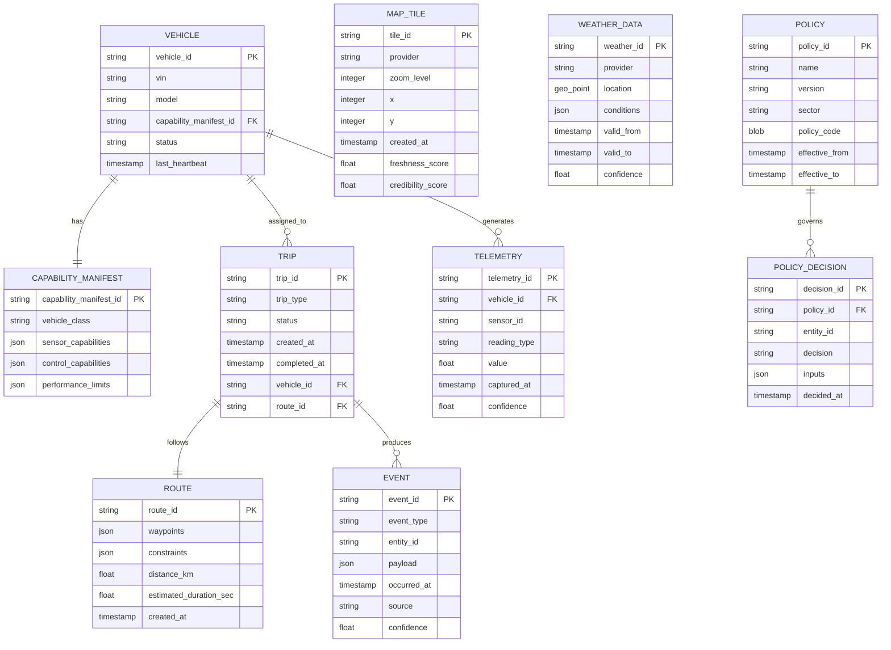
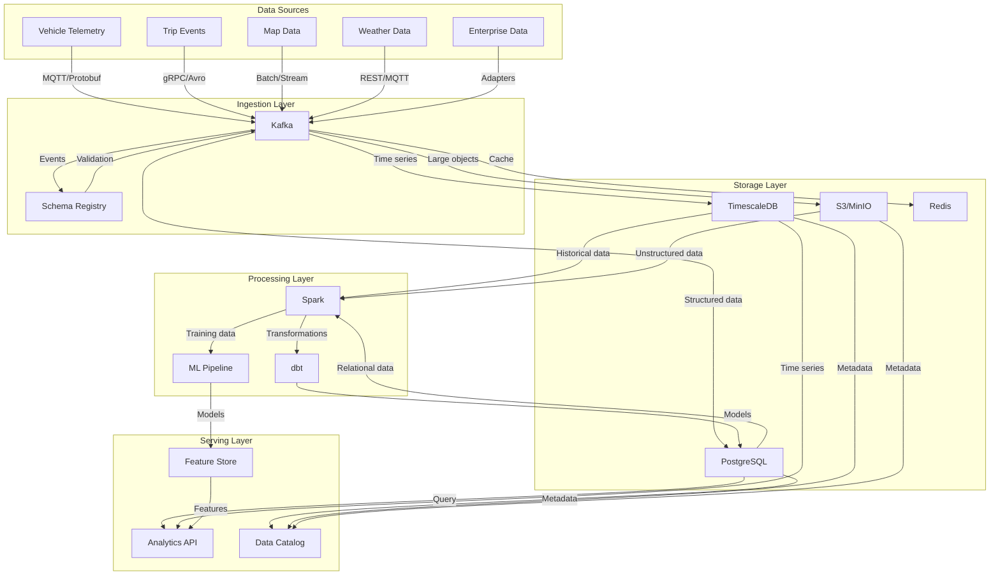
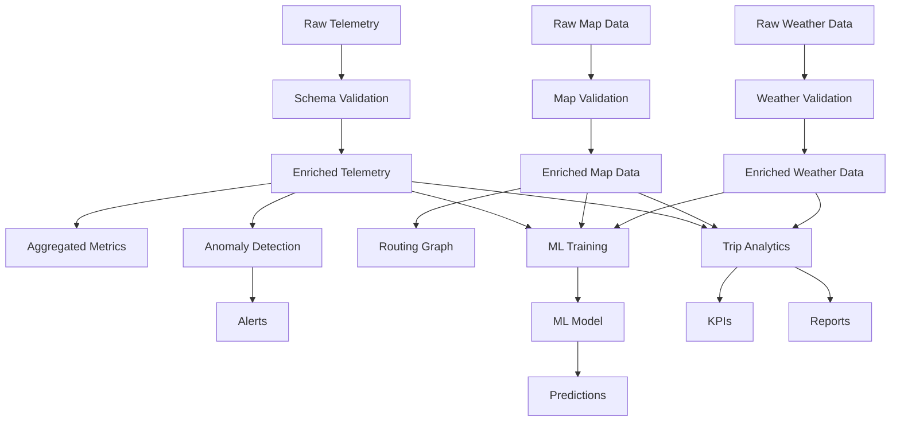
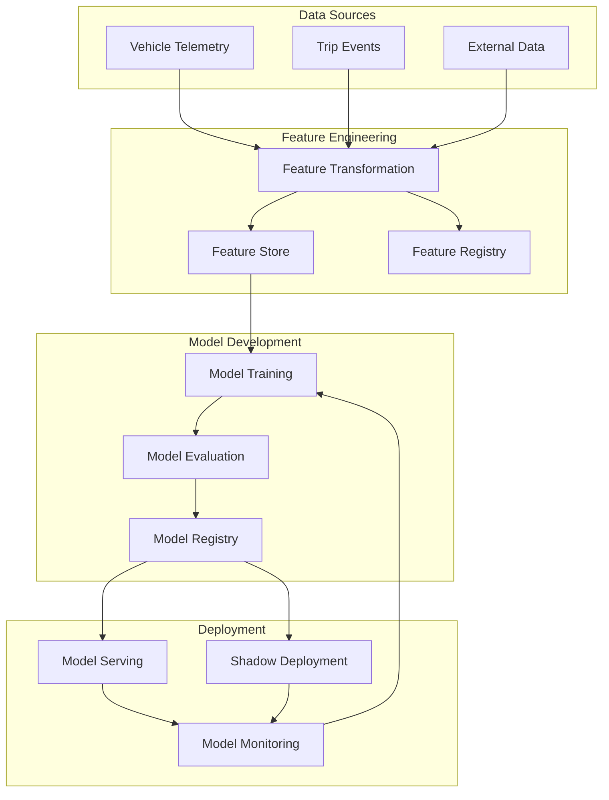

<div align="center">

## 📊 AtlasMesh Fleet OS — Data & Analytics Integration

**Comprehensive Data Strategy for Evidence-Based Operations**

</div>

---

### 📋 Table of Contents

<div align="center">

| 📊 **[Data Strategy](#1-data-strategy-overview)** | 🏗️ **[Data Architecture](#2-data-architecture)** | 🔄 **[Integration Patterns](#3-integration-patterns)** | 📈 **[Analytics Capabilities](#4-analytics-capabilities)** |
|:---:|:---:|:---:|:---:|
| **Core Principles & Domains** | **Logical & Physical Models** | **Data Flow & Processing** | **ML/AI & Insights** |

| 🔒 **[Data Governance](#5-data-governance)** | 🧪 **[Testing Strategy](#6-testing-strategy)** | 📚 **[References](#7-references--related-docs)** |
|:---:|:---:|:---:|
| **Privacy, Security & Compliance** | **Data Quality & Validation** | **Supporting Documentation** |

</div>

---

### 📊 **1) Data Strategy Overview**

AtlasMesh Fleet OS implements a comprehensive data strategy that enables evidence-based operations, continuous improvement and regulatory compliance. This document outlines the data architecture, integration patterns and analytics capabilities that power the platform.

#### 🎯 **1.1 Core Data Principles**

<div align="center">

| 🔍 **Provenance-aware** | 🔒 **Privacy by Design** | 📋 **Evidence-first** | ⚖️ **Freshness vs. Credibility** | 🛡️ **Offline Resilience** |
|:---:|:---:|:---:|:---:|:---:|
| All data carries source, confidence, and lineage metadata | Minimized PII collection; purpose-limited processing; retention controls | Data capture designed to support safety cases and regulatory compliance | Explicit trade-off policies for data currency vs. reliability | Store-and-forward capabilities; conflict resolution; eventual consistency |

</div>

#### 🏗️ **1.2 Data Domains**

<div align="center">

| 🚙 **Vehicle Telemetry** | 🎯 **Trip & Mission** | 🗺️ **Maps & Geospatial** | 🌤️ **Weather & Environment** | 🛡️ **Safety & Compliance** | 🏢 **Enterprise Integration** |
|:---:|:---:|:---:|:---:|:---:|:---:|
| **Description** | **Description** | **Description** | **Description** | **Description** | **Description** |
| Operational data from vehicles | Trip lifecycle and execution | Spatial data and features | Environmental conditions | Evidence and documentation | Business system data |
| **Key Entities** | **Key Entities** | **Key Entities** | **Key Entities** | **Key Entities** | **Key Entities** |
| Sensor readings, status, diagnostics | Routes, assignments, events | Map tiles, routes, POIs | Weather readings, forecasts, alerts | Incidents, decisions, audit trails | Orders, inventory, schedules |
| **Primary Consumers** | **Primary Consumers** | **Primary Consumers** | **Primary Consumers** | **Primary Consumers** | **Primary Consumers** |
| Fleet health, PdM, safety monitoring | Dispatch, routing, analytics | Routing, mission planning | Routing, ODD management | Regulators, safety case | Trip planning, analytics |

</div>

### 🏗️ **2) Data Architecture**

#### 📊 **2.1 Logical Data Model**



#### 2.2 Physical Data Architecture



### 3) Data Contracts & Schemas

#### 3.1 Schema Management

AtlasMesh Fleet OS uses a schema-first approach with centralized schema registry:

- **Schema formats**: Avro for events, Protobuf for telemetry, JSON Schema for APIs
- **Versioning**: Semantic versioning with backward compatibility requirements
- **Validation**: Runtime schema validation with rejection of non-conforming data
- **Evolution**: Compatibility checking in CI; breaking changes require version bump

#### 3.2 Core Schema Examples

##### Vehicle Telemetry Schema (Protobuf)

```protobuf
syntax = "proto3";

package atlasmesh.telemetry.v1;

import "google/protobuf/timestamp.proto";

message VehicleTelemetry {
  string vehicle_id = 1;
  string session_id = 2;
  google.protobuf.Timestamp timestamp = 3;
  
  message Position {
    double latitude = 1;
    double longitude = 2;
    double altitude = 3;
    double heading = 4;
    double speed = 5;
    PositionConfidence confidence = 6;
  }
  
  message PositionConfidence {
    double horizontal = 1;
    double vertical = 2;
    double heading = 3;
    double speed = 4;
  }
  
  message SystemStatus {
    double cpu_usage = 1;
    double memory_usage = 2;
    double disk_usage = 3;
    double battery_level = 4;
    double temperature = 5;
  }
  
  message SensorStatus {
    repeated SensorReading readings = 1;
  }
  
  message SensorReading {
    string sensor_id = 1;
    string sensor_type = 2;
    double value = 3;
    double confidence = 4;
    string status = 5;
  }
  
  Position position = 4;
  SystemStatus system = 5;
  SensorStatus sensors = 6;
  
  // Provenance metadata
  string source = 7;
  uint32 sequence_number = 8;
  double confidence_score = 9;
}
```

##### Trip Event Schema (Avro)

```json
{
  "type": "record",
  "name": "TripEvent",
  "namespace": "atlasmesh.events.v1",
  "fields": [
    {
      "name": "event_id",
      "type": "string"
    },
    {
      "name": "trip_id",
      "type": "string"
    },
    {
      "name": "event_type",
      "type": {
        "type": "enum",
        "name": "TripEventType",
        "symbols": [
          "TRIP_CREATED",
          "TRIP_ASSIGNED",
          "TRIP_STARTED",
          "TRIP_WAYPOINT_REACHED",
          "TRIP_PAUSED",
          "TRIP_RESUMED",
          "TRIP_COMPLETED",
          "TRIP_CANCELLED",
          "TRIP_FAILED"
        ]
      }
    },
    {
      "name": "timestamp",
      "type": {
        "type": "long",
        "logicalType": "timestamp-millis"
      }
    },
    {
      "name": "vehicle_id",
      "type": ["string", "null"]
    },
    {
      "name": "location",
      "type": ["null", {
        "type": "record",
        "name": "GeoPoint",
        "fields": [
          {"name": "latitude", "type": "double"},
          {"name": "longitude", "type": "double"}
        ]
      }]
    },
    {
      "name": "payload",
      "type": ["null", "bytes"]
    },
    {
      "name": "source",
      "type": "string"
    },
    {
      "name": "version",
      "type": "string"
    },
    {
      "name": "metadata",
      "type": {
        "type": "map",
        "values": "string"
      }
    }
  ]
}
```

### 4) Data Lineage & Provenance

#### 4.1 Provenance Tracking

All data in AtlasMesh Fleet OS includes provenance information:

- **Source identification**: Original producer of data (device, service, external provider)
- **Temporal context**: Creation timestamp, validity period, processing timestamp
- **Confidence metrics**: Quality indicators, uncertainty estimates, validation status
- **Processing history**: Transformations, enrichments, aggregations applied
- **Authorization chain**: Decision authorities, approval records, policy references

#### 4.2 Freshness vs. Credibility Trade-offs

The system implements explicit policies for balancing data freshness against credibility:

```yaml
## Example freshness vs. credibility policy for map data
map_data_policy:
  default:
    min_credibility_score: 0.8
    max_age_hours: 168  ## 7 days
    freshness_override_threshold: 0.95  ## Very fresh data can override credibility requirement
  
  construction_zones:
    min_credibility_score: 0.9
    max_age_hours: 24
    freshness_override_threshold: 0.98
  
  regulatory_features:
    min_credibility_score: 0.95
    max_age_hours: 720  ## 30 days
    freshness_override_threshold: 0.99
```

#### 4.3 Lineage Graph



### 5) Data Privacy & Security

#### 5.1 Privacy Controls

AtlasMesh Fleet OS implements privacy-by-design principles:

- **Data minimization**: Collection limited to necessary data points
- **Purpose limitation**: Clear definition of processing purposes
- **Storage limitation**: Retention policies with automated enforcement
- **PII handling**: Identification, classification, protection of personal data
- **Consent management**: Recording and enforcement of processing permissions
- **Data subject rights**: Mechanisms for access, rectification, erasure, portability

#### 5.2 Data Classification

| Classification | Description | Examples | Controls |
|----------------|-------------|----------|----------|
| **Public** | Non-sensitive, can be freely disclosed | Marketing materials, public APIs | Basic integrity protection |
| **Internal** | Business data, limited distribution | Operational metrics, non-sensitive telemetry | Access control, encryption at rest |
| **Confidential** | Business sensitive, restricted access | Customer data, detailed operations | Strong encryption, access logging |
| **Restricted** | Highly sensitive, strict controls | PII, security configurations, credentials | Encryption, access control, audit |

#### 5.3 Security Controls

- **Encryption**: TLS 1.3 for transit; AES-256 for rest; envelope encryption for keys
- **Access control**: RBAC/ABAC with least privilege; just-in-time access; MFA
- **Audit logging**: All data access and modification logged; immutable audit trail
- **Data loss prevention**: Egress controls; watermarking; exfiltration detection
- **Secure deletion**: Cryptographic erasure; retention enforcement; verification

### 6) Analytics & Reporting

#### 6.1 KPI Framework

AtlasMesh Fleet OS implements a comprehensive KPI framework aligned with strategic objectives:

| Category | KPI | Definition | Target | Data Source |
|----------|-----|------------|--------|------------|
| **Safety** | Assist Rate | Assists / 1,000 km | ≤0.3 | `trip_events`, `telemetry` |
| **Safety** | Incidents | Reportable incidents / 100k km | ≤0.6 | `safety_incidents` |
| **Reliability** | Fleet Availability | Uptime / (Uptime + Downtime) | ≥99.0% | `vehicle_status` |
| **Efficiency** | Empty Miles | Empty distance / Total distance | ≤5% | `trip_metrics` |
| **Experience** | On-Time Performance | On-time arrivals / Total arrivals | ≥95% | `trip_events` |
| **Energy** | Energy Efficiency | kWh/km or L/km | Sector-specific | `energy_telemetry` |

#### 6.2 Metrics Implementation

Each KPI is implemented as a dbt model with clear definitions and lineage:

```sql
-- Example dbt model for assist rate calculation
{{ config(
    materialized='incremental',
    unique_key='date_vehicle_id',
    tags=['kpi', 'safety']
) }}

WITH trip_distance AS (
    SELECT
        trip_id,
        vehicle_id,
        DATE(start_time) AS date,
        distance_km
    FROM {{ ref('fact_trips') }}
    WHERE status = 'COMPLETED'
    
        AND DATE(start_time) >= (SELECT MAX(date) FROM {{ this }})
    
),

assists AS (
    SELECT
        trip_id,
        vehicle_id,
        DATE(timestamp) AS date,
        COUNT(*) AS assist_count
    FROM {{ ref('fact_events') }}
    WHERE event_type = 'TELE_ASSIST_PROVIDED'
    
        AND DATE(timestamp) >= (SELECT MAX(date) FROM {{ this }})
    
    GROUP BY 1, 2, 3
)

SELECT
    COALESCE(td.date, a.date) AS date,
    COALESCE(td.vehicle_id, a.vehicle_id) AS vehicle_id,
    CONCAT(COALESCE(td.date, a.date), '-', COALESCE(td.vehicle_id, a.vehicle_id)) AS date_vehicle_id,
    COALESCE(SUM(td.distance_km), 0) AS distance_km,
    COALESCE(SUM(a.assist_count), 0) AS assist_count,
    CASE 
        WHEN COALESCE(SUM(td.distance_km), 0) > 0 
        THEN COALESCE(SUM(a.assist_count), 0) * 1000.0 / COALESCE(SUM(td.distance_km), 0)
        ELSE NULL
    END AS assist_rate_per_1000km
FROM trip_distance td
FULL OUTER JOIN assists a
    ON td.trip_id = a.trip_id
    AND td.vehicle_id = a.vehicle_id
    AND td.date = a.date
GROUP BY 1, 2, 3
```

#### 6.3 Reporting & Dashboards

AtlasMesh Fleet OS provides multi-level reporting capabilities:

- **Operational dashboards**: Real-time monitoring of fleet status and performance
- **Analytical dashboards**: Trend analysis, pattern detection, comparative metrics
- **Compliance reports**: Automated generation of regulatory documentation
- **Executive dashboards**: Strategic KPIs, business impact metrics, ROI tracking

### 7) Machine Learning Integration

#### 7.1 ML Pipeline Architecture



#### 7.2 Key ML Models

| Model | Purpose | Features | Architecture | Performance |
|-------|---------|----------|--------------|------------|
| **PdM (Predictive Maintenance)** | Component failure prediction | Telemetry, maintenance history | LSTM/Transformer | Precision ≥75% @ 14-day horizon |
| **Demand Forecasting** | Trip demand prediction | Historical trips, events, weather | Prophet/LSTM | WAPE ≤18% |
| **Energy Optimization** | Charging/refueling optimization | Energy usage, prices, schedules | Reinforcement Learning | Cost reduction ≥15% |
| **Anomaly Detection** | Unusual behavior identification | Telemetry, historical patterns | Isolation Forest/Autoencoder | Precision ≥85%, Recall ≥80% |

#### 7.3 ML Governance

- **Model cards**: Standardized documentation of model purpose, training, limitations
- **Explainability**: Feature importance, SHAP values, counterfactual explanations
- **Fairness**: Bias detection, mitigation strategies, demographic impact analysis
- **Versioning**: Model versioning aligned with data and code versions
- **Evaluation**: Standardized metrics, A/B testing, shadow deployment

### 8) Data Integration Patterns

#### 8.1 Enterprise Integration

AtlasMesh Fleet OS integrates with enterprise systems using the following patterns:

- **Adapters**: Purpose-built connectors with protocol translation and data mapping
- **Contract testing**: Automated verification of integration contracts
- **Event-driven**: Asynchronous communication with guaranteed delivery
- **Idempotent operations**: Safe retry mechanisms for reliable integration
- **Circuit breakers**: Fault isolation and graceful degradation

#### 8.2 External Data Sources

| Source | Integration Method | Update Frequency | Validation |
|--------|-------------------|------------------|------------|
| **Map Providers** | REST API / Tile Service | Daily / On-demand | Consistency checks, coverage validation |
| **Weather Services** | REST API / MQTT | Hourly / Real-time | Cross-source validation, anomaly detection |
| **Traffic Services** | REST API / Streaming | 5-15 minutes | Temporal consistency, spatial validation |
| **Regulatory Data** | Batch import / API | Weekly / On-change | Schema validation, authority verification |

### 9) Data Quality & Governance

#### 9.1 Data Quality Framework

AtlasMesh Fleet OS implements a comprehensive data quality framework:

- **Profiling**: Automated analysis of data characteristics and patterns
- **Validation**: Schema compliance, business rule enforcement, reference integrity
- **Monitoring**: Continuous quality metrics, anomaly detection, drift identification
- **Remediation**: Error handling, correction workflows, root cause analysis

#### 9.2 Data Quality Dimensions

| Dimension | Definition | Measurement | Controls |
|-----------|------------|-------------|----------|
| **Completeness** | Required data is present | % of non-null values | Schema validation, default handling |
| **Accuracy** | Data correctly represents reality | Error rate vs. ground truth | Cross-validation, consistency checks |
| **Consistency** | Data is coherent across the system | Violation rate of business rules | Constraint enforcement, reconciliation |
| **Timeliness** | Data is available when needed | Processing latency, freshness | SLAs, monitoring, alerting |
| **Uniqueness** | Entities are represented once | Duplication rate | Deduplication, identity resolution |

#### 9.3 Data Governance

- **Ownership**: Clear data domain ownership with RACI matrix
- **Metadata management**: Comprehensive data catalog with business context
- **Policy enforcement**: Automated enforcement of data policies
- **Lifecycle management**: Creation, retention, archival, deletion workflows
- **Compliance monitoring**: Regulatory requirement tracking and verification

### 10) Metrics Dictionary

The metrics dictionary provides precise definitions for all KPIs and metrics used in the system:

| Metric | Definition | Calculation | Unit | Aggregation | Tags |
|--------|------------|-------------|------|-------------|------|
| `assist_rate` | Tele-assist events per distance | `COUNT(assist_events) / SUM(distance_km) * 1000` | assists/1000km | AVG | vehicle, sector, region |
| `fleet_availability` | Percentage of time vehicles are available | `SUM(available_hours) / SUM(total_hours) * 100` | % | AVG | vehicle_type, sector |
| `on_time_performance` | Percentage of on-time arrivals | `COUNT(on_time_arrivals) / COUNT(total_arrivals) * 100` | % | AVG | trip_type, sector |
| `energy_efficiency` | Energy consumption per distance | `SUM(energy_consumed) / SUM(distance_km)` | kWh/km or L/km | AVG | vehicle_type, sector |
| `empty_miles_ratio` | Percentage of distance without payload | `SUM(empty_distance_km) / SUM(total_distance_km) * 100` | % | AVG | vehicle_type, sector |

### 11) References & Related Documents

- [Architecture](01_Architecture.md)
- [Requirements](03_Requirements_FRs_NFRs.md)
- [AI Model Documentation](05_AI_Model_Documentation.md)
- [Security Implementation](07_Security_Implementation.md)
- [DevOps Pipeline](08_DevOps_Pipeline_and_Deployment.md)
