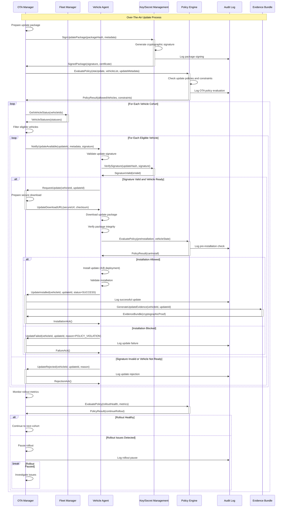
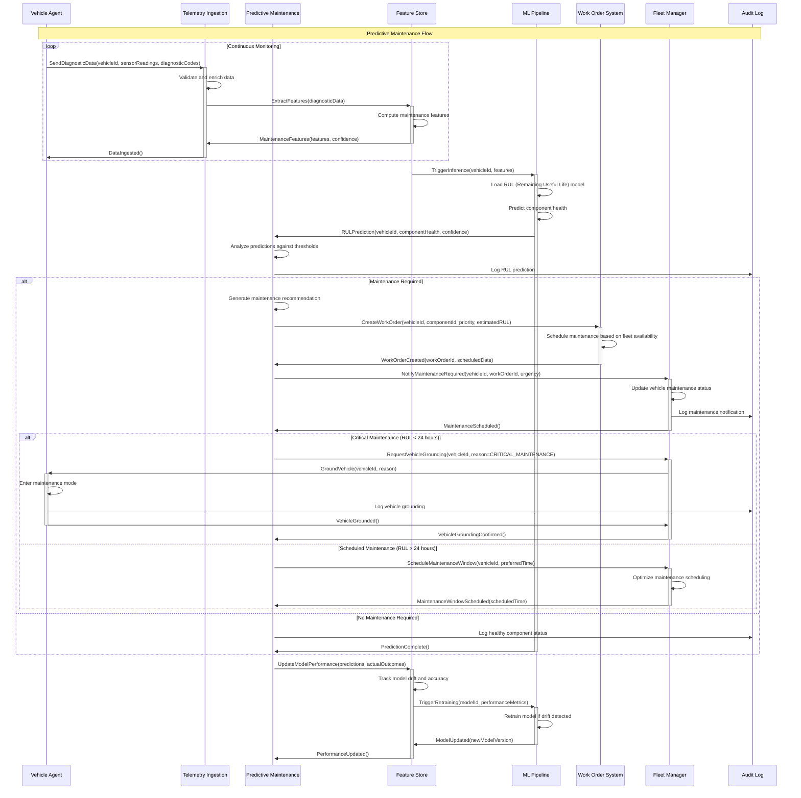
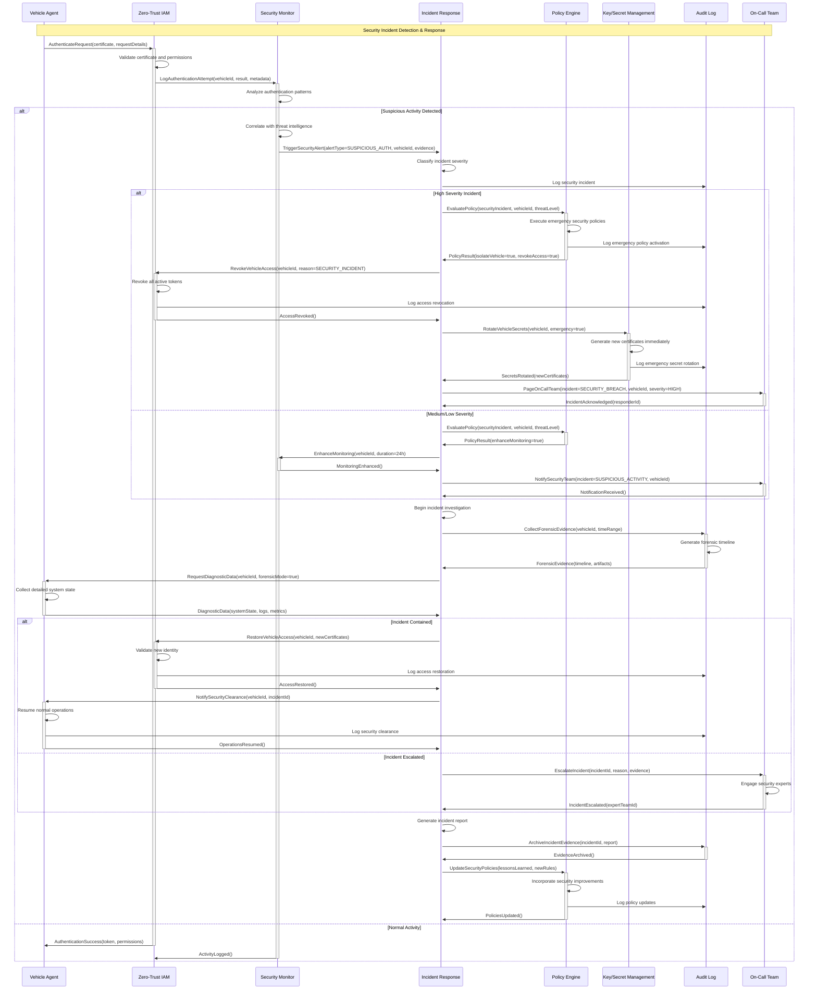

# AtlasMesh Fleet OS — Sequence Diagrams & System Flows

## 1) Overview

This document provides comprehensive sequence diagrams for critical system flows in the AtlasMesh Fleet OS. These diagrams illustrate the interactions between services, data flow, and decision points for key operational scenarios.

## 2) Trip Lifecycle - Complete Flow

```mermaid
sequenceDiagram
    participant UI as Control Center UI
    participant AG as API Gateway
    participant TS as Trip Service
    participant DS as Dispatch Service
    participant PE as Policy Engine
    participant RS as Routing Service
    participant FM as Fleet Manager
    participant VA as Vehicle Agent
    participant TI as Telemetry Ingestion
    participant AL as Audit Log
    
    Note over UI,AL: Complete Trip Lifecycle Flow
    
    %% Trip Creation
    UI->>+AG: CreateTrip(origin, destination, requirements)
    AG->>+TS: CreateTrip(tripRequest)
    TS->>TS: Validate trip parameters
    TS->>+PE: EvaluatePolicy(tripContext)
    PE->>PE: Execute policy rules
    PE->>AL: Log policy evaluation
    PE->>-TS: PolicyResult(allowed, constraints)
    
    alt Policy Allows Trip
        TS->>TS: Create trip record
        TS->>-AG: TripCreated(tripId, status=CREATED)
        AG->>-UI: TripResponse(tripId)
        
        %% Route Planning
        TS->>+RS: CalculateRoute(origin, destination, constraints)
        RS->>RS: Optimize route with constraints
        RS->>-TS: RouteCalculated(routeId, path, duration)
        
        %% Vehicle Assignment
        TS->>+DS: AssignVehicle(tripId, requirements)
        DS->>+FM: GetAvailableVehicles(requirements)
        FM->>-DS: AvailableVehicles(vehicleList)
        DS->>DS: Optimize assignment
        DS->>+PE: EvaluatePolicy(assignmentContext)
        PE->>AL: Log assignment policy check
        PE->>-DS: PolicyResult(allowed, vehicleId)
        DS->>-TS: VehicleAssigned(vehicleId, estimatedStart)
        
        %% Trip Dispatch
        TS->>+VA: DispatchTrip(tripId, routeId, instructions)
        VA->>VA: Validate trip parameters
        VA->>-TS: TripAccepted(estimatedArrival)
        TS->>TS: Update trip status to DISPATCHED
        
        %% Trip Execution
        VA->>VA: Begin trip execution
        loop During Trip
            VA->>+TI: SendTelemetry(vehicleState, location, progress)
            TI->>TI: Validate and process telemetry
            TI->>-VA: TelemetryAck()
            
            VA->>+TS: UpdateTripProgress(tripId, progress)
            TS->>-VA: ProgressAck()
            
            %% Policy Monitoring
            TS->>+PE: MonitorCompliance(tripId, currentState)
            PE->>AL: Log compliance check
            PE->>-TS: ComplianceStatus(compliant, violations)
        end
        
        %% Trip Completion
        VA->>+TS: CompleteTtrip(tripId, summary)
        TS->>TS: Update trip status to COMPLETED
        TS->>AL: Log trip completion
        TS->>-VA: TripCompletionAck()
        
    else Policy Denies Trip
        PE->>AL: Log policy denial
        TS->>-AG: TripDenied(reason, policyViolation)
        AG->>-UI: ErrorResponse(POLICY_VIOLATION, reason)
    end
```

## 3) Vehicle Onboarding & Registration

```mermaid
sequenceDiagram
    participant GT as Garage Tools
    participant FM as Fleet Manager
    participant PE as Policy Engine
    participant KS as Key/Secret Management
    participant ZT as Zero-Trust IAM
    participant VA as Vehicle Agent
    participant AL as Audit Log
    
    Note over GT,AL: Vehicle Onboarding Process
    
    %% Initial Registration
    GT->>+FM: RegisterVehicle(vehicleProfile, certificates)
    FM->>FM: Validate vehicle profile
    FM->>+PE: EvaluatePolicy(vehicleOnboarding)
    PE->>AL: Log onboarding policy check
    PE->>-FM: PolicyResult(allowed, constraints)
    
    alt Onboarding Allowed
        FM->>+KS: GenerateVehicleSecrets(vehicleId)
        KS->>KS: Generate certificates and keys
        KS->>AL: Log secret generation
        KS->>-FM: VehicleSecrets(certificates, keys)
        
        FM->>+ZT: RegisterVehicleIdentity(vehicleId, certificates)
        ZT->>ZT: Create SPIFFE identity
        ZT->>AL: Log identity registration
        ZT->>-FM: IdentityRegistered(spiffeId)
        
        FM->>FM: Create vehicle record
        FM->>AL: Log vehicle registration
        FM->>-GT: VehicleRegistered(vehicleId, credentials)
        
        %% Vehicle Agent Bootstrap
        GT->>+VA: Bootstrap(vehicleId, credentials, endpoints)
        VA->>VA: Initialize secure connections
        VA->>+ZT: AuthenticateVehicle(spiffeId, certificate)
        ZT->>ZT: Validate certificate chain
        ZT->>-VA: AuthenticationSuccess(token, policies)
        
        VA->>+FM: RegisterOnline(vehicleId, capabilities)
        FM->>FM: Update vehicle status to ONLINE
        FM->>AL: Log vehicle online status
        FM->>-VA: RegistrationAck(configuration)
        
        %% Health Check Establishment
        loop Continuous Health Monitoring
            VA->>+FM: SendHeartbeat(vehicleId, healthMetrics)
            FM->>FM: Update last seen timestamp
            FM->>-VA: HeartbeatAck()
        end
        
    else Onboarding Denied
        PE->>AL: Log onboarding denial
        FM->>-GT: OnboardingDenied(reason, policyViolation)
    end
```

## 4) OTA Update Flow



## 5) Predictive Maintenance Workflow



## 6) Security Incident Response



## 7) Evidence Generation & Compliance Audit

```mermaid
sequenceDiagram
    participant EE as Evidence Engine
    participant AL as Audit Log
    participant PE as Policy Engine
    participant TS as Trip Service
    participant KS as Key/Secret Management
    participant EB as Evidence Bundle
    participant CR as Compliance Report
    participant REG as Regulator
    
    Note over EE,REG: Automated Evidence Generation for Compliance
    
    %% Continuous Evidence Collection
    loop Continuous Monitoring
        TS->>+EE: ReportTripEvent(tripId, eventType, timestamp, context)
        EE->>EE: Classify event for compliance relevance
        EE->>+AL: StoreComplianceEvent(event, classification, metadata)
        AL->>AL: Cryptographically sign event
        AL->>-EE: EventStored(eventId, signature)
        EE->>-TS: EventRecorded()
        
        PE->>+EE: ReportPolicyDecision(policyId, decision, context, rationale)
        EE->>EE: Link decision to compliance requirements
        EE->>+AL: StorePolicyDecision(decision, complianceMapping)
        AL->>-EE: DecisionStored(decisionId, signature)
        EE->>-PE: DecisionRecorded()
    end
    
    %% Scheduled Evidence Bundle Generation
    EE->>EE: Trigger scheduled evidence generation
    EE->>+AL: CollectComplianceEvents(timeRange, complianceFramework)
    AL->>AL: Query cryptographically signed events
    AL->>-EE: ComplianceEvents(events, signatures, chainOfCustody)
    
    EE->>+PE: GetPolicyCompliance(timeRange, regulatoryRequirements)
    PE->>PE: Analyze policy adherence
    PE->>-EE: ComplianceAnalysis(adherenceRate, violations, mitigations)
    
    %% Evidence Bundle Creation
    EE->>+EB: CreateEvidenceBundle(events, analysis, metadata)
    EB->>EB: Aggregate evidence items
    EB->>EB: Generate compliance mappings
    EB->>+KS: SignEvidenceBundle(bundleHash, metadata)
    KS->>KS: Generate cryptographic signature
    KS->>-EB: BundleSigned(signature, certificate, timestamp)
    
    EB->>EB: Validate bundle integrity
    EB->>+AL: ArchiveEvidenceBundle(bundleId, signature, metadata)
    AL->>-EB: BundleArchived(archiveId)
    EB->>-EE: EvidenceBundleCreated(bundleId, integrityHash)
    
    %% Compliance Report Generation
    EE->>+CR: GenerateComplianceReport(bundleId, regulatoryFramework)
    CR->>CR: Format report per regulatory requirements
    CR->>CR: Include executive summary and technical details
    CR->>+KS: SignComplianceReport(reportHash, metadata)
    KS->>-CR: ReportSigned(signature, certificate)
    CR->>-EE: ComplianceReportReady(reportId, downloadUrl)
    
    %% Regulatory Submission (if required)
    alt Regulatory Submission Required
        EE->>+REG: SubmitComplianceReport(reportId, submissionMetadata)
        REG->>REG: Validate report format and signatures
        REG->>+KS: VerifyReportSignature(reportHash, signature)
        KS->>-REG: SignatureValid(isValid, certificateChain)
        
        alt Report Accepted
            REG->>+AL: LogRegulatorySubmission(reportId, accepted=true)
            AL->>-REG: SubmissionLogged()
            REG->>-EE: SubmissionAccepted(confirmationId, nextDueDate)
            
        else Report Rejected
            REG->>+AL: LogRegulatorySubmission(reportId, accepted=false, reason)
            AL->>-REG: SubmissionLogged()
            REG->>-EE: SubmissionRejected(reason, correctionRequired)
            
            EE->>EE: Schedule corrective action
        end
        
    else Internal Audit Only
        EE->>+AL: LogInternalAudit(bundleId, reportId, auditComplete=true)
        AL->>-EE: AuditLogged()
    end
    
    %% Continuous Monitoring & Alerting
    EE->>EE: Monitor compliance metrics
    EE->>EE: Check for policy violations or gaps
    
    alt Compliance Issues Detected
        EE->>+PE: TriggerComplianceAlert(issueType, severity, affectedSystems)
        PE->>PE: Evaluate compliance policies
        PE->>-EE: ComplianceAction(required, mitigationSteps)
        
        EE->>EE: Execute automated mitigations
        EE->>+AL: LogComplianceMitigation(issueId, actions, outcome)
        AL->>-EE: MitigationLogged()
    end
```

## 8) Multi-Tenant Sector Overlay Activation

```mermaid
sequenceDiagram
    participant UI as Sector-Specific UI
    participant SO as Sector Overlays
    participant TE as Tenant Entitlements
    participant PE as Policy Engine
    participant FS as Feature Flags
    participant AL as Audit Log
    
    Note over UI,AL: Dynamic Sector Overlay Activation
    
    %% Tenant Authentication & Entitlement Check
    UI->>+SO: RequestSectorAccess(tenantId, sector, userCredentials)
    SO->>+TE: ValidateTenantEntitlements(tenantId, sector, requestedFeatures)
    TE->>TE: Check subscription tier and feature entitlements
    TE->>AL: Log entitlement check
    TE->>-SO: EntitlementResult(allowed, availableFeatures, constraints)
    
    alt Access Granted
        SO->>+PE: LoadSectorPolicies(sector, tenantId, entitlements)
        PE->>PE: Retrieve sector-specific policy overlays
        PE->>AL: Log policy overlay activation
        PE->>-SO: SectorPolicies(policies, constraints, customizations)
        
        SO->>+FS: ActivateFeatureFlags(tenantId, sector, entitlements)
        FS->>FS: Enable sector-specific features
        FS->>AL: Log feature flag activation
        FS->>-SO: FeaturesActivated(activeFeatures, configuration)
        
        SO->>SO: Apply UI customizations and branding
        SO->>AL: Log sector overlay activation
        SO->>-UI: SectorAccessGranted(configuration, policies, features)
        
        %% Dynamic Policy Application
        loop During Session
            UI->>+SO: RequestOperation(operation, context, parameters)
            SO->>+PE: EvaluatePolicy(operation, sectorPolicies, tenantConstraints)
            PE->>PE: Apply sector-specific rules
            PE->>AL: Log policy evaluation with sector context
            PE->>-SO: PolicyResult(allowed, modifications, constraints)
            
            alt Operation Allowed
                SO->>SO: Apply sector-specific business logic
                SO->>-UI: OperationResult(success, data, sectorCustomizations)
            else Operation Denied
                SO->>AL: Log operation denial with sector context
                SO->>-UI: OperationDenied(reason, sectorPolicy, alternatives)
            end
        end
        
    else Access Denied
        TE->>AL: Log access denial
        SO->>-UI: AccessDenied(reason, requiredEntitlements, upgradeOptions)
    end
```

This comprehensive collection of sequence diagrams provides detailed insight into the AtlasMesh Fleet OS operational flows, ensuring proper understanding of system interactions, security protocols, and compliance processes.
