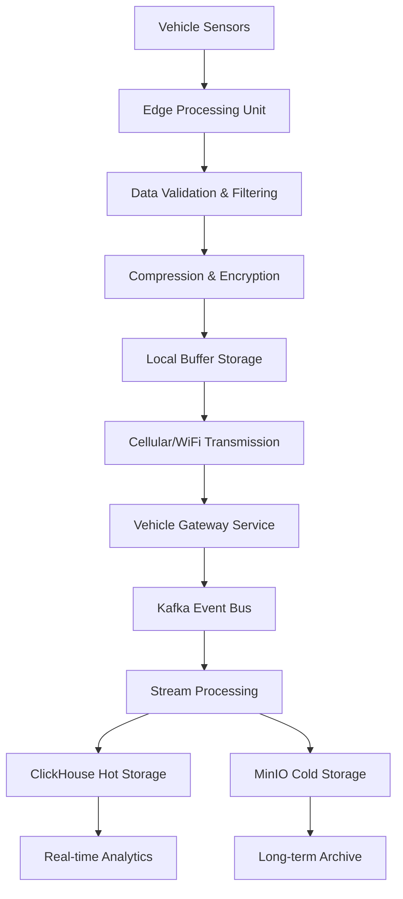

<div align="center">

# 📡 Sensor Data Collection Strategy
## AtlasMesh Fleet OS - Abu Dhabi Autonomous Vehicle Operations

**Document Version:** 1.0 | **Date:** July 2025 | **Classification:** Technical Strategy | **Region:** Abu Dhabi, UAE

</div>

---

## 📋 Table of Contents

<div align="center">

| 📡 **[Sensor Data Taxonomy](#sensor-data-taxonomy)** | 🏗️ **[Collection Architecture](#collection-architecture)** | 🔄 **[Data Processing](#data-processing-pipeline)** | 📊 **[Analytics & Insights](#analytics--insights)** |
|:---:|:---:|:---:|:---:|
| **Data Categories & Types** | **Collection Infrastructure** | **Processing & Transformation** | **ML/AI & Analytics** |

| 🔒 **[Privacy & Compliance](#privacy--compliance)** | 🧪 **[Testing & Validation](#testing--validation)** | 📚 **[References](#references--related-docs)** |
|:---:|:---:|:---:|
| **Data Protection & Regulatory** | **Quality Assurance** | **Supporting Documentation** |

</div>

---

## 🎯 **Executive Summary**

This document defines the comprehensive sensor data collection strategy for AtlasMesh Fleet OS, specifically optimized for Abu Dhabi's autonomous vehicle operations. The strategy encompasses data types, collection methods, retention policies, processing pipelines, and compliance requirements for the UAE regulatory environment.

---

## 📊 **Sensor Data Taxonomy**

### **Primary Data Categories**

#### **1. Vehicle Dynamics & Performance**
```yaml
vehicle_dynamics:
  frequency: 100Hz
  retention: 7 years (compliance)
  storage: hot_path + cold_archive
  data_points:
    - speed: float64 (km/h)
    - acceleration: vector3 (m/s²)
    - heading: float64 (degrees)
    - position: gps_coordinates
    - steering_angle: float64 (degrees)
    - brake_pressure: float64 (bar)
    - throttle_position: float64 (%)
    - gear_position: string
    - wheel_speed: array[4] (rpm)
    - suspension_travel: array[4] (mm)
```

#### **2. Autonomous System Telemetry**
```yaml
autonomy_telemetry:
  frequency: 50Hz
  retention: 7 years (safety critical)
  storage: hot_path + compliance_archive
  data_points:
    - autonomy_level: enum (L0-L5)
    - autonomy_status: enum (engaged/disengaged/fault)
    - confidence_score: float64 (0-1)
    - human_interventions: counter
    - system_overrides: counter
    - decision_latency: float64 (ms)
    - path_planning_status: enum
    - obstacle_detection_count: integer
    - emergency_stops: counter
    - failsafe_activations: counter
```

#### **3. Environmental Sensors (Abu Dhabi Specific)**
```yaml
environmental_sensors:
  frequency: 10Hz
  retention: 2 years
  storage: hot_path + weather_archive
  data_points:
    - ambient_temperature: float64 (°C)
    - humidity: float64 (%)
    - atmospheric_pressure: float64 (hPa)
    - wind_speed: float64 (km/h)
    - wind_direction: float64 (degrees)
    - visibility: float64 (km)
    - dust_concentration: float64 (μg/m³)
    - sandstorm_indicator: boolean
    - precipitation: float64 (mm/h)
    - uv_index: float64
    - air_quality_index: integer
```

#### **4. Vehicle Health & Diagnostics**
```yaml
vehicle_health:
  frequency: 1Hz
  retention: 5 years (maintenance)
  storage: hot_path + maintenance_archive
  data_points:
    - engine_temperature: float64 (°C)
    - coolant_temperature: float64 (°C)
    - oil_pressure: float64 (bar)
    - oil_temperature: float64 (°C)
    - battery_voltage: float64 (V)
    - battery_current: float64 (A)
    - battery_temperature: float64 (°C)
    - battery_soc: float64 (%)
    - fuel_level: float64 (%)
    - tire_pressure: array[4] (bar)
    - tire_temperature: array[4] (°C)
    - brake_temperature: array[4] (°C)
    - transmission_temperature: float64 (°C)
    - alternator_output: float64 (V)
    - diagnostic_codes: array[string]
```

#### **5. Safety & Security Systems**
```yaml
safety_security:
  frequency: 20Hz
  retention: 10 years (legal)
  storage: compliance_archive + audit_trail
  data_points:
    - airbag_status: array[boolean]
    - seatbelt_status: array[boolean]
    - door_status: array[boolean]
    - emergency_button_status: boolean
    - intrusion_detection: boolean
    - tamper_detection: boolean
    - security_alerts: array[string]
    - access_control_events: array[object]
    - emergency_calls: array[object]
    - incident_flags: array[string]
```

#### **6. Perception & Sensor Fusion**
```yaml
perception_data:
  frequency: 30Hz
  retention: 90 days (processing)
  storage: hot_path + selective_archive
  data_points:
    - camera_feeds: array[image_metadata]
    - lidar_point_clouds: compressed_data
    - radar_detections: array[object]
    - ultrasonic_readings: array[float64]
    - detected_objects: array[object]
    - lane_markings: array[polyline]
    - traffic_signs: array[object]
    - traffic_lights: array[object]
    - road_surface_condition: enum
    - construction_zones: array[polygon]
```

---

## 🏗️ **Data Collection Architecture**

### **Collection Pipeline**



### **Edge Processing Specifications**

#### **Hardware Requirements**
- **CPU**: ARM Cortex-A78 (8-core, 2.4GHz) or equivalent
- **Memory**: 32GB DDR5 RAM minimum
- **Storage**: 2TB NVMe SSD for local buffering
- **Connectivity**: 5G/LTE, WiFi 6, Ethernet
- **Environmental**: IP67 rated, -40°C to +85°C (Abu Dhabi heat)

#### **Edge Software Stack**
```yaml
edge_stack:
  os: Ubuntu 22.04 LTS (hardened)
  container_runtime: containerd
  orchestration: k3s (lightweight Kubernetes)
  data_processing: Apache Kafka (edge)
  time_sync: PTP/GNSS
  security: TPM 2.0, secure boot
  monitoring: Prometheus node exporter
```

---

## 📈 **Data Retention Policies**

### **Retention Matrix**

| Data Category | Hot Storage | Warm Storage | Cold Storage | Archive | Total Retention |
|---------------|-------------|--------------|--------------|---------|-----------------|
| Vehicle Dynamics | 30 days | 90 days | 1 year | 6 years | 7 years |
| Autonomy Telemetry | 90 days | 180 days | 2 years | 5 years | 7 years |
| Environmental | 7 days | 30 days | 6 months | 1.5 years | 2 years |
| Vehicle Health | 30 days | 90 days | 1 year | 4 years | 5 years |
| Safety/Security | 1 year | 2 years | 3 years | 4 years | 10 years |
| Perception Data | 7 days | 30 days | 60 days | - | 90 days |

### **Storage Tiers**

#### **Hot Storage (ClickHouse)**
- **Purpose**: Real-time analytics, dashboards, alerts
- **Performance**: <100ms query response
- **Capacity**: 50TB per cluster node
- **Replication**: 3x synchronous replication

#### **Warm Storage (ClickHouse + Compression)**
- **Purpose**: Historical analysis, reporting
- **Performance**: <1s query response
- **Capacity**: 200TB per cluster node
- **Compression**: LZ4 (3:1 ratio)

#### **Cold Storage (MinIO)**
- **Purpose**: Compliance, audit, long-term analysis
- **Performance**: <10s retrieval time
- **Capacity**: 1PB+ object storage
- **Compression**: ZSTD (5:1 ratio)

#### **Archive Storage (Glacier-compatible)**
- **Purpose**: Legal compliance, disaster recovery
- **Performance**: Hours to days retrieval
- **Capacity**: Unlimited
- **Encryption**: AES-256 + customer keys

---

## 🔄 **Data Processing Pipelines**

### **Real-time Processing (Hot Path)**

```yaml
hot_path_pipeline:
  ingestion_rate: 1M+ messages/second
  processing_latency: <50ms p99
  technologies:
    - Apache Kafka: Event streaming
    - ClickHouse: Real-time OLAP
    - Redis: Caching layer
    - Prometheus: Metrics collection
  
  processing_stages:
    1. data_validation:
        - Schema validation (Avro)
        - Range checking
        - Anomaly detection
    
    2. enrichment:
        - Geospatial tagging
        - Weather correlation
        - Traffic condition overlay
    
    3. aggregation:
        - Time-based windows (1s, 1m, 5m, 1h)
        - Vehicle-based grouping
        - Fleet-level summaries
    
    4. alerting:
        - Safety threshold monitoring
        - Performance degradation detection
        - Compliance violation alerts
```

### **Batch Processing (Cold Path)**

```yaml
cold_path_pipeline:
  processing_frequency: Hourly, Daily, Weekly
  technologies:
    - Apache Spark: Large-scale processing
    - MinIO: Object storage
    - Airflow: Workflow orchestration
    - Neo4j: Data lineage tracking
  
  processing_jobs:
    1. data_quality_assessment:
        - Completeness analysis
        - Accuracy validation
        - Consistency checking
    
    2. feature_engineering:
        - ML feature extraction
        - Statistical summaries
        - Trend analysis
    
    3. compliance_reporting:
        - UAE regulatory reports
        - ADTA submissions
        - Audit trail generation
    
    4. data_archival:
        - Compression optimization
        - Encryption application
        - Metadata indexing
```

---

## 🛡️ **DATA QUALITY & GOVERNANCE**

### **Data Quality Framework**

#### **Quality Dimensions**
1. **Completeness**: 99.5% target for critical sensors
2. **Accuracy**: ±2% tolerance for calibrated sensors
3. **Consistency**: Cross-sensor validation rules
4. **Timeliness**: <100ms end-to-end latency
5. **Validity**: Schema and range compliance

#### **Quality Monitoring**
```yaml
quality_monitoring:
  metrics:
    - data_completeness_ratio: gauge
    - sensor_accuracy_score: histogram
    - validation_failure_rate: counter
    - processing_latency: histogram
    - data_freshness: gauge
  
  alerting_thresholds:
    - completeness < 95%: WARNING
    - completeness < 90%: CRITICAL
    - accuracy_deviation > 5%: WARNING
    - processing_latency > 200ms: WARNING
    - validation_failures > 1%: CRITICAL
```

### **Data Governance Policies**

#### **Access Control**
```yaml
access_control:
  classification_levels:
    - public: Environmental data
    - internal: Vehicle performance
    - confidential: Customer data
    - restricted: Safety incidents
  
  role_based_access:
    - fleet_operator: Read vehicle health, performance
    - safety_analyst: Read safety, incident data
    - compliance_officer: Read all compliance data
    - data_scientist: Read anonymized datasets
    - auditor: Read audit trails, compliance
```

#### **Privacy Protection**
```yaml
privacy_protection:
  pii_handling:
    - driver_identification: Hash + salt
    - passenger_data: Encrypt at rest
    - location_data: Geofence anonymization
    - biometric_data: Local processing only
  
  anonymization:
    - k_anonymity: k=5 minimum
    - differential_privacy: ε=1.0 budget
    - data_masking: Production environments
    - pseudonymization: Reversible with key
```

---

## 🌍 **Abu Dhabi Specific Considerations**

### **Environmental Adaptations**

#### **Desert Climate Optimization**
```yaml
desert_adaptations:
  temperature_monitoring:
    - sensor_calibration: Monthly in summer
    - thermal_protection: Active cooling systems
    - heat_stress_detection: Component monitoring
  
  dust_mitigation:
    - air_filtration: HEPA filters
    - sensor_cleaning: Automated systems
    - contamination_detection: Optical sensors
  
  sandstorm_protocols:
    - visibility_monitoring: Continuous
    - operation_suspension: Automated
    - data_quality_flags: Storm indicators
```

#### **Cultural & Regulatory Integration**
```yaml
cultural_integration:
  islamic_calendar:
    - ramadan_adjustments: Operating hours
    - prayer_time_awareness: Route planning
    - eid_considerations: Demand patterns
  
  uae_regulations:
    - adta_compliance: Real-time monitoring
    - data_residency: UAE-only storage
    - audit_requirements: Comprehensive logging
    - emergency_protocols: Government integration
```

### **Connectivity Considerations**

#### **Network Optimization**
```yaml
network_optimization:
  cellular_priority:
    - etisalat_5g: Primary connection
    - du_lte: Backup connection
    - wifi_offload: Depot/garage areas
  
  data_compression:
    - real_time_data: LZ4 (fast)
    - historical_data: ZSTD (efficient)
    - image_data: JPEG 2000
    - point_clouds: Draco compression
  
  offline_capability:
    - local_buffer: 48 hours capacity
    - critical_data_priority: Safety first
    - sync_on_reconnect: Intelligent queuing
```

---

## 📊 **Cost Optimization Strategy**

### **Storage Cost Management**

#### **Tiered Storage Economics**
```yaml
storage_costs:
  hot_storage:
    - cost_per_gb_month: $0.50
    - query_cost: $0.001 per query
    - retention: 30-90 days
  
  warm_storage:
    - cost_per_gb_month: $0.20
    - query_cost: $0.005 per query
    - retention: 90 days - 2 years
  
  cold_storage:
    - cost_per_gb_month: $0.05
    - retrieval_cost: $0.01 per GB
    - retention: 2-7 years
  
  archive_storage:
    - cost_per_gb_month: $0.01
    - retrieval_cost: $0.05 per GB
    - retention: 7+ years
```

#### **Data Lifecycle Automation**
```yaml
lifecycle_automation:
  automated_transitions:
    - hot_to_warm: 30 days
    - warm_to_cold: 180 days
    - cold_to_archive: 2 years
  
  intelligent_deletion:
    - duplicate_detection: Content hashing
    - relevance_scoring: ML-based
    - compliance_protection: Legal holds
  
  compression_optimization:
    - algorithm_selection: Data type aware
    - compression_ratio_monitoring: Cost/benefit
    - deduplication: Cross-vehicle patterns
```

---

## 🔒 **Security & Compliance**

### **Data Security Framework**

#### **Encryption Standards**
```yaml
encryption:
  at_rest:
    - algorithm: AES-256-GCM
    - key_management: HashiCorp Vault
    - key_rotation: 90 days
  
  in_transit:
    - protocol: TLS 1.3
    - certificate_management: Let's Encrypt + internal CA
    - mutual_tls: Service-to-service
  
  in_processing:
    - homomorphic_encryption: Sensitive analytics
    - secure_enclaves: Critical computations
    - zero_knowledge_proofs: Privacy preservation
```

#### **Audit & Compliance**
```yaml
audit_compliance:
  audit_logging:
    - access_logs: All data access
    - modification_logs: Data changes
    - export_logs: Data transfers
    - retention_logs: Lifecycle events
  
  compliance_frameworks:
    - uae_data_protection: Full compliance
    - iso_27001: Information security
    - soc_2_type_2: Service organization controls
    - gdpr_equivalent: Privacy protection
  
  regular_audits:
    - internal_audits: Quarterly
    - external_audits: Annual
    - penetration_testing: Bi-annual
    - compliance_assessments: Continuous
```

---

## 📈 **Monitoring & Alerting**

### **Operational Metrics**

#### **System Health Indicators**
```yaml
system_metrics:
  data_ingestion:
    - messages_per_second: Real-time rate
    - processing_latency: End-to-end timing
    - error_rate: Failed message percentage
    - backlog_size: Queue depth monitoring
  
  storage_metrics:
    - disk_utilization: Storage capacity
    - query_performance: Response times
    - compression_ratio: Storage efficiency
    - replication_lag: Data consistency
  
  network_metrics:
    - bandwidth_utilization: Network usage
    - connection_stability: Uptime tracking
    - packet_loss: Quality monitoring
    - latency_distribution: Performance analysis
```

#### **Business Metrics**
```yaml
business_metrics:
  data_quality:
    - completeness_score: Data availability
    - accuracy_metrics: Sensor precision
    - timeliness_score: Freshness tracking
  
  compliance_metrics:
    - regulation_adherence: Compliance percentage
    - audit_readiness: Documentation completeness
    - incident_response: Resolution times
  
  cost_metrics:
    - storage_costs: Monthly expenditure
    - processing_costs: Compute expenses
    - transfer_costs: Network charges
```

---

## 🚀 **Implementation Roadmap**

### **Phase 1: Foundation (Q1 2025)**
- Core sensor integration (vehicle dynamics, health)
- Basic data pipeline (Kafka + ClickHouse)
- Essential monitoring and alerting
- UAE compliance framework

### **Phase 2: Enhancement (Q2 2025)**
- Advanced sensor integration (perception, environmental)
- ML pipeline for data quality
- Automated data lifecycle management
- Performance optimization

### **Phase 3: Scale (Q3-Q4 2025)**
- Multi-vehicle fleet support
- Advanced analytics capabilities
- Predictive maintenance integration
- Cost optimization automation

### **Phase 4: Intelligence (2026)**
- AI-driven data insights
- Autonomous data management
- Advanced privacy preservation
- Global compliance readiness

---

## 📋 **Conclusion**

This sensor data collection strategy provides a comprehensive framework for managing the vast amounts of data generated by Abu Dhabi's autonomous vehicle fleets. By implementing this strategy, AtlasMesh Fleet OS will ensure:

1. **Operational Excellence**: Real-time insights for optimal fleet performance
2. **Safety Assurance**: Comprehensive monitoring for incident prevention
3. **Regulatory Compliance**: Full adherence to UAE and international standards
4. **Cost Efficiency**: Intelligent data lifecycle management
5. **Scalability**: Architecture ready for fleet expansion

The strategy balances the need for comprehensive data collection with practical considerations of cost, performance, and compliance, ensuring AtlasMesh Fleet OS remains the leading platform for autonomous vehicle fleet management in Abu Dhabi and beyond.

---

*This document serves as the definitive guide for sensor data collection within the AtlasMesh Fleet OS ecosystem, ensuring consistent, compliant, and efficient data management across all autonomous vehicle operations.*
