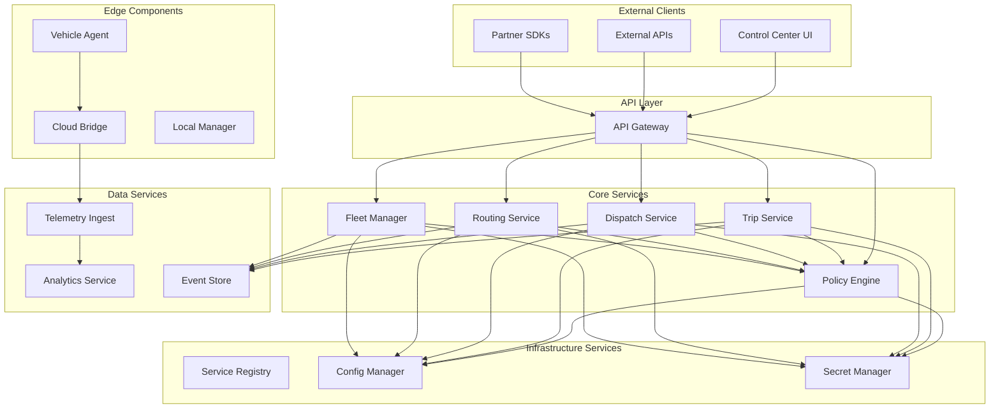

## 🏗️ AtlasMesh Fleet OS - Service Registry

**Comprehensive Registry of All Microservices**

---

### 📋 Table of Contents

| 🏗️ **[Service Architecture](#service-architecture)** | 🔧 **[Core Services](#core-services)** | 📊 **[Data Services](#data-services)** | 🛡️ **[Security Services](#security-services)** |
|:---:|:---:|:---:|:---:|
| **System Overview** | **Business Logic Services** | **Data Processing & Storage** | **Security & Compliance** |

| 🌐 **[Integration Services](#integration-services)** | 📈 **[Monitoring Services](#monitoring-services)** | 📚 **[References](#references--related-docs)** |
|:---:|:---:|:---:|
| **External Integrations** | **Observability & Analytics** | **Supporting Documentation** |

---

### 🏗️ **Service Architecture**

### Qualified Agnosticism Services

#### 1. Vehicle HAL Service

**Service ID**: `vehicle-hal`  
**Version**: `1.0.0`  
**Port**: HTTP 8080

##### Responsibilities
- Vehicle hardware abstraction through profile-driven interfaces
- Profile loading and validation (Terminal Tractor, Mine Haul, UTV, etc)
- Safety constraint enforcement per vehicle profile
- Actuator control translation to vehicle-specific protocols
- Standardized motion, sensor, and diagnostic interfaces

##### Key Features
- **Profile-Driven Abstraction**: ≤5% code delta across vehicle classes
- **Safety Monitoring**: Profile-specific constraint validation
- **Real-time Validation**: Command safety checking <5ms
- **Multi-Class Support**: Light Industrial, Heavy Duty, Mining, Defense, Passenger, Transit

##### Dependencies
- Vehicle profile configs (`configs/vehicles/*.yaml`)
- Sensor pack registry for sensor specifications
- Policy engine for safety policy enforcement

---

#### 2. Variant Budget Service

**Service ID**: `variant-budget`  
**Version**: `1.0.0`  
**Port**: HTTP 8093

##### Responsibilities
- Automated code delta analysis per agnostic dimension
- Variant budget tracking and enforcement (≤5% code, ≤25% test delta)
- CI/CD integration for build blocking
- Change Control Board (CCB) workflow integration
- Historical trend analysis and reporting

##### Key Features
- **Automated Delta Analysis**: Git-based code delta measurement
- **Hard Budget Limits**: Build blocking when limits exceeded
- **CCB Integration**: Formal exception approval workflow
- **Real-time Monitoring**: Prometheus metrics and Grafana dashboards

##### Dependencies
- Git repository access for delta analysis
- CI/CD pipeline integration
- Prometheus for metrics collection

---

#### 3. Conformance Testing Service

**Service ID**: `conformance-testing`  
**Version**: `1.0.0`  
**Port**: HTTP 8094

##### Responsibilities
- Multi-dimensional conformance testing (vehicle × sector × platform)
- Test matrix execution and result aggregation
- Evidence bundle generation for regulatory compliance
- Conformance score calculation and reporting
- Quality gate enforcement

##### Key Features
- **Multi-Dimensional Testing**: 72+ test combinations across dimensions
- **Priority-Based Execution**: Risk-based test selection
- **Evidence Automation**: ISO 26262/SOTIF/R155/R156 artifact generation
- **Parallel Execution**: <30-minute full suite execution

##### Dependencies
- Vehicle profiles, sensor packs, sector overlays
- Platform adapters for cross-platform testing
- Evidence engine for compliance artifact generation

---

#### 4. Sensor Pack Registry Service

**Service ID**: `sensor-pack-registry`  
**Version**: `1.0.0`  
**Port**: HTTP 8082

##### Responsibilities
- Sensor pack catalog and metadata management
- Calibration procedure automation
- Drift detection and monitoring
- Pack validation and certification tracking
- Fusion configuration management

##### Key Features
- **Certified Packs**: Rugged-A (mining/defense), Urban-B (ride-hail), Highway-C (logistics)
- **Calibration Automation**: Scheduled calibration procedures
- **Drift Monitoring**: Real-time sensor performance tracking
- **Hot-Swap Support**: ≤30-minute sensor pack replacement

##### Dependencies
- Sensor pack configs (`configs/sensor-packs/*.json`)
- Vehicle HAL for sensor interface abstraction
- Telemetry ingestion for drift detection

---

### Core Services

#### 5. Policy Engine Service

**Service ID**: `policy-engine`  
**Version**: `2.0.0`  
**Port**: gRPC 9090, HTTP 8080

##### Responsibilities
- Policy evaluation and management with Rego/OPA
- Sector overlay policy enforcement
- Rule engine for ODD, safety, routing, and dispatch policies
- Policy versioning and rollback
- Audit trail for all policy decisions
- Batch policy evaluation for performance

##### Enhancements (Phase 3 - Qualified Agnosticism)
- **Sector Overlay Support**: Defense, Mining, Logistics, Ride-hail policy overlays
- **PostgreSQL Repository**: Versioned policy storage with audit trail
- **P99 ≤40ms Performance**: Optimized for real-time decision making
- **Evidence Integration**: Compliance artifact generation for policy decisions

##### Key Features
- **Sub-10ms Policy Evaluation**: P99 policy evaluation ≤10ms
- **Explainable Decisions**: Full reasoning and evidence trails
- **Version Management**: Policy versioning with rollback capabilities
- **Caching**: Intelligent caching with configurable TTL
- **Audit Compliance**: Cryptographically signed decision logs

##### Interfaces
- **gRPC**: `atlasmesh.policy.v1.PolicyEngine`
- **HTTP**: RESTful API via API Gateway
- **Events**: Publishes policy decisions to event bus

##### Dependencies
- PostgreSQL (policy storage)
- Redis (caching)
- Kafka (event publishing)

##### SLOs
- **Availability**: 99.9%
- **Latency**: P99 ≤ 10ms for policy evaluation
- **Throughput**: 10,000 evaluations/second
- **Error Rate**: < 0.1%

---

#### 2. Trip Service

**Service ID**: `trip-service`  
**Version**: `1.0.0`  
**Port**: gRPC 9091, HTTP 8081

##### Responsibilities
- Complete trip lifecycle management
- Trip state machine with validation
- Integration with policy engine for trip validation
- Event sourcing for trip history
- Idempotent operations with exactly-once semantics

##### Key Features
- **Finite State Machine**: Robust trip state transitions
- **Idempotency**: Exactly-once semantics with idempotency keys
- **Policy Integration**: Real-time policy validation
- **Event Sourcing**: Complete audit trail of trip changes
- **Streaming Updates**: Real-time trip status updates

##### Interfaces
- **gRPC**: `atlasmesh.trip.v1.TripService`
- **HTTP**: RESTful API via API Gateway
- **Events**: Publishes trip events to event bus
- **Streaming**: Real-time trip updates

##### Dependencies
- PostgreSQL (trip data)
- Event Store (trip events)
- Policy Engine (validation)
- Kafka (event publishing)

##### SLOs
- **Availability**: 99.95%
- **Latency**: P95 ≤ 100ms for trip operations
- **Throughput**: 1,000 trips/second creation
- **Data Consistency**: 100% eventual consistency

---

#### 3. Dispatch Service

**Service ID**: `dispatch-service`  
**Version**: `1.0.0`  
**Port**: gRPC 9092, HTTP 8082

##### Responsibilities
- Vehicle assignment and optimization
- Fleet-wide optimization algorithms
- Real-time rebalancing
- Assignment validation and constraints
- Performance metrics and analytics

##### Key Features
- **Optimization Engine**: Multi-objective optimization
- **Real-time Rebalancing**: Dynamic fleet rebalancing
- **Constraint Handling**: Complex assignment constraints
- **Performance Tracking**: Comprehensive metrics
- **Scalable Architecture**: Handles large fleets

##### Interfaces
- **gRPC**: `atlasmesh.dispatch.v1.DispatchService`
- **HTTP**: RESTful API via API Gateway
- **Events**: Publishes assignment events
- **Streaming**: Real-time assignment updates

##### Dependencies
- PostgreSQL (assignment data)
- Redis (optimization cache)
- Policy Engine (constraint validation)
- Fleet Manager (vehicle status)
- Kafka (event publishing)

##### SLOs
- **Availability**: 99.9%
- **Latency**: P95 ≤ 5s for optimization
- **Assignment Success Rate**: ≥ 95%
- **Optimization Quality**: ≥ 90% efficiency score

---

#### 4. Routing Service

**Service ID**: `routing-service`  
**Version**: `1.0.0`  
**Port**: gRPC 9093, HTTP 8083

##### Responsibilities
- Route calculation and optimization
- Golden corridor management
- Real-time navigation support
- Route validation and analysis
- Performance monitoring and replay

##### Key Features
- **Multi-Modal Routing**: Support for various vehicle types
- **Golden Corridors**: Predefined safe routes
- **Real-time Navigation**: Turn-by-turn guidance
- **Route Replay**: Historical route analysis
- **Performance Analytics**: Comprehensive route metrics

##### Interfaces
- **gRPC**: `atlasmesh.routing.v1.RoutingService`
- **HTTP**: RESTful API via API Gateway
- **Events**: Publishes routing events
- **Streaming**: Real-time navigation updates

##### Dependencies
- PostgreSQL (route data)
- Map Services (external)
- Policy Engine (route validation)
- Weather Services (conditions)
- Kafka (event publishing)

##### SLOs
- **Availability**: 99.95%
- **Latency**: P95 ≤ 5s for route calculation
- **Route Quality**: ≥ 95% success rate
- **Navigation Accuracy**: ≤ 2m deviation

---

#### 5. Fleet Manager Service

**Service ID**: `fleet-manager`  
**Version**: `1.0.0`  
**Port**: gRPC 9094, HTTP 8084

##### Responsibilities
- Vehicle registry and lifecycle management
- Health monitoring and diagnostics
- ODD validation and management
- Maintenance scheduling
- Capability assessment

##### Key Features
- **Vehicle Registry**: Comprehensive vehicle database
- **Health Monitoring**: Real-time health assessment
- **ODD Management**: Operational Design Domain validation
- **Predictive Maintenance**: ML-based maintenance scheduling
- **Capability Matrix**: Dynamic capability assessment

##### Interfaces
- **gRPC**: `atlasmesh.fleet.v1.FleetManager`
- **HTTP**: RESTful API via API Gateway
- **Events**: Publishes fleet events
- **Streaming**: Real-time vehicle updates

##### Dependencies
- PostgreSQL (fleet data)
- Time Series DB (telemetry)
- Policy Engine (ODD validation)
- ML Services (predictive maintenance)
- Kafka (event publishing)

##### SLOs
- **Availability**: 99.95%
- **Health Check Latency**: P95 ≤ 1s
- **Vehicle Registration**: P99 ≤ 5s
- **Data Accuracy**: 99.9% telemetry accuracy

---

### Infrastructure Services

#### API Gateway

**Service ID**: `api-gateway`  
**Version**: `1.0.0`  
**Port**: HTTP 8080, HTTPS 8443

##### Responsibilities
- Unified API access point
- Authentication and authorization
- Rate limiting and throttling
- Request/response transformation
- Circuit breaker patterns

##### Key Features
- **Authentication**: JWT and API key support
- **Rate Limiting**: Configurable rate limits
- **Circuit Breakers**: Fault tolerance
- **Request Transformation**: Protocol translation
- **Comprehensive Logging**: Full audit trail

##### SLOs
- **Availability**: 99.99%
- **Latency**: P95 ≤ 50ms overhead
- **Throughput**: 50,000 requests/second
- **Error Rate**: < 0.01%

---

#### Service Registry

**Service ID**: `service-registry`  
**Version**: `1.0.0`  
**Port**: HTTP 8761

##### Responsibilities
- Service discovery and registration
- Health check coordination
- Load balancing configuration
- Service metadata management

##### Key Features
- **Auto-Discovery**: Automatic service registration
- **Health Monitoring**: Continuous health checks
- **Load Balancing**: Dynamic load balancing
- **Metadata Management**: Service capabilities and versions

---

### Data Services

#### Telemetry Ingest Service

**Service ID**: `telemetry-ingest`  
**Version**: `1.0.0`  
**Port**: gRPC 9095, HTTP 8085

##### Responsibilities
- High-throughput telemetry ingestion
- Data validation and transformation
- Schema registry management
- Real-time streaming to analytics

##### Key Features
- **High Throughput**: 1M+ messages/second
- **Schema Validation**: Automatic schema validation
- **Data Transformation**: Real-time data processing
- **Backpressure Handling**: Graceful degradation

##### SLOs
- **Availability**: 99.9%
- **Throughput**: 1,000,000 messages/second
- **Latency**: P95 ≤ 10ms ingestion
- **Data Loss**: < 0.001%

---

#### Analytics Service

**Service ID**: `analytics-service`  
**Version**: `1.0.0`  
**Port**: gRPC 9096, HTTP 8086

##### Responsibilities
- Real-time analytics and aggregation
- Metric calculation and storage
- Dashboard data preparation
- Alerting and anomaly detection

##### Key Features
- **Real-time Processing**: Stream processing
- **Metric Aggregation**: Multi-dimensional metrics
- **Anomaly Detection**: ML-based anomaly detection
- **Dashboard APIs**: Optimized dashboard queries

---

### Edge Services

#### Vehicle Agent

**Service ID**: `vehicle-agent`  
**Version**: `1.0.0`  
**Deployment**: On-vehicle edge device

##### Responsibilities
- Vehicle control and monitoring
- Local decision making
- Sensor data collection
- Cloud connectivity management

##### Key Features
- **Real-time Control**: Sub-50ms control loops
- **Edge Intelligence**: Local decision making
- **Fault Tolerance**: Graceful degradation
- **Secure Communication**: mTLS to cloud

##### SLOs
- **Control Loop**: P95 ≤ 50ms
- **Availability**: 99.99% uptime
- **Communication**: 99.9% cloud connectivity
- **Safety**: 100% safe-stop compliance

---

#### Cloud Bridge

**Service ID**: `cloud-bridge`  
**Version**: `1.0.0`  
**Port**: gRPC 9097, HTTP 8087

##### Responsibilities
- Edge-to-cloud communication
- Data aggregation and forwarding
- Command relay to vehicles
- Connection management

##### Key Features
- **Protocol Translation**: Multiple protocols
- **Data Compression**: Efficient data transfer
- **Connection Pooling**: Optimized connections
- **Retry Logic**: Robust error handling

---

### Service Communication Patterns

#### Synchronous Communication
- **gRPC**: Primary inter-service communication
- **HTTP/REST**: External API access
- **Circuit Breakers**: Fault tolerance

#### Asynchronous Communication
- **Event Bus**: Kafka-based event streaming
- **Message Queues**: Reliable message delivery
- **Pub/Sub**: Real-time notifications

#### Data Patterns
- **Event Sourcing**: Trip and fleet events
- **CQRS**: Command Query Responsibility Segregation
- **Saga Pattern**: Distributed transactions

---

### Deployment Architecture

#### Container Orchestration
- **Kubernetes**: Container orchestration
- **Helm**: Package management
- **Istio**: Service mesh (optional)

#### Service Mesh Features
- **mTLS**: Automatic mutual TLS
- **Traffic Management**: Load balancing and routing
- **Observability**: Distributed tracing
- **Security Policies**: Network policies

#### Scaling Strategies
- **Horizontal Pod Autoscaling**: CPU/memory based
- **Vertical Pod Autoscaling**: Resource optimization
- **Custom Metrics**: Business metric scaling

---

### Monitoring and Observability

#### Metrics
- **Prometheus**: Metrics collection
- **Grafana**: Visualization and dashboards
- **Custom Metrics**: Business KPIs

#### Logging
- **Structured Logging**: JSON format
- **Centralized Logging**: ELK/EFK stack
- **Log Correlation**: Request tracing

#### Tracing
- **OpenTelemetry**: Distributed tracing
- **Jaeger**: Trace visualization
- **Performance Analysis**: Latency breakdown

#### Alerting
- **Prometheus AlertManager**: Alert routing
- **PagerDuty**: Incident management
- **Slack Integration**: Team notifications

---

### Security Architecture

#### Authentication & Authorization
- **JWT Tokens**: Stateless authentication
- **RBAC**: Role-based access control
- **ABAC**: Attribute-based access control
- **mTLS**: Service-to-service security

#### Data Protection
- **Encryption at Rest**: Database encryption
- **Encryption in Transit**: TLS everywhere
- **Key Management**: Vault/KMS integration
- **Data Masking**: PII protection

#### Network Security
- **Network Policies**: Kubernetes network policies
- **Firewall Rules**: Cloud provider firewalls
- **VPC Isolation**: Network segmentation
- **DDoS Protection**: Cloud-native protection

---

### Disaster Recovery

#### Backup Strategy
- **Database Backups**: Automated daily backups
- **Configuration Backups**: GitOps approach
- **Disaster Recovery**: Multi-region deployment

#### Recovery Procedures
- **RTO**: 4 hours maximum
- **RPO**: 1 hour maximum
- **Automated Failover**: Health-based failover
- **Manual Procedures**: Documented runbooks

---

### Performance Characteristics

#### Throughput Targets
- **API Gateway**: 50,000 requests/second
- **Policy Engine**: 10,000 evaluations/second
- **Trip Service**: 1,000 trips/second
- **Telemetry Ingest**: 1,000,000 messages/second

#### Latency Targets
- **Policy Evaluation**: P99 ≤ 10ms
- **Trip Operations**: P95 ≤ 100ms
- **Route Calculation**: P95 ≤ 5s
- **Vehicle Control**: P95 ≤ 50ms

#### Availability Targets
- **Core Services**: 99.95%
- **API Gateway**: 99.99%
- **Edge Services**: 99.99%
- **Data Services**: 99.9%

---

### Development and Operations

#### Development Workflow
- **GitOps**: Infrastructure as code
- **CI/CD**: Automated pipelines
- **Testing**: Comprehensive test suites
- **Code Review**: Mandatory reviews

#### Operational Procedures
- **Deployment**: Blue-green deployments
- **Rollback**: Automated rollback procedures
- **Monitoring**: Comprehensive monitoring
- **Incident Response**: 24/7 on-call support

#### Quality Gates
- **Unit Tests**: 90% coverage minimum
- **Integration Tests**: End-to-end testing
- **Performance Tests**: Load testing
- **Security Tests**: Vulnerability scanning

---

This service registry provides a comprehensive overview of the AtlasMesh Fleet OS microservices architecture, enabling effective development, deployment, and operations of the autonomous fleet management system.

