# Qualified Agnosticism Implementation

## Executive Summary

AtlasMesh Fleet OS implements **"qualified agnosticism"** - a pragmatic, engineering-grounded approach to building vehicle-agnostic, sector-agnostic, and platform-agnostic autonomous fleet operations. This document outlines the reality-based implementation that respects physics, safety certification requirements, and regulatory constraints while achieving meaningful code reuse and operational flexibility.

## The Reality Check

### What "Universal Agnosticism" Claims vs. Reality

| Claim | Reality | Our Approach |
|-------|---------|--------------|
| "Works on any vehicle" | Physics can't be abstracted | **Class/model-bounded** with certified profiles |
| "One size fits all sectors" | Regulatory differences are real | **Policy overlays** targeting ≥90% code reuse |
| "Deploy anywhere" | Platform lock-in exists | **Contract-driven** infrastructure with adapters |

### The "Qualified" in Qualified Agnosticism

We achieve agnosticism **within bounds**:

- **Vehicle-Agnostic**: ✅ Yes, but class/model-bounded with certified profiles
- **Sector-Agnostic**: ✅ Yes, via policy overlays targeting ≥90% code reuse  
- **Platform-Agnostic**: ✅ Yes, easiest to achieve with proper abstraction layers

## Architecture Principles

### 1. Agnostic by Contract

All abstraction boundaries are defined by **contracts**, not wishful thinking:

```mermaid
graph TB
    subgraph "Contract Boundaries"
        VehicleContract[🚗 Vehicle Contract<br/>HAL Interface + Profiles]
        SectorContract[🏢 Sector Contract<br/>Policy Overlays + UI Tokens]
        PlatformContract[☁️ Platform Contract<br/>Infrastructure Adapters]
    end
    
    subgraph "Implementation Reality"
        VehiclePhysics[⚙️ Vehicle Physics<br/>Mass, brake curves, actuator limits]
        SectorRegulations[📋 Sector Regulations<br/>Compliance, workflows, evidence]
        PlatformServices[🔧 Platform Services<br/>Storage, compute, networking]
    end
    
    VehicleContract -.-> VehiclePhysics
    SectorContract -.-> SectorRegulations
    PlatformContract -.-> PlatformServices
    
    classDef contract fill:#e1f5fe,stroke:#01579b,stroke-width:3px
    classDef reality fill:#ffebee,stroke:#c62828,stroke-width:2px
    
    class VehicleContract,SectorContract,PlatformContract contract
    class VehiclePhysics,SectorRegulations,PlatformServices reality
```



### 2. Variant Budget Enforcement

**Automated enforcement** of agnosticism limits:

- **Core code delta ≤ 5%** per tenet (vehicle/sector/platform)
- **Test-time delta ≤ 25%** per tenet
- **CI blocks releases** that exceed budgets
- **Change Control Board (CCB)** for exceptions

### 3. Safety-First Certification

Each abstraction level maintains **safety certification**:

- **Vehicle profiles** → Model-specific ISO 26262/SOTIF validation
- **Sector overlays** → Regulatory compliance per jurisdiction
- **Platform adapters** → Security and availability guarantees

## Implementation Architecture

### Phase 1: Vehicle-Agnostic Foundation

#### Vehicle Hardware Abstraction Layer (HAL)

**Purpose**: Enable same control code across vehicle classes through config-driven profiles.

```mermaid
sequenceDiagram
    autonumber
    participant App as 🤖 Vehicle Agent
    participant HAL as 🔌 Vehicle HAL
    participant Profile as 📋 Profile Loader
    participant Safety as 🛡️ Safety Monitor
    participant Vehicle as 🚗 Physical Vehicle
    
    App->>HAL: Execute motion command
    HAL->>Profile: Get vehicle constraints
    Profile-->>HAL: Max accel: 2.5 m/s² (profile)
    HAL->>Safety: Validate command safety
    Safety->>Safety: Apply profile limits
    Safety-->>HAL: Command validated
    HAL->>Vehicle: Execute constrained command
    Vehicle-->>HAL: Execution feedback
    HAL-->>App: Command completed
    
    Note over App,Vehicle: Same code, different vehicles via profiles
```



**Key Components**:
- **Profile Loader**: Loads vehicle-specific parameters from YAML configs
- **HAL Interface**: Standardized motion, sensor, and diagnostic interfaces
- **Safety Monitor**: Enforces profile-specific safety constraints
- **Actuator Controller**: Translates commands to vehicle-specific protocols

#### Vehicle Profile System

**Vehicle Classes Supported**:

| Class | Examples | Key Constraints |
|-------|----------|----------------|
| **Class A: Light Industrial** | UTV, small tractors | Max speed: 25 km/h, tight turns |
| **Class B: Heavy Duty** | Terminal tractors, trucks | High mass, stability limits |
| **Class C: Mining** | Haul trucks, loaders | Extreme loads, harsh environment |
| **Class D: Defense** | Military vehicles | Security, survivability |
| **Class E: Passenger** | Sedans, ride-hail | Comfort, efficiency |
| **Class F: Transit** | Buses, shuttles | Capacity, accessibility |

**Profile Structure**:
```yaml
# Example: Terminal Tractor Profile
vehicle:
  identification:
    class: "ClassB_HeavyDuty"
    make: "Industrial Corp"
    model: "Terminal Tractor V2"
    
  physics:
    mass_kg: 8500
    wheelbase_m: 3.2
    center_of_gravity: {x_m: 1.6, y_m: 0.0, z_m: 1.2}
    
  actuation:
    steering: {max_angle_deg: 45, max_rate_deg_per_s: 30}
    braking: {max_decel_m_s2: 4.0, response_time_ms: 150}
    throttle: {max_accel_m_s2: 2.5, response_time_ms: 200}
    
  safety:
    emergency_brake_decel_m_s2: 6.0
    rollover_threshold_deg: 25
    max_slope_deg: 15
```

#### Variant Budget Enforcement System

**Purpose**: Automatically track and enforce code delta limits to maintain qualified agnosticism.

```mermaid
graph LR
    subgraph "Budget Tracking"
        CodeAnalysis[📊 Code Analysis]
        TestAnalysis[🧪 Test Analysis]
        DeltaCalculation[📊 Delta Calculation]
    end
    
    subgraph "Enforcement"
        BudgetCheck{Budget Check}
        CIGate[🚪 CI Gate]
        CCBTrigger[📋 CCB Trigger]
    end
    
    subgraph "Limits"
        VehicleBudget[🚗 Vehicle ≤5%]
        SectorBudget[🏢 Sector ≤5%]
        PlatformBudget[☁️ Platform ≤5%]
        TestBudget[🧪 Test ≤25%]
    end
    
    CodeAnalysis --> DeltaCalculation
    TestAnalysis --> DeltaCalculation
    DeltaCalculation --> BudgetCheck
    
    BudgetCheck -->|Within Budget| CIGate
    BudgetCheck -->|Exceeds Budget| CCBTrigger
    
    BudgetCheck -.-> VehicleBudget
    BudgetCheck -.-> SectorBudget
    BudgetCheck -.-> PlatformBudget
    BudgetCheck -.-> TestBudget
    
    classDef tracking fill:#e8f5e8,stroke:#388e3c,stroke-width:2px
    classDef enforcement fill:#e1f5fe,stroke:#01579b,stroke-width:2px
    classDef limits fill:#fff3e0,stroke:#f57c00,stroke-width:2px
    
    class CodeAnalysis,TestAnalysis,DeltaCalculation tracking
    class BudgetCheck,CIGate,CCBTrigger enforcement
    class VehicleBudget,SectorBudget,PlatformBudget,TestBudget limits
```



### Phase 2: Sector-Agnostic Overlays

#### Sector Overlay System

**Purpose**: Enable sector-specific customizations without code forks through policy and UI overlays.

**Target Sectors** (Priority Order):
1. **Defense** - Highest security/complexity requirements
2. **Mining** - Harsh environments, safety-critical operations  
3. **Logistics** - Efficiency and scale optimization
4. **Ride-hail** - Consumer experience and comfort

**Overlay Components**:

```mermaid
graph TB
    subgraph "Sector Overlays"
        PolicyOverlay[📋 Policy Overlay<br/>Sector-specific rules]
        UIOverlay[🎨 UI Overlay<br/>Sector-specific themes]
        WorkflowOverlay[🔄 Workflow Overlay<br/>Sector-specific processes]
        EvidenceOverlay[📊 Evidence Overlay<br/>Compliance mappings]
    end
    
    subgraph "Core Platform"
        SharedBackbone[🏗️ Shared Backbone<br/>≥90% common code]
        PolicyEngine[⚖️ Policy Engine]
        UIFramework[🖥️ UI Framework]
        WorkflowEngine[🔄 Workflow Engine]
    end
    
    PolicyOverlay --> PolicyEngine
    UIOverlay --> UIFramework
    WorkflowOverlay --> WorkflowEngine
    EvidenceOverlay --> SharedBackbone
    
    classDef overlay fill:#f3e5f5,stroke:#7b1fa2,stroke-width:2px
    classDef core fill:#e1f5fe,stroke:#01579b,stroke-width:3px
    
    class PolicyOverlay,UIOverlay,WorkflowOverlay,EvidenceOverlay overlay
    class SharedBackbone,PolicyEngine,UIFramework,WorkflowEngine core
```



#### Defense Sector Overlay (First Implementation)

**Defense-Specific Requirements**:
- **Security**: Classification levels, OPSEC, encrypted communications
- **ROE (Rules of Engagement)**: Weapon systems integration, threat response
- **Survivability**: Hardened systems, redundancy, battle damage assessment
- **Command & Control**: Military hierarchy, mission planning, SITREP

**Implementation Approach**:
```yaml
# Defense Sector Overlay Configuration
sector: defense
classification: SECRET
policies:
  speed_limits:
    tactical: 80  # km/h
    stealth: 20   # km/h
  communications:
    encryption: AES-256
    frequency_hopping: true
  engagement_rules:
    threat_response: automatic
    weapon_authorization: required
ui_theme:
  color_scheme: military_green
  terminology: military
  dashboards: tactical
evidence_requirements:
  - "NIST 800-53"
  - "Common Criteria"
  - "STIG Compliance"
```

### Phase 3: Platform-Agnostic Infrastructure

#### Platform Adapter Pattern

**Purpose**: Enable deployment across cloud providers and on-premises infrastructure through standardized interfaces.

**Target Platforms**:
- **Primary**: Azure EKS (initial focus)
- **Secondary**: AWS EKS, Google GKE
- **Tertiary**: On-premises Kubernetes

**Adapter Architecture**:

```mermaid
graph TB
    subgraph "Application Layer"
        FleetServices[🚛 Fleet Services]
        DataServices[📊 Data Services]
        MLServices[🤖 ML Services]
    end
    
    subgraph "Platform Adapters"
        StorageAdapter[💾 Storage Adapter]
        ComputeAdapter[💻 Compute Adapter]
        NetworkAdapter[🌐 Network Adapter]
        SecurityAdapter[🔐 Security Adapter]
    end
    
    subgraph "Platform Implementations"
        AzureServices[☁️ Azure Services]
        AWSServices[☁️ AWS Services]
        OnPremServices[🏢 On-Prem Services]
    end
    
    FleetServices --> StorageAdapter
    DataServices --> ComputeAdapter
    MLServices --> NetworkAdapter
    FleetServices --> SecurityAdapter
    
    StorageAdapter --> AzureServices
    ComputeAdapter --> AWSServices
    NetworkAdapter --> OnPremServices
    SecurityAdapter --> AzureServices
    
    classDef application fill:#e8f5e8,stroke:#388e3c,stroke-width:2px
    classDef adapter fill:#e1f5fe,stroke:#01579b,stroke-width:3px
    classDef platform fill:#fff3e0,stroke:#f57c00,stroke-width:2px
    
    class FleetServices,DataServices,MLServices application
    class StorageAdapter,ComputeAdapter,NetworkAdapter,SecurityAdapter adapter
    class AzureServices,AWSServices,OnPremServices platform
```



## Validation & Compliance

### Programmatic Proof Points (90-180 days)

**Acceptance Criteria**:

1. **3-Vehicle Demo**: Same core runs on Light Industrial UTV, Terminal Tractor, and Mine Haul
   - Each has a profile; braking & stability gates pass within ±5% spec
   - **Success Metric**: Fleet availability ≥ 99.0% across ≥ 3 classes

2. **2-Sector Pilot**: Defense and Mining overlays
   - ≥90% code shared; sector SLAs both green for two releases
   - **Success Metric**: Cross-sector code share ≥ 90%

3. **2-Cloud Deploys**: Azure EKS and on-prem K3s
   - Same Helm/Kustomize; conformance suite green; P99 RPC within budget
   - **Success Metric**: Platform conformance 100%

4. **Variant Budget Compliance**: 
   - Respected for 3 consecutive releases
   - **Success Metric**: Code delta ≤5%, Test delta ≤25%

### Safety & Compliance Framework

**Per-Vehicle Class Certification**:
- **ISO 26262**: Functional safety analysis per vehicle class
- **SOTIF**: Safety of intended functionality validation  
- **UN R155**: Cybersecurity requirements compliance
- **UN R156**: Software update security validation

**Per-Sector Compliance**:
- **Defense**: NIST 800-53, Common Criteria, STIG
- **Mining**: MSHA Part 56, ISO 19296
- **Logistics**: DOT regulations, FMCSA compliance
- **Ride-hail**: Local transportation authority requirements

## Trade-offs & Limitations

### What We Don't Claim

- **Not universal**: No rail/air/marine; no vehicles without certified DBW
- **Not plug-and-play**: Requires profile certification and testing per model
- **Not zero-delta**: Some code differences are necessary and acceptable
- **Not regulation-agnostic**: Jurisdictional differences require policy overlays

### Explicit Boundaries

- **Vehicle Classes**: Limited to ground vehicles with drive-by-wire systems
- **Certification Cost**: Scales with number of profiles/sensor packs
- **UX Differences**: Sector-specific workflows require overlay development
- **Data Localization**: May force regionally isolated deployments

## Implementation Roadmap

### Phase 1: Vehicle-Agnostic Foundation (Months 1-6)
- ✅ Vehicle HAL implementation
- ✅ Vehicle profile system
- ✅ Variant budget enforcement
- ⏳ Conformance testing framework
- ⏳ 3-vehicle demonstration

### Phase 2: Sector Overlays (Months 4-9)
- 🔄 Defense sector overlay (priority 1)
- ⏳ Mining sector overlay (priority 2)
- ⏳ Logistics sector overlay (priority 3)
- ⏳ Ride-hail sector overlay (priority 4)

### Phase 3: Platform Abstraction (Months 7-12)
- ⏳ Platform adapter implementation
- ⏳ Multi-cloud conformance suite
- ⏳ Deployment automation
- ⏳ Cross-platform validation

## Success Metrics

### Technical KPIs
- **Fleet Availability**: ≥99.0% across ≥3 vehicle classes
- **Assist Rate**: ≤2/1,000 km across all sectors
- **Policy Runtime**: P99 ≤40ms for all policy evaluations
- **Code Reuse**: ≥90% shared code across sectors
- **Platform Conformance**: 100% across target platforms

### Business KPIs  
- **Time to Market**: 50% reduction for new vehicle class onboarding
- **Development Cost**: 60% reduction for new sector expansion
- **Operational Efficiency**: 30% improvement in fleet utilization
- **Compliance Cost**: 40% reduction in certification overhead

---

**This qualified agnosticism approach provides a realistic, engineering-grounded path to achieving meaningful vehicle, sector, and platform independence while respecting the fundamental constraints of physics, safety, and regulation.**
