```mermaid
graph TB
    subgraph "Physics Reality"
        Mass[📏 Mass/Inertia<br/>UTV: 800kg vs Mine Truck: 400,000kg]
        Braking[🛑 Brake Curves<br/>Hydraulic vs Air vs Electric]
        Traction[🛞 Traction Limits<br/>Tire compound, load, surface]
        Actuators[⚙️ Actuator Response<br/>10ms vs 300ms latencies]
    end
    
    subgraph "Control Impact"
        ControlLoops[🎮 Control Loops<br/>PID parameters must change]
        SafetyLimits[🛡️ Safety Limits<br/>Deceleration, jerk, stability]
        Dynamics[📊 Vehicle Dynamics<br/>Rollover, understeer thresholds]
        Emergency[🚨 Emergency Response<br/>Stopping distance, maneuvers]
    end
    
    Mass --> ControlLoops
    Braking --> SafetyLimits
    Traction --> Dynamics
    Actuators --> Emergency
    
    classDef physics fill:#ffebee,stroke:#c62828,stroke-width:3px
    classDef control fill:#e8f5e8,stroke:#388e3c,stroke-width:2px
    
    class Mass,Braking,Traction,Actuators physics
    class ControlLoops,SafetyLimits,Dynamics,Emergency control
```

```mermaid
graph TB
    subgraph "Certification Reality"
        ISO26262[📜 ISO 26262<br/>Functional Safety per Model]
        SOTIF[🔍 SOTIF<br/>Safety of Intended Functionality]
        TestEvidence[🧪 Test Evidence<br/>Model-specific validation]
        HazardAnalysis[⚠️ Hazard Analysis<br/>Vehicle-specific risks]
    end
    
    subgraph "Certification Impact"
        ModelSpecific[🎯 Model-Specific<br/>Cannot be abstracted]
        ProcessReuse[🔄 Process Reuse<br/>Tooling can be shared]
        EvidenceGeneration[📊 Evidence Generation<br/>Per-model artifacts]
        ComplianceValidation[✅ Compliance Validation<br/>Regulatory approval]
    end
    
    ISO26262 --> ModelSpecific
    SOTIF --> ProcessReuse
    TestEvidence --> EvidenceGeneration
    HazardAnalysis --> ComplianceValidation
    
    classDef certification fill:#fff3e0,stroke:#f57c00,stroke-width:3px
    classDef impact fill:#e3f2fd,stroke:#1976d2,stroke-width:2px
    
    class ISO26262,SOTIF,TestEvidence,HazardAnalysis certification
    class ModelSpecific,ProcessReuse,EvidenceGeneration,ComplianceValidation impact
```

```mermaid
graph TB
    subgraph "ODD Reality"
        Weather[🌦️ Weather Conditions<br/>Desert vs Arctic vs Tropical]
        RoadTypes[🛣️ Road Types<br/>Highway vs Mine vs Port]
        Scenarios[🎭 Scenarios<br/>Passenger vs Cargo vs Defense]
        Environment[🌍 Environment<br/>Urban vs Rural vs Industrial]
    end
    
    subgraph "Sector Impact"
        DefenseODD[🛡️ Defense ODD<br/>Tactical, survivability]
        MiningODD[⛏️ Mining ODD<br/>Harsh, industrial]
        LogisticsODD[📦 Logistics ODD<br/>Efficiency, predictability]
        RideHailODD[🚗 Ride-hail ODD<br/>Comfort, safety]
    end
    
    Weather --> DefenseODD
    RoadTypes --> MiningODD
    Scenarios --> LogisticsODD
    Environment --> RideHailODD
    
    classDef odd fill:#f3e5f5,stroke:#7b1fa2,stroke-width:3px
    classDef sector fill:#e1f5fe,stroke:#01579b,stroke-width:2px
    
    class Weather,RoadTypes,Scenarios,Environment odd
    class DefenseODD,MiningODD,LogisticsODD,RideHailODD sector
```

```mermaid
graph TB
    subgraph "Sensor Reality"
        SensorTypes[📡 Sensor Types<br/>LiDAR, Camera, Radar, IMU]
        Calibration[🎯 Calibration<br/>Pack-specific procedures]
        FusionModels[🔄 Fusion Models<br/>Algorithm parameters]
        DriftDetection[📊 Drift Detection<br/>Performance monitoring]
    end
    
    subgraph "Pack Impact"
        RuggedPack[🏔️ Rugged Pack<br/>Mining, defense environments]
        UrbanPack[🏙️ Urban Pack<br/>City, ride-hail scenarios]
        HighwayPack[🛣️ Highway Pack<br/>Long-range, high-speed]
        AllWeatherPack[🌦️ All-Weather Pack<br/>Rain, snow, fog capable]
    end
    
    SensorTypes --> RuggedPack
    Calibration --> UrbanPack
    FusionModels --> HighwayPack
    DriftDetection --> AllWeatherPack
    
    classDef sensor fill:#ffebee,stroke:#c62828,stroke-width:3px
    classDef pack fill:#e8f5e8,stroke:#388e3c,stroke-width:2px
    
    class SensorTypes,Calibration,FusionModels,DriftDetection sensor
    class RuggedPack,UrbanPack,HighwayPack,AllWeatherPack pack
```

```mermaid
graph TB
    subgraph "Regulatory Reality"
        Privacy[🔒 Privacy Laws<br/>GDPR, CCPA, local regulations]
        Export[🌍 Export Controls<br/>ITAR, EAR restrictions]
        Defense[🛡️ Defense ROE<br/>Rules of engagement, classification]
        Evidence[📋 Evidence Requirements<br/>Audit trails, compliance]
    end
    
    subgraph "Jurisdiction Impact"
        EUCompliance[🇪🇺 EU Compliance<br/>GDPR, AI Act]
        USCompliance[🇺🇸 US Compliance<br/>NHTSA, DOT, ITAR]
        UAECompliance[🇦🇪 UAE Compliance<br/>Local transportation authority]
        DefenseCompliance[🛡️ Defense Compliance<br/>Classification, OPSEC]
    end
    
    Privacy --> EUCompliance
    Export --> USCompliance
    Defense --> UAECompliance
    Evidence --> DefenseCompliance
    
    classDef regulatory fill:#fff3e0,stroke:#f57c00,stroke-width:3px
    classDef jurisdiction fill:#f3e5f5,stroke:#7b1fa2,stroke-width:2px
    
    class Privacy,Export,Defense,Evidence regulatory
    class EUCompliance,USCompliance,UAECompliance,DefenseCompliance jurisdiction
```

# The Five Constraining Realities of AV Agnosticism

## Executive Summary

Universal "works-everywhere" AV software is constrained by **five fundamental realities** that cannot be abstracted away. Understanding these constraints is critical to implementing **qualified agnosticism** that works within realistic bounds.

## Reality #1: Physics & Actuation

### **The Constraint**
Brake curves, mass/inertia, tire/μ, actuator latencies vary fundamentally across vehicle types. Control loops must be re-parametrized and re-proven per **vehicle profile**.

### **Why This Matters**

### **Our Qualified Solution**
- **Vehicle HAL + Profiles**: All dynamics & control params in `/configs/vehicles/<model>.yaml`
- **No Code Forks**: Core planners/controllers read *only* from profiles
- **Certified Per Model**: HiL + track testing validates each profile
- **Bounded Classes**: Light Industrial, Heavy Duty, Mining, Defense, Passenger, Transit

### **Feasibility Score: Medium-High (Class/Model Bounded)**

## Reality #2: Safety Certification

### **The Constraint**
ISO 26262/SOTIF artifacts and test evidence are **model-specific**. You can reuse *process* and tooling, not the stamped certification result.

### **Why This Matters**

### **Our Qualified Solution**
- **Evidence Portability**: Auto-generated safety case deltas per profile
- **Process Reuse**: Shared tooling and methodology across models
- **Automated Evidence**: Reproducible logs & hashes per release
- **Certification Matrix**: Model × Sensor Pack × Environment validation

### **Feasibility Score: Medium (Process Reuse, Evidence Automation)**

## Reality #3: ODD Boundaries

### **The Constraint**
Weather, road types, and scenarios differ across sectors. Policies and acceptance tests change with **operational context**.

### **Why This Matters**

### **Our Qualified Solution**
- **Policy Engine**: All sector/jurisdiction differences as policies with unit tests
- **Sector Overlays**: Policy/UX overlays on shared backbone (≥90% code reuse)
- **Evidence Mappers**: Compliance mapping per regulatory framework
- **ODD Validation**: Scenario bank spans vehicle×sector×weather

### **Feasibility Score: High (With Policy Overlays)**

## Reality #4: Data & Sensor Packs

### **The Constraint**
Perception quality depends on specific sensor constellations and calibration **SOPs**. Models and thresholds are **pack-bound**.

### **Why This Matters**

### **Our Qualified Solution**
- **Sensor Pack Modularity**: Certify small set (Rugged-A, Urban-B, Highway-C)
- **HAL Drivers**: Fusion models bound to packs with calibration SOPs
- **Online Drift Sentry**: Automated performance monitoring
- **Fail-Silent Policy**: Graceful degradation when sensors fail

### **Feasibility Score: Medium-High (Pack-Bounded)**

## Reality #5: Regulation & Security

### **The Constraint**
Jurisdictional privacy/export rules, defense ROE, and fleet evidence requirements force **policy-level divergence**.

### **Why This Matters**

### **Our Qualified Solution**
- **Policy-Driven Tenancy**: Jurisdiction-specific policy overlays
- **Data Localization**: Regional deployment carve-outs when required
- **Evidence Automation**: Auto-attached compliance artifacts per release
- **Security by Design**: mTLS, PKI, secrets through KMS/Vault

### **Feasibility Score: High (Policy-Driven)**

## Constraint Summary Matrix

| Reality | Core Constraint | Abstraction Limit | Our Solution | Feasibility |
|---------|----------------|-------------------|--------------|-------------|
| **Physics & Actuation** | Control loops must be re-parametrized per vehicle | Cannot abstract physics | Vehicle HAL + Profiles | **Medium-High** |
| **Safety Certification** | Evidence is model-specific | Cannot reuse certification stamps | Evidence automation + Process reuse | **Medium** |
| **ODD Boundaries** | Scenarios differ by sector/environment | Cannot have universal ODD | Policy overlays + Sector packs | **High** |
| **Data & Sensor Packs** | Perception depends on sensor constellation | Cannot abstract sensor physics | Certified sensor packs | **Medium-High** |
| **Regulation & Security** | Jurisdictional differences are real | Cannot ignore regulatory boundaries | Policy-driven compliance | **High** |

## The Qualified Agnosticism Response

### **What We Accept**
- **Bounded Agnosticism**: Works within defined classes, packs, and jurisdictions
- **Contract-Driven**: All abstraction boundaries defined by contracts
- **Variant Budgets**: Automated enforcement of delta limits
- **Certification Reality**: Model-specific evidence with process reuse

### **What We Don't Claim**
- **Universal Compatibility**: No "works on anything with wheels"
- **Zero Configuration**: Profiles and packs require certification
- **Regulation Agnostic**: Jurisdictional differences require policy overlays
- **Physics Abstraction**: Cannot abstract away fundamental constraints

## Implementation Strategy

### **Phase 1: Accept the Constraints**
1. **Vehicle HAL + Profiles** - Accept physics reality, implement bounded abstraction
2. **Sensor Pack Certification** - Accept sensor reality, certify specific constellations
3. **Policy Engine** - Accept regulatory reality, implement policy overlays

### **Phase 2: Automate Within Bounds**
1. **Variant Budget Enforcement** - Automate delta tracking and enforcement
2. **Evidence Generation** - Automate certification artifact creation
3. **Conformance Testing** - Automate validation within defined bounds

### **Phase 3: Scale Within Limits**
1. **Profile Expansion** - Add new vehicle classes within certified bounds
2. **Sector Overlays** - Add new sectors with policy-driven differences
3. **Platform Adapters** - Add new platforms with contract-driven interfaces

---

**The key insight: Don't fight the constraints - architect within them. Qualified agnosticism acknowledges reality while maximizing reuse within realistic bounds.**
