# Qualified Agnosticism Feasibility Scorecard

## Executive Summary

This scorecard provides a detailed, engineering-grounded assessment of feasibility for each dimension of agnosticism in AtlasMesh Fleet OS. Each dimension is scored based on technical constraints, implementation complexity and realistic achievability.

## Feasibility Scoring Framework

### **Scoring Criteria**
- **High (80-95%)**: Achievable with standard engineering practices
- **Medium-High (65-80%)**: Achievable with significant engineering effort
- **Medium (50-65%)**: Achievable with major architectural changes
- **Medium-Low (35-50%)**: Achievable with fundamental redesign
- **Low (20-35%)**: Theoretically possible but impractical
- **Very Low (<20%)**: Not feasible with current technology

### **Assessment Factors**
1. **Technical Constraints** - Physics, safety, regulatory limitations
2. **Implementation Complexity** - Engineering effort and risk
3. **Certification Requirements** - Safety and compliance overhead
4. **Market Reality** - Customer and regulatory acceptance
5. **Cost-Benefit Analysis** - ROI and business viability

## Vehicle-Agnostic Feasibility

### **Overall Score: Medium-High (70%)**

```mermaid
graph TB
    subgraph "Vehicle-Agnostic Assessment"
        Physics[⚙️ Physics Constraints<br/>Score: 60% - Cannot abstract]
        Safety[🛡️ Safety Certification<br/>Score: 55% - Model-specific]
        Control[🎮 Control Systems<br/>Score: 75% - Profile-driven]
        Hardware[🔧 Hardware Abstraction<br/>Score: 80% - HAL feasible]
        Testing[🧪 Testing & Validation<br/>Score: 65% - Per-model required]
    end
    
    subgraph "Implementation Strategy"
        HAL[🔌 Vehicle HAL<br/>Standardized interfaces]
        Profiles[📋 Vehicle Profiles<br/>Config-driven parameters]
        Certification[📜 Per-Model Certification<br/>Evidence automation]
        VariantBudget[📊 Variant Budget<br/>≤5% code delta enforcement]
    end
    
    Physics --> HAL
    Safety --> Profiles
    Control --> Certification
    Hardware --> VariantBudget
    Testing --> HAL
    
    classDef constraint fill:#ffebee,stroke:#c62828,stroke-width:2px
    classDef solution fill:#e8f5e8,stroke:#388e3c,stroke-width:2px
    
    class Physics,Safety,Control,Hardware,Testing constraint
    class HAL,Profiles,Certification,VariantBudget solution
```

### **What "Yes" Looks Like**
- **Shared Core**: 95% of control and planning code shared across vehicle classes
- **Per-Model Profiles**: Physics, actuation, and safety parameters in config files
- **HiL & Track Re-cert**: Hardware-in-loop and track testing per vehicle model
- **Class Boundaries**: Light Industrial, Heavy Duty, Mining, Defense, Passenger, Transit

### **What Stops You**
- **Missing DBW**: Vehicles without drive-by-wire systems cannot be supported
- **Latency Budgets**: Real-time control requirements vary significantly
- **Bespoke Actuators**: Custom actuator systems require specialized integration
- **Certification Cost**: Per-model safety certification is expensive and time-consuming

### **Feasibility Breakdown**

| Vehicle Class | Feasibility | Key Constraints | Implementation Effort |
|---------------|-------------|-----------------|----------------------|
| **Light Industrial UTV** | **High (85%)** | Simple dynamics, standard actuators | 3-4 months |
| **Terminal Tractor** | **High (80%)** | Well-defined use case, mature tech | 4-5 months |
| **Mine Haul Truck** | **Medium-High (75%)** | Harsh environment, safety critical | 6-8 months |
| **Defense Vehicle** | **Medium-High (70%)** | Security requirements, survivability | 8-10 months |
| **Ride-hail Sedan** | **High (85%)** | Mature automotive tech, standards | 3-4 months |
| **Public Transit Bus** | **Medium-High (75%)** | Passenger safety, accessibility | 5-6 months |

## Sector-Agnostic Feasibility

### **Overall Score: High (85%)**

```mermaid
graph TB
    subgraph "Sector-Agnostic Assessment"
        Regulations[📋 Regulatory Differences<br/>Score: 90% - Policy overlays]
        Workflows[🔄 Workflow Variations<br/>Score: 85% - UI tokens]
        KPIs[📊 KPI Differences<br/>Score: 90% - Configurable metrics]
        Evidence[📜 Evidence Requirements<br/>Score: 80% - Mapping automation]
        UX[🎨 UX Variations<br/>Score: 85% - Theme overlays]
    end
    
    subgraph "Implementation Strategy"
        PolicyEngine[⚖️ Policy Engine<br/>Rego-based rules]
        SectorOverlays[🏢 Sector Overlays<br/>90% code reuse target]
        EvidenceMappers[📊 Evidence Mappers<br/>Compliance automation]
        UITokens[🎨 UI Tokens<br/>Sector-specific themes]
    end
    
    Regulations --> PolicyEngine
    Workflows --> SectorOverlays
    KPIs --> EvidenceMappers
    Evidence --> UITokens
    UX --> PolicyEngine
    
    classDef assessment fill:#e3f2fd,stroke:#1976d2,stroke-width:2px
    classDef strategy fill:#e8f5e8,stroke:#388e3c,stroke-width:2px
    
    class Regulations,Workflows,KPIs,Evidence,UX assessment
    class PolicyEngine,SectorOverlays,EvidenceMappers,UITokens strategy
```

### **What "Yes" Looks Like**
- **Shared Backbone**: ≥90% code shared across sectors via policy overlays
- **Policy/UX Overlays**: Sector-specific rules, workflows, and UI themes
- **Evidence Mappers**: Automated compliance mapping per regulatory framework
- **Workspace Modes**: Role-based interfaces for different sector needs

### **What Stops You**
- **Conflicting SLAs**: Incompatible service level requirements between sectors
- **Operator UX Divergence**: Fundamentally different user experience needs
- **Regulatory Conflicts**: Mutually exclusive compliance requirements
- **Cultural Differences**: Sector-specific terminology and workflows

### **Feasibility Breakdown**

| Sector | Feasibility | Key Challenges | Code Reuse Target |
|--------|-------------|----------------|-------------------|
| **Defense** | **High (80%)** | Security, classification, ROE | 88-92% |
| **Mining** | **High (85%)** | Safety, harsh environment | 90-94% |
| **Logistics** | **High (90%)** | Efficiency, integration | 92-96% |
| **Ride-hail** | **High (85%)** | Consumer experience, comfort | 90-94% |

## Platform-Agnostic Feasibility

### **Overall Score: High (90%)**

```mermaid
graph TB
    subgraph "Platform-Agnostic Assessment"
        Kubernetes[☸️ Kubernetes Abstraction<br/>Score: 95% - Industry standard]
        Storage[💾 Storage Abstraction<br/>Score: 90% - S3-compatible APIs]
        Networking[🌐 Network Abstraction<br/>Score: 85% - Standard protocols]
        Security[🔐 Security Abstraction<br/>Score: 85% - OIDC/mTLS standards]
        Monitoring[📊 Monitoring Abstraction<br/>Score: 90% - Prometheus/OTEL]
    end
    
    subgraph "Implementation Strategy"
        PlatformAdapters[🔌 Platform Adapters<br/>Contract-driven interfaces]
        ConformanceSuite[✅ Conformance Suite<br/>Automated validation]
        DeploymentInterface[🚀 Deployment Interface<br/>Helm/Terraform only]
        DevProdParity[⚖️ Dev/Prod Parity<br/>Environment consistency]
    end
    
    Kubernetes --> PlatformAdapters
    Storage --> ConformanceSuite
    Networking --> DeploymentInterface
    Security --> DevProdParity
    Monitoring --> PlatformAdapters
    
    classDef assessment fill:#f3e5f5,stroke:#7b1fa2,stroke-width:2px
    classDef strategy fill:#e8f5e8,stroke:#388e3c,stroke-width:2px
    
    class Kubernetes,Storage,Networking,Security,Monitoring assessment
    class PlatformAdapters,ConformanceSuite,DeploymentInterface,DevProdParity strategy
```

### **What "Yes" Looks Like**
- **K8s-First**: Kubernetes as the universal deployment target
- **Provider Adapters**: Storage/queue/KMS behind standardized interfaces
- **Conformance Suite**: Automated testing across target platforms
- **One Deployment Interface**: Single Helm/Terraform deployment method

### **What Stops You**
- **Deep PaaS Lock-in**: Heavy dependence on provider-specific services
- **Bespoke IAM**: Custom identity and access management in application code
- **Network Dependencies**: Platform-specific networking requirements
- **Data Gravity**: Large datasets tied to specific cloud providers

### **Feasibility Breakdown**

| Platform | Feasibility | Key Constraints | Migration Effort |
|----------|-------------|-----------------|------------------|
| **Azure EKS** | **High (95%)** | Primary target, full support | Baseline |
| **AWS EKS** | **High (90%)** | Standard K8s, minor adapter changes | 2-3 months |
| **Google GKE** | **High (90%)** | Standard K8s, minor adapter changes | 2-3 months |
| **On-prem K3s** | **Medium-High (80%)** | Infrastructure complexity | 4-6 months |
| **OpenShift** | **Medium-High (75%)** | Security policies, compliance | 3-4 months |

## Cross-Dimensional Feasibility Matrix

### **Interaction Effects**

```mermaid
graph TB
    subgraph "Feasibility Interactions"
        VehicleSector[🚗×🏢 Vehicle×Sector<br/>Score: 75%]
        VehiclePlatform[🚗×☁️ Vehicle×Platform<br/>Score: 80%]
        SectorPlatform[🏢×☁️ Sector×Platform<br/>Score: 85%]
        AllThree[🚗×🏢×☁️ All Three<br/>Score: 70%]
    end
    
    subgraph "Complexity Factors"
        TestMatrix[🧪 Test Matrix<br/>Exponential growth]
        CertificationCost[💰 Certification Cost<br/>Per combination]
        VariantBudget[📊 Variant Budget<br/>Delta accumulation]
        MaintenanceOverhead[🔧 Maintenance<br/>Support complexity]
    end
    
    VehicleSector --> TestMatrix
    VehiclePlatform --> CertificationCost
    SectorPlatform --> VariantBudget
    AllThree --> MaintenanceOverhead
    
    classDef interaction fill:#fff3e0,stroke:#f57c00,stroke-width:2px
    classDef complexity fill:#ffebee,stroke:#c62828,stroke-width:2px
    
    class VehicleSector,VehiclePlatform,SectorPlatform,AllThree interaction
    class TestMatrix,CertificationCost,VariantBudget,MaintenanceOverhead complexity
```

| Combination | Feasibility | Key Challenge | Mitigation Strategy |
|-------------|-------------|---------------|-------------------|
| **Vehicle × Sector** | **75%** | Test matrix explosion | Prioritized sector rollout |
| **Vehicle × Platform** | **80%** | Certification per platform | Shared certification process |
| **Sector × Platform** | **85%** | Compliance complexity | Policy-driven deployment |
| **All Three Dimensions** | **70%** | Exponential complexity | Phased implementation |

## Risk Assessment & Mitigation

### **High-Risk Areas**

| Risk | Impact | Probability | Mitigation |
|------|--------|-------------|------------|
| **Certification Bottleneck** | High | Medium | Automated evidence generation |
| **Variant Budget Creep** | High | High | Automated enforcement gates |
| **Test Matrix Explosion** | Medium | High | Prioritized test scenarios |
| **Platform Lock-in** | Medium | Medium | Contract-driven adapters |

### **Success Factors**

| Factor | Importance | Current Status | Action Required |
|--------|------------|----------------|-----------------|
| **Automated Variant Budget** | Critical | In Progress | Complete enforcement system |
| **Evidence Automation** | Critical | Not Started | Build evidence generation |
| **Conformance Testing** | High | In Progress | Complete test framework |
| **Policy Engine** | High | Not Started | Build sector overlay system |

## Recommended Implementation Strategy

### **Phase 1: Prove Vehicle-Agnostic (6 months)**
- **Target**: 3 vehicle classes with shared core
- **Success Metric**: ≥95% code reuse, all safety gates pass
- **Risk**: Medium - Physics constraints well understood

### **Phase 2: Add Sector Overlays (6 months)**
- **Target**: 2 sectors (Defense, Mining) with policy overlays
- **Success Metric**: ≥90% code reuse across sectors
- **Risk**: Low - Policy abstraction is well-established

### **Phase 3: Platform Abstraction (3 months)**
- **Target**: 2 platforms (Azure, On-prem) with adapters
- **Success Metric**: 100% deployment compatibility
- **Risk**: Low - Kubernetes abstraction is mature

### **Overall Timeline: 15 months to full qualified agnosticism**

## Cost-Benefit Analysis

### **Investment Required**
- **Initial Development**: +40% over single-target system
- **Ongoing Maintenance**: +15% per release
- **Certification Overhead**: +25% per vehicle class

### **Expected Returns**
- **Time to Market**: -50% for new vehicle classes
- **Development Cost**: -60% for new sectors
- **Operational Efficiency**: +30% fleet utilization
- **Compliance Cost**: -40% certification overhead

### **Break-Even Analysis**
- **Vehicle Classes**: Break-even at 4+ classes
- **Sectors**: Break-even at 3+ sectors
- **Platforms**: Break-even at 2+ platforms

---

**This feasibility scorecard provides the engineering reality check needed to implement qualified agnosticism successfully within realistic constraints and timelines.**

