# Agnostic By Contract: Implementation Guide

## Executive Summary

**"Agnostic by Contract"** is the foundational principle of qualified agnosticism. All abstraction boundaries are defined by **explicit contracts**, not wishful thinking. This document defines the contract boundaries and implementation strategy for AtlasMesh Fleet OS.

## Contract Philosophy

### **Core Principle**
Every abstraction layer must have:
1. **Explicit Interface Contract** - What the abstraction promises
2. **Implementation Bounds** - What variations are allowed
3. **Validation Criteria** - How compliance is verified
4. **Failure Modes** - What happens when contracts are violated

### **Contract Hierarchy**

```mermaid
graph TB
    subgraph "Contract Layers"
        SystemContract[🏗️ System Contract<br/>Fleet OS API]
        ServiceContract[🔧 Service Contract<br/>Microservice APIs]
        ComponentContract[⚙️ Component Contract<br/>Internal interfaces]
        DataContract[📊 Data Contract<br/>Schemas & formats]
    end
    
    subgraph "Agnostic Dimensions"
        VehicleContract[🚗 Vehicle Contract<br/>HAL + Profiles]
        SectorContract[🏢 Sector Contract<br/>Policy + Overlays]
        PlatformContract[☁️ Platform Contract<br/>Infrastructure Adapters]
    end
    
    subgraph "Enforcement Mechanisms"
        ContractTesting[🧪 Contract Testing<br/>Consumer-driven tests]
        SchemaValidation[✅ Schema Validation<br/>Runtime verification]
        ConformanceSuite[📋 Conformance Suite<br/>Compliance testing]
        VariantBudget[📊 Variant Budget<br/>Delta enforcement]
    end
    
    SystemContract --> VehicleContract
    ServiceContract --> SectorContract
    ComponentContract --> PlatformContract
    DataContract --> VehicleContract
    
    VehicleContract --> ContractTesting
    SectorContract --> SchemaValidation
    PlatformContract --> ConformanceSuite
    VehicleContract --> VariantBudget
    
    classDef contract fill:#e3f2fd,stroke:#1976d2,stroke-width:3px
    classDef agnostic fill:#e8f5e8,stroke:#388e3c,stroke-width:2px
    classDef enforcement fill:#fff3e0,stroke:#f57c00,stroke-width:2px
    
    class SystemContract,ServiceContract,ComponentContract,DataContract contract
    class VehicleContract,SectorContract,PlatformContract agnostic
    class ContractTesting,SchemaValidation,ConformanceSuite,VariantBudget enforcement
```


## Vehicle Contract Definition

### **Vehicle HAL Contract**

```yaml
# Vehicle HAL Interface Contract
vehicle_hal_contract:
  version: "1.0.0"
  
  interfaces:
    motion_control:
      methods:
        - execute_motion_command
        - get_motion_status
        - emergency_stop
      parameters:
        - target_speed: "float64, m/s, [0, profile.max_speed]"
        - steering_angle: "float64, radians, [-profile.max_angle, +profile.max_angle]"
        - brake_pressure: "float64, normalized, [0.0, 1.0]"
      guarantees:
        - response_time: "≤ profile.actuator_response_time"
        - safety_validation: "all commands validated against profile limits"
        - error_handling: "graceful degradation on actuator failure"
        
    sensor_interface:
      methods:
        - get_sensor_data
        - get_sensor_health
        - calibrate_sensors
      data_formats:
        - lidar: "PointCloud2, ROS2 standard"
        - camera: "CompressedImage, H.264"
        - radar: "RadarScan, custom format"
        - imu: "Imu, ROS2 standard"
      guarantees:
        - data_freshness: "≤ 100ms for safety-critical sensors"
        - coordinate_frames: "consistent with vehicle profile"
        - failure_detection: "sensor health monitoring"
        
    diagnostic_interface:
      methods:
        - get_vehicle_health
        - get_fault_codes
        - run_diagnostics
      metrics:
        - battery_level: "float64, percentage, [0.0, 100.0]"
        - fuel_level: "float64, percentage, [0.0, 100.0]"
        - engine_temperature: "float64, celsius"
        - brake_wear: "float64, percentage, [0.0, 100.0]"
      guarantees:
        - health_update_rate: "≥ 1 Hz"
        - fault_detection: "real-time fault monitoring"
        - predictive_maintenance: "RUL estimation where applicable"

  profile_contract:
    required_fields:
      - identification: "VIN pattern, make, model, class"
      - physics: "mass, wheelbase, center_of_gravity"
      - actuation: "steering, braking, throttle limits"
      - performance: "speed, acceleration, jerk limits"
      - safety: "emergency brake, rollover thresholds"
    validation_rules:
      - physics_consistency: "CG within wheelbase bounds"
      - safety_margins: "emergency brake > normal brake"
      - performance_realism: "acceleration within power limits"
    certification_requirements:
      - iso26262: "ASIL level per vehicle class"
      - sotif: "safety validation scenarios"
      - testing: "HiL + track validation required"
```

### **Vehicle Profile Schema Contract**

```json
{
  "$schema": "https://json-schema.org/draft/2020-12/schema",
  "title": "Vehicle Profile Contract",
  "type": "object",
  "required": ["identification", "physics", "actuation", "performance", "safety"],
  "properties": {
    "identification": {
      "type": "object",
      "required": ["vin_pattern", "make", "model", "class"],
      "properties": {
        "vin_pattern": {"type": "string", "pattern": "^[A-Z0-9*]+$"},
        "make": {"type": "string", "minLength": 1},
        "model": {"type": "string", "minLength": 1},
        "class": {"enum": ["ClassA_LightIndustrial", "ClassB_HeavyDuty", "ClassC_Mining", "ClassD_Defense", "ClassE_Passenger", "ClassF_Transit"]}
      }
    },
    "physics": {
      "type": "object",
      "required": ["mass_kg", "wheelbase_m", "center_of_gravity"],
      "properties": {
        "mass_kg": {"type": "number", "minimum": 500, "maximum": 500000},
        "wheelbase_m": {"type": "number", "minimum": 1.0, "maximum": 15.0},
        "center_of_gravity": {
          "type": "object",
          "required": ["x_m", "y_m", "z_m"],
          "properties": {
            "x_m": {"type": "number", "minimum": 0},
            "y_m": {"type": "number"},
            "z_m": {"type": "number", "minimum": 0}
          }
        }
      }
    },
    "actuation": {
      "type": "object",
      "required": ["steering", "braking", "throttle"],
      "properties": {
        "steering": {
          "type": "object",
          "required": ["max_angle_deg", "max_rate_deg_per_s", "response_time_ms"],
          "properties": {
            "max_angle_deg": {"type": "number", "minimum": 10, "maximum": 90},
            "max_rate_deg_per_s": {"type": "number", "minimum": 5, "maximum": 100},
            "response_time_ms": {"type": "number", "minimum": 50, "maximum": 500}
          }
        },
        "braking": {
          "type": "object",
          "required": ["max_decel_m_s2", "response_time_ms"],
          "properties": {
            "max_decel_m_s2": {"type": "number", "minimum": 1.0, "maximum": 10.0},
            "response_time_ms": {"type": "number", "minimum": 100, "maximum": 1000}
          }
        }
      }
    }
  }
}
```

## Sector Contract Definition

### **Policy Engine Contract**

```yaml
# Sector Policy Contract
sector_policy_contract:
  version: "1.0.0"
  
  policy_interface:
    methods:
      - evaluate_policy
      - get_policy_metadata
      - validate_policy_syntax
    input_format:
      - context: "JSON object with request context"
      - policy_id: "string, unique policy identifier"
      - parameters: "JSON object with policy parameters"
    output_format:
      - decision: "enum: ALLOW, DENY, CONDITIONAL"
      - reason: "string, human-readable explanation"
      - conditions: "array of conditions if CONDITIONAL"
      - metadata: "object with policy execution metadata"
    guarantees:
      - response_time: "P99 ≤ 40ms for all policy evaluations"
      - consistency: "same input always produces same output"
      - auditability: "all decisions logged with context"
      
  sector_overlay_contract:
    required_components:
      - policy_rules: "Rego policies for sector-specific rules"
      - ui_theme: "CSS/theme overrides for sector branding"
      - workflow_definitions: "BPMN workflows for sector processes"
      - evidence_mappers: "compliance requirement mappings"
    validation_rules:
      - policy_syntax: "valid Rego syntax required"
      - ui_consistency: "theme must inherit from base"
      - workflow_validity: "BPMN validation required"
      - evidence_completeness: "all requirements mapped"
    code_reuse_target: "≥90% shared code across sectors"
    
  compliance_contract:
    evidence_formats:
      - audit_logs: "structured JSON with cryptographic signatures"
      - compliance_reports: "PDF with embedded metadata"
      - certification_bundles: "ZIP with all required artifacts"
    retention_requirements:
      - audit_logs: "7 years minimum"
      - compliance_reports: "10 years minimum"
      - certification_evidence: "vehicle lifetime + 5 years"
```

### **Sector Overlay Schema Contract**

```json
{
  "$schema": "https://json-schema.org/draft/2020-12/schema",
  "title": "Sector Overlay Contract",
  "type": "object",
  "required": ["sector", "policies", "ui_theme", "workflows", "evidence"],
  "properties": {
    "sector": {
      "enum": ["defense", "mining", "logistics", "ride_hail"]
    },
    "policies": {
      "type": "object",
      "required": ["speed_limits", "geofences", "weather_gates"],
      "properties": {
        "speed_limits": {
          "type": "object",
          "patternProperties": {
            "^[a-z_]+$": {"type": "number", "minimum": 0, "maximum": 50}
          }
        },
        "geofences": {
          "type": "array",
          "items": {
            "type": "object",
            "required": ["name", "polygon", "restrictions"],
            "properties": {
              "name": {"type": "string"},
              "polygon": {"type": "array", "minItems": 3},
              "restrictions": {"type": "array", "items": {"type": "string"}}
            }
          }
        }
      }
    },
    "ui_theme": {
      "type": "object",
      "required": ["color_scheme", "terminology", "dashboards"],
      "properties": {
        "color_scheme": {"enum": ["military_green", "industrial_orange", "logistics_blue", "consumer_purple"]},
        "terminology": {"type": "object"},
        "dashboards": {"type": "array", "items": {"type": "string"}}
      }
    }
  }
}
```

## Platform Contract Definition

### **Infrastructure Adapter Contract**

```yaml
# Platform Infrastructure Contract
platform_adapter_contract:
  version: "1.0.0"
  
  storage_adapter:
    interface: "S3-compatible API"
    methods:
      - put_object
      - get_object
      - delete_object
      - list_objects
    guarantees:
      - consistency: "read-after-write consistency"
      - durability: "99.999999999% (11 9's)"
      - availability: "99.9% SLA minimum"
    supported_providers:
      - aws_s3
      - azure_blob
      - gcp_storage
      - minio_on_prem
      
  compute_adapter:
    interface: "Kubernetes API"
    resources:
      - deployments
      - services
      - configmaps
      - secrets
    guarantees:
      - scheduling: "resource requests honored"
      - networking: "service discovery functional"
      - scaling: "horizontal pod autoscaling"
    supported_platforms:
      - azure_aks
      - aws_eks
      - gcp_gke
      - on_prem_k3s
      
  messaging_adapter:
    interface: "Kafka-compatible API"
    operations:
      - produce_message
      - consume_message
      - create_topic
      - manage_consumer_groups
    guarantees:
      - ordering: "per-partition ordering maintained"
      - durability: "configurable replication factor"
      - throughput: "minimum 10MB/s per partition"
    supported_systems:
      - apache_kafka
      - azure_event_hubs
      - aws_kinesis
      - confluent_cloud
      
  security_adapter:
    interface: "OIDC + mTLS"
    capabilities:
      - authentication: "JWT token validation"
      - authorization: "RBAC + ABAC policies"
      - encryption: "TLS 1.3 minimum"
      - key_management: "automated rotation"
    guarantees:
      - token_validation: "≤ 10ms P99 latency"
      - certificate_rotation: "automated with 30-day renewal"
      - audit_logging: "all access decisions logged"
```

## Contract Testing Implementation

### **Consumer-Driven Contract Testing**

```yaml
# Contract Test Configuration
contract_testing:
  vehicle_hal_tests:
    consumer: "fleet_manager"
    provider: "vehicle_hal"
    tests:
      - name: "execute_motion_command_success"
        request:
          method: "POST"
          path: "/api/v1/vehicles/{vin}/motion"
          body: {"target_speed": 5.0, "steering_angle": 0.2}
        response:
          status: 200
          body: {"command_id": "uuid", "status": "accepted"}
          headers: {"Content-Type": "application/json"}
        
      - name: "execute_motion_command_safety_violation"
        request:
          method: "POST"
          path: "/api/v1/vehicles/{vin}/motion"
          body: {"target_speed": 100.0, "steering_angle": 2.0}
        response:
          status: 400
          body: {"error": "safety_violation", "details": "speed exceeds profile limit"}
          
  sector_policy_tests:
    consumer: "fleet_manager"
    provider: "policy_engine"
    tests:
      - name: "evaluate_speed_policy_defense"
        request:
          method: "POST"
          path: "/api/v1/policies/evaluate"
          body: {"policy": "speed_limit", "context": {"sector": "defense", "zone": "tactical"}}
        response:
          status: 200
          body: {"decision": "ALLOW", "max_speed": 80}
          
  platform_adapter_tests:
    consumer: "fleet_manager"
    provider: "storage_adapter"
    tests:
      - name: "store_telemetry_data"
        request:
          method: "PUT"
          path: "/telemetry/{vehicle_id}/{timestamp}"
          body: "binary_telemetry_data"
        response:
          status: 200
          headers: {"ETag": "checksum"}
```

### **Schema Validation Enforcement**

```go
// Vehicle Profile Validation
func ValidateVehicleProfile(profile VehicleProfile) error {
    // Load contract schema
    schema, err := jsonschema.Compile("vehicle_profile_contract.json")
    if err != nil {
        return fmt.Errorf("failed to load schema: %w", err)
    }
    
    // Validate against contract
    if err := schema.Validate(profile); err != nil {
        return fmt.Errorf("profile contract violation: %w", err)
    }
    
    // Additional business rule validation
    if err := validatePhysicsConsistency(profile); err != nil {
        return fmt.Errorf("physics validation failed: %w", err)
    }
    
    return nil
}

// Policy Contract Validation
func ValidateSectorPolicy(policy SectorPolicy) error {
    // Validate Rego syntax
    if err := validateRegoSyntax(policy.Rules); err != nil {
        return fmt.Errorf("invalid Rego syntax: %w", err)
    }
    
    // Validate code reuse target
    reusePercent := calculateCodeReuse(policy)
    if reusePercent < 90.0 {
        return fmt.Errorf("code reuse %f%% below 90%% target", reusePercent)
    }
    
    return nil
}
```

## Contract Enforcement Mechanisms

### **Runtime Contract Validation**

```yaml
# Runtime Validation Configuration
runtime_validation:
  vehicle_hal:
    request_validation: true
    response_validation: true
    performance_monitoring: true
    safety_constraint_checking: true
    
  policy_engine:
    input_schema_validation: true
    output_format_validation: true
    performance_sla_monitoring: true
    audit_trail_generation: true
    
  platform_adapters:
    api_compatibility_checking: true
    resource_constraint_validation: true
    security_policy_enforcement: true
    conformance_testing: true
```

### **Contract Violation Handling**

```mermaid
graph TB
    ContractViolation[⚠️ Contract Violation Detected]
    
    ContractViolation --> Severity{Severity Assessment}
    
    Severity -->|Critical| ImmediateStop[🛑 Immediate Stop<br/>Safety-critical violation]
    Severity -->|High| GracefulDegradation[⬇️ Graceful Degradation<br/>Reduce functionality]
    Severity -->|Medium| AlertAndContinue[🚨 Alert & Continue<br/>Log and monitor]
    Severity -->|Low| LogOnly[📝 Log Only<br/>Track for analysis]
    
    ImmediateStop --> IncidentResponse[🚨 Incident Response]
    GracefulDegradation --> FallbackMode[🔄 Fallback Mode]
    AlertAndContinue --> MonitoringAlert[📊 Monitoring Alert]
    LogOnly --> TrendAnalysis[📈 Trend Analysis]
    
    classDef violation fill:#ffebee,stroke:#c62828,stroke-width:3px
    classDef response fill:#e8f5e8,stroke:#388e3c,stroke-width:2px
    
    class ContractViolation violation
    class ImmediateStop,GracefulDegradation,AlertAndContinue,LogOnly,IncidentResponse,FallbackMode,MonitoringAlert,TrendAnalysis response
```



## Contract Evolution Strategy

### **Versioning and Backward Compatibility**

```yaml
# Contract Versioning Strategy
contract_versioning:
  semantic_versioning: true
  backward_compatibility:
    major_version: "breaking changes allowed"
    minor_version: "additive changes only"
    patch_version: "bug fixes only"
    
  deprecation_policy:
    notice_period: "6 months minimum"
    migration_support: "automated migration tools"
    sunset_timeline: "12 months maximum"
    
  contract_registry:
    centralized_storage: true
    version_history: true
    impact_analysis: true
    consumer_tracking: true
```

---

**Agnostic by Contract ensures that all abstraction boundaries are explicit, testable and enforceable, providing the foundation for reliable qualified agnosticism.**

