# Architecture That Makes Qualified Agnosticism Real

## Executive Summary

This document provides the **concrete architectural implementation** that transforms qualified agnosticism from concept to reality. Every component, interface, and system described here has been designed to respect the five constraining realities while maximizing code reuse and operational flexibility.

## Architecture Philosophy

### **Reality-Grounded Design**
- **Physics First**: Architecture respects vehicle dynamics and actuator constraints
- **Safety Paramount**: Every abstraction maintains safety certification requirements
- **Contract-Driven**: All boundaries defined by explicit, testable contracts
- **Budget-Enforced**: Automated variant budget tracking prevents scope creep

### **Qualified Agnosticism Stack**

```mermaid
graph TB
    subgraph "Application Layer"
        FleetManagement[🚛 Fleet Management<br/>Business Logic]
        OperationalWorkflows[🔄 Operational Workflows<br/>Sector-Specific Processes]
        UserInterfaces[🖥️ User Interfaces<br/>Role-Based Workspaces]
    end
    
    subgraph "Agnosticism Layer"
        VehicleHAL[🚗 Vehicle HAL<br/>Profile-Driven Abstraction]
        SectorOverlays[🏢 Sector Overlays<br/>Policy + UI Tokens]
        PlatformAdapters[☁️ Platform Adapters<br/>Infrastructure Abstraction]
    end
    
    subgraph "Contract Layer"
        VehicleContracts[📋 Vehicle Contracts<br/>HAL + Profile Schemas]
        SectorContracts[📋 Sector Contracts<br/>Policy + Evidence Schemas]
        PlatformContracts[📋 Platform Contracts<br/>Infrastructure APIs]
    end
    
    subgraph "Enforcement Layer"
        VariantBudget[📊 Variant Budget<br/>Delta Tracking & Enforcement]
        ConformanceTesting[✅ Conformance Testing<br/>Multi-Dimensional Validation]
        EvidenceGeneration[📜 Evidence Generation<br/>Automated Compliance]
    end
    
    subgraph "Physical Reality"
        VehiclePhysics[⚙️ Vehicle Physics<br/>Mass, Dynamics, Actuators]
        SectorRegulations[📋 Sector Regulations<br/>Compliance Requirements]
        PlatformInfrastructure[🏗️ Platform Infrastructure<br/>Cloud/Edge Resources]
    end
    
    FleetManagement --> VehicleHAL
    OperationalWorkflows --> SectorOverlays
    UserInterfaces --> PlatformAdapters
    
    VehicleHAL --> VehicleContracts
    SectorOverlays --> SectorContracts
    PlatformAdapters --> PlatformContracts
    
    VehicleContracts --> VariantBudget
    SectorContracts --> ConformanceTesting
    PlatformContracts --> EvidenceGeneration
    
    VariantBudget --> VehiclePhysics
    ConformanceTesting --> SectorRegulations
    EvidenceGeneration --> PlatformInfrastructure
    
    classDef application fill:#e8f5e8,stroke:#388e3c,stroke-width:2px
    classDef agnostic fill:#e1f5fe,stroke:#01579b,stroke-width:3px
    classDef contract fill:#fff3e0,stroke:#f57c00,stroke-width:2px
    classDef enforcement fill:#f3e5f5,stroke:#7b1fa2,stroke-width:2px
    classDef reality fill:#ffebee,stroke:#c62828,stroke-width:2px
    
    class FleetManagement,OperationalWorkflows,UserInterfaces application
    class VehicleHAL,SectorOverlays,PlatformAdapters agnostic
    class VehicleContracts,SectorContracts,PlatformContracts contract
    class VariantBudget,ConformanceTesting,EvidenceGeneration enforcement
    class VehiclePhysics,SectorRegulations,PlatformInfrastructure reality
```


## 1. Vehicle Profile System Architecture

### **Profile-Driven Vehicle Abstraction**

```yaml
# Vehicle Profile Architecture
vehicle_profile_system:
  components:
    profile_loader:
      responsibility: "Load and validate vehicle profiles"
      interfaces: ["ProfileLoaderAPI", "ValidationAPI"]
      contracts: ["VehicleProfileSchema", "PhysicsValidation"]
      
    hal_interface:
      responsibility: "Standardized vehicle control interface"
      interfaces: ["MotionControlAPI", "SensorAPI", "DiagnosticAPI"]
      contracts: ["HALContract", "SafetyContract"]
      
    safety_monitor:
      responsibility: "Enforce profile-specific safety constraints"
      interfaces: ["SafetyValidationAPI", "EmergencyAPI"]
      contracts: ["SafetyLimitsContract", "EmergencyResponseContract"]
      
    actuator_controller:
      responsibility: "Translate commands to vehicle-specific protocols"
      interfaces: ["ActuatorAPI", "FeedbackAPI"]
      contracts: ["ActuatorContract", "ResponseTimeContract"]
```

### **Vehicle Class Hierarchy**


### **HAL Interface Implementation**

```go
// Vehicle HAL Interface Contract
type VehicleHAL interface {
    // Motion control with profile-enforced constraints
    ExecuteMotionCommand(ctx context.Context, cmd MotionCommand) (*CommandResponse, error)
    GetMotionStatus(ctx context.Context, vehicleID string) (*MotionStatus, error)
    EmergencyStop(ctx context.Context, vehicleID string) error
    
    // Sensor data with standardized formats
    GetSensorData(ctx context.Context, vehicleID string, sensorType SensorType) (*SensorData, error)
    GetSensorHealth(ctx context.Context, vehicleID string) (*SensorHealth, error)
    CalibrateSensors(ctx context.Context, vehicleID string, pack SensorPack) error
    
    // Diagnostics with vehicle-agnostic interface
    GetVehicleHealth(ctx context.Context, vehicleID string) (*VehicleHealth, error)
    GetFaultCodes(ctx context.Context, vehicleID string) ([]FaultCode, error)
    RunDiagnostics(ctx context.Context, vehicleID string) (*DiagnosticReport, error)
}

// Profile-enforced motion command validation
func (h *HALService) ExecuteMotionCommand(ctx context.Context, cmd MotionCommand) (*CommandResponse, error) {
    // Load vehicle profile
    profile, err := h.profileLoader.GetProfile(cmd.VehicleID)
    if err != nil {
        return nil, fmt.Errorf("failed to load profile: %w", err)
    }
    
    // Validate command against profile constraints
    if err := h.safetyMonitor.ValidateCommand(cmd, profile); err != nil {
        return nil, fmt.Errorf("safety validation failed: %w", err)
    }
    
    // Execute with profile-specific parameters
    response, err := h.actuatorController.Execute(cmd, profile)
    if err != nil {
        return nil, fmt.Errorf("command execution failed: %w", err)
    }
    
    return response, nil
}
```

## 2. Sector Overlay Architecture

### **Policy-Driven Sector Abstraction**

```yaml
# Sector Overlay Architecture
sector_overlay_system:
  components:
    policy_engine:
      responsibility: "Evaluate sector-specific policies"
      interfaces: ["PolicyEvaluationAPI", "PolicyManagementAPI"]
      contracts: ["PolicyContract", "PerformanceContract"]
      
    ui_token_system:
      responsibility: "Sector-specific UI customization"
      interfaces: ["ThemeAPI", "TerminologyAPI", "WorkflowAPI"]
      contracts: ["UIContract", "AccessibilityContract"]
      
    workflow_engine:
      responsibility: "Sector-specific operational workflows"
      interfaces: ["WorkflowAPI", "ProcessAPI", "ApprovalAPI"]
      contracts: ["WorkflowContract", "ComplianceContract"]
      
    evidence_mapper:
      responsibility: "Map compliance requirements to evidence"
      interfaces: ["EvidenceAPI", "ComplianceAPI", "AuditAPI"]
      contracts: ["EvidenceContract", "RetentionContract"]
```

### **Sector Policy Framework**


### **Policy Engine Implementation**

```go
// Sector Policy Engine Contract
type PolicyEngine interface {
    EvaluatePolicy(ctx context.Context, req PolicyRequest) (*PolicyDecision, error)
    GetPolicyMetadata(ctx context.Context, policyID string) (*PolicyMetadata, error)
    ValidatePolicyRules(ctx context.Context, rules RegoRules) error
    UpdatePolicy(ctx context.Context, policy SectorPolicy) error
}

// Policy evaluation with performance guarantees
func (pe *PolicyEngineService) EvaluatePolicy(ctx context.Context, req PolicyRequest) (*PolicyDecision, error) {
    // Start performance timer (P99 ≤ 40ms requirement)
    start := time.Now()
    defer func() {
        duration := time.Since(start)
        pe.metrics.RecordPolicyEvaluationTime(duration)
        if duration > 40*time.Millisecond {
            pe.logger.Warn("Policy evaluation exceeded P99 target", "duration", duration)
        }
    }()
    
    // Load sector-specific policy
    policy, err := pe.policyLoader.GetPolicy(req.SectorID, req.PolicyID)
    if err != nil {
        return nil, fmt.Errorf("failed to load policy: %w", err)
    }
    
    // Evaluate using Rego engine
    decision, err := pe.regoEngine.Evaluate(policy.Rules, req.Context)
    if err != nil {
        return nil, fmt.Errorf("policy evaluation failed: %w", err)
    }
    
    // Log decision for audit trail
    pe.auditLogger.LogPolicyDecision(req, decision)
    
    return decision, nil
}
```

## 3. Platform Adapter Architecture

### **Infrastructure Abstraction Layer**

```yaml
# Platform Adapter Architecture
platform_adapter_system:
  components:
    storage_adapter:
      responsibility: "S3-compatible storage abstraction"
      interfaces: ["StorageAPI", "ObjectAPI", "BucketAPI"]
      contracts: ["S3Contract", "ConsistencyContract"]
      
    compute_adapter:
      responsibility: "Kubernetes-based compute abstraction"
      interfaces: ["DeploymentAPI", "ServiceAPI", "ScalingAPI"]
      contracts: ["K8sContract", "ResourceContract"]
      
    messaging_adapter:
      responsibility: "Kafka-compatible messaging abstraction"
      interfaces: ["ProducerAPI", "ConsumerAPI", "TopicAPI"]
      contracts: ["KafkaContract", "OrderingContract"]
      
    security_adapter:
      responsibility: "OIDC + mTLS security abstraction"
      interfaces: ["AuthAPI", "AuthzAPI", "CertAPI"]
      contracts: ["SecurityContract", "ComplianceContract"]
```

### **Platform Adapter Pattern**


### **Platform Adapter Implementation**

```go
// Platform Storage Adapter Contract
type StorageAdapter interface {
    PutObject(ctx context.Context, bucket, key string, data io.Reader) error
    GetObject(ctx context.Context, bucket, key string) (io.ReadCloser, error)
    DeleteObject(ctx context.Context, bucket, key string) error
    ListObjects(ctx context.Context, bucket, prefix string) ([]ObjectInfo, error)
    
    // Conformance validation
    ValidateS3Compatibility(ctx context.Context) error
    GetPerformanceMetrics(ctx context.Context) (*PerformanceMetrics, error)
}

// Azure Blob Storage adapter with S3 compatibility
func (a *AzureBlobAdapter) PutObject(ctx context.Context, bucket, key string, data io.Reader) error {
    // Validate S3 compatibility constraints
    if err := a.validateS3Constraints(bucket, key); err != nil {
        return fmt.Errorf("S3 compatibility violation: %w", err)
    }
    
    // Convert to Azure Blob Storage API
    containerClient := a.serviceClient.NewContainerClient(bucket)
    blobClient := containerClient.NewBlobClient(key)
    
    // Upload with S3-compatible metadata
    _, err := blobClient.Upload(ctx, data, &azblob.UploadOptions{
        Metadata: map[string]string{
            "s3-compatible": "true",
            "adapter-version": a.version,
        },
    })
    
    if err != nil {
        return fmt.Errorf("Azure blob upload failed: %w", err)
    }
    
    return nil
}
```

## 4. Variant Budget Enforcement Architecture

### **Automated Delta Tracking System**

```yaml
# Variant Budget Architecture
variant_budget_system:
  components:
    delta_analyzer:
      responsibility: "Analyze code and test deltas"
      interfaces: ["AnalysisAPI", "ComparisonAPI", "MetricsAPI"]
      contracts: ["DeltaContract", "AccuracyContract"]
      
    budget_tracker:
      responsibility: "Track budget consumption and trends"
      interfaces: ["BudgetAPI", "TrendAPI", "AlertAPI"]
      contracts: ["BudgetContract", "ThresholdContract"]
      
    policy_enforcer:
      responsibility: "Enforce budget policies and gates"
      interfaces: ["EnforcementAPI", "GateAPI", "CCBApi"]
      contracts: ["EnforcementContract", "EscalationContract"]
      
    ccb_integration:
      responsibility: "Change Control Board workflow integration"
      interfaces: ["WorkflowAPI", "ApprovalAPI", "NotificationAPI"]
      contracts: ["CCBContract", "ProcessContract"]
```

### **Budget Enforcement Flow**


## 5. Conformance Testing Architecture

### **Multi-Dimensional Validation Framework**

```yaml
# Conformance Testing Architecture
conformance_testing_system:
  components:
    test_orchestrator:
      responsibility: "Orchestrate multi-dimensional testing"
      interfaces: ["OrchestrationAPI", "SchedulingAPI", "ReportingAPI"]
      contracts: ["TestContract", "CoverageContract"]
      
    conformance_validator:
      responsibility: "Validate conformance across dimensions"
      interfaces: ["ValidationAPI", "ComplianceAPI", "CertificationAPI"]
      contracts: ["ConformanceContract", "StandardsContract"]
      
    evidence_generator:
      responsibility: "Generate certification evidence"
      interfaces: ["EvidenceAPI", "ArtifactAPI", "ExportAPI"]
      contracts: ["EvidenceContract", "FormatContract"]
      
    matrix_runner:
      responsibility: "Execute test matrix combinations"
      interfaces: ["ExecutionAPI", "ParallelAPI", "ResultAPI"]
      contracts: ["ExecutionContract", "PerformanceContract"]
```

### **Test Matrix Architecture**

```mermaid
graph TB
    subgraph "Test Dimensions"
        VehicleDim[🚗 Vehicle Dimension<br/>6 classes]
        SectorDim[🏢 Sector Dimension<br/>4 overlays]
        PlatformDim[☁️ Platform Dimension<br/>3 targets]
        EnvironmentDim[🌍 Environment Dimension<br/>3 environments]
    end
    
    subgraph "Test Matrix"
        TestCombinations[🧪 Test Combinations<br/>6×4×3×3 = 216 combinations]
        PriorityMatrix[📊 Priority Matrix<br/>Risk-based prioritization]
        ExecutionPlan[📋 Execution Plan<br/>Parallel execution strategy]
    end
    
    subgraph "Validation Results"
        ConformanceScore[📊 Conformance Score<br/>Per dimension compliance]
        CertificationEvidence[📜 Certification Evidence<br/>Automated artifact generation]
        ComplianceReport[📋 Compliance Report<br/>Regulatory submission ready]
    end
    
    VehicleDim --> TestCombinations
    SectorDim --> TestCombinations
    PlatformDim --> TestCombinations
    EnvironmentDim --> TestCombinations
    
    TestCombinations --> PriorityMatrix
    PriorityMatrix --> ExecutionPlan
    
    ExecutionPlan --> ConformanceScore
    ConformanceScore --> CertificationEvidence
    CertificationEvidence --> ComplianceReport
    
    classDef dimension fill:#e8f5e8,stroke:#388e3c,stroke-width:2px
    classDef matrix fill:#e1f5fe,stroke:#01579b,stroke-width:2px
    classDef result fill:#fff3e0,stroke:#f57c00,stroke-width:2px
    
    class VehicleDim,SectorDim,PlatformDim,EnvironmentDim dimension
    class TestCombinations,PriorityMatrix,ExecutionPlan matrix
    class ConformanceScore,CertificationEvidence,ComplianceReport result
```



## 6. Evidence Generation Architecture

### **Automated Compliance Artifact System**

```yaml
# Evidence Generation Architecture
evidence_generation_system:
  components:
    evidence_collector:
      responsibility: "Collect evidence from all system components"
      interfaces: ["CollectionAPI", "AggregationAPI", "ValidationAPI"]
      contracts: ["EvidenceContract", "QualityContract"]
      
    artifact_generator:
      responsibility: "Generate regulatory-compliant artifacts"
      interfaces: ["GenerationAPI", "TemplateAPI", "FormatAPI"]
      contracts: ["ArtifactContract", "StandardsContract"]
      
    compliance_mapper:
      responsibility: "Map evidence to regulatory requirements"
      interfaces: ["MappingAPI", "RequirementAPI", "GapAPI"]
      contracts: ["ComplianceContract", "CoverageContract"]
      
    export_manager:
      responsibility: "Export evidence bundles for submission"
      interfaces: ["ExportAPI", "PackagingAPI", "DeliveryAPI"]
      contracts: ["ExportContract", "IntegrityContract"]
```

## Architecture Validation Checklist

### **Vehicle-Agnostic Validation**
- [ ] **HAL Interface Compliance**: 100% standardized across all vehicle classes
- [ ] **Profile Validation**: Physics consistency and safety margin verification
- [ ] **Safety Certification**: Per-model ISO 26262/SOTIF compliance
- [ ] **Performance Consistency**: ±5% variance across vehicle classes
- [ ] **Code Reuse**: ≥95% shared code across vehicle classes

### **Sector-Agnostic Validation**
- [ ] **Policy Performance**: P99 ≤40ms for all policy evaluations
- [ ] **Code Sharing**: ≥90% shared code across sector overlays
- [ ] **UI Consistency**: Sector themes inherit from common base
- [ ] **Workflow Compliance**: BPMN validation for all sector workflows
- [ ] **Evidence Mapping**: 100% regulatory requirement coverage

### **Platform-Agnostic Validation**
- [ ] **API Compatibility**: 100% S3/Kafka/K8s API compliance
- [ ] **Performance Parity**: ≥95% performance across platforms
- [ ] **Security Compliance**: 100% security policy enforcement
- [ ] **Deployment Consistency**: Single Helm/Terraform deployment
- [ ] **Conformance Testing**: 100% conformance suite pass rate

### **Cross-Dimensional Validation**
- [ ] **Variant Budget Compliance**: ≤5% code delta per dimension
- [ ] **Test Matrix Coverage**: 100% critical path combinations tested
- [ ] **Evidence Generation**: 100% automated compliance artifacts
- [ ] **Integration Testing**: End-to-end workflow validation
- [ ] **Regression Prevention**: Continuous conformance monitoring

---

**This architecture provides the concrete, implementable foundation for qualified agnosticism that respects physical constraints while maximizing code reuse and operational flexibility.**
