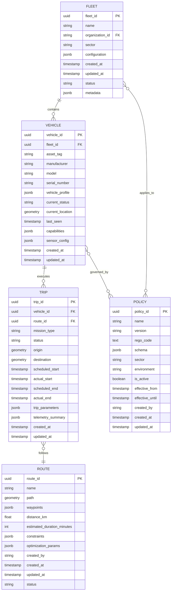
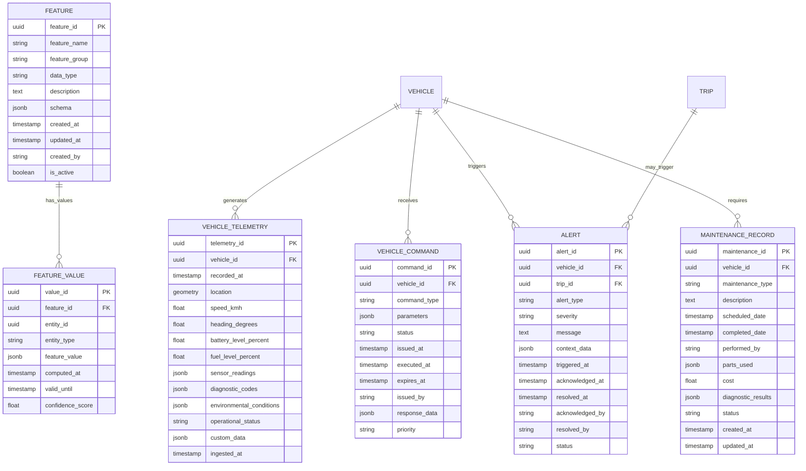
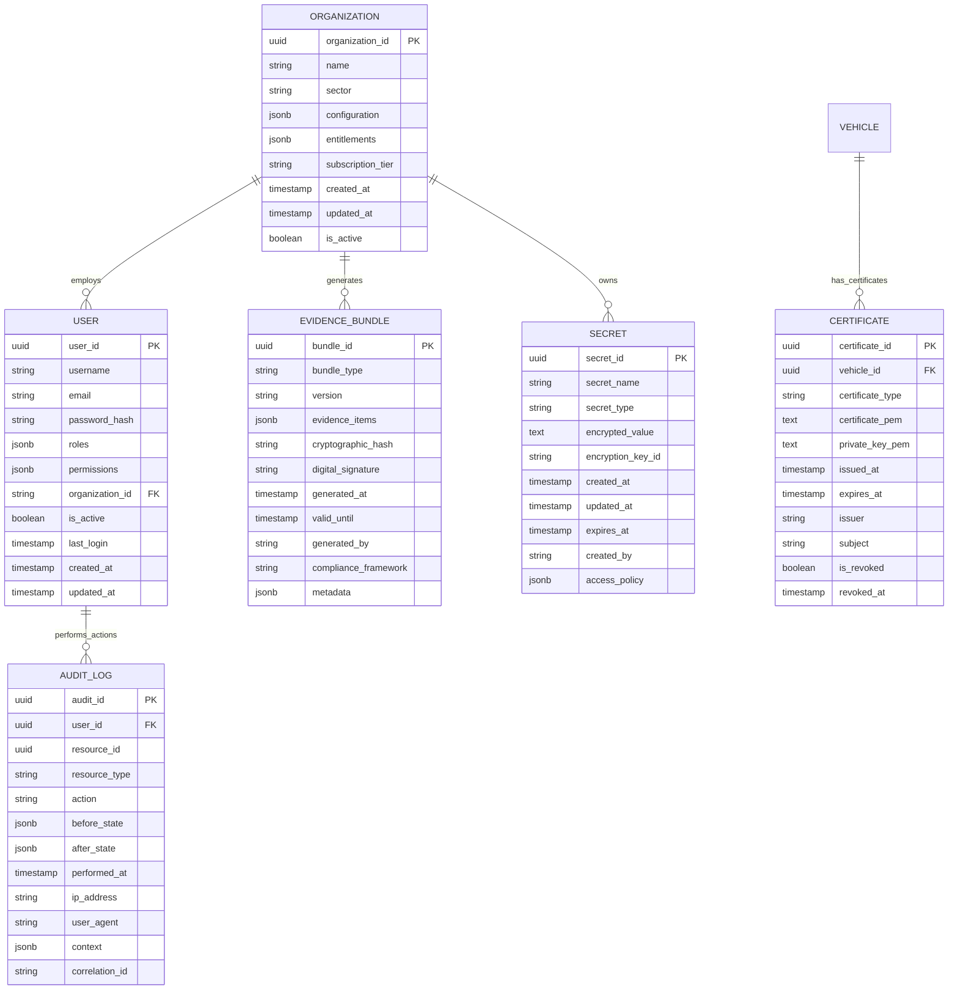
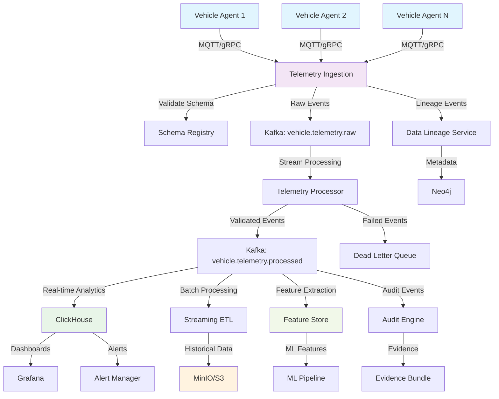
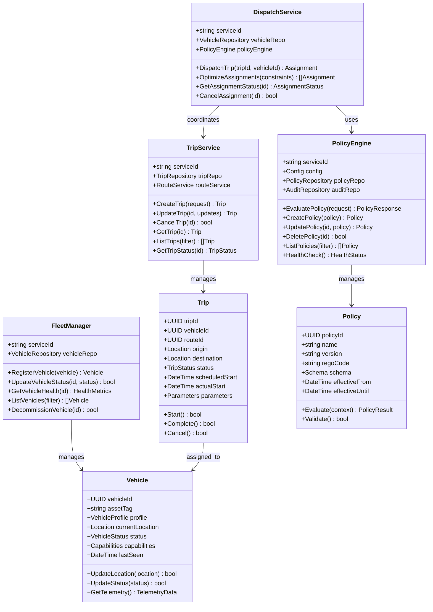
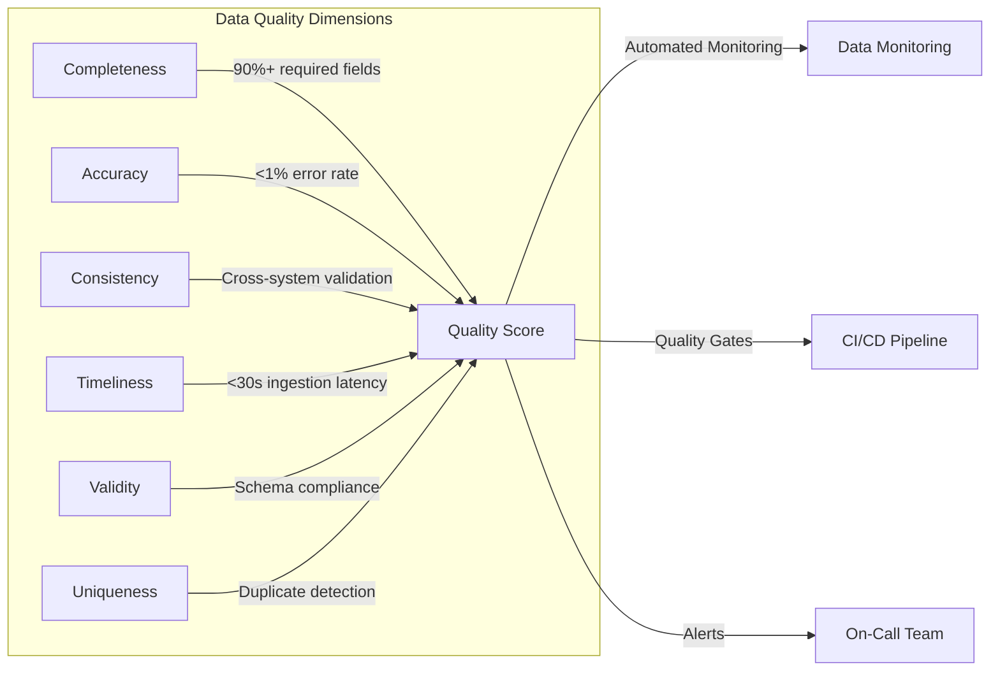
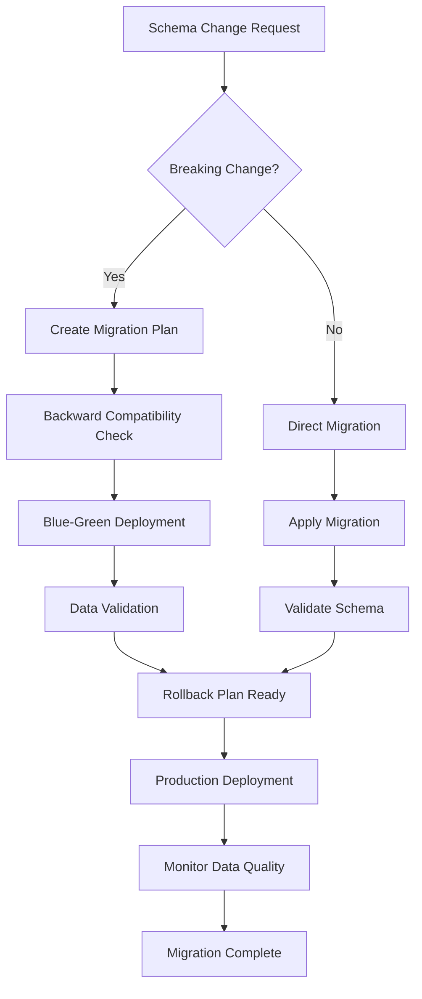

# AtlasMesh Fleet OS — Data Models & Entity Relationship Diagrams

## 1) Overview

This document provides comprehensive data models, Entity Relationship Diagrams (ERDs), and data flow diagrams for the AtlasMesh Fleet OS. The system uses a microservices architecture with domain-driven design principles, where each service manages its own data models.

## 2) Core Domain ERD



## 3) Telemetry & Analytics ERD



## 4) Security & Compliance ERD



## 5) Data Flow Diagram - Telemetry Pipeline



## 6) Sequence Diagram - Policy Evaluation Flow

```mermaid
sequenceDiagram
    participant VA as Vehicle Agent
    participant PE as Policy Engine
    participant DS as Dispatch Service
    participant TS as Trip Service
    participant AL as Audit Log
    
    Note over VA,AL: Policy Evaluation for Trip Assignment
    
    VA->>+PE: EvaluatePolicy(vehicleId, context)
    PE->>PE: Load applicable policies
    PE->>PE: Execute Rego evaluation
    
    alt Policy Allows Action
        PE->>AL: Log policy decision (ALLOW)
        PE->>-VA: PolicyResponse(allowed=true, constraints)
        VA->>+DS: RequestTripAssignment(vehicleId, constraints)
        DS->>+TS: CreateTrip(tripRequest)
        TS->>TS: Validate trip parameters
        TS->>-DS: TripCreated(tripId)
        DS->>-VA: TripAssigned(tripId, route)
    else Policy Denies Action
        PE->>AL: Log policy decision (DENY)
        PE->>-VA: PolicyResponse(allowed=false, reason)
        VA->>VA: Enter degraded mode
    end
    
    Note over VA,AL: All decisions are audited for compliance
```

## 7) UML Class Diagram - Core Services



## 8) Data Governance & Quality

### 8.1 Data Classification

| Classification | Description | Examples | Retention |
|---------------|-------------|----------|-----------|
| **Public** | Non-sensitive operational data | Vehicle models, route templates | 7 years |
| **Internal** | Business operational data | Trip summaries, fleet metrics | 5 years |
| **Confidential** | Sensitive business data | Customer data, financial records | 7 years |
| **Restricted** | Highly sensitive data | Security logs, audit trails | 10 years |

### 8.2 Data Quality Metrics



## 9) Database Schemas

### 9.1 PostgreSQL Schema (Core Services)

```sql
-- Core Fleet Management Schema
CREATE SCHEMA fleet_core;

-- Organizations and Multi-tenancy
CREATE TABLE fleet_core.organizations (
    organization_id UUID PRIMARY KEY DEFAULT gen_random_uuid(),
    name VARCHAR(255) NOT NULL,
    sector VARCHAR(50) NOT NULL,
    configuration JSONB DEFAULT '{}',
    entitlements JSONB DEFAULT '{}',
    subscription_tier VARCHAR(50) DEFAULT 'basic',
    created_at TIMESTAMP WITH TIME ZONE DEFAULT NOW(),
    updated_at TIMESTAMP WITH TIME ZONE DEFAULT NOW(),
    is_active BOOLEAN DEFAULT true
);

-- Fleets
CREATE TABLE fleet_core.fleets (
    fleet_id UUID PRIMARY KEY DEFAULT gen_random_uuid(),
    organization_id UUID NOT NULL REFERENCES fleet_core.organizations(organization_id),
    name VARCHAR(255) NOT NULL,
    sector VARCHAR(50) NOT NULL,
    configuration JSONB DEFAULT '{}',
    created_at TIMESTAMP WITH TIME ZONE DEFAULT NOW(),
    updated_at TIMESTAMP WITH TIME ZONE DEFAULT NOW(),
    status VARCHAR(50) DEFAULT 'active',
    metadata JSONB DEFAULT '{}'
);

-- Vehicles
CREATE TABLE fleet_core.vehicles (
    vehicle_id UUID PRIMARY KEY DEFAULT gen_random_uuid(),
    fleet_id UUID NOT NULL REFERENCES fleet_core.fleets(fleet_id),
    asset_tag VARCHAR(100) UNIQUE NOT NULL,
    manufacturer VARCHAR(100) NOT NULL,
    model VARCHAR(100) NOT NULL,
    serial_number VARCHAR(100) UNIQUE NOT NULL,
    vehicle_profile JSONB NOT NULL,
    current_status VARCHAR(50) DEFAULT 'offline',
    current_location GEOMETRY(POINT, 4326),
    last_seen TIMESTAMP WITH TIME ZONE,
    capabilities JSONB DEFAULT '{}',
    sensor_config JSONB DEFAULT '{}',
    created_at TIMESTAMP WITH TIME ZONE DEFAULT NOW(),
    updated_at TIMESTAMP WITH TIME ZONE DEFAULT NOW()
);

-- Create indexes for performance
CREATE INDEX idx_vehicles_fleet_id ON fleet_core.vehicles(fleet_id);
CREATE INDEX idx_vehicles_status ON fleet_core.vehicles(current_status);
CREATE INDEX idx_vehicles_location ON fleet_core.vehicles USING GIST(current_location);
CREATE INDEX idx_vehicles_last_seen ON fleet_core.vehicles(last_seen);
```

### 9.2 ClickHouse Schema (Analytics)

```sql
-- Telemetry Hot Path Schema
CREATE DATABASE IF NOT EXISTS atlasmesh_analytics;

-- Vehicle Telemetry Table (Optimized for time-series queries)
CREATE TABLE atlasmesh_analytics.vehicle_telemetry (
    vehicle_id UUID,
    recorded_at DateTime64(3),
    ingested_at DateTime64(3) DEFAULT now64(),
    location Tuple(Float64, Float64), -- (latitude, longitude)
    speed_kmh Float32,
    heading_degrees Float32,
    battery_level_percent Float32,
    fuel_level_percent Float32,
    sensor_readings String, -- JSON string for flexibility
    diagnostic_codes Array(String),
    operational_status LowCardinality(String),
    environmental_conditions String, -- JSON string
    custom_data String -- JSON string for extensibility
) ENGINE = MergeTree()
PARTITION BY toYYYYMM(recorded_at)
ORDER BY (vehicle_id, recorded_at)
TTL recorded_at + INTERVAL 90 DAY; -- Hot data retention

-- Aggregated Metrics Table
CREATE MATERIALIZED VIEW atlasmesh_analytics.vehicle_metrics_hourly
ENGINE = SummingMergeTree()
PARTITION BY toYYYYMM(hour)
ORDER BY (vehicle_id, hour)
AS SELECT
    vehicle_id,
    toStartOfHour(recorded_at) as hour,
    count() as telemetry_count,
    avg(speed_kmh) as avg_speed,
    max(speed_kmh) as max_speed,
    avg(battery_level_percent) as avg_battery,
    min(battery_level_percent) as min_battery
FROM atlasmesh_analytics.vehicle_telemetry
GROUP BY vehicle_id, hour;
```

## 10) Data Migration & Evolution

### 10.1 Schema Migration Strategy



### 10.2 Data Versioning

- **Schema Versioning**: Semantic versioning for all schema changes
- **API Versioning**: Backward compatibility for 2 major versions
- **Data Contracts**: Formal contracts between services with validation
- **Evolution Strategy**: Additive changes preferred, breaking changes planned

This comprehensive data model documentation ensures proper understanding of the AtlasMesh Fleet OS data architecture, relationships, and governance policies.
