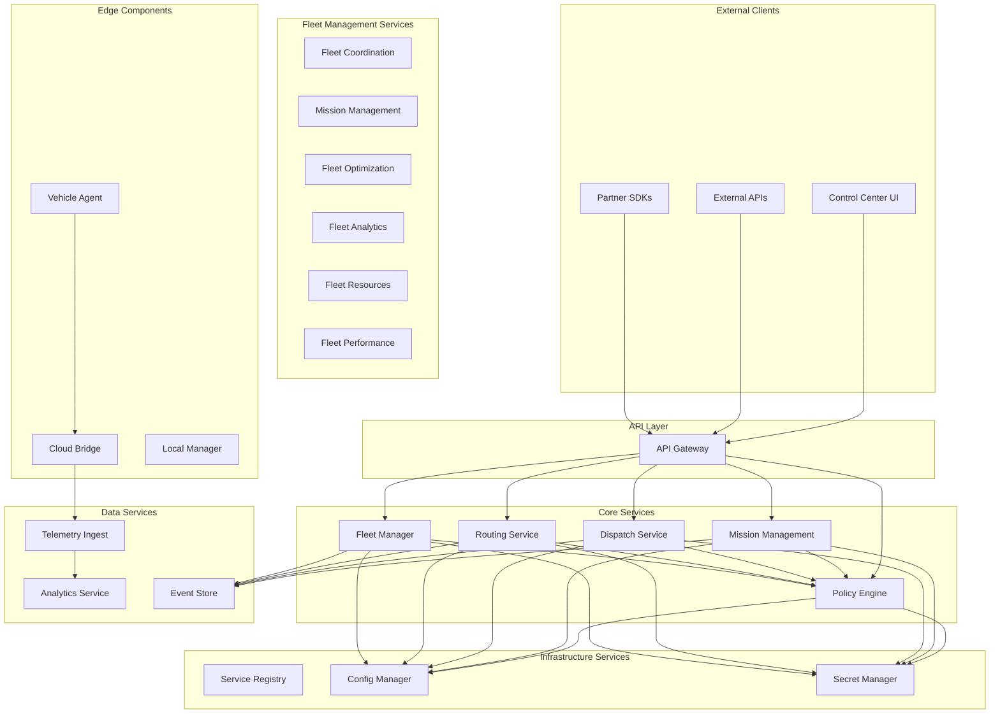

# 🏗️ AtlasMesh Fleet Management System - Service Registry

**Comprehensive Registry of All 72 Microservices**

---

## 📋 Table of Contents

| 🏗️ **[Service Architecture](#service-architecture)** | 🔧 **[Core Services](#core-services)** | 📊 **[Data Services](#data-services)** | 🛡️ **[Security Services](#security-services)** |
|:---:|:---:|:---:|:---:|
| **System Overview** | **Business Logic Services** | **Data Processing & Storage** | **Security & Compliance** |

| 🌐 **[Integration Services](#integration-services)** | 📈 **[Monitoring Services](#monitoring-services)** | 📚 **[References](#references--related-docs)** |
|:---:|:---:|:---:|
| **External Integrations** | **Observability & Analytics** | **Supporting Documentation** |

---

## 🏗️ **Service Architecture**

## Qualified Agnosticism Services

### 1. Vehicle HAL Service

**Service ID**: `vehicle-hal`  
**Version**: `1.0.0`  
**Port**: HTTP 8080

#### Responsibilities
- Vehicle hardware abstraction through profile-driven interfaces
- Profile loading and validation (Terminal Tractor, Mine Haul, UTV, etc.)
- Safety constraint enforcement per vehicle profile
- Actuator control translation to vehicle-specific protocols
- Standardized motion, sensor, and diagnostic interfaces

#### Key Features
- **Profile-Driven Abstraction**: ≤5% code delta across vehicle classes
- **Safety Monitoring**: Profile-specific constraint validation
- **Real-time Validation**: Command safety checking <5ms
- **Multi-Class Support**: Light Industrial, Heavy Duty, Mining, Defense, Passenger, Transit

#### Dependencies
- Vehicle profile configs (`configs/vehicles/*.yaml`)
- Sensor pack registry for sensor specifications
- Policy engine for safety policy enforcement

---

### 2. Variant Budget Service

**Service ID**: `variant-budget`  
**Version**: `1.0.0`  
**Port**: HTTP 8093

#### Responsibilities
- Automated code delta analysis per agnostic dimension
- Variant budget tracking and enforcement (≤5% code, ≤25% test delta)
- CI/CD integration for build blocking
- Change Control Board (CCB) workflow integration
- Historical trend analysis and reporting

#### Key Features
- **Automated Delta Analysis**: Git-based code delta measurement
- **Hard Budget Limits**: Build blocking when limits exceeded
- **CCB Integration**: Formal exception approval workflow
- **Real-time Monitoring**: Prometheus metrics and Grafana dashboards

#### Dependencies
- Git repository access for delta analysis
- CI/CD pipeline integration
- Prometheus for metrics collection

---

### 3. Conformance Testing Service

**Service ID**: `conformance-testing`  
**Version**: `1.0.0`  
**Port**: HTTP 8094

#### Responsibilities
- Multi-dimensional conformance testing (vehicle × sector × platform)
- Test matrix execution and result aggregation
- Evidence bundle generation for regulatory compliance
- Conformance score calculation and reporting
- Quality gate enforcement

#### Key Features
- **Multi-Dimensional Testing**: 72+ test combinations across dimensions
- **Priority-Based Execution**: Risk-based test selection
- **Evidence Automation**: ISO 26262/SOTIF/R155/R156 artifact generation
- **Parallel Execution**: <30-minute full suite execution

#### Dependencies
- Vehicle profiles, sensor packs, sector overlays
- Platform adapters for cross-platform testing
- Evidence engine for compliance artifact generation

---

### 4. Sensor Pack Registry Service

**Service ID**: `sensor-pack-registry`  
**Version**: `1.0.0`  
**Port**: HTTP 8082

#### Responsibilities
- Sensor pack catalog and metadata management
- Calibration procedure automation
- Drift detection and monitoring
- Pack validation and certification tracking
- Fusion configuration management

#### Key Features
- **Certified Packs**: Rugged-A (mining/defense), Urban-B (ride-hail), Highway-C (logistics)
- **Calibration Automation**: Scheduled calibration procedures
- **Drift Monitoring**: Real-time sensor performance tracking
- **Hot-Swap Support**: ≤30-minute sensor pack replacement

#### Dependencies
- Sensor pack configs (`configs/sensor-packs/*.json`)
- Vehicle HAL for sensor interface abstraction
- Telemetry ingestion for drift detection

---

## Core Services

### 5. Policy Engine Service

**Service ID**: `policy-engine`  
**Version**: `2.0.0`  
**Port**: gRPC 9090, HTTP 8080

#### Responsibilities
- Policy evaluation and management with Rego/OPA
- Sector overlay policy enforcement
- Rule engine for ODD, safety, routing, and dispatch policies
- Policy versioning and rollback
- Audit trail for all policy decisions
- Batch policy evaluation for performance

#### Enhancements (Phase 3 - Qualified Agnosticism)
- **Sector Overlay Support**: Defense, Mining, Logistics, Ride-hail policy overlays
- **PostgreSQL Repository**: Versioned policy storage with audit trail
- **P99 ≤40ms Performance**: Optimized for real-time decision making
- **Evidence Integration**: Compliance artifact generation for policy decisions

#### Key Features
- **Sub-10ms Policy Evaluation**: P99 policy evaluation ≤10ms
- **Explainable Decisions**: Full reasoning and evidence trails
- **Version Management**: Policy versioning with rollback capabilities
- **Caching**: Intelligent caching with configurable TTL
- **Audit Compliance**: Cryptographically signed decision logs

#### Interfaces
- **gRPC**: `atlasmesh.policy.v1.PolicyEngine`
- **HTTP**: RESTful API via API Gateway
- **Events**: Publishes policy decisions to event bus

#### Dependencies
- PostgreSQL (policy storage)
- Redis (caching)
- Kafka (event publishing)

#### SLOs
- **Availability**: 99.9%
- **Latency**: P99 ≤ 10ms for policy evaluation
- **Throughput**: 10,000 evaluations/second
- **Error Rate**: < 0.1%

---

### 2. Mission Management Service

**Service ID**: `mission-management`  
**Version**: `1.0.0`  
**Port**: HTTP 8080

#### Responsibilities
- Mission template management and orchestration
- Mission dependency resolution and scheduling
- Mission execution monitoring and analytics
- Mission safety protocols and compliance
- Mission coordination and optimization
- **Trip Management**: Complete trip lifecycle management within missions

#### Key Features
- **Mission Templates**: Reusable mission template library
- **Dependency Management**: Mission dependency resolution
- **Orchestration**: Mission execution orchestration
- **Safety**: Mission safety protocols and compliance
- **Analytics**: Mission performance analytics
- **Trip Management**: Trip state machine with validation
- **Event Sourcing**: Complete audit trail of mission and trip changes

#### Interfaces
- **HTTP**: RESTful API for mission management
- **gRPC**: `atlasmesh.mission.v1.MissionManagement`
- **Events**: Publishes trip events to event bus
- **Streaming**: Real-time trip updates

#### Dependencies
- PostgreSQL (trip data)
- Event Store (trip events)
- Policy Engine (validation)
- Kafka (event publishing)

#### SLOs
- **Availability**: 99.95%
- **Latency**: P95 ≤ 100ms for trip operations
- **Throughput**: 1,000 trips/second creation
- **Data Consistency**: 100% eventual consistency

---

### 3. Dispatch Service

**Service ID**: `dispatch-service`  
**Version**: `1.0.0`  
**Port**: gRPC 9092, HTTP 8082

#### Responsibilities
- Vehicle assignment and optimization
- Fleet-wide optimization algorithms
- Real-time rebalancing
- Assignment validation and constraints
- Performance metrics and analytics

#### Key Features
- **Optimization Engine**: Multi-objective optimization
- **Real-time Rebalancing**: Dynamic fleet rebalancing
- **Constraint Handling**: Complex assignment constraints
- **Performance Tracking**: Comprehensive metrics
- **Scalable Architecture**: Handles large fleets

#### Interfaces
- **gRPC**: `atlasmesh.dispatch.v1.DispatchService`
- **HTTP**: RESTful API via API Gateway
- **Events**: Publishes assignment events
- **Streaming**: Real-time assignment updates

#### Dependencies
- PostgreSQL (assignment data)
- Redis (optimization cache)
- Policy Engine (constraint validation)
- Fleet Manager (vehicle status)
- Kafka (event publishing)

#### SLOs
- **Availability**: 99.9%
- **Latency**: P95 ≤ 5s for optimization
- **Assignment Success Rate**: ≥ 95%
- **Optimization Quality**: ≥ 90% efficiency score

---

### 4. Routing Service

**Service ID**: `routing-service`  
**Version**: `1.0.0`  
**Port**: gRPC 9093, HTTP 8083

#### Responsibilities
- Route calculation and optimization
- Golden corridor management
- Real-time navigation support
- Route validation and analysis
- Performance monitoring and replay

#### Key Features
- **Multi-Modal Routing**: Support for various vehicle types
- **Golden Corridors**: Predefined safe routes
- **Real-time Navigation**: Turn-by-turn guidance
- **Route Replay**: Historical route analysis
- **Performance Analytics**: Comprehensive route metrics

#### Interfaces
- **gRPC**: `atlasmesh.routing.v1.RoutingService`
- **HTTP**: RESTful API via API Gateway
- **Events**: Publishes routing events
- **Streaming**: Real-time navigation updates

#### Dependencies
- PostgreSQL (route data)
- Map Services (external)
- Policy Engine (route validation)
- Weather Services (conditions)
- Kafka (event publishing)

#### SLOs
- **Availability**: 99.95%
- **Latency**: P95 ≤ 5s for route calculation
- **Route Quality**: ≥ 95% success rate
- **Navigation Accuracy**: ≤ 2m deviation

---

### 5. Fleet Manager Service

**Service ID**: `fleet-manager`  
**Version**: `1.0.0`  
**Port**: gRPC 9094, HTTP 8084

#### Responsibilities
- Vehicle registry and lifecycle management
- Health monitoring and diagnostics
- ODD validation and management
- Maintenance scheduling
- Capability assessment

#### Key Features
- **Vehicle Registry**: Comprehensive vehicle database
- **Health Monitoring**: Real-time health assessment
- **ODD Management**: Operational Design Domain validation
- **Predictive Maintenance**: ML-based maintenance scheduling
- **Capability Matrix**: Dynamic capability assessment

#### Interfaces
- **gRPC**: `atlasmesh.fleet.v1.FleetManager`
- **HTTP**: RESTful API via API Gateway
- **Events**: Publishes fleet events
- **Streaming**: Real-time vehicle updates

#### Dependencies
- PostgreSQL (fleet data)
- Time Series DB (telemetry)
- Policy Engine (ODD validation)
- ML Services (predictive maintenance)
- Kafka (event publishing)

#### SLOs
- **Availability**: 99.95%
- **Health Check Latency**: P95 ≤ 1s
- **Vehicle Registration**: P99 ≤ 5s
- **Data Accuracy**: 99.9% telemetry accuracy

---

## Infrastructure Services

### API Gateway

**Service ID**: `api-gateway`  
**Version**: `1.0.0`  
**Port**: HTTP 8080, HTTPS 8443

#### Responsibilities
- Unified API access point
- Authentication and authorization
- Rate limiting and throttling
- Request/response transformation
- Circuit breaker patterns

#### Key Features
- **Authentication**: JWT and API key support
- **Rate Limiting**: Configurable rate limits
- **Circuit Breakers**: Fault tolerance
- **Request Transformation**: Protocol translation
- **Comprehensive Logging**: Full audit trail

#### SLOs
- **Availability**: 99.99%
- **Latency**: P95 ≤ 50ms overhead
- **Throughput**: 50,000 requests/second
- **Error Rate**: < 0.01%

---

### Service Registry

**Service ID**: `service-registry`  
**Version**: `1.0.0`  
**Port**: HTTP 8761

#### Responsibilities
- Service discovery and registration
- Health check coordination
- Load balancing configuration
- Service metadata management

#### Key Features
- **Auto-Discovery**: Automatic service registration
- **Health Monitoring**: Continuous health checks
- **Load Balancing**: Dynamic load balancing
- **Metadata Management**: Service capabilities and versions

---

## Fleet Management Services

### 6. Fleet Coordination Service

**Service ID**: `fleet-coordination`  
**Version**: `1.0.0`  
**Port**: HTTP 8080

#### Responsibilities
- Multi-fleet coordination and federation management
- Cross-fleet resource sharing and allocation
- Fleet isolation and security enforcement
- Inter-fleet communication protocols
- Fleet coordination analytics and monitoring

#### Key Features
- **Fleet Federation**: Multi-tenant fleet federation management
- **Resource Sharing**: Cross-fleet resource sharing with isolation
- **Communication**: Secure inter-fleet communication protocols
- **Coordination**: Fleet coordination standards and protocols
- **Analytics**: Fleet coordination analytics and insights

#### Interfaces
- **HTTP**: RESTful API for fleet coordination
- **gRPC**: `atlasmesh.fleet.v1.FleetCoordination`
- **Events**: Publishes coordination events to event bus

#### Dependencies
- PostgreSQL (fleet coordination data)
- Redis (coordination caching)
- Kafka (event publishing)

#### SLOs
- **Availability**: 99.9%
- **Latency**: P95 ≤ 5s for coordination decisions
- **Throughput**: 1,000 coordination requests/second
- **Error Rate**: < 0.1%

---

### 7. Fleet Manager Service

**Service ID**: `fleet-manager`  
**Version**: `1.0.0`  
**Port**: HTTP 8081

#### Responsibilities
- Vehicle registry and lifecycle management
- Health monitoring and diagnostics
- ODD validation and management
- Maintenance scheduling
- Capability assessment
- **Sector-Specific Configuration**: Multi-sector support with configuration overlays

#### Key Features
- **Vehicle Registry**: Comprehensive vehicle database
- **Health Monitoring**: Real-time health assessment
- **ODD Management**: Operational Design Domain validation
- **Predictive Maintenance**: ML-based maintenance scheduling
- **Capability Matrix**: Dynamic capability assessment
- **Sector Support**: Defense, Mining, Logistics, Ride-hail configurations

#### Interfaces
- **HTTP**: RESTful API for fleet management
- **gRPC**: `atlasmesh.fleet.v1.FleetManager`
- **Events**: Publishes mission events to event bus

#### Dependencies
- PostgreSQL (mission data)
- Redis (mission caching)
- Kafka (event publishing)

#### SLOs
- **Availability**: 99.9%
- **Latency**: P95 ≤ 2m for mission creation
- **Throughput**: 500 mission requests/second
- **Error Rate**: < 0.1%

---

### 8. Fleet Optimization Service

**Service ID**: `fleet-optimization`  
**Version**: `1.0.0`  
**Port**: HTTP 8080

#### Responsibilities
- Multi-objective fleet optimization
- Dynamic fleet rebalancing and allocation
- Cost and energy optimization
- Fleet optimization algorithms and analytics
- Optimization monitoring and reporting

#### Key Features
- **Multi-Objective**: Multi-objective optimization algorithms
- **Rebalancing**: Dynamic fleet rebalancing
- **Cost Optimization**: Fleet cost optimization
- **Energy Optimization**: Fleet energy optimization
- **Analytics**: Fleet optimization analytics

#### Interfaces
- **HTTP**: RESTful API for fleet optimization
- **gRPC**: `atlasmesh.optimization.v1.FleetOptimization`
- **Events**: Publishes optimization events to event bus

#### Dependencies
- PostgreSQL (optimization data)
- Redis (optimization caching)
- Kafka (event publishing)

#### SLOs
- **Availability**: 99.9%
- **Latency**: P95 ≤ 5m for optimization runs
- **Throughput**: 100 optimization requests/second
- **Error Rate**: < 0.1%

---

### 9. Fleet Analytics Service

**Service ID**: `fleet-analytics`  
**Version**: `1.0.0`  
**Port**: HTTP 8080

#### Responsibilities
- Fleet health scoring and monitoring
- Fleet efficiency metrics and analytics
- Predictive analytics and forecasting
- Fleet analytics dashboards and reporting
- Analytics data processing and insights

#### Key Features
- **Health Scoring**: Comprehensive fleet health scoring
- **Efficiency Metrics**: Fleet efficiency metrics and analytics
- **Predictive Analytics**: Fleet predictive analytics and forecasting
- **Dashboards**: Fleet analytics dashboards
- **Insights**: Fleet analytics insights and recommendations

#### Interfaces
- **HTTP**: RESTful API for fleet analytics
- **gRPC**: `atlasmesh.analytics.v1.FleetAnalytics`
- **Events**: Publishes analytics events to event bus

#### Dependencies
- PostgreSQL (analytics data)
- ClickHouse (time-series analytics)
- Redis (analytics caching)
- Kafka (event publishing)

#### SLOs
- **Availability**: 99.9%
- **Latency**: P95 ≤ 10m for analytics processing
- **Throughput**: 1,000 analytics requests/second
- **Error Rate**: < 0.1%

---

### 10. Fleet Resource Management Service

**Service ID**: `fleet-resources`  
**Version**: `1.0.0`  
**Port**: HTTP 8080

#### Responsibilities
- Fleet resource allocation and optimization
- Resource monitoring and planning
- Resource forecasting and capacity planning
- Resource utilization analytics
- Resource management optimization

#### Key Features
- **Resource Allocation**: Fleet resource allocation
- **Resource Optimization**: Resource optimization algorithms
- **Resource Monitoring**: Resource monitoring and analytics
- **Resource Planning**: Resource planning and forecasting
- **Resource Analytics**: Resource utilization analytics

#### Interfaces
- **HTTP**: RESTful API for fleet resource management
- **gRPC**: `atlasmesh.resources.v1.FleetResources`
- **Events**: Publishes resource events to event bus

#### Dependencies
- PostgreSQL (resource data)
- Redis (resource caching)
- Kafka (event publishing)

#### SLOs
- **Availability**: 99.9%
- **Latency**: P95 ≤ 5m for resource allocation
- **Throughput**: 500 resource requests/second
- **Error Rate**: < 0.1%

---

### 11. Fleet Performance Management Service

**Service ID**: `fleet-performance`  
**Version**: `1.0.0`  
**Port**: HTTP 8080

#### Responsibilities
- Fleet performance monitoring and analytics
- Performance optimization and improvement
- Performance benchmarking and comparison
- Performance reporting and insights
- Performance management optimization

#### Key Features
- **Performance Monitoring**: Fleet performance monitoring
- **Performance Optimization**: Performance optimization algorithms
- **Performance Benchmarking**: Fleet performance benchmarking
- **Performance Reporting**: Performance reporting and analytics
- **Performance Analytics**: Fleet performance analytics

#### Interfaces
- **HTTP**: RESTful API for fleet performance management
- **gRPC**: `atlasmesh.performance.v1.FleetPerformance`
- **Events**: Publishes performance events to event bus

#### Dependencies
- PostgreSQL (performance data)
- Redis (performance caching)
- Kafka (event publishing)

#### SLOs
- **Availability**: 99.9%
- **Latency**: P95 ≤ 5m for performance analysis
- **Throughput**: 500 performance requests/second
- **Error Rate**: < 0.1%

---

## Integration Services

### 8. WMS Adapters

**Service ID**: `wms-adapters`  
**Version**: `1.0.0`  
**Port**: HTTP 8085

#### Responsibilities
- SAP EWM integration and synchronization
- Manhattan SCALE integration and synchronization
- Oracle WMS integration and synchronization
- Real-time task sync and inventory management
- Pick/place confirmations and status updates

#### Key Features
- **Multi-WMS Support**: SAP EWM, Manhattan SCALE, Oracle WMS
- **Real-time Sync**: Live task and inventory synchronization
- **Error Handling**: Robust error handling and retry mechanisms
- **Sector Support**: Logistics-specific configurations

#### Interfaces
- **HTTP**: RESTful API for WMS operations
- **gRPC**: `atlasmesh.wms.v1.WMSAdapter`

---

### 9. Defense Adapters

**Service ID**: `defense-adapters`  
**Version**: `1.0.0`  
**Port**: HTTP 8086

#### Responsibilities
- NATO Command system integration
- Military protocol compliance
- Secure data exchange
- Mission coordination with defense systems

#### Key Features
- **NATO Integration**: NATO Command system connectivity
- **Security**: Military-grade security and encryption
- **Compliance**: Defense protocol compliance
- **Audit Trail**: Complete audit logging for defense operations

#### Interfaces
- **HTTP**: RESTful API for defense operations
- **gRPC**: `atlasmesh.defense.v1.DefenseAdapter`

---

### 10. Mining Adapters

**Service ID**: `mining-adapters`  
**Version**: `1.0.0`  
**Port**: HTTP 8087

#### Responsibilities
- Wenco FMS integration
- MineStar integration
- Modular Mining DISPATCH integration
- Production reporting and equipment status

#### Key Features
- **FMS Integration**: Wenco, MineStar, Modular Mining
- **Production Data**: Real-time production reporting
- **Equipment Status**: Equipment health and status monitoring
- **Mining Protocols**: Mining-specific communication protocols

#### Interfaces
- **HTTP**: RESTful API for mining operations
- **gRPC**: `atlasmesh.mining.v1.MiningAdapter`

---

### 11. Ride-Hail Adapters

**Service ID**: `ride-hail-adapters`  
**Version**: `1.0.0`  
**Port**: HTTP 8088

#### Responsibilities
- Payment processing integration
- Passenger app integration
- Ride matching and dispatch
- Customer service integration

#### Key Features
- **Payment Processing**: Stripe, PayPal, and other payment providers
- **Passenger App**: Mobile app integration
- **Ride Management**: Trip planning and execution
- **Customer Service**: Support and feedback integration

#### Interfaces
- **HTTP**: RESTful API for ride-hail operations
- **gRPC**: `atlasmesh.ridehail.v1.RideHailAdapter`

---

### 12. Auth Service

**Service ID**: `auth-service`  
**Version**: `1.0.0`  
**Port**: HTTP 8089

#### Responsibilities
- User authentication and authorization
- JWT token management
- Role-based access control (RBAC)
- Multi-factor authentication (MFA)

#### Key Features
- **Authentication**: JWT, OAuth2, SAML support
- **Authorization**: Fine-grained RBAC
- **MFA**: TOTP, SMS, biometric support
- **Session Management**: Secure session handling

#### Interfaces
- **HTTP**: RESTful API for authentication
- **gRPC**: `atlasmesh.auth.v1.AuthService`

---

### 13. Cache Manager

**Service ID**: `cache-manager`  
**Version**: `1.0.0`  
**Port**: HTTP 8090

#### Responsibilities
- Distributed caching across services
- Cache invalidation and refresh
- Performance optimization
- Memory management

#### Key Features
- **Multi-tier Caching**: L1, L2, L3 cache layers
- **Cache Policies**: TTL, LRU, LFU policies
- **Distributed**: Redis cluster support
- **Monitoring**: Cache hit/miss metrics

#### Interfaces
- **HTTP**: RESTful API for cache operations
- **gRPC**: `atlasmesh.cache.v1.CacheManager`

---

### 14. Control Center UI

**Service ID**: `control-center-ui`  
**Version**: `1.0.0`  
**Port**: HTTP 3000

#### Responsibilities
- Web-based fleet management interface
- Real-time vehicle monitoring
- Mission and trip management
- Analytics and reporting dashboard

#### Key Features
- **Real-time Updates**: WebSocket connections
- **Responsive Design**: Mobile and desktop support
- **Sector Support**: Sector-specific UI configurations
- **Analytics**: Interactive dashboards and reports

#### Interfaces
- **HTTP**: Web interface
- **WebSocket**: Real-time updates
- **REST API**: Backend integration

---

### 15. Energy Management

**Service ID**: `energy-management`  
**Version**: `1.0.0`  
**Port**: HTTP 8091

#### Responsibilities
- Smart charging coordination
- V2G (Vehicle-to-Grid) management
- Energy-aware routing
- Battery optimization

#### Key Features
- **Smart Charging**: Intelligent charging scheduling
- **V2G Support**: Vehicle-to-grid energy management
- **Energy Routing**: Energy-aware route optimization
- **Battery Management**: Battery health and optimization

#### Interfaces
- **HTTP**: RESTful API for energy operations
- **gRPC**: `atlasmesh.energy.v1.EnergyManagement`

---

### 16. HD Map Service

**Service ID**: `hd-map-service`  
**Version**: `1.0.0`  
**Port**: HTTP 8092

#### Responsibilities
- High-definition map management
- Map data serving and caching
- Geospatial queries
- Map updates and versioning

#### Key Features
- **HD Maps**: High-definition mapping support
- **Geospatial Queries**: Spatial data queries
- **Map Caching**: Efficient map data caching
- **Version Control**: Map versioning and updates

#### Interfaces
- **HTTP**: RESTful API for map operations
- **gRPC**: `atlasmesh.map.v1.HDMapService`

---

### 17. Vehicle Gateway

**Service ID**: `vehicle-gateway`  
**Version**: `1.0.0`  
**Port**: HTTP 8093

#### Responsibilities
- Vehicle communication gateway
- Protocol translation
- Message routing
- Vehicle state management

#### Key Features
- **Protocol Support**: Multiple vehicle protocols
- **Message Routing**: Intelligent message routing
- **State Management**: Vehicle state tracking
- **Tele-assist**: Remote assistance capabilities

#### Interfaces
- **HTTP**: RESTful API for vehicle operations
- **gRPC**: `atlasmesh.vehicle.v1.VehicleGateway`

---

### 18. Predictive Maintenance

**Service ID**: `predictive-maintenance`  
**Version**: `1.0.0`  
**Port**: HTTP 8094

#### Responsibilities
- ML-based maintenance prediction
- Equipment health monitoring
- Maintenance scheduling
- Failure prediction

#### Key Features
- **ML Models**: Predictive maintenance algorithms
- **Health Monitoring**: Real-time equipment health
- **Scheduling**: Intelligent maintenance scheduling
- **Predictions**: Failure prediction and alerts

#### Interfaces
- **HTTP**: RESTful API for maintenance operations
- **gRPC**: `atlasmesh.maintenance.v1.PredictiveMaintenance`

---

### 19. Weather Fusion

**Service ID**: `weather-fusion`  
**Version**: `1.0.0`  
**Port**: HTTP 8095

#### Responsibilities
- Multi-source weather data fusion
- Weather prediction and forecasting
- Environmental condition monitoring
- Weather-aware routing

#### Key Features
- **Data Fusion**: Multiple weather source integration
- **Forecasting**: Weather prediction algorithms
- **Environmental**: Environmental condition monitoring
- **Routing Integration**: Weather-aware route planning

#### Interfaces
- **HTTP**: RESTful API for weather operations
- **gRPC**: `atlasmesh.weather.v1.WeatherFusion`

---

### 20. Digital Twin

**Service ID**: `digital-twin`  
**Version**: `1.0.0`  
**Port**: HTTP 8096

#### Responsibilities
- Digital twin management
- Virtual vehicle simulation
- State synchronization
- Simulation coordination

#### Key Features
- **Twin Management**: Digital twin lifecycle
- **Simulation**: Virtual vehicle simulation
- **State Sync**: Real-time state synchronization
- **Coordination**: Simulation coordination

#### Interfaces
- **HTTP**: RESTful API for twin operations
- **gRPC**: `atlasmesh.twin.v1.DigitalTwin`

---

### 21. Arabic Localization

**Service ID**: `arabic-localization`  
**Version**: `1.0.0`  
**Port**: HTTP 8097

#### Responsibilities
- Arabic language support
- RTL (Right-to-Left) text handling
- Cultural adaptation
- Localization services

#### Key Features
- **Language Support**: Full Arabic language support
- **RTL Support**: Right-to-left text rendering
- **Cultural**: Cultural adaptation for UAE/MENA
- **Localization**: Multi-language localization

#### Interfaces
- **HTTP**: RESTful API for localization
- **gRPC**: `atlasmesh.i18n.v1.ArabicLocalization`

---

### 22. Auditability

**Service ID**: `auditability`  
**Version**: `1.0.0`  
**Port**: HTTP 8098

#### Responsibilities
- Audit trail management
- Compliance logging
- Evidence collection
- Regulatory reporting

#### Key Features
- **Audit Trails**: Comprehensive audit logging
- **Compliance**: Regulatory compliance support
- **Evidence**: Evidence collection and storage
- **Reporting**: Automated compliance reporting

#### Interfaces
- **HTTP**: RESTful API for audit operations
- **gRPC**: `atlasmesh.audit.v1.Auditability`

---

### 23. Chaos Engineering

**Service ID**: `chaos-engineering`  
**Version**: `1.0.0`  
**Port**: HTTP 8099

#### Responsibilities
- Chaos testing and fault injection
- System resilience testing
- Failure simulation
- Recovery testing

#### Key Features
- **Fault Injection**: Controlled failure injection
- **Resilience Testing**: System resilience validation
- **Recovery**: Recovery procedure testing
- **Monitoring**: Chaos experiment monitoring

#### Interfaces
- **HTTP**: RESTful API for chaos operations
- **gRPC**: `atlasmesh.chaos.v1.ChaosEngineering`

---

### 24. Comms Orchestration

**Service ID**: `comms-orchestration`  
**Version**: `1.0.0`  
**Port**: HTTP 8100

#### Responsibilities
- Communication orchestration
- Multi-path communication
- Offline-first capabilities
- Cost/latency optimization

#### Key Features
- **Multi-path**: Multiple communication paths
- **Offline**: Offline-first communication
- **Optimization**: Cost and latency optimization
- **Orchestration**: Communication flow orchestration

#### Interfaces
- **HTTP**: RESTful API for comms operations
- **gRPC**: `atlasmesh.comms.v1.CommsOrchestration`

---

### 25. Compliance Automation

**Service ID**: `compliance-automation`  
**Version**: `1.0.0`  
**Port**: HTTP 8101

#### Responsibilities
- Automated compliance checking
- Regulatory requirement validation
- Evidence generation
- Compliance reporting

#### Key Features
- **Automation**: Automated compliance checking
- **Validation**: Regulatory requirement validation
- **Evidence**: Automated evidence generation
- **Reporting**: Compliance report generation

#### Interfaces
- **HTTP**: RESTful API for compliance operations
- **gRPC**: `atlasmesh.compliance.v1.ComplianceAutomation`

---

### 26. Cost Optimization

**Service ID**: `cost-optimization`  
**Version**: `1.0.0`  
**Port**: HTTP 8102

#### Responsibilities
- Cost analysis and optimization
- Resource utilization monitoring
- Budget management
- Cost forecasting

#### Key Features
- **Analysis**: Cost analysis and insights
- **Optimization**: Resource optimization
- **Budgeting**: Budget management and tracking
- **Forecasting**: Cost prediction and forecasting

#### Interfaces
- **HTTP**: RESTful API for cost operations
- **gRPC**: `atlasmesh.cost.v1.CostOptimization`

---

### 27. Data Fusion

**Service ID**: `data-fusion`  
**Version**: `1.0.0`  
**Port**: HTTP 8103

#### Responsibilities
- Multi-source data fusion
- Data quality management
- Sensor data integration
- Data validation

#### Key Features
- **Fusion**: Multi-source data integration
- **Quality**: Data quality management
- **Validation**: Data validation and cleansing
- **Integration**: Sensor data integration

#### Interfaces
- **HTTP**: RESTful API for data operations
- **gRPC**: `atlasmesh.data.v1.DataFusion`

---

### 28. Data Lineage

**Service ID**: `data-lineage`  
**Version**: `1.0.0`  
**Port**: HTTP 8104

#### Responsibilities
- Data lineage tracking
- Data provenance management
- Data flow monitoring
- Data governance

#### Key Features
- **Lineage**: Complete data lineage tracking
- **Provenance**: Data source tracking
- **Flow**: Data flow monitoring
- **Governance**: Data governance support

#### Interfaces
- **HTTP**: RESTful API for lineage operations
- **gRPC**: `atlasmesh.lineage.v1.DataLineage`

---

### 29. Degraded Modes

**Service ID**: `degraded-modes`  
**Version**: `1.0.0`  
**Port**: HTTP 8105

#### Responsibilities
- Degraded operation management
- Graceful degradation
- Fallback procedures
- System resilience

#### Key Features
- **Degradation**: Graceful system degradation
- **Fallback**: Fallback procedure management
- **Resilience**: System resilience support
- **Recovery**: Degraded mode recovery

#### Interfaces
- **HTTP**: RESTful API for degraded operations
- **gRPC**: `atlasmesh.degraded.v1.DegradedModes`

---

### 30. Digital Twin Simulation

**Service ID**: `scenario-testing`  
**Version**: `1.0.0`  
**Port**: HTTP 8106

#### Responsibilities
- Digital twin simulation
- Virtual testing environment
- Scenario simulation
- Performance testing

#### Key Features
- **Simulation**: Advanced simulation capabilities
- **Testing**: Virtual testing environment
- **Scenarios**: Scenario-based simulation
- **Performance**: Performance testing and validation

#### Interfaces
- **HTTP**: RESTful API for simulation operations
- **gRPC**: `atlasmesh.simulation.v1.DigitalTwinSimulation`

---

### 31. ERP Integration

**Service ID**: `erp-financial-connector`  
**Version**: `1.0.0`  
**Port**: HTTP 8107

#### Responsibilities
- ERP system integration
- Business process automation
- Data synchronization
- Workflow management

#### Key Features
- **ERP Support**: SAP, Oracle, Microsoft Dynamics
- **Automation**: Business process automation
- **Sync**: Real-time data synchronization
- **Workflow**: Workflow management and orchestration

#### Interfaces
- **HTTP**: RESTful API for ERP operations
- **gRPC**: `atlasmesh.erp.v1.ERPIntegration`

---

### 32. ERP WMS Adapters

**Service ID**: `business-systems-connector`  
**Version**: `1.0.0`  
**Port**: HTTP 8108

#### Responsibilities
- ERP-WMS integration adapters
- Data transformation
- Protocol translation
- System bridging

#### Key Features
- **Adapters**: Multiple ERP-WMS adapters
- **Transformation**: Data format transformation
- **Translation**: Protocol translation
- **Bridging**: System integration bridging

#### Interfaces
- **HTTP**: RESTful API for adapter operations
- **gRPC**: `atlasmesh.erp.v1.ERPWMSAdapters`

---

### 33. Event Bus

**Service ID**: `event-bus`  
**Version**: `1.0.0`  
**Port**: HTTP 8109

#### Responsibilities
- Event streaming and messaging
- Event routing and distribution
- Event persistence
- Event replay

#### Key Features
- **Streaming**: Real-time event streaming
- **Routing**: Intelligent event routing
- **Persistence**: Event persistence and storage
- **Replay**: Event replay capabilities

#### Interfaces
- **HTTP**: RESTful API for event operations
- **gRPC**: `atlasmesh.events.v1.EventBus`

---

### 34. Evidence Engine

**Service ID**: `evidence-engine`  
**Version**: `1.0.0`  
**Port**: HTTP 8110

#### Responsibilities
- Evidence collection and management
- Compliance evidence generation
- Audit trail creation
- Regulatory reporting

#### Key Features
- **Collection**: Automated evidence collection
- **Generation**: Compliance evidence generation
- **Audit**: Comprehensive audit trails
- **Reporting**: Regulatory report generation

#### Interfaces
- **HTTP**: RESTful API for evidence operations
- **gRPC**: `atlasmesh.evidence.v1.EvidenceEngine`

---

### 35. External Integrations

**Service ID**: `external-integrations`  
**Version**: `1.0.0`  
**Port**: HTTP 8111

#### Responsibilities
- Third-party system integration
- API management
- Data exchange
- Integration monitoring

#### Key Features
- **Third-party**: External system integration
- **API Management**: API lifecycle management
- **Exchange**: Secure data exchange
- **Monitoring**: Integration health monitoring

#### Interfaces
- **HTTP**: RESTful API for integration operations
- **gRPC**: `atlasmesh.integration.v1.ExternalIntegrations`

---

### 36. Feature Flags

**Service ID**: `feature-flags`  
**Version**: `1.0.0`  
**Port**: HTTP 8112

#### Responsibilities
- Feature flag management
- A/B testing support
- Gradual rollouts
- Feature toggling

#### Key Features
- **Management**: Feature flag lifecycle management
- **A/B Testing**: A/B testing framework
- **Rollouts**: Gradual feature rollouts
- **Toggling**: Runtime feature toggling

#### Interfaces
- **HTTP**: RESTful API for feature operations
- **gRPC**: `atlasmesh.features.v1.FeatureFlags`

---

### 37. Feature Store Registry

**Service ID**: `feature-store-registry`  
**Version**: `1.0.0`  
**Port**: HTTP 8113

#### Responsibilities
- Feature store management
- Feature metadata
- Feature discovery
- Feature versioning

#### Key Features
- **Store Management**: Feature store lifecycle
- **Metadata**: Feature metadata management
- **Discovery**: Feature discovery and search
- **Versioning**: Feature version control

#### Interfaces
- **HTTP**: RESTful API for feature store operations
- **gRPC**: `atlasmesh.features.v1.FeatureStoreRegistry`

---

### 38. Garage Tools

**Service ID**: `garage-tools`  
**Version**: `1.0.0`  
**Port**: HTTP 8114

#### Responsibilities
- Vehicle maintenance tools
- Diagnostic utilities
- Repair procedures
- Tool management

#### Key Features
- **Maintenance**: Vehicle maintenance tools
- **Diagnostics**: Diagnostic utilities and procedures
- **Repair**: Repair procedure management
- **Management**: Tool inventory and management

#### Interfaces
- **HTTP**: RESTful API for garage operations
- **gRPC**: `atlasmesh.garage.v1.GarageTools`

---

### 39. Key Secret Management

**Service ID**: `key-secret-management`  
**Version**: `1.0.0`  
**Port**: HTTP 8115

#### Responsibilities
- Secret and key management
- Encryption key rotation
- Secret distribution
- Security compliance

#### Key Features
- **Management**: Secret and key lifecycle management
- **Rotation**: Automated key rotation
- **Distribution**: Secure secret distribution
- **Compliance**: Security compliance support

#### Interfaces
- **HTTP**: RESTful API for secret operations
- **gRPC**: `atlasmesh.secrets.v1.KeySecretManagement`

---

### 40. Map Data Contract

**Service ID**: `map-data-contract`  
**Version**: `1.0.0`  
**Port**: HTTP 8116

#### Responsibilities
- Map data contract management
- Data schema validation
- Contract versioning
- Data quality assurance

#### Key Features
- **Contract Management**: Map data contract lifecycle
- **Validation**: Schema validation and enforcement
- **Versioning**: Contract version control
- **Quality**: Data quality assurance

#### Interfaces
- **HTTP**: RESTful API for contract operations
- **gRPC**: `atlasmesh.map.v1.MapDataContract`

---

### 41. Mission Planning

**Service ID**: `mission-planning`  
**Version**: `1.0.0`  
**Port**: HTTP 8117

#### Responsibilities
- Mission planning and optimization
- Route planning and scheduling
- Resource allocation
- Mission feasibility analysis

#### Key Features
- **Planning**: Advanced mission planning algorithms
- **Optimization**: Multi-objective optimization
- **Scheduling**: Intelligent mission scheduling
- **Feasibility**: Mission feasibility analysis

#### Interfaces
- **HTTP**: RESTful API for planning operations
- **gRPC**: `atlasmesh.planning.v1.MissionPlanning`

---

### 42. ML Pipeline

**Service ID**: `ml-pipeline`  
**Version**: `1.0.0`  
**Port**: HTTP 8118

#### Responsibilities
- Machine learning pipeline management
- Model training and deployment
- Data preprocessing
- Model monitoring

#### Key Features
- **Pipeline Management**: ML pipeline orchestration
- **Training**: Automated model training
- **Deployment**: Model deployment and serving
- **Monitoring**: Model performance monitoring

#### Interfaces
- **HTTP**: RESTful API for ML operations
- **gRPC**: `atlasmesh.ml.v1.MLPipeline`

---

### 43. Monitoring Alerting

**Service ID**: `monitoring-alerting`  
**Version**: `1.0.0`  
**Port**: HTTP 8119

#### Responsibilities
- System monitoring and alerting
- Health check management
- Alert routing and escalation
- Incident management

#### Key Features
- **Monitoring**: Comprehensive system monitoring
- **Alerting**: Intelligent alert management
- **Escalation**: Alert escalation procedures
- **Incidents**: Incident management and tracking

#### Interfaces
- **HTTP**: RESTful API for monitoring operations
- **gRPC**: `atlasmesh.monitoring.v1.MonitoringAlerting`

---

### 44. Observability

**Service ID**: `observability`  
**Version**: `1.0.0`  
**Port**: HTTP 8120

#### Responsibilities
- Distributed tracing
- Metrics collection
- Log aggregation
- Performance monitoring

#### Key Features
- **Tracing**: Distributed request tracing
- **Metrics**: Custom metrics collection
- **Logging**: Centralized log aggregation
- **Performance**: Performance monitoring and analysis

#### Interfaces
- **HTTP**: RESTful API for observability operations
- **gRPC**: `atlasmesh.observability.v1.Observability`

---

### 45. Oncall Runbooks

**Service ID**: `oncall-runbooks`  
**Version**: `1.0.0`  
**Port**: HTTP 8121

#### Responsibilities
- On-call runbook management
- Incident response procedures
- Escalation workflows
- Knowledge base management

#### Key Features
- **Runbooks**: Automated runbook execution
- **Incidents**: Incident response procedures
- **Escalation**: Escalation workflow management
- **Knowledge**: Knowledge base and documentation

#### Interfaces
- **HTTP**: RESTful API for runbook operations
- **gRPC**: `atlasmesh.runbooks.v1.OncallRunbooks`

---

### 46. Platform Adapters

**Service ID**: `platform-adapters`  
**Version**: `1.0.0`  
**Port**: HTTP 8122

#### Responsibilities
- Cloud platform adaptation
- Infrastructure abstraction
- Multi-cloud support
- Platform-specific optimizations

#### Key Features
- **Cloud Support**: AWS, Azure, GCP support
- **Abstraction**: Infrastructure abstraction layer
- **Multi-cloud**: Multi-cloud deployment support
- **Optimization**: Platform-specific optimizations

#### Interfaces
- **HTTP**: RESTful API for platform operations
- **gRPC**: `atlasmesh.platform.v1.PlatformAdapters`

---

### 47. Purpose Binding Residency

**Service ID**: `purpose-binding-residency`  
**Version**: `1.0.0`  
**Port**: HTTP 8123

#### Responsibilities
- Data residency compliance
- Purpose binding enforcement
- Privacy regulation compliance
- Data localization

#### Key Features
- **Residency**: Data residency compliance
- **Purpose Binding**: Purpose-based data access control
- **Privacy**: Privacy regulation compliance
- **Localization**: Data localization support

#### Interfaces
- **HTTP**: RESTful API for residency operations
- **gRPC**: `atlasmesh.privacy.v1.PurposeBindingResidency`

---

### 48. Schema Registry

**Service ID**: `schema-registry`  
**Version**: `1.0.0`  
**Port**: HTTP 8124

#### Responsibilities
- Schema management and versioning
- Schema validation
- Schema evolution
- Data contract management

#### Key Features
- **Management**: Schema lifecycle management
- **Validation**: Schema validation and enforcement
- **Evolution**: Schema evolution support
- **Contracts**: Data contract management

#### Interfaces
- **HTTP**: RESTful API for schema operations
- **gRPC**: `atlasmesh.schema.v1.SchemaRegistry`

---

### 49. Sector Overlays

**Service ID**: `sector-overlays`  
**Version**: `1.0.0`  
**Port**: HTTP 8125

#### Responsibilities
- Sector-specific configuration management
- Policy overlay management
- Sector adaptation
- Multi-sector support

#### Key Features
- **Configuration**: Sector-specific configurations
- **Policies**: Policy overlay management
- **Adaptation**: Dynamic sector adaptation
- **Multi-sector**: Multi-sector support

#### Interfaces
- **HTTP**: RESTful API for sector operations
- **gRPC**: `atlasmesh.sector.v1.SectorOverlays`

---

### 50. Security

**Service ID**: `security`  
**Version**: `1.0.0`  
**Port**: HTTP 8126

#### Responsibilities
- Security policy enforcement
- Threat detection
- Security monitoring
- Incident response

#### Key Features
- **Policy Enforcement**: Security policy management
- **Threat Detection**: Real-time threat detection
- **Monitoring**: Security event monitoring
- **Response**: Security incident response

#### Interfaces
- **HTTP**: RESTful API for security operations
- **gRPC**: `atlasmesh.security.v1.Security`

---

### 51. Security Hardening

**Service ID**: `security-hardening`  
**Version**: `1.0.0`  
**Port**: HTTP 8127

#### Responsibilities
- System security hardening
- Vulnerability management
- Security configuration
- Compliance validation

#### Key Features
- **Hardening**: System security hardening
- **Vulnerability**: Vulnerability management
- **Configuration**: Security configuration management
- **Compliance**: Security compliance validation

#### Interfaces
- **HTTP**: RESTful API for hardening operations
- **gRPC**: `atlasmesh.security.v1.SecurityHardening`

---

### 52. Sensor Data Collector

**Service ID**: `sensor-data-collector`  
**Version**: `1.0.0`  
**Port**: HTTP 8128

#### Responsibilities
- Sensor data collection
- Data preprocessing
- Sensor calibration
- Data quality assurance

#### Key Features
- **Collection**: Multi-sensor data collection
- **Preprocessing**: Data preprocessing and cleaning
- **Calibration**: Sensor calibration management
- **Quality**: Data quality assurance

#### Interfaces
- **HTTP**: RESTful API for sensor operations
- **gRPC**: `atlasmesh.sensor.v1.SensorDataCollector`

---

### 53. Sensor Drivers

**Service ID**: `sensor-drivers`  
**Version**: `1.0.0`  
**Port**: HTTP 8129

#### Responsibilities
- Sensor driver management
- Hardware abstraction
- Device communication
- Driver lifecycle management

#### Key Features
- **Driver Management**: Sensor driver lifecycle
- **Abstraction**: Hardware abstraction layer
- **Communication**: Device communication protocols
- **Lifecycle**: Driver installation and updates

#### Interfaces
- **HTTP**: RESTful API for driver operations
- **gRPC**: `atlasmesh.sensor.v1.SensorDrivers`

---

### 54. Shared

**Service ID**: `shared`  
**Version**: `1.0.0`  
**Port**: HTTP 8130

#### Responsibilities
- Shared utilities and libraries
- Common functionality
- Cross-service components
- Utility functions

#### Key Features
- **Utilities**: Shared utility functions
- **Libraries**: Common library components
- **Cross-service**: Cross-service shared code
- **Functions**: Utility function library

#### Interfaces
- **HTTP**: RESTful API for shared operations
- **gRPC**: `atlasmesh.shared.v1.Shared`

---

### 55. Simulation

**Service ID**: `simulation`  
**Version**: `1.0.0`  
**Port**: HTTP 8131

#### Responsibilities
- Simulation environment management
- Scenario execution
- Simulation data generation
- Performance testing

#### Key Features
- **Environment**: Simulation environment setup
- **Scenarios**: Scenario execution and management
- **Data Generation**: Synthetic data generation
- **Testing**: Performance and stress testing

#### Interfaces
- **HTTP**: RESTful API for simulation operations
- **gRPC**: `atlasmesh.simulation.v1.Simulation`

---

### 56. Telemetry Lakehouse

**Service ID**: `telemetry-lakehouse`  
**Version**: `1.0.0`  
**Port**: HTTP 8132

#### Responsibilities
- Telemetry data lake management
- Data warehousing
- Analytics data processing
- Data archival

#### Key Features
- **Data Lake**: Telemetry data lake management
- **Warehousing**: Data warehousing capabilities
- **Analytics**: Analytics data processing
- **Archival**: Long-term data archival

#### Interfaces
- **HTTP**: RESTful API for lakehouse operations
- **gRPC**: `atlasmesh.telemetry.v1.TelemetryLakehouse`

---

### 57. Tenant Entitlements

**Service ID**: `tenant-entitlements`  
**Version**: `1.0.0`  
**Port**: HTTP 8133

#### Responsibilities
- Multi-tenant entitlement management
- Access control per tenant
- Resource allocation
- Tenant isolation

#### Key Features
- **Entitlements**: Tenant-specific entitlements
- **Access Control**: Per-tenant access control
- **Resource Allocation**: Tenant resource allocation
- **Isolation**: Tenant data and resource isolation

#### Interfaces
- **HTTP**: RESTful API for tenant operations
- **gRPC**: `atlasmesh.tenant.v1.TenantEntitlements`

---

### 58. Testing Framework

**Service ID**: `testing-framework`  
**Version**: `1.0.0`  
**Port**: HTTP 8134

#### Responsibilities
- Automated testing framework
- Test execution and reporting
- Test data management
- Quality assurance

#### Key Features
- **Framework**: Comprehensive testing framework
- **Execution**: Automated test execution
- **Reporting**: Test result reporting and analytics
- **Data Management**: Test data management

#### Interfaces
- **HTTP**: RESTful API for testing operations
- **gRPC**: `atlasmesh.testing.v1.TestingFramework`

---

### 59. Time Sync Calibration

**Service ID**: `time-sync-calibration`  
**Version**: `1.0.0`  
**Port**: HTTP 8135

#### Responsibilities
- Time synchronization across systems
- Clock calibration
- Time drift correction
- Precision timing

#### Key Features
- **Synchronization**: System-wide time sync
- **Calibration**: Clock calibration and adjustment
- **Drift Correction**: Time drift detection and correction
- **Precision**: High-precision timing support

#### Interfaces
- **HTTP**: RESTful API for time operations
- **gRPC**: `atlasmesh.time.v1.TimeSyncCalibration`

---

### 60. UAE Government Integration

**Service ID**: `uae-government-integration`  
**Version**: `1.0.0`  
**Port**: HTTP 8136

#### Responsibilities
- UAE government system integration
- Regulatory compliance
- Government data exchange
- Localization support

#### Key Features
- **Government Integration**: UAE government systems
- **Compliance**: UAE regulatory compliance
- **Data Exchange**: Government data exchange
- **Localization**: UAE-specific localization

#### Interfaces
- **HTTP**: RESTful API for government operations
- **gRPC**: `atlasmesh.government.v1.UAEGovIntegration`

---

### 61. Vehicle Interface

**Service ID**: `vehicle-interface`  
**Version**: `1.0.0`  
**Port**: HTTP 8137

#### Responsibilities
- Vehicle communication interface
- Protocol translation
- CAN bus communication
- ECU integration

#### Key Features
- **Communication**: Vehicle communication protocols
- **Translation**: Protocol translation and adaptation
- **CAN Bus**: CAN bus communication support
- **ECU Integration**: ECU integration and control

#### Interfaces
- **HTTP**: RESTful API for vehicle operations
- **gRPC**: `atlasmesh.vehicle.v1.VehicleInterface`

---

### 62. Zero Trust IAM

**Service ID**: `zero-trust-iam`  
**Version**: `1.0.0`  
**Port**: HTTP 8138

#### Responsibilities
- Zero trust identity and access management
- Continuous authentication
- Risk-based access control
- Security posture management

#### Key Features
- **Zero Trust**: Zero trust security model
- **Continuous Auth**: Continuous authentication
- **Risk-based**: Risk-based access decisions
- **Posture**: Security posture management

#### Interfaces
- **HTTP**: RESTful API for IAM operations
- **gRPC**: `atlasmesh.iam.v1.ZeroTrustIAM`

---

### 63. Cloud Bridge

**Service ID**: `cloud-bridge`  
**Version**: `1.0.0`  
**Port**: HTTP 8139

#### Responsibilities
- Vehicle-to-cloud communication bridge
- Protocol translation
- Message routing
- Connection management

#### Key Features
- **Bridge**: Vehicle-cloud communication bridge
- **Translation**: Protocol translation and adaptation
- **Routing**: Intelligent message routing
- **Connection**: Connection lifecycle management

#### Interfaces
- **HTTP**: RESTful API for bridge operations
- **gRPC**: `atlasmesh.bridge.v1.CloudBridge`

---

### 64. Service Registry

**Service ID**: `service-registry`  
**Version**: `1.0.0`  
**Port**: HTTP 8140

#### Responsibilities
- Service discovery and registration
- Health monitoring
- Load balancing
- Service metadata management

#### Key Features
- **Discovery**: Service discovery and registration
- **Health**: Service health monitoring
- **Load Balancing**: Intelligent load balancing
- **Metadata**: Service metadata management

#### Interfaces
- **HTTP**: RESTful API for registry operations
- **gRPC**: `atlasmesh.registry.v1.ServiceRegistry`

---

### 65. Fleet Analytics

**Service ID**: `fleet-analytics`  
**Version**: `1.0.0`  
**Port**: HTTP 8141

#### Responsibilities
- Fleet performance analytics
- Business intelligence
- Reporting and dashboards
- Data visualization

#### Key Features
- **Analytics**: Advanced fleet analytics
- **BI**: Business intelligence capabilities
- **Reporting**: Automated reporting
- **Visualization**: Data visualization dashboards

#### Interfaces
- **HTTP**: RESTful API for analytics operations
- **gRPC**: `atlasmesh.analytics.v1.FleetAnalytics`

---

### 66. Mission Planning

**Service ID**: `mission-planning`  
**Version**: `1.0.0`  
**Port**: HTTP 8142

#### Responsibilities
- Mission planning and optimization
- Route planning and scheduling
- Resource allocation
- Mission feasibility analysis

#### Key Features
- **Planning**: Advanced mission planning algorithms
- **Optimization**: Multi-objective optimization
- **Scheduling**: Intelligent mission scheduling
- **Feasibility**: Mission feasibility analysis

#### Interfaces
- **HTTP**: RESTful API for planning operations
- **gRPC**: `atlasmesh.planning.v1.MissionPlanning`

---

### 67. Path Planning

**Service ID**: `path-planning`  
**Version**: `1.0.0`  
**Port**: HTTP 8143

#### Responsibilities
- Path planning algorithms
- Obstacle avoidance
- Dynamic path updates
- Multi-vehicle coordination

#### Key Features
- **Algorithms**: Advanced path planning algorithms
- **Avoidance**: Obstacle detection and avoidance
- **Dynamic**: Real-time path updates
- **Coordination**: Multi-vehicle path coordination

#### Interfaces
- **HTTP**: RESTful API for path operations
- **gRPC**: `atlasmesh.path.v1.PathPlanning`

---

### 68. Remote Operations

**Service ID**: `remote-operations`  
**Version**: `1.0.0`  
**Port**: HTTP 8144

#### Responsibilities
- Remote vehicle operations
- Tele-assist capabilities
- Emergency intervention
- Remote monitoring

#### Key Features
- **Remote Ops**: Remote vehicle control
- **Tele-assist**: Human-in-the-loop assistance
- **Emergency**: Emergency intervention capabilities
- **Monitoring**: Remote vehicle monitoring

#### Interfaces
- **HTTP**: RESTful API for remote operations
- **gRPC**: `atlasmesh.remote.v1.RemoteOperations`

---

### 69. Vehicle Agent

**Service ID**: `vehicle-agent`  
**Version**: `1.0.0`  
**Port**: HTTP 8145

#### Responsibilities
- On-vehicle autonomous agent
- Perception and decision making
- Vehicle control
- Safety monitoring

#### Key Features
- **Autonomous**: Autonomous decision making
- **Perception**: Sensor data processing
- **Control**: Vehicle control algorithms
- **Safety**: Real-time safety monitoring

#### Interfaces
- **HTTP**: RESTful API for agent operations
- **gRPC**: `atlasmesh.agent.v1.VehicleAgent`

---

### 70. Vehicle HAL

**Service ID**: `vehicle-hal`  
**Version**: `1.0.0`  
**Port**: HTTP 8146

#### Responsibilities
- Vehicle hardware abstraction layer
- Sensor interface management
- Actuator control
- Hardware abstraction

#### Key Features
- **Abstraction**: Hardware abstraction layer
- **Sensors**: Multi-sensor interface management
- **Actuators**: Actuator control and management
- **Hardware**: Vehicle hardware abstraction

#### Interfaces
- **HTTP**: RESTful API for HAL operations
- **gRPC**: `atlasmesh.hal.v1.VehicleHAL`

---

### 71. Variant Budget

**Service ID**: `variant-budget`  
**Version**: `1.0.0`  
**Port**: HTTP 8147

#### Responsibilities
- Code variant budget enforcement
- Change impact tracking
- Compliance monitoring
- Budget reporting

#### Key Features
- **Enforcement**: Variant budget enforcement
- **Tracking**: Change impact tracking
- **Monitoring**: Compliance monitoring
- **Reporting**: Budget utilization reporting

#### Interfaces
- **HTTP**: RESTful API for budget operations
- **gRPC**: `atlasmesh.budget.v1.VariantBudget`

---

### 72. Conformance Testing

**Service ID**: `conformance-testing`  
**Version**: `1.0.0`  
**Port**: HTTP 8148

#### Responsibilities
- Conformance testing framework
- Test execution and validation
- Compliance verification
- Test reporting

#### Key Features
- **Framework**: Comprehensive testing framework
- **Execution**: Automated test execution
- **Validation**: Compliance validation
- **Reporting**: Test result reporting

#### Interfaces
- **HTTP**: RESTful API for testing operations
- **gRPC**: `atlasmesh.testing.v1.ConformanceTesting`

---

## Data Services

### Telemetry Ingest Service

**Service ID**: `telemetry-ingestion`  
**Version**: `1.0.0`  
**Port**: gRPC 9095, HTTP 8085

#### Responsibilities
- High-throughput telemetry ingestion
- Data validation and transformation
- Schema registry management
- Real-time streaming to analytics

#### Key Features
- **High Throughput**: 1M+ messages/second
- **Schema Validation**: Automatic schema validation
- **Data Transformation**: Real-time data processing
- **Backpressure Handling**: Graceful degradation

#### SLOs
- **Availability**: 99.9%
- **Throughput**: 1,000,000 messages/second
- **Latency**: P95 ≤ 10ms ingestion
- **Data Loss**: < 0.001%

---

### Analytics Service

**Service ID**: `analytics-service`  
**Version**: `1.0.0`  
**Port**: gRPC 9096, HTTP 8086

#### Responsibilities
- Real-time analytics and aggregation
- Metric calculation and storage
- Dashboard data preparation
- Alerting and anomaly detection

#### Key Features
- **Real-time Processing**: Stream processing
- **Metric Aggregation**: Multi-dimensional metrics
- **Anomaly Detection**: ML-based anomaly detection
- **Dashboard APIs**: Optimized dashboard queries

---

## Edge Services

### Vehicle Agent

**Service ID**: `vehicle-agent`  
**Version**: `1.0.0`  
**Deployment**: On-vehicle edge device

#### Responsibilities
- Vehicle control and monitoring
- Local decision making
- Sensor data collection
- Cloud connectivity management

#### Key Features
- **Real-time Control**: Sub-50ms control loops
- **Edge Intelligence**: Local decision making
- **Fault Tolerance**: Graceful degradation
- **Secure Communication**: mTLS to cloud

#### SLOs
- **Control Loop**: P95 ≤ 50ms
- **Availability**: 99.99% uptime
- **Communication**: 99.9% cloud connectivity
- **Safety**: 100% safe-stop compliance

---

### Cloud Bridge

**Service ID**: `cloud-bridge`  
**Version**: `1.0.0`  
**Port**: gRPC 9097, HTTP 8087

#### Responsibilities
- Edge-to-cloud communication
- Data aggregation and forwarding
- Command relay to vehicles
- Connection management

#### Key Features
- **Protocol Translation**: Multiple protocols
- **Data Compression**: Efficient data transfer
- **Connection Pooling**: Optimized connections
- **Retry Logic**: Robust error handling

---

## Service Communication Patterns

### Synchronous Communication
- **gRPC**: Primary inter-service communication
- **HTTP/REST**: External API access
- **Circuit Breakers**: Fault tolerance

### Asynchronous Communication
- **Event Bus**: Kafka-based event streaming
- **Message Queues**: Reliable message delivery
- **Pub/Sub**: Real-time notifications

### Data Patterns
- **Event Sourcing**: Trip and fleet events
- **CQRS**: Command Query Responsibility Segregation
- **Saga Pattern**: Distributed transactions

---

## Deployment Architecture

### Container Orchestration
- **Kubernetes**: Container orchestration
- **Helm**: Package management
- **Istio**: Service mesh (optional)

### Service Mesh Features
- **mTLS**: Automatic mutual TLS
- **Traffic Management**: Load balancing and routing
- **Observability**: Distributed tracing
- **Security Policies**: Network policies

### Scaling Strategies
- **Horizontal Pod Autoscaling**: CPU/memory based
- **Vertical Pod Autoscaling**: Resource optimization
- **Custom Metrics**: Business metric scaling

---

## Monitoring and Observability

### Metrics
- **Prometheus**: Metrics collection
- **Grafana**: Visualization and dashboards
- **Custom Metrics**: Business KPIs

### Logging
- **Structured Logging**: JSON format
- **Centralized Logging**: ELK/EFK stack
- **Log Correlation**: Request tracing

### Tracing
- **OpenTelemetry**: Distributed tracing
- **Jaeger**: Trace visualization
- **Performance Analysis**: Latency breakdown

### Alerting
- **Prometheus AlertManager**: Alert routing
- **PagerDuty**: Incident management
- **Slack Integration**: Team notifications

---

## Security Architecture

### Authentication & Authorization
- **JWT Tokens**: Stateless authentication
- **RBAC**: Role-based access control
- **ABAC**: Attribute-based access control
- **mTLS**: Service-to-service security

### Data Protection
- **Encryption at Rest**: Database encryption
- **Encryption in Transit**: TLS everywhere
- **Key Management**: Vault/KMS integration
- **Data Masking**: PII protection

### Network Security
- **Network Policies**: Kubernetes network policies
- **Firewall Rules**: Cloud provider firewalls
- **VPC Isolation**: Network segmentation
- **DDoS Protection**: Cloud-native protection

---

## Disaster Recovery

### Backup Strategy
- **Database Backups**: Automated daily backups
- **Configuration Backups**: GitOps approach
- **Disaster Recovery**: Multi-region deployment

### Recovery Procedures
- **RTO**: 4 hours maximum
- **RPO**: 1 hour maximum
- **Automated Failover**: Health-based failover
- **Manual Procedures**: Documented runbooks

---

## Performance Characteristics

### Throughput Targets
- **API Gateway**: 50,000 requests/second
- **Policy Engine**: 10,000 evaluations/second
- **Mission Management**: 1,000 missions/second
- **Telemetry Ingest**: 1,000,000 messages/second

### Latency Targets
- **Policy Evaluation**: P99 ≤ 10ms
- **Trip Operations**: P95 ≤ 100ms
- **Route Calculation**: P95 ≤ 5s
- **Vehicle Control**: P95 ≤ 50ms

### Availability Targets
- **Core Services**: 99.95%
- **API Gateway**: 99.99%
- **Edge Services**: 99.99%
- **Data Services**: 99.9%

---

## Development and Operations

### Development Workflow
- **GitOps**: Infrastructure as code
- **CI/CD**: Automated pipelines
- **Testing**: Comprehensive test suites
- **Code Review**: Mandatory reviews

### Operational Procedures
- **Deployment**: Blue-green deployments
- **Rollback**: Automated rollback procedures
- **Monitoring**: Comprehensive monitoring
- **Incident Response**: 24/7 on-call support

### Quality Gates
- **Unit Tests**: 90% coverage minimum
- **Integration Tests**: End-to-end testing
- **Performance Tests**: Load testing
- **Security Tests**: Vulnerability scanning

---

This service registry provides a comprehensive overview of the AtlasMesh Fleet Management System microservices architecture, enabling effective development, deployment, and operations of the autonomous fleet management system.

- **CI/CD**: Automated pipelines
- **Testing**: Comprehensive test suites
- **Code Review**: Mandatory reviews

### Operational Procedures
- **Deployment**: Blue-green deployments
- **Rollback**: Automated rollback procedures
- **Monitoring**: Comprehensive monitoring
- **Incident Response**: 24/7 on-call support

### Quality Gates
- **Unit Tests**: 90% coverage minimum
- **Integration Tests**: End-to-end testing
- **Performance Tests**: Load testing
- **Security Tests**: Vulnerability scanning

---

This service registry provides a comprehensive overview of the AtlasMesh Fleet Management System microservices architecture, enabling effective development, deployment, and operations of the autonomous fleet management system.
