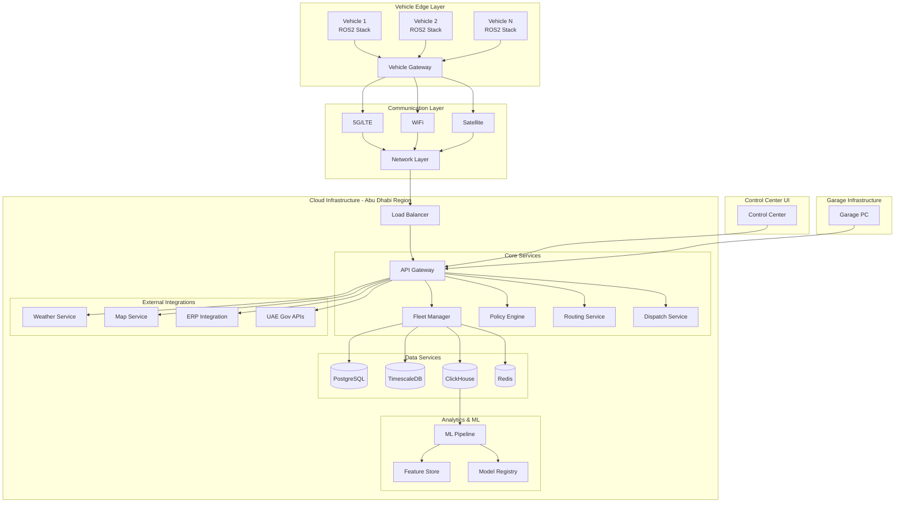
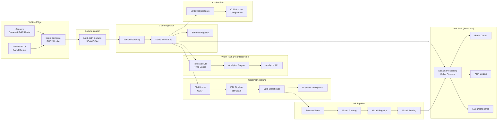
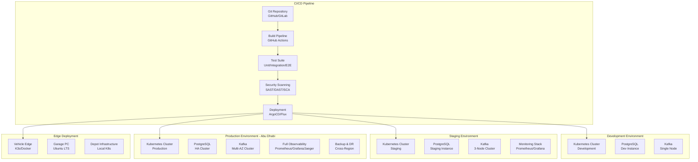

# Complete AtlasMesh Fleet OS Architecture
## Abu Dhabi Autonomous Vehicle Operations

**Document Version:** 2.0  
**Date:** December 2024  
**Classification:** Technical Architecture  
**Region:** Abu Dhabi, UAE

---

## 🏗️ **COMPLETE SYSTEM ARCHITECTURE**

### **High-Level System Overview**

### **Detailed Service Architecture**

```mermaid
graph TB
    subgraph "API Layer"
        AG[API Gateway<br/>Kong/Nginx]
        AG --> AUTH[Auth Service<br/>OAuth2/OIDC]
        AG --> RL[Rate Limiting]
        AG --> LOG[Request Logging]
    end
    
    subgraph "Core Platform Services"
        FM[Fleet Manager<br/>Go/gRPC]
        PE[Policy Engine<br/>OPA/Rego]
        VG[Vehicle Gateway<br/>Go/MQTT]
        RS[Routing Service<br/>Go/GraphHopper]
        DS[Dispatch Service<br/>Go/Optimization]
        SM[Safety Monitor<br/>Go/Rules Engine]
    end
    
    subgraph "Phase 2 Advanced Services"
        WF[Weather Fusion<br/>Multi-source ML]
        TI[Telemetry Ingestion<br/>Kafka/Stream]
        PM[Predictive Maintenance<br/>ML/RUL Models]
        GT[Garage Tools<br/>OTA/SBOM]
        KS[Key Management<br/>Vault/HSM]
        DT[Digital Twin<br/>CARLA/Gazebo]
    end
    
    subgraph "Data Storage Layer"
        PG[(PostgreSQL<br/>Transactional)]
        TS[(TimescaleDB<br/>Time Series)]
        CH[(ClickHouse<br/>Analytics)]
        MO[(MinIO<br/>Object Storage)]
        RD[(Redis<br/>Cache/Session)]
        NEO[(Neo4j<br/>Graph/Lineage)]
    end
    
    subgraph "Event & Messaging"
        KF[Kafka<br/>Event Bus]
        SR[Schema Registry<br/>Avro/Protobuf]
        KF --> SR
    end
    
    subgraph "Monitoring & Observability"
        PR[Prometheus<br/>Metrics]
        GR[Grafana<br/>Dashboards]
        JG[Jaeger<br/>Tracing]
        ELK[ELK Stack<br/>Logging]
    end
    
    subgraph "Security Layer"
        VT[Vault<br/>Secrets]
        SP[SPIFFE/SPIRE<br/>Identity]
        OPA[Open Policy Agent<br/>Authorization]
    end
    
    subgraph "External Systems"
        ADTA[ADTA APIs<br/>Traffic Management]
        WEATHER[Weather Providers<br/>AccuWeather/OpenWeather]
        MAPS[Map Providers<br/>HERE/Mapbox/OSM]
        ERP[ERP Systems<br/>SAP/Oracle]
        EMERGENCY[Emergency Services<br/>999/Police/Ambulance]
    end
    
    %% Core Service Connections
    FM --> PG
    FM --> TS
    FM --> RD
    PE --> PG
    PE --> OPA
    VG --> KF
    VG --> RD
    RS --> CH
    RS --> MAPS
    DS --> FM
    DS --> RS
    SM --> KF
    SM --> PE
    
    %% Phase 2 Service Connections
    WF --> CH
    WF --> WEATHER
    TI --> KF
    TI --> TS
    TI --> CH
    PM --> CH
    PM --> ML[ML Pipeline]
    GT --> MO
    GT --> VT
    KS --> VT
    KS --> SP
    DT --> CH
    DT --> ML
    
    %% Event Flow
    VG --> KF
    KF --> TI
    KF --> WF
    KF --> PM
    
    %% Monitoring Connections
    FM --> PR
    PE --> PR
    VG --> PR
    PR --> GR
    FM --> JG
    PE --> JG
    VG --> JG
    
    %% External Integrations
    RS --> ADTA
    WF --> WEATHER
    RS --> MAPS
    FM --> ERP
    SM --> EMERGENCY
```

### **Data Flow Architecture**

### **Security Architecture**

```mermaid
graph TB
    subgraph "Identity & Access"
        IDP[Identity Provider<br/>Keycloak/Auth0]
        RBAC[Role-Based Access<br/>Kubernetes RBAC]
        ABAC[Attribute-Based Access<br/>OPA Policies]
        
        IDP --> RBAC
        IDP --> ABAC
    end
    
    subgraph "Network Security"
        FW[Firewall<br/>Cloud Native]
        WAF[Web Application Firewall]
        NP[Network Policies<br/>Kubernetes]
        MTLS[mTLS<br/>Service Mesh]
        
        FW --> WAF
        WAF --> NP
        NP --> MTLS
    end
    
    subgraph "Data Protection"
        ENCRYPT[Encryption at Rest<br/>AES-256]
        TLS[Encryption in Transit<br/>TLS 1.3]
        VAULT[Secret Management<br/>HashiCorp Vault]
        DLP[Data Loss Prevention]
        
        ENCRYPT --> VAULT
        TLS --> VAULT
        VAULT --> DLP
    end
    
    subgraph "Monitoring & Response"
        SIEM[Security Information<br/>Event Management]
        IDS[Intrusion Detection<br/>Falco/Suricata]
        VULN[Vulnerability Scanning<br/>Trivy/Clair]
        IR[Incident Response<br/>PagerDuty/Opsgenie]
        
        SIEM --> IDS
        IDS --> VULN
        VULN --> IR
    end
    
    subgraph "Compliance"
        AUDIT[Audit Logging<br/>Immutable Trail]
        GDPR[GDPR Compliance<br/>Data Rights]
        UAE[UAE Data Residency<br/>Local Storage]
        ISO[ISO 27001<br/>Security Controls]
        
        AUDIT --> GDPR
        GDPR --> UAE
        UAE --> ISO
    end
```

### **Deployment Architecture**

### **Integration Architecture**

```mermaid
graph TB
    subgraph "AtlasMesh Core"
        CORE[AtlasMesh Fleet OS<br/>Core Platform]
    end
    
    subgraph "UAE Government Systems"
        ADTA[Abu Dhabi Transport Authority<br/>Traffic Management]
        POLICE[UAE Police<br/>Emergency Response]
        CUSTOMS[UAE Customs<br/>Border Control]
        HEALTH[Ministry of Health<br/>Emergency Medical]
    end
    
    subgraph "Enterprise Systems"
        SAP[SAP ERP<br/>Fleet Management]
        ORACLE[Oracle WMS<br/>Warehouse Management]
        MAXIMO[IBM Maximo<br/>Asset Management]
        SALESFORCE[Salesforce<br/>Customer Management]
    end
    
    subgraph "Map & Location Services"
        HERE[HERE Maps<br/>Navigation & Traffic]
        MAPBOX[Mapbox<br/>Visualization]
        OSM[OpenStreetMap<br/>Open Data]
        GOOGLE[Google Maps<br/>Geocoding]
    end
    
    subgraph "Weather & Environment"
        ACCUWEATHER[AccuWeather<br/>Forecasting]
        OPENWEATHER[OpenWeatherMap<br/>Real-time Data]
        NCMS[UAE NCMS<br/>National Weather]
        DUST[Dust Storm Alerts<br/>Regional Monitoring]
    end
    
    subgraph "Communication Providers"
        ETISALAT[Etisalat<br/>5G/LTE Network]
        DU[du<br/>Backup Connectivity]
        THURAYA[Thuraya<br/>Satellite Backup]
        WIFI[WiFi Providers<br/>Depot/Garage]
    end
    
    subgraph "Financial & Payment"
        ADCB[Abu Dhabi Commercial Bank<br/>Fleet Financing]
        EMIRATES_NBD[Emirates NBD<br/>Payment Processing]
        VISA[Visa/Mastercard<br/>Payment Gateway]
        BLOCKCHAIN[UAE Blockchain<br/>Smart Contracts]
    end
    
    %% Integration Connections
    CORE --> ADTA
    CORE --> POLICE
    CORE --> CUSTOMS
    CORE --> HEALTH
    
    CORE --> SAP
    CORE --> ORACLE
    CORE --> MAXIMO
    CORE --> SALESFORCE
    
    CORE --> HERE
    CORE --> MAPBOX
    CORE --> OSM
    CORE --> GOOGLE
    
    CORE --> ACCUWEATHER
    CORE --> OPENWEATHER
    CORE --> NCMS
    CORE --> DUST
    
    CORE --> ETISALAT
    CORE --> DU
    CORE --> THURAYA
    CORE --> WIFI
    
    CORE --> ADCB
    CORE --> EMIRATES_NBD
    CORE --> VISA
    CORE --> BLOCKCHAIN
```

---

## 🔧 **TECHNOLOGY STACK SUMMARY**

### **Frontend & UI**
- **Framework:** React 18 + TypeScript
- **Styling:** Tailwind CSS + Framer Motion
- **State Management:** Redux Toolkit + React Query
- **Maps:** OpenStreetMap + Google Maps (Abu Dhabi centered)
- **Testing:** Vitest + React Testing Library
- **Accessibility:** WCAG 2.2 AA compliant

### **Backend Services**
- **Languages:** Go (core services), Python (ML/analytics), TypeScript (APIs)
- **Communication:** gRPC (internal), REST (external), WebSocket (real-time)
- **Authentication:** OAuth 2.0 + OIDC, mTLS for service-to-service
- **API Gateway:** Kong or Nginx with rate limiting

### **Data Layer**
- **Transactional:** PostgreSQL 15+ with PostGIS
- **Time Series:** TimescaleDB (PostgreSQL extension)
- **Analytics:** ClickHouse (columnar OLAP)
- **Object Storage:** MinIO (S3-compatible)
- **Cache:** Redis Cluster
- **Graph:** Neo4j (data lineage)

### **Event & Messaging**
- **Event Bus:** Apache Kafka with Schema Registry
- **Protocols:** MQTT (vehicles), AMQP (internal), WebSocket (UI)
- **Serialization:** Avro (events), Protobuf (telemetry), JSON (APIs)

### **Infrastructure & Deployment**
- **Orchestration:** Kubernetes (cloud), K3s (edge)
- **Service Mesh:** Istio or Linkerd
- **CI/CD:** GitHub Actions + ArgoCD
- **Monitoring:** Prometheus + Grafana + Jaeger
- **Security:** HashiCorp Vault + SPIFFE/SPIRE

### **Machine Learning & Analytics**
- **ML Framework:** TensorFlow/PyTorch + MLflow
- **Feature Store:** Feast or custom solution
- **Data Processing:** Apache Spark + dbt
- **Notebooks:** Jupyter + MLflow tracking

---

## 📍 **ABU DHABI SPECIFIC ADAPTATIONS**

### **Environmental Considerations**
- **Temperature:** -40°C to +85°C operational range
- **Dust Protection:** IP67 rated components
- **Sandstorm Detection:** Automated visibility monitoring
- **Heat Mitigation:** Active cooling systems

### **Regulatory Compliance**
- **ADTA Integration:** Real-time traffic management
- **UAE Data Residency:** All PII stored locally
- **Islamic Calendar:** Ramadan/Eid operational adjustments
- **Arabic Localization:** RTL UI support

### **Network Infrastructure**
- **Primary:** Etisalat 5G network
- **Backup:** du LTE connectivity
- **Satellite:** Thuraya for remote areas
- **Edge:** Local WiFi in depots/garages

---

## 🔄 **DATA FLOW PATTERNS**

### **Real-time Telemetry (Hot Path)**
1. Vehicle sensors → Edge computer (ROS2)
2. Edge → Multi-path comms (5G/WiFi/Sat)
3. Vehicle Gateway → Kafka event bus
4. Stream processing → Redis cache
5. Live dashboards + alerts

### **Analytics Pipeline (Warm Path)**
1. Kafka → TimescaleDB ingestion
2. Aggregation → ClickHouse OLAP
3. dbt transformations → Data marts
4. Analytics API → Business intelligence

### **Compliance Archive (Cold Path)**
1. All events → MinIO object storage
2. Compression + encryption
3. Long-term retention (7+ years)
4. Audit trail preservation

---

## 🛡️ **SECURITY & COMPLIANCE FRAMEWORK**

### **Zero-Trust Architecture**
- **Identity:** SPIFFE/SPIRE for service identity
- **Network:** mTLS for all service communication
- **Data:** Encryption at rest and in transit
- **Access:** RBAC + ABAC with OPA policies

### **Compliance Standards**
- **ISO 27001:** Information security management
- **SOC 2 Type II:** Service organization controls
- **UAE Data Protection:** Local data residency
- **GDPR Equivalent:** Privacy by design

### **Audit & Evidence**
- **Immutable Logs:** Cryptographically signed
- **Evidence Bundles:** Automated generation
- **Compliance Reports:** Real-time monitoring
- **Incident Response:** 24/7 SOC coverage

---

This comprehensive architecture supports AtlasMesh Fleet OS as a production-ready, scalable, and compliant autonomous vehicle fleet management platform specifically designed for Abu Dhabi's unique operational requirements.
