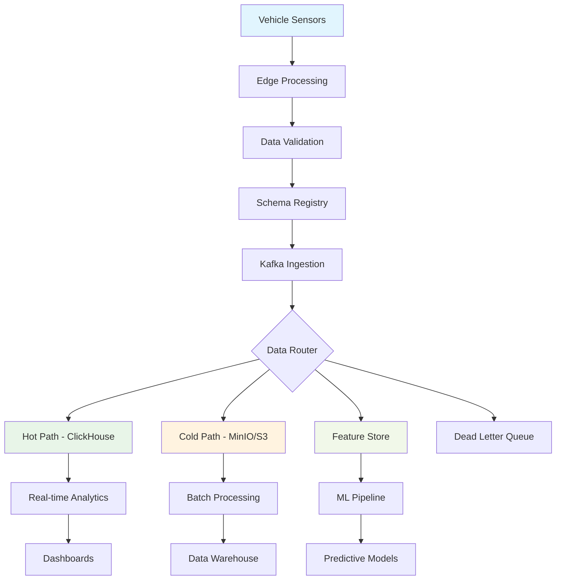

# AtlasMesh Fleet OS — Telemetry Dictionary

## 1) Overview

This document provides a comprehensive dictionary of all telemetry data points, metrics, events, and signals collected, processed, and analyzed within the AtlasMesh Fleet OS. This serves as the single source of truth for understanding telemetry semantics, data types, collection frequencies, and business context.

## 2) Telemetry Data Classification

### 2.1 Data Categories

| Category | Description | Retention | Privacy Level |
|----------|-------------|-----------|---------------|
| **Vehicle State** | Real-time operational status and position | 90 days hot, 7 years cold | Internal |
| **Performance Metrics** | System and component performance data | 30 days hot, 2 years cold | Internal |
| **Safety Events** | Safety-critical incidents and alerts | 10 years | Restricted |
| **Diagnostic Data** | Component health and fault information | 5 years | Internal |
| **Environmental** | Weather, road, and ambient conditions | 1 year | Public |
| **Mission Data** | Trip and task execution information | 7 years | Confidential |
| **Security Events** | Authentication, authorization, and security incidents | 10 years | Restricted |
| **Business Metrics** | KPIs, SLAs, and operational efficiency | 7 years | Confidential |

## 3) Core Vehicle Telemetry

### 3.1 Position & Navigation

```yaml
# GPS/GNSS Position Data
vehicle.position:
  description: "Primary vehicle location from GNSS receiver"
  data_type: "geometry_point"
  units: "WGS84 decimal degrees"
  frequency: "10 Hz"
  accuracy: "±2.5m CEP"
  fields:
    latitude:
      type: "float64"
      range: [-90.0, 90.0]
      precision: 8
    longitude:
      type: "float64" 
      range: [-180.0, 180.0]
      precision: 8
    altitude_msl:
      type: "float32"
      units: "meters"
      range: [-500.0, 9000.0]
    heading_true:
      type: "float32"
      units: "degrees"
      range: [0.0, 360.0]
    speed_over_ground:
      type: "float32"
      units: "m/s"
      range: [0.0, 100.0]
    hdop:
      type: "float32"
      description: "Horizontal Dilution of Precision"
      range: [0.5, 50.0]
    satellites_used:
      type: "uint8"
      range: [0, 32]
    fix_quality:
      type: "enum"
      values: ["no_fix", "gps", "dgps", "rtk_float", "rtk_fixed"]

# Inertial Navigation System
vehicle.ins:
  description: "Inertial navigation and orientation data"
  frequency: "100 Hz"
  fields:
    acceleration_x:
      type: "float32"
      units: "m/s²"
      range: [-50.0, 50.0]
    acceleration_y:
      type: "float32"
      units: "m/s²"
      range: [-50.0, 50.0]
    acceleration_z:
      type: "float32"
      units: "m/s²"
      range: [-50.0, 50.0]
    angular_velocity_x:
      type: "float32"
      units: "rad/s"
      range: [-10.0, 10.0]
    angular_velocity_y:
      type: "float32"
      units: "rad/s"
      range: [-10.0, 10.0]
    angular_velocity_z:
      type: "float32"
      units: "rad/s"
      range: [-10.0, 10.0]
    roll:
      type: "float32"
      units: "degrees"
      range: [-180.0, 180.0]
    pitch:
      type: "float32"
      units: "degrees"
      range: [-90.0, 90.0]
    yaw:
      type: "float32"
      units: "degrees"
      range: [0.0, 360.0]
```

### 3.2 Vehicle Dynamics

```yaml
# Vehicle Motion and Control
vehicle.dynamics:
  description: "Vehicle motion, control inputs, and dynamic state"
  frequency: "50 Hz"
  fields:
    speed_kmh:
      type: "float32"
      units: "km/h"
      range: [0.0, 300.0]
      description: "Vehicle ground speed"
    steering_angle:
      type: "float32"
      units: "degrees"
      range: [-45.0, 45.0]
      description: "Front wheel steering angle"
    throttle_position:
      type: "float32"
      units: "percent"
      range: [0.0, 100.0]
    brake_pressure:
      type: "float32"
      units: "bar"
      range: [0.0, 200.0]
    gear_position:
      type: "enum"
      values: ["park", "reverse", "neutral", "drive", "low", "manual_1", "manual_2", "manual_3", "manual_4", "manual_5", "manual_6"]
    engine_rpm:
      type: "uint16"
      units: "rpm"
      range: [0, 8000]
    wheel_speed_fl:
      type: "float32"
      units: "rad/s"
      description: "Front left wheel speed"
    wheel_speed_fr:
      type: "float32"
      units: "rad/s"
      description: "Front right wheel speed"
    wheel_speed_rl:
      type: "float32"
      units: "rad/s"
      description: "Rear left wheel speed"
    wheel_speed_rr:
      type: "float32"
      units: "rad/s"
      description: "Rear right wheel speed"
```

### 3.3 Power & Energy Systems

```yaml
# Battery and Energy Management
vehicle.power:
  description: "Battery, fuel, and energy system telemetry"
  frequency: "1 Hz"
  fields:
    battery_voltage:
      type: "float32"
      units: "volts"
      range: [10.0, 60.0]
    battery_current:
      type: "float32"
      units: "amperes"
      range: [-500.0, 500.0]
    battery_soc:
      type: "float32"
      units: "percent"
      range: [0.0, 100.0]
      description: "State of Charge"
    battery_soh:
      type: "float32"
      units: "percent"
      range: [0.0, 100.0]
      description: "State of Health"
    battery_temperature:
      type: "float32"
      units: "celsius"
      range: [-40.0, 80.0]
    fuel_level:
      type: "float32"
      units: "percent"
      range: [0.0, 100.0]
    fuel_consumption_rate:
      type: "float32"
      units: "L/100km"
      range: [0.0, 100.0]
    charging_status:
      type: "enum"
      values: ["not_charging", "ac_charging", "dc_fast_charging", "wireless_charging"]
    charging_power:
      type: "float32"
      units: "kW"
      range: [0.0, 350.0]
    range_remaining:
      type: "float32"
      units: "kilometers"
      range: [0.0, 2000.0]
```

## 4) Sensor Systems Telemetry

### 4.1 Camera Systems

```yaml
# Camera and Vision Systems
vehicle.sensors.cameras:
  description: "Camera system status and metadata"
  frequency: "1 Hz"
  fields:
    front_camera_status:
      type: "enum"
      values: ["active", "inactive", "fault", "blocked", "calibrating"]
    rear_camera_status:
      type: "enum"
      values: ["active", "inactive", "fault", "blocked", "calibrating"]
    left_camera_status:
      type: "enum"
      values: ["active", "inactive", "fault", "blocked", "calibrating"]
    right_camera_status:
      type: "enum"
      values: ["active", "inactive", "fault", "blocked", "calibrating"]
    camera_temperature:
      type: "float32"
      units: "celsius"
      range: [-40.0, 85.0]
    image_quality_score:
      type: "float32"
      range: [0.0, 1.0]
      description: "Normalized image quality metric"
    objects_detected:
      type: "uint16"
      range: [0, 1000]
      description: "Number of objects detected in current frame"
    lane_detection_confidence:
      type: "float32"
      range: [0.0, 1.0]
```

### 4.2 LiDAR Systems

```yaml
# LiDAR Point Cloud Systems
vehicle.sensors.lidar:
  description: "LiDAR system operational telemetry"
  frequency: "10 Hz"
  fields:
    lidar_status:
      type: "enum"
      values: ["active", "inactive", "fault", "degraded", "calibrating"]
    rotation_speed:
      type: "float32"
      units: "rpm"
      range: [300, 1200]
    points_per_second:
      type: "uint32"
      range: [100000, 2000000]
    range_accuracy:
      type: "float32"
      units: "centimeters"
      range: [1.0, 10.0]
    laser_temperature:
      type: "float32"
      units: "celsius"
      range: [-40.0, 85.0]
    point_cloud_density:
      type: "float32"
      units: "points/m²"
      range: [10.0, 10000.0]
    interference_detected:
      type: "boolean"
      description: "Other LiDAR interference detected"
```

### 4.3 Radar Systems

```yaml
# Radar Detection Systems
vehicle.sensors.radar:
  description: "Radar system operational status and detections"
  frequency: "20 Hz"
  fields:
    front_radar_status:
      type: "enum"
      values: ["active", "inactive", "fault", "blocked", "calibrating"]
    rear_radar_status:
      type: "enum"
      values: ["active", "inactive", "fault", "blocked", "calibrating"]
    side_radar_left_status:
      type: "enum"
      values: ["active", "inactive", "fault", "blocked", "calibrating"]
    side_radar_right_status:
      type: "enum"
      values: ["active", "inactive", "fault", "blocked", "calibrating"]
    targets_tracked:
      type: "uint8"
      range: [0, 64]
      description: "Number of radar targets being tracked"
    max_detection_range:
      type: "float32"
      units: "meters"
      range: [50.0, 300.0]
    doppler_resolution:
      type: "float32"
      units: "m/s"
      range: [0.1, 2.0]
```

## 5) Environmental Telemetry

### 5.1 Weather Conditions

```yaml
# Environmental and Weather Data
vehicle.environment.weather:
  description: "Local weather conditions affecting vehicle operation"
  frequency: "0.1 Hz"  # Every 10 seconds
  fields:
    ambient_temperature:
      type: "float32"
      units: "celsius"
      range: [-50.0, 60.0]
    humidity:
      type: "float32"
      units: "percent"
      range: [0.0, 100.0]
    atmospheric_pressure:
      type: "float32"
      units: "hPa"
      range: [800.0, 1100.0]
    wind_speed:
      type: "float32"
      units: "m/s"
      range: [0.0, 50.0]
    wind_direction:
      type: "float32"
      units: "degrees"
      range: [0.0, 360.0]
    precipitation_rate:
      type: "float32"
      units: "mm/h"
      range: [0.0, 100.0]
    precipitation_type:
      type: "enum"
      values: ["none", "rain", "snow", "sleet", "hail"]
    visibility:
      type: "float32"
      units: "meters"
      range: [1.0, 50000.0]
    uv_index:
      type: "float32"
      range: [0.0, 15.0]
```

### 5.2 Road Conditions

```yaml
# Road Surface and Traffic Conditions
vehicle.environment.road:
  description: "Road surface conditions and traffic environment"
  frequency: "1 Hz"
  fields:
    road_surface_type:
      type: "enum"
      values: ["asphalt", "concrete", "gravel", "dirt", "sand", "snow", "ice"]
    road_surface_condition:
      type: "enum"
      values: ["dry", "wet", "icy", "snowy", "muddy", "flooded"]
    road_friction_coefficient:
      type: "float32"
      range: [0.1, 1.0]
      description: "Estimated road friction coefficient"
    traffic_density:
      type: "enum"
      values: ["free_flow", "light", "moderate", "heavy", "congested"]
    construction_zone:
      type: "boolean"
      description: "Vehicle is in construction zone"
    school_zone:
      type: "boolean"
      description: "Vehicle is in school zone"
    speed_limit:
      type: "uint8"
      units: "km/h"
      range: [5, 200]
```

## 6) System Performance Telemetry

### 6.1 Compute Resources

```yaml
# System Resource Utilization
vehicle.system.compute:
  description: "Onboard computing system performance metrics"
  frequency: "1 Hz"
  fields:
    cpu_usage_percent:
      type: "float32"
      range: [0.0, 100.0]
      description: "Overall CPU utilization"
    memory_usage_percent:
      type: "float32"
      range: [0.0, 100.0]
      description: "RAM utilization"
    disk_usage_percent:
      type: "float32"
      range: [0.0, 100.0]
      description: "Storage utilization"
    gpu_usage_percent:
      type: "float32"
      range: [0.0, 100.0]
      description: "GPU utilization for AI processing"
    cpu_temperature:
      type: "float32"
      units: "celsius"
      range: [20.0, 100.0]
    gpu_temperature:
      type: "float32"
      units: "celsius"
      range: [20.0, 100.0]
    network_latency_ms:
      type: "float32"
      units: "milliseconds"
      range: [1.0, 5000.0]
    network_bandwidth_mbps:
      type: "float32"
      units: "Mbps"
      range: [0.1, 1000.0]
```

### 6.2 Communication Systems

```yaml
# Communication and Connectivity
vehicle.system.comms:
  description: "Communication system status and performance"
  frequency: "1 Hz"
  fields:
    cellular_signal_strength:
      type: "int8"
      units: "dBm"
      range: [-120, -50]
    cellular_technology:
      type: "enum"
      values: ["2G", "3G", "4G_LTE", "5G_NSA", "5G_SA"]
    wifi_connected:
      type: "boolean"
    wifi_signal_strength:
      type: "int8"
      units: "dBm"
      range: [-100, -30]
    satellite_connected:
      type: "boolean"
      description: "Satellite communication available"
    v2x_active:
      type: "boolean"
      description: "Vehicle-to-Everything communication active"
    data_usage_mb:
      type: "float32"
      units: "megabytes"
      description: "Data usage in current session"
```

## 7) Mission & Operational Telemetry

### 7.1 Trip Execution

```yaml
# Trip and Mission Data
vehicle.mission.trip:
  description: "Current trip execution status and metrics"
  frequency: "1 Hz"
  fields:
    trip_id:
      type: "uuid"
      description: "Unique trip identifier"
    trip_status:
      type: "enum"
      values: ["planned", "dispatched", "en_route", "arrived", "loading", "unloading", "completed", "cancelled", "emergency"]
    route_id:
      type: "uuid"
      description: "Current route identifier"
    waypoint_current:
      type: "uint16"
      description: "Current waypoint index"
    waypoint_total:
      type: "uint16"
      description: "Total waypoints in route"
    distance_to_destination:
      type: "float32"
      units: "meters"
      range: [0.0, 1000000.0]
    estimated_time_arrival:
      type: "timestamp"
      description: "ISO 8601 timestamp"
    progress_percent:
      type: "float32"
      range: [0.0, 100.0]
      description: "Trip completion percentage"
    deviation_from_route:
      type: "float32"
      units: "meters"
      range: [0.0, 1000.0]
      description: "Distance from planned route"
```

### 7.2 Cargo & Payload

```yaml
# Cargo and Payload Management
vehicle.mission.cargo:
  description: "Cargo status and payload information"
  frequency: "0.1 Hz"  # Every 10 seconds
  fields:
    payload_weight:
      type: "float32"
      units: "kilograms"
      range: [0.0, 50000.0]
    payload_volume:
      type: "float32"
      units: "cubic_meters"
      range: [0.0, 100.0]
    cargo_secured:
      type: "boolean"
      description: "Cargo properly secured"
    door_status:
      type: "enum"
      values: ["closed", "open", "partially_open", "fault"]
    temperature_controlled:
      type: "boolean"
      description: "Refrigerated cargo"
    cargo_temperature:
      type: "float32"
      units: "celsius"
      range: [-30.0, 50.0]
    hazmat_present:
      type: "boolean"
      description: "Hazardous materials onboard"
    hazmat_class:
      type: "string"
      description: "UN hazmat classification if present"
```

## 8) Safety & Security Telemetry

### 8.1 Safety Systems

```yaml
# Safety System Status
vehicle.safety.systems:
  description: "Safety-critical system status and alerts"
  frequency: "10 Hz"
  fields:
    emergency_stop_active:
      type: "boolean"
      description: "Emergency stop engaged"
    collision_imminent:
      type: "boolean"
      description: "Collision detection system alert"
    autonomous_mode_active:
      type: "boolean"
      description: "Vehicle in autonomous mode"
    manual_override_active:
      type: "boolean"
      description: "Human operator override engaged"
    safety_driver_present:
      type: "boolean"
      description: "Safety driver detected in vehicle"
    seatbelt_status:
      type: "boolean"
      description: "Driver seatbelt fastened"
    airbag_status:
      type: "enum"
      values: ["armed", "deployed", "fault"]
    abs_active:
      type: "boolean"
      description: "Anti-lock braking system active"
    traction_control_active:
      type: "boolean"
      description: "Traction control system active"
    stability_control_active:
      type: "boolean"
      description: "Electronic stability control active"
```

### 8.2 Security Events

```yaml
# Security and Intrusion Detection
vehicle.security.events:
  description: "Security events and intrusion detection"
  frequency: "event_driven"
  fields:
    unauthorized_access_attempt:
      type: "boolean"
      description: "Unauthorized access detected"
    tamper_detected:
      type: "boolean"
      description: "Physical tampering detected"
    cyber_attack_detected:
      type: "boolean"
      description: "Cybersecurity threat detected"
    certificate_expired:
      type: "boolean"
      description: "Security certificate expired"
    encryption_failure:
      type: "boolean"
      description: "Encryption/decryption failure"
    geofence_violation:
      type: "boolean"
      description: "Vehicle outside authorized area"
    speed_violation:
      type: "boolean"
      description: "Speed limit violation"
    route_deviation:
      type: "boolean"
      description: "Unauthorized route deviation"
```

## 9) Diagnostic & Maintenance Telemetry

### 9.1 Component Health

```yaml
# Component Health Monitoring
vehicle.diagnostics.health:
  description: "Component health and predictive maintenance data"
  frequency: "1 Hz"
  fields:
    engine_health_score:
      type: "float32"
      range: [0.0, 1.0]
      description: "Normalized engine health score"
    transmission_health_score:
      type: "float32"
      range: [0.0, 1.0]
    brake_health_score:
      type: "float32"
      range: [0.0, 1.0]
    suspension_health_score:
      type: "float32"
      range: [0.0, 1.0]
    tire_health_score:
      type: "float32"
      range: [0.0, 1.0]
    battery_health_score:
      type: "float32"
      range: [0.0, 1.0]
    sensor_health_score:
      type: "float32"
      range: [0.0, 1.0]
    compute_health_score:
      type: "float32"
      range: [0.0, 1.0]
    overall_health_score:
      type: "float32"
      range: [0.0, 1.0]
      description: "Aggregate vehicle health score"
```

### 9.2 Fault Codes & Alerts

```yaml
# Diagnostic Trouble Codes
vehicle.diagnostics.faults:
  description: "Active fault codes and diagnostic information"
  frequency: "event_driven"
  fields:
    active_fault_codes:
      type: "array"
      items:
        type: "string"
        pattern: "^[A-Z][0-9]{4}$"
      description: "ISO 14229 diagnostic trouble codes"
    fault_severity:
      type: "enum"
      values: ["info", "warning", "error", "critical"]
    fault_category:
      type: "enum"
      values: ["powertrain", "chassis", "body", "network", "sensor", "safety"]
    maintenance_due:
      type: "boolean"
      description: "Scheduled maintenance due"
    maintenance_overdue:
      type: "boolean"
      description: "Scheduled maintenance overdue"
    estimated_repair_time:
      type: "float32"
      units: "hours"
      range: [0.1, 100.0]
    repair_urgency:
      type: "enum"
      values: ["low", "medium", "high", "critical"]
```

## 10) Business Intelligence Telemetry

### 10.1 Operational KPIs

```yaml
# Key Performance Indicators
vehicle.kpis.operational:
  description: "Business and operational key performance indicators"
  frequency: "0.01 Hz"  # Every 100 seconds
  fields:
    utilization_rate:
      type: "float32"
      range: [0.0, 1.0]
      description: "Vehicle utilization rate"
    fuel_efficiency:
      type: "float32"
      units: "km/L"
      range: [1.0, 50.0]
    on_time_performance:
      type: "float32"
      range: [0.0, 1.0]
      description: "Percentage of on-time deliveries"
    customer_satisfaction_score:
      type: "float32"
      range: [1.0, 5.0]
    revenue_per_km:
      type: "float32"
      units: "currency/km"
      range: [0.0, 100.0]
    cost_per_km:
      type: "float32"
      units: "currency/km"
      range: [0.0, 50.0]
    safety_incidents_per_1000km:
      type: "float32"
      range: [0.0, 10.0]
```

## 11) Telemetry Data Quality Metrics

### 11.1 Data Quality Indicators

```yaml
# Data Quality and Completeness
telemetry.quality:
  description: "Telemetry data quality and reliability metrics"
  frequency: "1 Hz"
  fields:
    data_completeness_percent:
      type: "float32"
      range: [0.0, 100.0]
      description: "Percentage of expected data points received"
    data_latency_ms:
      type: "float32"
      units: "milliseconds"
      range: [1.0, 10000.0]
      description: "End-to-end data latency"
    packet_loss_percent:
      type: "float32"
      range: [0.0, 100.0]
      description: "Telemetry packet loss rate"
    schema_validation_errors:
      type: "uint32"
      description: "Number of schema validation failures"
    duplicate_messages:
      type: "uint32"
      description: "Number of duplicate messages detected"
    out_of_order_messages:
      type: "uint32"
      description: "Number of out-of-sequence messages"
```

## 12) Sector-Specific Telemetry Extensions

### 12.1 Defense Sector

```yaml
# Defense-Specific Telemetry
vehicle.defense:
  description: "Defense sector specific telemetry data"
  frequency: "varies"
  fields:
    mission_classification:
      type: "enum"
      values: ["unclassified", "confidential", "secret", "top_secret"]
    threat_level:
      type: "enum"
      values: ["green", "yellow", "orange", "red"]
    jamming_detected:
      type: "boolean"
      description: "Electronic jamming detected"
    iff_status:
      type: "enum"
      values: ["friend", "foe", "unknown", "neutral"]
      description: "Identification Friend or Foe status"
    armor_integrity:
      type: "float32"
      range: [0.0, 1.0]
      description: "Armor integrity percentage"
```

### 12.2 Mining Sector

```yaml
# Mining-Specific Telemetry
vehicle.mining:
  description: "Mining sector specific telemetry data"
  frequency: "varies"
  fields:
    load_weight:
      type: "float32"
      units: "tonnes"
      range: [0.0, 500.0]
    material_type:
      type: "enum"
      values: ["ore", "overburden", "coal", "aggregate", "empty"]
    dust_concentration:
      type: "float32"
      units: "mg/m³"
      range: [0.0, 1000.0]
    gas_detection:
      type: "object"
      properties:
        methane_ppm:
          type: "float32"
          range: [0.0, 10000.0]
        carbon_monoxide_ppm:
          type: "float32"
          range: [0.0, 1000.0]
        hydrogen_sulfide_ppm:
          type: "float32"
          range: [0.0, 100.0]
    vibration_level:
      type: "float32"
      units: "g"
      range: [0.0, 20.0]
    slope_angle:
      type: "float32"
      units: "degrees"
      range: [0.0, 45.0]
```

### 12.3 Logistics Sector

```yaml
# Logistics-Specific Telemetry
vehicle.logistics:
  description: "Logistics sector specific telemetry data"
  frequency: "varies"
  fields:
    delivery_status:
      type: "enum"
      values: ["picked_up", "in_transit", "out_for_delivery", "delivered", "failed_delivery"]
    package_count:
      type: "uint16"
      range: [0, 10000]
    delivery_window_compliance:
      type: "boolean"
      description: "Delivery within promised time window"
    customer_signature_required:
      type: "boolean"
    proof_of_delivery:
      type: "enum"
      values: ["signature", "photo", "geolocation", "recipient_id"]
    warehouse_dock_time:
      type: "float32"
      units: "minutes"
      range: [0.0, 480.0]
    sorting_facility_id:
      type: "string"
      description: "Current sorting facility identifier"
```

### 12.4 Ride-Hail Sector

```yaml
# Ride-Hail Specific Telemetry
vehicle.ridehail:
  description: "Ride-hail sector specific telemetry data"
  frequency: "varies"
  fields:
    passenger_count:
      type: "uint8"
      range: [0, 8]
    trip_rating:
      type: "float32"
      range: [1.0, 5.0]
      description: "Passenger trip rating"
    comfort_score:
      type: "float32"
      range: [0.0, 1.0]
      description: "Ride comfort metric"
    cleanliness_score:
      type: "float32"
      range: [0.0, 1.0]
    accessibility_features_active:
      type: "boolean"
      description: "Wheelchair accessibility engaged"
    child_safety_seat:
      type: "boolean"
      description: "Child safety seat installed"
    ambient_temperature_cabin:
      type: "float32"
      units: "celsius"
      range: [15.0, 30.0]
    music_volume_level:
      type: "uint8"
      range: [0, 100]
    privacy_partition_status:
      type: "enum"
      values: ["up", "down", "not_available"]
```

## 13) Telemetry Processing Pipeline

### 13.1 Data Flow Architecture



### 13.2 Data Retention Policies

| Data Category | Hot Storage | Cold Storage | Archive | Purge |
|---------------|-------------|--------------|---------|-------|
| **Real-time Telemetry** | 7 days | 90 days | 2 years | 7 years |
| **Safety Events** | 30 days | 1 year | 5 years | 10 years |
| **Diagnostic Data** | 14 days | 6 months | 2 years | 5 years |
| **Business Metrics** | 30 days | 1 year | 3 years | 7 years |
| **Environmental Data** | 3 days | 30 days | 1 year | 2 years |
| **Security Events** | 90 days | 1 year | 5 years | 10 years |

## 14) Telemetry API Endpoints

### 14.1 Ingestion APIs

```yaml
# Telemetry Ingestion Endpoints
POST /v2/telemetry/ingest:
  description: "Batch telemetry ingestion"
  rate_limit: "10,000 requests/minute per vehicle"
  payload_limit: "1MB per request"
  
POST /v2/telemetry/stream:
  description: "Real-time telemetry streaming (WebSocket)"
  rate_limit: "Unlimited for authenticated vehicles"
  
GET /v2/telemetry/schema/{schema_id}:
  description: "Retrieve telemetry schema definition"
  
POST /v2/telemetry/validate:
  description: "Validate telemetry payload against schema"
```

### 14.2 Query APIs

```yaml
# Telemetry Query Endpoints
GET /v2/telemetry/vehicle/{vehicle_id}:
  description: "Get latest telemetry for specific vehicle"
  parameters:
    - name: "fields"
      description: "Comma-separated list of fields to return"
    - name: "time_range"
      description: "ISO 8601 time range (e.g., PT1H for last hour)"
      
GET /v2/telemetry/fleet/{fleet_id}/aggregate:
  description: "Get aggregated telemetry for fleet"
  parameters:
    - name: "metric"
      description: "Aggregation metric (avg, min, max, sum, count)"
    - name: "group_by"
      description: "Grouping dimension (vehicle, time, location)"
      
GET /v2/telemetry/alerts:
  description: "Get active telemetry-based alerts"
  parameters:
    - name: "severity"
      description: "Filter by alert severity"
    - name: "category"
      description: "Filter by alert category"
```

This comprehensive telemetry dictionary serves as the definitive reference for all data points within the AtlasMesh Fleet OS, ensuring consistent understanding and implementation across all system components.
