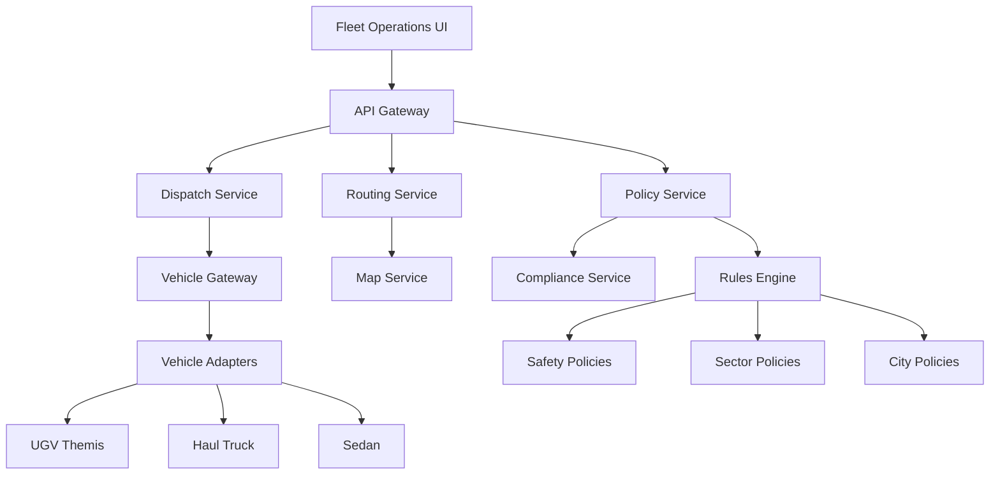

# AtlasMesh Fleet Operating System

Welcome to the AtlasMesh Fleet OS documentation - your comprehensive guide to deploying and operating **vehicle-agnostic, platform-agnostic, sector-agnostic L4 autonomous fleet management systems**.

## 🎯 What is AtlasMesh Fleet OS?

AtlasMesh Fleet OS is a unified **Fleet Management System (FMS) + AV retrofit kit** designed specifically for extreme Middle East operating conditions. It enables L4 autonomous operations across multiple sectors without requiring vehicle-specific code changes.

### Core Capabilities

=== "Multi-Sector Support"
    - **Defense**: Convoy operations, tactical missions, secure base logistics
    - **Mining**: Haul trucks, equipment coordination, safety protocols  
    - **Logistics**: Port operations, last-mile delivery, warehouse automation
    - **Ride-hailing**: Urban transport, passenger service, fleet optimization

=== "Extreme Weather Ready"
    - **55°C desert operations** with thermal derating
    - **Dust storm protocols** with sensor degradation handling
    - **Sand/salt corrosion resistance** for coastal operations
    - **Intermittent connectivity** with offline capability

=== "Vehicle Agnostic"
    - **Retrofit approach** works with existing fleets
    - **Capability manifests** define what each vehicle can do
    - **Adapter SDK** for seamless integration
    - **No vehicle-specific code** in core platform

## 🏗️ System Architecture



## 🚀 Quick Start

### Prerequisites

- **Docker** 24.0+ and **Kubernetes** 1.28+
- **Node.js** 18+ and **npm** 9+
- **Middle East deployment region** (UAE, Saudi Arabia, Qatar)

### 1. Clone and Setup

```bash
git clone https://github.com/atlasmesh/fleet-os.git
cd fleet-os
make setup
```

### 2. Start Development Environment

```bash
make dev
```

This starts:
- **Fleet Operations UI**: http://localhost:3000
- **Control Center**: http://localhost:3001  
- **API Gateway**: http://localhost:8080
- **Simulation Environment**: http://localhost:8090

### 3. Configure Your Fleet

1. **Define vehicle capabilities** in `configs/vehicles/`
2. **Set sector policies** in `rules/policy/sector/`
3. **Configure city operations** in `configs/cities/`

## 📋 Documentation Structure

### Strategy & Planning
Get familiar with the business model, market positioning, and implementation roadmap.

[:material-strategy: Strategy Docs](strategy/01_executive_summary_and_vision.md){ .md-button .md-button--primary }

### Technical Implementation  
Deep dive into architecture, APIs, security, and development processes.

[:material-code-braces: Technical Docs](technical/01_architecture.md){ .md-button }

### Sector Specialization
Learn how to configure the platform for different industry sectors.

[:material-factory: Sector Packs](sector-packs/defense.md){ .md-button }

### Vehicle Integration
Integrate new vehicle types using the adapter SDK and capability manifests.

[:material-car: Vehicle Integration](vehicle-packs/ugv_themis.md){ .md-button }

### Safety & Compliance
Understand safety cases, regulatory compliance, and audit requirements.

[:material-shield-check: Safety & Compliance](safety/README.md){ .md-button }

### Operations
Production deployment guides, troubleshooting, and operational procedures.

[:material-cog: Operations Guide](runbooks/README.md){ .md-button }

## 🌟 Key Features

### Intelligent Fleet Management

- **Multi-objective dispatch** balancing safety, efficiency, and customer SLAs
- **Real-time optimization** with traffic, weather, and energy constraints
- **Predictive maintenance** preventing unexpected downtime
- **Energy optimization** for mixed EV/hybrid/diesel fleets

### Extreme Conditions Handling

- **Weather data fusion** from multiple providers
- **Automatic degradation** when conditions exceed safety thresholds  
- **Thermal management** with speed/route derating at high temperatures
- **Dust/sand mode** with enhanced sensor cleaning and conservative planning

### Policy-Driven Operations

- **Precedence hierarchy**: Safety > Law > Tenant > Sector > City > Fleet
- **Rules as code** with automated testing and deployment
- **ODD enforcement** preventing operations outside safe boundaries
- **Compliance automation** with audit trail generation

### Safety & Security

- **ISO 26262/21448** functional safety compliance
- **UNECE R155/R156** cybersecurity standards
- **PKI-based authentication** for all vehicle communications
- **Tamper-evident OTA updates** with automatic rollback

## 📊 Supported Metrics

Track performance across multiple dimensions:

| Metric Category | Examples |
| --- | --- |
| **Safety** | Incidents per million km, Near-miss rate, Emergency stops |
| **Efficiency** | Trip completion rate, ETA accuracy, Fuel/energy efficiency |
| **Availability** | Vehicle uptime, Service availability, Maintenance scheduling |
| **Customer** | On-time performance, Customer satisfaction, Response time |

## 🔗 Quick Links

- [**Architecture Overview**](technical/01_architecture.md) - System design and service breakdown
- [**API Documentation**](technical/09_api_documentation.md) - REST and GraphQL API reference  
- [**Vehicle Integration Guide**](technical/11_integration_and_contribution_guidelines.md) - Add your vehicles
- [**Deployment Guide**](runbooks/deployment.md) - Production deployment procedures
- [**Troubleshooting**](runbooks/troubleshooting.md) - Common issues and solutions

## 🎯 Next Steps

1. **Read the [Executive Summary](strategy/01_executive_summary_and_vision.md)** to understand the business vision
2. **Review [Architecture](technical/01_architecture.md)** to understand the technical approach  
3. **Explore [Sector Packs](sector-packs/defense.md)** to see industry-specific configurations
4. **Try the [Quick Start Tutorial](runbooks/quick_start.md)** with sample data

---

**Questions?** Reach out to our team at [team@atlasmesh.ai](mailto:team@atlasmesh.ai)
