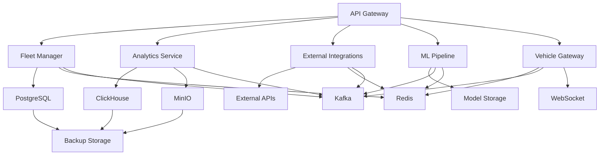

# AtlasMesh Fleet OS Operations Runbook

## Overview

This runbook provides comprehensive operational procedures for managing the AtlasMesh Fleet OS platform. It covers deployment, monitoring, troubleshooting, maintenance, and emergency procedures.

## Table of Contents

1. [System Architecture](#system-architecture)
2. [Deployment Procedures](#deployment-procedures)
3. [Monitoring and Alerting](#monitoring-and-alerting)
4. [Troubleshooting Guide](#troubleshooting-guide)
5. [Maintenance Procedures](#maintenance-procedures)
6. [Emergency Procedures](#emergency-procedures)
7. [Security Procedures](#security-procedures)
8. [Backup and Recovery](#backup-and-recovery)
9. [Performance Optimization](#performance-optimization)
10. [Disaster Recovery](#disaster-recovery)

## System Architecture

### Core Components

```
┌─────────────────────────────────────────────────────────────┐
│                    AtlasMesh Fleet OS                        │
├─────────────────────────────────────────────────────────────┤
│  Presentation Layer                                         │
│  ┌─────────────────┐ ┌─────────────────┐ ┌─────────────────┐ │
│  │ Control Center  │ │ Mobile App      │ │ Partner APIs    │ │
│  │ (React/Web)     │ │ (React Native)  │ │ (REST/GraphQL)  │ │
│  └─────────────────┘ └─────────────────┘ └─────────────────┘ │
├─────────────────────────────────────────────────────────────┤
│  API Gateway & Load Balancer                               │
│  ┌─────────────────┐ ┌─────────────────┐ ┌─────────────────┐ │
│  │ Kong/NGINX      │ │ Rate Limiting   │ │ Authentication  │ │
│  └─────────────────┘ └─────────────────┘ └─────────────────┘ │
├─────────────────────────────────────────────────────────────┤
│  Core Services Layer                                       │
│  ┌─────────────────┐ ┌─────────────────┐ ┌─────────────────┐ │
│  │ Fleet Manager     │ │ Analytics       │ │ ML Pipeline     │ │
│  │ Vehicle Gateway │ │ External Int.    │ │ Policy Engine   │ │
│  └─────────────────┘ └─────────────────┘ └─────────────────┘ │
├─────────────────────────────────────────────────────────────┤
│  Data & Storage Layer                                      │
│  ┌─────────────────┐ ┌─────────────────┐ ┌─────────────────┐ │
│  │ PostgreSQL      │ │ ClickHouse      │ │ Redis           │ │
│  │ TimescaleDB     │ │ MinIO           │ │ Kafka           │ │
│  └─────────────────┘ └─────────────────┘ └─────────────────┘ │
├─────────────────────────────────────────────────────────────┤
│  Infrastructure Layer                                     │
│  ┌─────────────────┐ ┌─────────────────┐ ┌─────────────────┐ │
│  │ Kubernetes      │ │ Prometheus      │ │ Grafana         │ │
│  │ Helm            │ │ Jaeger          │ │ ELK Stack      │ │
│  └─────────────────┘ └─────────────────┘ └─────────────────┘ │
└─────────────────────────────────────────────────────────────┘
```

### Service Dependencies



## Deployment Procedures

### Prerequisites

- Kubernetes cluster (v1.24+)
- Helm 3.x
- kubectl configured
- Docker registry access
- SSL certificates
- Database credentials

### 1. Infrastructure Setup

#### 1.1 Create Namespace
```bash
kubectl create namespace atlasmesh-fleet-os
kubectl config set-context --current --namespace=atlasmesh-fleet-os
```

#### 1.2 Install Dependencies
```bash
# Install PostgreSQL
helm repo add bitnami https://charts.bitnami.com/bitnami
helm install postgresql bitnami/postgresql \
  --set auth.postgresPassword=postgres \
  --set auth.database=fleet_os

# Install Redis
helm install redis bitnami/redis \
  --set auth.enabled=false

# Install Kafka
helm install kafka bitnami/kafka \
  --set persistence.enabled=true

# Install ClickHouse
helm install clickhouse bitnami/clickhouse \
  --set persistence.enabled=true

# Install MinIO
helm install minio bitnami/minio \
  --set auth.rootUser=minioadmin \
  --set auth.rootPassword=minioadmin123
```

#### 1.3 Install Monitoring Stack
```bash
# Install Prometheus
helm repo add prometheus-community https://prometheus-community.github.io/helm-charts
helm install prometheus prometheus-community/kube-prometheus-stack \
  --set grafana.adminPassword=admin123

# Install Jaeger
helm repo add jaegertracing https://jaegertracing.github.io/helm-charts
helm install jaeger jaegertracing/jaeger
```

### 2. Application Deployment

#### 2.1 Build and Push Images
```bash
# Build service images
docker build -t atlasmesh/fleet-manager:latest ./services/fleet-manager
docker build -t atlasmesh/analytics-service:latest ./services/analytics-service
docker build -t atlasmesh/external-integrations:latest ./services/external-integrations
docker build -t atlasmesh/ml-pipeline:latest ./services/ml-pipeline
docker build -t atlasmesh/vehicle-gateway:latest ./services/vehicle-gateway

# Push to registry
docker push atlasmesh/fleet-manager:latest
docker push atlasmesh/analytics-service:latest
docker push atlasmesh/external-integrations:latest
docker push atlasmesh/ml-pipeline:latest
docker push atlasmesh/vehicle-gateway:latest
```

#### 2.2 Deploy with Helm
```bash
# Deploy AtlasMesh Fleet OS
helm install atlasmesh-fleet-os ./deployment/helm/fleet-os \
  --set global.imageRegistry=atlasmesh \
  --set global.imageTag=latest \
  --set global.environment=production \
  --set global.domain=api.atlasmesh.com \
  --set global.tls.enabled=true \
  --set global.tls.secretName=atlasmesh-tls
```

#### 2.3 Verify Deployment
```bash
# Check pod status
kubectl get pods

# Check service status
kubectl get services

# Check ingress
kubectl get ingress

# Test API endpoints
curl -k https://api.atlasmesh.com/health
```

### 3. Database Initialization

#### 3.1 Run Migrations
```bash
# Run database migrations
kubectl exec -it deployment/fleet-manager -- /app/migrate up

# Initialize analytics tables
kubectl exec -it deployment/analytics-service -- /app/init-analytics
```

#### 3.2 Seed Initial Data
```bash
# Create default organization
kubectl exec -it deployment/fleet-manager -- /app/seed-data

# Initialize ML models
kubectl exec -it deployment/ml-pipeline -- /app/init-models
```

## Monitoring and Alerting

### 1. Prometheus Configuration

#### 1.1 Service Discovery
```yaml
# prometheus-config.yaml
global:
  scrape_interval: 15s
  evaluation_interval: 15s

scrape_configs:
  - job_name: 'atlasmesh-services'
    kubernetes_sd_configs:
      - role: endpoints
        namespaces:
          names:
            - atlasmesh-fleet-os
    relabel_configs:
      - source_labels: [__meta_kubernetes_service_annotation_prometheus_io_scrape]
        action: keep
        regex: true
      - source_labels: [__meta_kubernetes_service_annotation_prometheus_io_path]
        action: replace
        target_label: __metrics_path__
        regex: (.+)
```

#### 1.2 Alert Rules
```yaml
# alert-rules.yaml
groups:
  - name: atlasmesh-fleet-os
    rules:
      - alert: ServiceDown
        expr: up{job="atlasmesh-services"} == 0
        for: 1m
        labels:
          severity: critical
        annotations:
          summary: "Service {{ $labels.instance }} is down"
          
      - alert: HighErrorRate
        expr: rate(http_requests_total{status=~"5.."}[5m]) > 0.1
        for: 2m
        labels:
          severity: warning
        annotations:
          summary: "High error rate for {{ $labels.service }}"
          
      - alert: HighLatency
        expr: histogram_quantile(0.95, rate(http_request_duration_seconds_bucket[5m])) > 2
        for: 5m
        labels:
          severity: warning
        annotations:
          summary: "High latency for {{ $labels.service }}"
          
      - alert: DatabaseConnectionFailed
        expr: up{job="postgresql"} == 0
        for: 1m
        labels:
          severity: critical
        annotations:
          summary: "Database connection failed"
          
      - alert: KafkaConsumerLag
        expr: kafka_consumer_lag_sum > 1000
        for: 5m
        labels:
          severity: warning
        annotations:
          summary: "High Kafka consumer lag"
```

### 2. Grafana Dashboards

#### 2.1 Fleet Operations Dashboard
```json
{
  "dashboard": {
    "title": "AtlasMesh Fleet Operations",
    "panels": [
      {
        "title": "Active Vehicles",
        "type": "stat",
        "targets": [
          {
            "expr": "sum(fleet_vehicles_active)",
            "legendFormat": "Active Vehicles"
          }
        ]
      },
      {
        "title": "Fleet Utilization",
        "type": "gauge",
        "targets": [
          {
            "expr": "fleet_utilization_rate",
            "legendFormat": "Utilization %"
          }
        ]
      },
      {
        "title": "Trip Completion Rate",
        "type": "graph",
        "targets": [
          {
            "expr": "rate(trips_completed_total[5m])",
            "legendFormat": "Trips/min"
          }
        ]
      }
    ]
  }
}
```

#### 2.2 System Health Dashboard
```json
{
  "dashboard": {
    "title": "System Health",
    "panels": [
      {
        "title": "Service Status",
        "type": "table",
        "targets": [
          {
            "expr": "up{job=\"atlasmesh-services\"}",
            "legendFormat": "{{ instance }}"
          }
        ]
      },
      {
        "title": "Response Time",
        "type": "graph",
        "targets": [
          {
            "expr": "histogram_quantile(0.95, rate(http_request_duration_seconds_bucket[5m]))",
            "legendFormat": "95th percentile"
          }
        ]
      },
      {
        "title": "Error Rate",
        "type": "graph",
        "targets": [
          {
            "expr": "rate(http_requests_total{status=~\"5..\"}[5m])",
            "legendFormat": "5xx errors/sec"
          }
        ]
      }
    ]
  }
}
```

### 3. Alerting Channels

#### 3.1 Slack Integration
```yaml
# alertmanager-config.yaml
global:
  slack_api_url: 'https://hooks.slack.com/services/YOUR/SLACK/WEBHOOK'

route:
  group_by: ['alertname']
  group_wait: 10s
  group_interval: 10s
  repeat_interval: 1h
  receiver: 'slack-notifications'

receivers:
  - name: 'slack-notifications'
    slack_configs:
      - channel: '#atlasmesh-alerts'
        title: 'AtlasMesh Alert'
        text: '{{ range .Alerts }}{{ .Annotations.summary }}{{ end }}'
```

#### 3.2 Email Notifications
```yaml
receivers:
  - name: 'email-notifications'
    email_configs:
      - to: 'ops@atlasmesh.com'
        subject: 'AtlasMesh Alert: {{ .GroupLabels.alertname }}'
        body: |
          {{ range .Alerts }}
          Alert: {{ .Annotations.summary }}
          Description: {{ .Annotations.description }}
          {{ end }}
```

## Troubleshooting Guide

### 1. Common Issues

#### 1.1 Service Not Starting
**Symptoms:**
- Pods stuck in Pending or CrashLoopBackOff
- Services not responding to health checks

**Diagnosis:**
```bash
# Check pod status
kubectl get pods -l app=fleet-manager

# Check pod logs
kubectl logs -f deployment/fleet-manager

# Check pod events
kubectl describe pod <pod-name>

# Check resource usage
kubectl top pods
```

**Solutions:**
- Check resource limits and requests
- Verify environment variables
- Check database connectivity
- Review application logs

#### 1.2 Database Connection Issues
**Symptoms:**
- Database connection timeouts
- Connection pool exhaustion
- Slow queries

**Diagnosis:**
```bash
# Check database status
kubectl exec -it deployment/postgresql -- psql -U postgres -c "SELECT 1"

# Check connection pool
kubectl exec -it deployment/fleet-manager -- /app/health-check

# Check database metrics
kubectl port-forward svc/postgresql 5432:5432
psql -h localhost -U postgres -c "SELECT * FROM pg_stat_activity;"
```

**Solutions:**
- Increase connection pool size
- Optimize database queries
- Check network connectivity
- Review database configuration

#### 1.3 High Memory Usage
**Symptoms:**
- Pods being killed due to OOM
- Slow response times
- Memory leaks

**Diagnosis:**
```bash
# Check memory usage
kubectl top pods

# Check memory limits
kubectl describe pod <pod-name>

# Check application metrics
curl http://localhost:8080/metrics | grep memory
```

**Solutions:**
- Increase memory limits
- Optimize application code
- Check for memory leaks
- Review garbage collection settings

#### 1.4 Kafka Issues
**Symptoms:**
- Message processing delays
- Consumer lag
- Connection timeouts

**Diagnosis:**
```bash
# Check Kafka status
kubectl exec -it deployment/kafka -- kafka-topics.sh --list --bootstrap-server localhost:9092

# Check consumer lag
kubectl exec -it deployment/kafka -- kafka-consumer-groups.sh --bootstrap-server localhost:9092 --group fleet-manager --describe

# Check Kafka metrics
curl http://localhost:8080/metrics | grep kafka
```

**Solutions:**
- Increase Kafka resources
- Optimize consumer configuration
- Check network connectivity
- Review topic configuration

### 2. Performance Issues

#### 2.1 Slow API Responses
**Diagnosis:**
```bash
# Check response times
curl -w "@curl-format.txt" -o /dev/null -s http://api.atlasmesh.com/health

# Check database performance
kubectl exec -it deployment/postgresql -- psql -U postgres -c "SELECT * FROM pg_stat_statements ORDER BY total_time DESC LIMIT 10;"

# Check application metrics
curl http://localhost:8080/metrics | grep http_request_duration
```

**Solutions:**
- Optimize database queries
- Add database indexes
- Implement caching
- Scale horizontally

#### 2.2 High CPU Usage
**Diagnosis:**
```bash
# Check CPU usage
kubectl top pods

# Check CPU limits
kubectl describe pod <pod-name>

# Check application metrics
curl http://localhost:8080/metrics | grep cpu
```

**Solutions:**
- Increase CPU limits
- Optimize application code
- Check for infinite loops
- Review algorithm efficiency

### 3. Security Issues

#### 3.1 Authentication Failures
**Symptoms:**
- 401 Unauthorized errors
- JWT token validation failures
- User login issues

**Diagnosis:**
```bash
# Check authentication service
kubectl logs -f deployment/auth-service

# Check JWT token
kubectl exec -it deployment/fleet-manager -- /app/validate-token <token>

# Check user database
kubectl exec -it deployment/postgresql -- psql -U postgres -c "SELECT * FROM users WHERE email = 'user@example.com';"
```

**Solutions:**
- Check JWT secret configuration
- Verify user credentials
- Check token expiration
- Review authentication flow

#### 3.2 Authorization Issues
**Symptoms:**
- 403 Forbidden errors
- Permission denied
- Role-based access issues

**Diagnosis:**
```bash
# Check user permissions
kubectl exec -it deployment/postgresql -- psql -U postgres -c "SELECT * FROM user_roles WHERE user_id = 'user-123';"

# Check policy engine
kubectl logs -f deployment/policy-engine

# Check authorization logs
kubectl logs -f deployment/fleet-manager | grep "authorization"
```

**Solutions:**
- Check user roles and permissions
- Verify policy configuration
- Review authorization logic
- Check resource access controls

## Maintenance Procedures

### 1. Regular Maintenance

#### 1.1 Database Maintenance
```bash
# Weekly database maintenance
kubectl exec -it deployment/postgresql -- psql -U postgres -c "VACUUM ANALYZE;"

# Monthly database maintenance
kubectl exec -it deployment/postgresql -- psql -U postgres -c "REINDEX DATABASE fleet_os;"

# Check database size
kubectl exec -it deployment/postgresql -- psql -U postgres -c "SELECT pg_size_pretty(pg_database_size('fleet_os'));"
```

#### 1.2 Log Rotation
```bash
# Configure log rotation
kubectl create configmap logrotate-config --from-file=logrotate.conf

# Apply log rotation
kubectl apply -f logrotate-daemonset.yaml
```

#### 1.3 Certificate Renewal
```bash
# Check certificate expiration
kubectl get secret atlasmesh-tls -o jsonpath='{.data.tls\.crt}' | base64 -d | openssl x509 -noout -dates

# Renew certificate
kubectl apply -f cert-manager.yaml
kubectl apply -f certificate.yaml
```

### 2. Software Updates

#### 2.1 Application Updates
```bash
# Update application images
docker build -t atlasmesh/fleet-manager:v1.2.0 ./services/fleet-manager
docker push atlasmesh/fleet-manager:v1.2.0

# Update Helm chart
helm upgrade atlasmesh-fleet-os ./deployment/helm/fleet-os \
  --set global.imageTag=v1.2.0

# Verify update
kubectl rollout status deployment/fleet-manager
```

#### 2.2 Database Updates
```bash
# Run database migrations
kubectl exec -it deployment/fleet-manager -- /app/migrate up

# Verify migration
kubectl exec -it deployment/postgresql -- psql -U postgres -c "SELECT version FROM schema_migrations ORDER BY version DESC LIMIT 1;"
```

#### 2.3 Infrastructure Updates
```bash
# Update Kubernetes
kubectl drain <node-name> --ignore-daemonsets

# Update Helm charts
helm repo update
helm upgrade postgresql bitnami/postgresql
helm upgrade redis bitnami/redis
helm upgrade kafka bitnami/kafka
```

### 3. Capacity Planning

#### 3.1 Resource Monitoring
```bash
# Check resource usage
kubectl top nodes
kubectl top pods

# Check storage usage
kubectl exec -it deployment/postgresql -- df -h
kubectl exec -it deployment/clickhouse -- df -h
```

#### 3.2 Scaling Procedures
```bash
# Scale services horizontally
kubectl scale deployment fleet-manager --replicas=5
kubectl scale deployment analytics-service --replicas=3

# Scale database
helm upgrade postgresql bitnami/postgresql --set replicaCount=3

# Scale Kafka
helm upgrade kafka bitnami/kafka --set replicaCount=3
```

## Emergency Procedures

### 1. Service Outage

#### 1.1 Complete System Outage
**Immediate Actions:**
1. Check system status
2. Identify root cause
3. Implement workaround
4. Notify stakeholders
5. Document incident

**Commands:**
```bash
# Check system status
kubectl get pods
kubectl get services
kubectl get ingress

# Check logs
kubectl logs -f deployment/fleet-manager
kubectl logs -f deployment/analytics-service

# Check resources
kubectl top nodes
kubectl top pods
```

#### 1.2 Database Outage
**Immediate Actions:**
1. Check database status
2. Verify connectivity
3. Check disk space
4. Review logs
5. Implement backup

**Commands:**
```bash
# Check database status
kubectl exec -it deployment/postgresql -- pg_isready

# Check disk space
kubectl exec -it deployment/postgresql -- df -h

# Check database logs
kubectl logs -f deployment/postgresql

# Restore from backup
kubectl exec -it deployment/postgresql -- pg_restore -U postgres -d fleet_os /backup/fleet_os_backup.sql
```

#### 1.3 Network Issues
**Immediate Actions:**
1. Check network connectivity
2. Verify DNS resolution
3. Check firewall rules
4. Review network policies
5. Test external connectivity

**Commands:**
```bash
# Check network connectivity
kubectl exec -it deployment/fleet-manager -- ping google.com

# Check DNS resolution
kubectl exec -it deployment/fleet-manager -- nslookup api.atlasmesh.com

# Check network policies
kubectl get networkpolicies

# Check ingress
kubectl get ingress
kubectl describe ingress atlasmesh-ingress
```

### 2. Security Incidents

#### 2.1 Unauthorized Access
**Immediate Actions:**
1. Identify compromised accounts
2. Revoke access tokens
3. Check audit logs
4. Notify security team
5. Implement additional monitoring

**Commands:**
```bash
# Check audit logs
kubectl logs -f deployment/fleet-manager | grep "unauthorized"

# Check user sessions
kubectl exec -it deployment/postgresql -- psql -U postgres -c "SELECT * FROM user_sessions WHERE status = 'active';"

# Revoke tokens
kubectl exec -it deployment/fleet-manager -- /app/revoke-tokens --user-id <user-id>
```

#### 2.2 Data Breach
**Immediate Actions:**
1. Identify scope of breach
2. Isolate affected systems
3. Preserve evidence
4. Notify authorities
5. Implement containment

**Commands:**
```bash
# Check access logs
kubectl logs -f deployment/fleet-manager | grep "sensitive"

# Check data access
kubectl exec -it deployment/postgresql -- psql -U postgres -c "SELECT * FROM audit_logs WHERE action = 'SELECT' AND table_name = 'users';"

# Isolate systems
kubectl scale deployment fleet-manager --replicas=0
```

### 3. Performance Degradation

#### 3.1 High Load
**Immediate Actions:**
1. Check system metrics
2. Identify bottlenecks
3. Scale resources
4. Optimize queries
5. Implement caching

**Commands:**
```bash
# Check system metrics
kubectl top nodes
kubectl top pods

# Check application metrics
curl http://localhost:8080/metrics | grep -E "(cpu|memory|requests)"

# Scale services
kubectl scale deployment fleet-manager --replicas=10
kubectl scale deployment analytics-service --replicas=5
```

#### 3.2 Database Performance
**Immediate Actions:**
1. Check database metrics
2. Identify slow queries
3. Optimize indexes
4. Scale database
5. Implement read replicas

**Commands:**
```bash
# Check database metrics
kubectl exec -it deployment/postgresql -- psql -U postgres -c "SELECT * FROM pg_stat_activity WHERE state = 'active';"

# Check slow queries
kubectl exec -it deployment/postgresql -- psql -U postgres -c "SELECT * FROM pg_stat_statements ORDER BY total_time DESC LIMIT 10;"

# Optimize database
kubectl exec -it deployment/postgresql -- psql -U postgres -c "VACUUM ANALYZE;"
```

## Security Procedures

### 1. Access Control

#### 1.1 User Management
```bash
# Create user
kubectl exec -it deployment/fleet-manager -- /app/create-user --email user@example.com --role admin

# Update user role
kubectl exec -it deployment/fleet-manager -- /app/update-user-role --user-id user-123 --role operator

# Deactivate user
kubectl exec -it deployment/fleet-manager -- /app/deactivate-user --user-id user-123
```

#### 1.2 API Key Management
```bash
# Generate API key
kubectl exec -it deployment/fleet-manager -- /app/generate-api-key --user-id user-123

# Revoke API key
kubectl exec -it deployment/fleet-manager -- /app/revoke-api-key --key-id key-123

# List API keys
kubectl exec -it deployment/fleet-manager -- /app/list-api-keys --user-id user-123
```

### 2. Network Security

#### 2.1 Firewall Rules
```bash
# Check network policies
kubectl get networkpolicies

# Apply network policy
kubectl apply -f network-policy.yaml

# Check ingress rules
kubectl get ingress
kubectl describe ingress atlasmesh-ingress
```

#### 2.2 SSL/TLS Configuration
```bash
# Check certificate status
kubectl get secret atlasmesh-tls -o jsonpath='{.data.tls\.crt}' | base64 -d | openssl x509 -noout -dates

# Update certificate
kubectl apply -f certificate.yaml

# Check TLS configuration
kubectl exec -it deployment/nginx -- nginx -t
```

### 3. Data Security

#### 3.1 Encryption
```bash
# Check encryption status
kubectl exec -it deployment/postgresql -- psql -U postgres -c "SHOW ssl;"

# Enable encryption
kubectl exec -it deployment/postgresql -- psql -U postgres -c "ALTER SYSTEM SET ssl = on;"
```

#### 3.2 Backup Security
```bash
# Encrypt backup
kubectl exec -it deployment/postgresql -- pg_dump -U postgres fleet_os | gpg --symmetric --cipher-algo AES256 --output /backup/fleet_os_backup.sql.gpg

# Verify backup integrity
kubectl exec -it deployment/postgresql -- gpg --verify /backup/fleet_os_backup.sql.gpg
```

## Backup and Recovery

### 1. Backup Procedures

#### 1.1 Database Backup
```bash
# Full database backup
kubectl exec -it deployment/postgresql -- pg_dump -U postgres -h localhost -p 5432 fleet_os > /backup/fleet_os_$(date +%Y%m%d_%H%M%S).sql

# Incremental backup
kubectl exec -it deployment/postgresql -- pg_dump -U postgres -h localhost -p 5432 fleet_os --schema-only > /backup/fleet_os_schema_$(date +%Y%m%d_%H%M%S).sql
```

#### 1.2 Application Backup
```bash
# Backup application data
kubectl exec -it deployment/fleet-manager -- tar -czf /backup/app_data_$(date +%Y%m%d_%H%M%S).tar.gz /app/data

# Backup configuration
kubectl exec -it deployment/fleet-manager -- tar -czf /backup/config_$(date +%Y%m%d_%H%M%S).tar.gz /app/config
```

#### 1.3 Automated Backup
```yaml
# backup-cronjob.yaml
apiVersion: batch/v1
kind: CronJob
metadata:
  name: database-backup
spec:
  schedule: "0 2 * * *"
  jobTemplate:
    spec:
      template:
        spec:
          containers:
          - name: backup
            image: postgres:15
            command:
            - /bin/bash
            - -c
            - |
              pg_dump -U postgres -h postgresql fleet_os > /backup/fleet_os_$(date +%Y%m%d_%H%M%S).sql
              gzip /backup/fleet_os_$(date +%Y%m%d_%H%M%S).sql
              aws s3 cp /backup/fleet_os_$(date +%Y%m%d_%H%M%S).sql.gz s3://atlasmesh-backups/
            volumeMounts:
            - name: backup-storage
              mountPath: /backup
          volumes:
          - name: backup-storage
            persistentVolumeClaim:
              claimName: backup-pvc
          restartPolicy: OnFailure
```

### 2. Recovery Procedures

#### 2.1 Database Recovery
```bash
# Restore from backup
kubectl exec -it deployment/postgresql -- psql -U postgres -c "DROP DATABASE IF EXISTS fleet_os;"
kubectl exec -it deployment/postgresql -- psql -U postgres -c "CREATE DATABASE fleet_os;"
kubectl exec -it deployment/postgresql -- psql -U postgres -d fleet_os -f /backup/fleet_os_backup.sql

# Verify recovery
kubectl exec -it deployment/postgresql -- psql -U postgres -d fleet_os -c "SELECT COUNT(*) FROM vehicles;"
```

#### 2.2 Application Recovery
```bash
# Restore application data
kubectl exec -it deployment/fleet-manager -- tar -xzf /backup/app_data_backup.tar.gz -C /

# Restore configuration
kubectl exec -it deployment/fleet-manager -- tar -xzf /backup/config_backup.tar.gz -C /

# Restart services
kubectl rollout restart deployment/fleet-manager
```

### 3. Disaster Recovery

#### 3.1 Multi-Region Setup
```bash
# Deploy to secondary region
kubectl config use-context secondary-region
helm install atlasmesh-fleet-os-secondary ./deployment/helm/fleet-os \
  --set global.environment=disaster-recovery \
  --set global.replicaCount=1
```

#### 3.2 Failover Procedures
```bash
# Update DNS to point to secondary region
kubectl apply -f dns-failover.yaml

# Verify failover
curl -k https://api.atlasmesh.com/health
```

## Performance Optimization

### 1. Application Optimization

#### 1.1 Database Optimization
```sql
-- Create indexes
CREATE INDEX CONCURRENTLY idx_vehicles_fleet_id ON vehicles(fleet_id);
CREATE INDEX CONCURRENTLY idx_vehicles_status ON vehicles(operational_status);
CREATE INDEX CONCURRENTLY idx_trips_vehicle_id ON trips(vehicle_id);
CREATE INDEX CONCURRENTLY idx_trips_status ON trips(status);

-- Analyze tables
ANALYZE vehicles;
ANALYZE trips;
ANALYZE fleet_utilization;
```

#### 1.2 Caching Implementation
```yaml
# redis-config.yaml
apiVersion: v1
kind: ConfigMap
metadata:
  name: redis-config
data:
  redis.conf: |
    maxmemory 2gb
    maxmemory-policy allkeys-lru
    save 900 1
    save 300 10
    save 60 10000
```

#### 1.3 Connection Pooling
```yaml
# database-config.yaml
apiVersion: v1
kind: ConfigMap
metadata:
  name: database-config
data:
  database.yaml: |
    database:
      max_connections: 100
      min_connections: 10
      connection_timeout: 30s
      idle_timeout: 10m
```

### 2. Infrastructure Optimization

#### 2.1 Resource Optimization
```yaml
# resource-limits.yaml
apiVersion: apps/v1
kind: Deployment
metadata:
  name: fleet-manager
spec:
  template:
    spec:
      containers:
      - name: fleet-manager
        resources:
          requests:
            memory: "512Mi"
            cpu: "250m"
          limits:
            memory: "1Gi"
            cpu: "500m"
```

#### 2.2 Horizontal Pod Autoscaling
```yaml
# hpa.yaml
apiVersion: autoscaling/v2
kind: HorizontalPodAutoscaler
metadata:
  name: fleet-manager-hpa
spec:
  scaleTargetRef:
    apiVersion: apps/v1
    kind: Deployment
    name: fleet-manager
  minReplicas: 2
  maxReplicas: 10
  metrics:
  - type: Resource
    resource:
      name: cpu
      target:
        type: Utilization
        averageUtilization: 70
  - type: Resource
    resource:
      name: memory
      target:
        type: Utilization
        averageUtilization: 80
```

### 3. Monitoring Optimization

#### 3.1 Metrics Collection
```yaml
# metrics-config.yaml
apiVersion: v1
kind: ConfigMap
metadata:
  name: metrics-config
data:
  prometheus.yml: |
    global:
      scrape_interval: 15s
      evaluation_interval: 15s
    scrape_configs:
      - job_name: 'atlasmesh-services'
        static_configs:
          - targets: ['fleet-manager:8080', 'analytics-service:8080']
        metrics_path: /metrics
        scrape_interval: 5s
```

#### 3.2 Log Aggregation
```yaml
# fluentd-config.yaml
apiVersion: v1
kind: ConfigMap
metadata:
  name: fluentd-config
data:
  fluent.conf: |
    <source>
      @type tail
      path /var/log/containers/*.log
      pos_file /var/log/fluentd-containers.log.pos
      tag kubernetes.*
      format json
    </source>
    <match kubernetes.**>
      @type elasticsearch
      host elasticsearch.logging.svc.cluster.local
      port 9200
      index_name atlasmesh-logs
    </match>
```

## Contact Information

### Operations Team
- **On-Call**: +971-50-123-4567
- **Email**: ops@atlasmesh.com
- **Slack**: #atlasmesh-ops

### Escalation Procedures
1. **Level 1**: Operations Team (0-15 minutes)
2. **Level 2**: Senior Operations (15-30 minutes)
3. **Level 3**: Engineering Team (30-60 minutes)
4. **Level 4**: Management (60+ minutes)

### Emergency Contacts
- **Security Team**: security@atlasmesh.com
- **Database Team**: dba@atlasmesh.com
- **Network Team**: network@atlasmesh.com
- **Management**: management@atlasmesh.com

---

**Last Updated**: January 15, 2024  
**Version**: 1.0.0  
**Next Review**: February 15, 2024
