# 🎯 AtlasMesh Fleet Management System: Unified Problem & Solution Framework

**Vehicle-Agnostic Fleet Management Platform for 4 Sectors**

**📊 101 Total Use Cases** | **🌍 4 Sectors** | **💰 [$12.5B Focused Enterprise TAM](02_Market_Insights_&_Jobs-To-Be-Done_JTBD.md#1-market-layers-provenance--sensitivity)** | **🚀 99.3%+ Target Availability**

---

## 🚀 Quick Navigation

| [🎯 Executive View](#-executive-view) | [🌊 Cross-Sector Patterns](#-cross-sector-patterns) | [📊 Unified Metrics](#-unified-metrics) |
|:---:|:---:|:---:|
| **30-Second Summary** | **Common Problems & Solutions** | **KPIs & Outcomes** |

| [🛡️ Defense](#-defense-sector) | [⛏️ Mining](#-mining-sector) | [🚛 Logistics](#-logistics-sector) | [🚗 Ride-Hail](#-ride-hail-sector) |
|:---:|:---:|:---:|:---:|
| **30 Use Cases** | **26 Use Cases** | **24 Use Cases** | **21 Use Cases** |

---

## 🎯 Executive View

### The Universal Challenge

Every sector faces the same core problem: **Existing vehicle fleets are manual and inefficient, but retrofitting them with autonomy is blocked by vendor lock-in, integration complexity and lack of unified fleet management.**

```mermaid
graph LR
    A[Manual Vehicle Fleets] -->|❌| B[Autonomous Fleet Operations]
    
    C[Why It Fails:]
    C --> D[🔧 Vendor Lock-in]
    C --> E[🔌 Integration Complexity]
    C --> F[📋 Lack of Unified FMS]
    C --> G[💰 High Retrofit Costs]
    C --> H[👥 Operator Training]
```

### The AtlasMesh Solution

**Vehicle-Agnostic Fleet Management Platform. Retrofit Existing Fleets. Cloud-Based SaaS.**

| 🎯 **Vehicle-Agnostic** | 🛡️ **Proven in Harsh Conditions** | 📋 **Fleet Management Built-in** | 🚀 **Rapid Deployment** |
|:---:|:---:|:---:|:---:|
| Works with ANY vehicle type | Proven in 50°C heat, dust, GNSS-denial | Unified fleet operations | 90 days to production |

---

## 🌊 Cross-Sector Patterns

### Universal Problems We Solve

| Problem Category | Defense Impact | Mining Impact | Logistics Impact | Ride-Hail Impact |
|:---|:---:|:---:|:---:|:---:|
| **🌡️ Environmental Extremes** | Mission abort | -15% throughput | Sensor failures | Service gaps |
| **📡 Connectivity Loss** | Convoy splits | Assist spikes | Tracking gaps | Passenger anxiety |
| **🔧 Multi-Vendor Chaos** | Incompatible systems | Mixed fleet issues | Integration delays | Scale barriers |
| **📋 Compliance Burden** | 6-month approvals | Safety violations | Customs delays | Regulatory blocks |
| **👥 Operator Overload** | Slow response | Incident pile-up | Yard congestion | Poor experience |

### Universal Solutions We Provide

---

## 📊 Unified Metrics

### Cross-Sector KPI Targets (12-18 months)

| Metric | Defense | Mining | Logistics | Ride-Hail | Platform Target |
|:---|:---:|:---:|:---:|:---:|:---:|
| **Availability in ODD** | 99.0% | 99.5% | 99.3% | 99.5% | **≥99.3%** |
| **Assist Rate** | ≤0.5/1k km | ≤0.2/1k km | ≤0.3/1k km | ≤0.4/1k km | **≤0.5/1k km** |
| **Mission Completion** | 98% | 99% | 95% | 98% | **≥98%** |
| **Time to Deploy** | 90 days | 60 days | 45 days | 30 days | **≤90 days** |
| **Cost Reduction** | 20% | 25% | 30% | 35% | **15-35%** |

---

## 🛡️ Defense Sector

### Defense at a Glance

**30 Use Cases** | **$17.5B Market** | **Focus: Mission Success in Contested Environments**

### Defense Use Case Matrix

| ID | Use Case | Mission Type | Key Challenge | Primary KPI |
|:---:|:---|:---:|:---:|:---:|
| **D1** | [FOB Resupply Convoy](../prd/use-cases/defense/D1_autonomous_fob_resupply_convoy.md) | `CONVOY_RUN` | GNSS denial | Mission completion |
| **D2** | [Last Mile Critical Drop](../prd/use-cases/defense/D2_last_mile_critical_drop.md) | `CRITICAL_DROP` | Contested zones | Personnel safety |
| **D3** | [Base Perimeter Patrol](../prd/use-cases/defense/D3_base_perimeter_patrol.md) | `PATROL_RUN` | 24/7 vigilance | Threat detection |
| **D4** | [Route Clearance Recon](../prd/use-cases/defense/D4_route_clearance_recon.md) | `CLEARANCE_RUN` | IED detection | Route safety |
| **D5** | [MEDEVAC Shuttle](../prd/use-cases/defense/D5_autonomous_medevac_shuttle.md) | `MEDEVAC_RUN` | Golden hour | Response time |
| **D6** | [Border Corridor Logistics](../prd/use-cases/defense/D6_border_corridor_logistics.md) | `CORRIDOR_RUN` | Cross-border | Throughput |
| **D7** | [Engineering Support Haul](../prd/use-cases/defense/D7_engineering_support_haul.md) | `SUPPORT_RUN` | Heavy loads | Equipment uptime |
| **D8** | [Force Protection Perimeter](../prd/use-cases/defense/D8_force_protection_perimeter.md) | `PROTECTION_RUN` | Active threats | Response speed |
| **D9** | [Counter-UAS Operations](../prd/use-cases/defense/D9_counter_uas_operations.md) | `COUNTER_UAS` | Drone threats | Neutralization rate |
| **D10** | [Tactical Reconnaissance](../prd/use-cases/defense/D10_tactical_reconnaissance.md) | `RECON_RUN` | Stealth ops | Intel quality |
| **D11** | [Secure Data Courier](../prd/use-cases/defense/D11_secure_data_courier.md) | `COURIER_RUN` | Air-gapped | Data integrity |
| **D12** | [Medical Evacuation](../prd/use-cases/defense/D12_autonomous_medical_evacuation.md) | `MEDEVAC_RUN` | Casualty care | Survival rate |
| **D13** | [Forward Refueling](../prd/use-cases/defense/D13_autonomous_forward_refueling.md) | `REFUEL_RUN` | Fuel logistics | Mission range |
| **D14** | [Communications Relay](../prd/use-cases/defense/D14_autonomous_communications_relay.md) | `COMMS_RUN` | Network gaps | Coverage |
| **D15** | [Counter-IED Route Clear](../prd/use-cases/defense/D15_counter_ied_route_clearance.md) | `IED_CLEAR` | Explosive threats | Detection rate |
| **D16** | [EW Support](../prd/use-cases/defense/D16_autonomous_electronic_warfare_support.md) | `EW_RUN` | Electronic warfare | Jamming success |
| **D17** | [Logistics Distribution](../prd/use-cases/defense/D17_autonomous_logistics_distribution_center.md) | `DISTRO_RUN` | Supply chain | Fulfillment rate |
| **D18** | [Runway Debris Monitor](../prd/use-cases/defense/D18_autonomous_runway_debris_monitoring.md) | `RUNWAY_RUN` | FOD detection | Clear rate |
| **D19** | [Aircraft Maintenance](../prd/use-cases/defense/D19_aircraft_maintenance_support.md) | `MAINT_SUPPORT` | Turn time | Aircraft availability |
| **D20** | [Tactical Power Distro](../prd/use-cases/defense/D20_autonomous_tactical_power_distribution.md) | `POWER_RUN` | Grid resilience | Uptime |
| **D21** | [Water Purification](../prd/use-cases/defense/D21_autonomous_tactical_water_purification.md) | `WATER_RUN` | Water security | Quality/volume |
| **D22** | [Field Repair Support](../prd/use-cases/defense/D22_autonomous_field_repair_support.md) | `REPAIR_RUN` | Equipment fix | MTTR |
| **D23** | [Perimeter Security](../prd/use-cases/defense/D23_autonomous_perimeter_security_response.md) | `SECURITY_RUN` | Intrusion | Response time |
| **D24** | [Law Enforcement Protocol](../prd/use-cases/defense/D24_law_enforcement_interaction_protocol.md) | `LE_PROTOCOL` | Civil interface | Compliance |
| **D25** | [Civilian Traffic Integration](../prd/use-cases/defense/D25_civilian_traffic_integration.md) | `CIVIL_MIX` | Mixed ops | Safety |
| **D26** | [Rugged Terrain Mobility](../prd/use-cases/defense/D26_rugged_terrain_mobility_&_traversability.md) | `TERRAIN_RUN` | Extreme terrain | Traversability |
| **D27** | [Search and Rescue Operations](../prd/use-cases/defense/D27_autonomous_search_and_rescue_operations.md) | `SAR_RUN` | Personnel recovery | Detection accuracy |
| **D28** | [Combat Support Operations](../prd/use-cases/defense/D28_autonomous_combat_support_operations.md) | `COMBAT_SUPPORT_RUN` | Tactical support | Mission success |
| **D29** | [Tactical Decoy Operations](../prd/use-cases/defense/D29_autonomous_tactical_decoy_operations.md) | `DECOY_RUN` | Deception ops | Effectiveness |

### Defense Solution Highlights

| 🛰️ **GNSS-Denied Ops** | 🌡️ **Extreme Conditions** | 🔒 **Security First** | 📡 **Degraded Comms** |
|:---:|:---:|:---:|:---:|
| SLAM + INS fallback | -40°C to +60°C proven | Air-gapped evidence | 45+ min autonomy |

---

## ⛏️ Mining Sector

### Mining at a Glance

**26 Use Cases** | **$17.2B Market** | **Focus: 24/7 Productivity in Harsh Environments**

### Mining Use Case Matrix

| ID | Use Case | Mission Type | Key Challenge | Primary KPI |
|:---:|:---|:---:|:---:|:---:|
| **M1** | [Pit-to-Crusher Haul](../prd/use-cases/mining/M1_pit_to_crusher_autonomous_haul.md) | `HAUL_RUN` | Heat/dust | TPH uplift |
| **M2** | [Overburden Removal](../prd/use-cases/mining/M2_overburden_removal_cycle.md) | `OVERBURDEN_RUN` | Volume | BCM/hour |
| **M3** | [Autonomous Refuel](../prd/use-cases/mining/M3_autonomous_refuel_recharge_sweeper.md) | `REFUEL_RUN` | Downtime | Availability |
| **M4** | [Stockpile Grade Control](../prd/use-cases/mining/M4_stockpile_reclaim_grade_control.md) | `STOCKPILE_RUN` | Grade control | Blend accuracy |
| **M5** | [Haul Road Patrol](../prd/use-cases/mining/M5_haul_road_condition_patrol.md) | `ROAD_MAINT` | Surface quality | Road availability |
| **M6** | [Blast Pattern Support](../prd/use-cases/mining/M6_blast_pattern_drilling_support.md) | `DRILL_SUPPORT` | Precision | Pattern accuracy |
| **M7** | [Shovel Truck Coordination](../prd/use-cases/mining/M7_shovel_truck_coordination.md) | `TRANSFER_RUN` | Distance | Cycle time |
| **M8** | [Tailings Dam Inspection](../prd/use-cases/mining/M8_tailings_dam_inspection.md) | `MONITOR_RUN` | Safety | Compliance |
| **M9** | [Environmental Monitoring](../prd/use-cases/mining/M9_environmental_monitoring_sweep.md) | `UNDERGROUND` | Confined space | Safety incidents |
| **M10** | [Tailings Facility Monitor](../prd/use-cases/mining/M10_tailings_facility_monitoring.md) | `SLOPE_MONITOR` | Geotechnical | Early warning |
| **M11** | [Explosive Delivery](../prd/use-cases/mining/M11_autonomous_explosive_delivery.md) | `BLAST_CLEAR` | Safety zones | Clear time |
| **M12** | [Grade Control Sampling](../prd/use-cases/mining/M12_autonomous_grade_control_sampling.md) | `SAMPLE_RUN` | Quality | Sample rate |
| **M13** | [Dewatering Pump Management](../prd/use-cases/mining/M13_autonomous_dewatering_pump_management.md) | `VENT_RUN` | Air quality | Coverage |
| **M14** | [Drill Core Transport](../prd/use-cases/mining/M14_autonomous_drill_core_transport.md) | `EXPLOSIVE_RUN` | Hazmat | Zero incidents |
| **M15** | [Shift Change Shuttle](../prd/use-cases/mining/M15_autonomous_shift_change_shuttle.md) | `EMERGENCY` | Response time | Golden minutes |
| **M16** | [Dust Suppression](../prd/use-cases/mining/M16_autonomous_dust_suppression.md) | `DUST_RUN` | Visibility | PM levels |
| **M17** | [Slope Stability Monitor](../prd/use-cases/mining/M17_autonomous_slope_stability_monitoring.md) | `ENV_MONITOR` | Compliance | Exceedances |
| **M18** | [Explosive Transport](../prd/use-cases/mining/M18_autonomous_explosive_transport.md) | `CRUSHER_OPT` | Throughput | TPH consistency |
| **M19** | [Mine Rescue Support](../prd/use-cases/mining/M19_autonomous_mine_rescue_support.md) | `SHUTTLE_RUN` | Personnel | On-time |
| **M20** | [Reclamation Monitoring](../prd/use-cases/mining/M20_autonomous_reclamation_monitoring.md) | `DEWATER_RUN` | Water mgmt | Pump efficiency |
| **M21** | [Fuel and Lube Service](../prd/use-cases/mining/M21_autonomous_fuel_and_lube_service.md) | `TIRE_RUN` | Wear optimization | Tire life |
| **M22** | [Tire Monitoring Service](../prd/use-cases/mining/M22_autonomous_tire_monitoring_service.md) | `LUBE_RUN` | Preventive maint | Equipment uptime |
| **M23** | [Conveyor Inspection](../prd/use-cases/mining/M23_autonomous_conveyor_inspection.md) | `INSPECT_RUN` | Belt integrity | Fault detection |
| **M24** | [Ventilation Monitoring](../prd/use-cases/mining/M24_autonomous_ventilation_monitoring.md) | `WALL_MONITOR` | Stability | Movement detection |
| **M25** | [Underground Mapping](../prd/use-cases/mining/M25_autonomous_underground_mapping.md) | `WASTE_RUN` | Dump optimization | Volume/hour |

### Mining Solution Highlights

| 🌡️ **Heat Hardened** | 💨 **Dust Resilient** | ⚙️ **Predictive Maintenance** | 📊 **Production Optimized** |
|:---:|:---:|:---:|:---:|
| Thermal derating mgmt | Multi-sensor fusion | 0.8+ precision/recall | 8-12% TPH uplift |

---

## 🚛 Logistics Sector

### Logistics at a Glance

**24 Use Cases** | **$31.5B Market** | **Focus: Seamless Flow Through Complex Networks**

### Logistics Use Case Matrix

| ID | Use Case | Mission Type | Key Challenge | Primary KPI |
|:---:|:---|:---:|:---:|:---:|
| **L1** | [Yard Switcher](../prd/use-cases/logistics/L1_yard_switcher_dock_yard.md) | `YARD_RUN` | Congestion | Moves/hour |
| **L2** | [Container Terminal](../prd/use-cases/logistics/L2_container_terminal_berth_shuttle.md) | `BERTH_SHUTTLE` | Crane sync | Turn time |
| **L3** | [Cross-Dock Transfer](../prd/use-cases/logistics/L3_cross_dock_wave_fulfillment.md) | `CROSS_DOCK` | Wave timing | On-time rate |
| **L4** | [Hub-to-Hub Corridor](../prd/use-cases/logistics/L4_hub_to_hub_corridor.md) | `CORRIDOR_RUN` | Long haul | Utilization |
| **L5** | [Cold Chain Shuttle](../prd/use-cases/logistics/L5_cold_chain_shuttle.md) | `COLD_CHAIN` | Temp control | Excursions |
| **L6** | [Port Equipment Shuttle](../prd/use-cases/logistics/L6_port_terminal_equipment_shuttle.md) | `EQUIPMENT_RUN` | Equipment flow | Idle time |
| **L7** | [Terminal Yard Optimize](../prd/use-cases/logistics/L7_terminal_yard_optimization.md) | `YARD_OPT` | Space utilization | Density |
| **L8** | [Empty Repositioning](../prd/use-cases/logistics/L8_empty_container_repositioning.md) | `EMPTY_RUN` | Deadhead miles | Empty % |
| **L9** | [Intermodal Connection](../prd/use-cases/logistics/L9_intermodal_rail_connection.md) | `INTERMODAL` | Mode transfer | Connection rate |
| **L10** | [Cross-Border Transit](../prd/use-cases/logistics/L10_cross_border_customs_transit.md) | `BORDER_RUN` | Customs | Clear time |
| **L11** | [Hazmat Transport](../prd/use-cases/logistics/L11_hazardous_materials_transport.md) | `HAZMAT_RUN` | Safety compliance | Zero incidents |
| **L12** | [Cross-Dock Transfer](../prd/use-cases/logistics/L12_autonomous_cross_dock_transfer.md) | `TRANSFER_RUN` | Load matching | Transfer time |
| **L13** | [Refrigerated Transport](../prd/use-cases/logistics/L13_autonomous_refrigerated_transport.md) | `REEFER_RUN` | Cold chain | Temp compliance |
| **L14** | [Returns Processing](../prd/use-cases/logistics/L14_autonomous_returns_processing.md) | `RETURNS_RUN` | Reverse flow | Process time |
| **L15** | [Inventory Cycle Count](../prd/use-cases/logistics/L15_autonomous_inventory_cycle_count.md) | `INVENTORY_RUN` | Accuracy | Count rate |
| **L16** | [Order Fulfillment](../prd/use-cases/logistics/L16_autonomous_order_fulfillment.md) | `FULFILL_RUN` | Pick accuracy | Orders/hour |
| **L17** | [Parcel Sorting](../prd/use-cases/logistics/L17_autonomous_parcel_sorting.md) | `SORT_RUN` | Sort speed | Parcels/hour |
| **L18** | [Dock Scheduling](../prd/use-cases/logistics/L18_autonomous_dock_scheduling.md) | `DOCK_SCHED` | Slot optimization | Utilization |
| **L19** | [Facility Maintenance](../prd/use-cases/logistics/L19_autonomous_facility_maintenance.md) | `MAINT_RUN` | Preventive | Uptime |
| **L20** | [Yard Security Patrol](../prd/use-cases/logistics/L20_autonomous_yard_security_patrol.md) | `SECURITY_RUN` | Perimeter | Coverage |

### Logistics Solution Highlights

| 🔌 **WMS/TOS Integration** | 🌡️ **Cold Chain Certified** | 🚛 **Mixed Traffic Ready** | 📦 **Dock Orchestration** |
|:---:|:---:|:---:|:---:|
| Certified adapters | ±0.5°C control | V2I enabled | Smart scheduling |

---

## 🚗 Ride-Hail Sector

### Ride-Hail at a Glance

**21 Use Cases** | **$189.9B Market** | **Focus: Safe, Accessible Urban Mobility at Scale**

### Ride-Hail Use Case Matrix

| ID | Use Case | Mission Type | Key Challenge | Primary KPI |
|:---:|:---|:---:|:---:|:---:|
| **R1** | [Standard P2P Ride](../prd/use-cases/ride-hail/R1_standard_point_to_point_ride.md) | `OP_RUN` | Mixed traffic | ETA accuracy |
| **R2** | [Shared Pool Ride](../prd/use-cases/ride-hail/R2_shared_ride_pool.md) | `POOL_RUN` | Route optimization | Occupancy |
| **R3** | [Airport Shuttle](../prd/use-cases/ride-hail/R3_airport_pickup_drop_staging.md) | `AIRPORT_RUN` | Queue management | Wait time |
| **R4** | [Accessibility Service](../prd/use-cases/ride-hail/R4_accessibility_ride.md) | `ACCESS_RUN` | ADA compliance | Service rate |
| **R5** | [Night Safety Ride](../prd/use-cases/ride-hail/R5_night_safety_escort.md) | `SAFETY_RUN` | Passenger security | Incident rate |
| **R6** | [Commuter Service](../prd/use-cases/ride-hail/R6_scheduled_commuter_service.md) | `COMMUTE_RUN` | Peak demand | On-time |
| **R7** | [Event Transport](../prd/use-cases/ride-hail/R7_special_event_transport.md) | `EVENT_RUN` | Surge handling | Fulfillment |
| **R8** | [Law Enforcement Interaction](../prd/use-cases/ride-hail/R8_law_enforcement_interaction.md) | `SCHOOL_RUN` | Child safety | Zero incidents |
| **R9** | [Medical Transport](../prd/use-cases/ride-hail/R9_medical_transport_non_emergency.md) | `MEDICAL_RUN` | NEMT compliance | Appointment rate |
| **R10** | [Multimodal Connect](../prd/use-cases/ride-hail/R10_multi_modal_transit_connection.md) | `CONNECT_RUN` | Transit sync | Connection rate |
| **R11** | [Emergency Evac](../prd/use-cases/ride-hail/R11_emergency_evacuation_transport.md) | `EVAC_RUN` | Crisis response | Capacity |
| **R12** | [Airport Queue Management](../prd/use-cases/ride-hail/R12_autonomous_airport_queue_management.md) | `TOURIST_RUN` | Experience | CSAT |
| **R13** | [Passenger Assistance](../prd/use-cases/ride-hail/R13_autonomous_passenger_assistance.md) | `SENIOR_RUN` | Extra assistance | Comfort score |
| **R14** | [Multimodal Connection](../prd/use-cases/ride-hail/R14_autonomous_multi_modal_connection.md) | `DELIVERY_RUN` | Package handling | Delivery rate |
| **R15** | [Package Delivery](../prd/use-cases/ride-hail/R15_autonomous_package_delivery.md) | `SUBSCRIBE_RUN` | Member experience | Retention |
| **R16** | [Tourism Experience](../prd/use-cases/ride-hail/R16_autonomous_tourism_experience.md) | `CORP_RUN` | Schedule adherence | Punctuality |
| **R17** | [Carpooling Service](../prd/use-cases/ride-hail/R17_autonomous_carpooling_service.md) | `ENTERTAIN_RUN` | Night operations | Safety |
| **R18** | [Subscription Service](../prd/use-cases/ride-hail/R18_autonomous_subscription_service.md) | `CAMPUS_RUN` | Fixed route | Headway |
| **R19** | [Campus Shuttle](../prd/use-cases/ride-hail/R19_autonomous_campus_shuttle.md) | `SHOP_RUN` | Cargo handling | Trip time |
| **R20** | [Night Safety Service](../prd/use-cases/ride-hail/R20_autonomous_night_safety_service.md) | `VIP_RUN` | Premium experience | NPS |

### Ride-Hail Solution Highlights

| ♿ **Accessibility First** | 🌃 **Night Operations** | 👥 **Passenger Safety** | 📱 **App Integration** |
|:---:|:---:|:---:|:---:|
| ADA certified | Enhanced sensors | Panic button | Real-time tracking |

---

## 🔧 Implementation Framework

### 18-Month Strategic Roadmap

**Based on [Product Roadmap & Milestones](12_Product_Roadmap_and_Milestones.md)**

#### **Phase 1: MVP & Foundation (Months 1-6)**
- **M1-M2**: Core platform, HAL, CI/CD baseline, safety case template
- **M3-M4**: Multi-vehicle support, sector policies, routing v1, perception fusion
- **M5-M6**: Control center, tele-assist, offline-first, MVP launch with 3 lighthouse pilots
- **Success Metrics**: 99.0% availability, ≤0.5 assists/1k km, CSAT ≥4.5

#### **Phase 2: Pilots & Validation (Months 7-12)**
- **M7-M8**: Predictive maintenance, enterprise integration, weather-aware routing
- **M9-M10**: Performance optimization, reliability patterns, fault tolerance
- **M11-M12**: Scale preparation (72+ vehicles), pilot completion, production launch
- **Success Metrics**: 10 customers, 100+ vehicles, $10M ARR run-rate

#### **Phase 3: Scale & Expansion (Months 13-18)**
- **M13-M14**: Scale optimization, international expansion, advanced AI/ML
- **M15-M16**: Market expansion, platform excellence, top-tier performance
- **M17-M18**: Innovation leadership, market consolidation, sustainable growth
- **Success Metrics**: 72+ customers, $35M ARR, 12% market share, #1 in harsh environments

### Deployment Timeline by Sector

### Success Gates & Quality Assurance

| Gate Category | Defense | Mining | Logistics | Ride-Hail | Platform Standard |
|:---|:---:|:---:|:---:|:---:|:---:|
| **Safety Gates** | ROE compliance | Heat/dust validation | Cold chain integrity | Passenger safety | 0 critical incidents |
| **Performance Gates** | Mission completion | TPH targets | SLA compliance | ETA accuracy | 99.9% availability |
| **Compliance Gates** | Security clearance | Environmental permits | Customs certification | Regulatory approval | 100% audit pass |
| **Integration Gates** | Multi-OEM support | Heavy-duty hardware | WMS/TOS adapters | Accessibility compliance | ≤4 weeks integration |

### Capacity & Resource Planning

| Phase | Team Size | Key Roles | Velocity (SP/sprint) | Budget (CapEx/OpEx) |
|:---|:---:|:---:|:---:|:---:|
| **Months 1-6 (MVP)** | 54 FTE | Platform, Safety, DevOps | 330 SP | $1.8-2.4M / $450-600k |
| **Months 7-12 (Pilots)** | 70 FTE | ML, Integrations, SRE | 420 SP | $2.0-2.8M / $700-900k |
| **Months 13-18 (Scale)** | 96 FTE | AI/ML, International, GTM | 540 SP | $2.5-3.5M / $1.1-1.5M |

### Risk Mitigation & Quality Assurance

| Risk Category | Mitigation Strategy | Success Criteria |
|:---|:---:|:---:|
| **Technical Risk** | Twin-gated CI/CD, chaos testing | 99.9% reliability, MTTR ≤1h |
| **Safety Risk** | Evidence automation, audit gates | 0 critical incidents, 100% compliance |
| **Market Risk** | Lighthouse customers, references | 72+ customers, 12% market share |
| **Financial Risk** | FinOps guardrails, unit economics | $35M ARR, ≥60% gross margin |

---

## 📈 Business Impact Summary

### Quantified Value by Sector

| Metric | Defense | Mining | Logistics | Ride-Hail |
|:---|:---:|:---:|:---:|:---:|
| **Cost Reduction** | 20% OpEx | 25% per ton | 30% per move | 35% per mile |
| **Safety Improvement** | 80% less exposure | 90% fewer incidents | 85% fewer accidents | 95% safer |
| **Productivity Gain** | 2x mission capacity | 12% more TPH | 40% faster turns | 50% more rides |
| **Time to Deploy** | 90 days | 60 days | 45 days | 30 days |
| **ROI Period** | 18 months | 12 months | 9 months | 6 months |

---

## 🚀 Get Started

### Next Steps by Role

| 👔 **Executives** | 🛠️ **Technical Teams** | 📊 **Operations** | 💼 **Partners** |
|:---:|:---:|:---:|:---:|
| [ROI Calculator →](https://atlasmesh.com/roi) | [API Docs →](../technical/api) | [Training Portal →](https://learn.atlasmesh.com) | [Partner Program →](https://partners.atlasmesh.com) |
| Schedule Strategy Session | Request Tech Deep-Dive | Book Demo | Apply for Certification |

### Contact Our Sector Experts

| Sector | Expert | Email | Schedule |
|:---|:---|:---|:---:|
| **Defense** | Col. Sarah Mitchell (Ret.) | defense@atlasmesh.com | [📅 Book](https://cal.atlasmesh.com/defense) |
| **Mining** | Dr. James Chen, P.Eng | mining@atlasmesh.com | [📅 Book](https://cal.atlasmesh.com/mining) |
| **Logistics** | Maria Rodriguez, CSCP | logistics@atlasmesh.com | [📅 Book](https://cal.atlasmesh.com/logistics) |
| **Ride-Hail** | Alex Kumar, Former Uber Ops | ridehail@atlasmesh.com | [📅 Book](https://cal.atlasmesh.com/ridehail) |

---

## 📚 Deep Dive Resources

### Sector-Specific Documentation

- 🛡️ [Defense Problem & Solution Deep Dive](../prd/use-cases/defense/00_Problem_Statement_and_Solution-Defense.md)
- ⛏️ [Mining Problem & Solution Deep Dive](../prd/use-cases/mining/00_Problem_Statement_and_Solution-Mining.md)
- 🚛 [Logistics Problem & Solution Deep Dive](../prd/use-cases/logistics/00_Problem_Statement_and_Solution-Logistics.md)
- 🚗 [Ride-Hail Problem & Solution Deep Dive](../prd/use-cases/ride-hail/00_Problem_Statement_and_Solution-RideHailing.md)

### Technical Architecture

- 🏗️ [System Architecture](../technical/01_Architecture.md)
- 🔌 [Integration Guide](../technical/02_Integration.md)
- 🛡️ [Security Model](../technical/03_Security.md)
- 📊 [Metrics & Monitoring](../technical/04_Observability.md)

### Business Resources

- 📈 [Market Analysis](./02_Market_Insights_&_Jobs-To-Be-Done_JTBD.md)
- 🎯 [OKRs & Metrics](./03_OKRs_and_Metrics_Canon.md)
- 👥 [Personas & Scenarios](./10_Personas_and_Scenarios.md)
- 💰 [Pricing & Packaging](./05_Product_and_Marketplace_Strategy.md)

---

**🎯 One Platform. 101 Use Cases. Infinite Possibilities.**

**AtlasMesh Fleet OS** - The Operating System for Autonomous Operations

[🚀 Start Your Journey](https://atlasmesh.com/get-started) | [📧 Contact Sales](mailto:sales@atlasmesh.com) | [💬 Join Community](https://community.atlasmesh.com)

---

*Last Updated: October 2024 | Version 3.0 | © AtlasMesh Inc.*