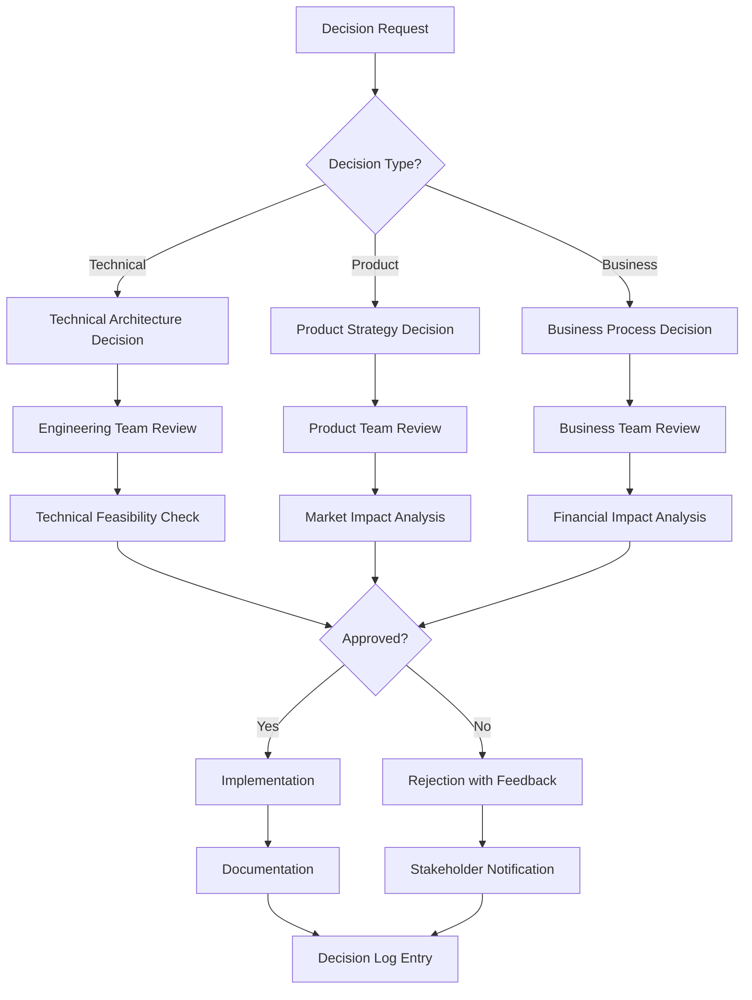

# DACI Decision Log

**Purpose**: Track all cross-team product decisions using the DACI framework (Driver-Approver-Contributors-Informed)

**Last Updated**: [YYYY-MM-DD]  
**Version**: [1.0]

---

## Decision Process Flow

---

## Decision Log Template

| Decision ID | Date | Title | Driver | Approver | Contributors | Informed | Status | Rationale |
|--------------|------|-------|--------|----------|--------------|----------|--------|-----------|
| D-001 | YYYY-MM-DD | [Decision Title] | [Name] | [Name] | [Names] | [Names] | [Open/Closed] | [Brief rationale] |

---

## Decision Records

### D-001: [Decision Title]
**Date**: [YYYY-MM-DD]  
**Status**: [Open/Closed]  
**Priority**: [P0/P1/P2/P3]

#### DACI Roles
- **Driver**: [Name] - [Role]
- **Approver**: [Name] - [Role]
- **Contributors**: 
  - [Name] - [Role]
  - [Name] - [Role]
- **Informed**: 
  - [Name] - [Role]
  - [Name] - [Role]

#### Decision Context
**What decision needs to be made?**
- [Clear description of the decision]

**Why is this decision needed?**
- [Business context and drivers]

**What are the constraints?**
- [Technical, business, or other constraints]

#### Options Considered
| Option | Description | Pros | Cons | Recommendation |
|--------|-------------|------|------|----------------|
| Option A | [Description] | [Pros] | [Cons] | [Yes/No] |
| Option B | [Description] | [Pros] | [Cons] | [Yes/No] |
| Option C | [Description] | [Pros] | [Cons] | [Yes/No] |

#### Decision
**Chosen Option**: [Option Name]  
**Rationale**: [Why this option was chosen]  
**Implementation Plan**: [How this will be implemented]  
**Success Criteria**: [How we'll know it worked]

#### Impact Analysis
**Positive Impacts**:
- [List positive impacts]

**Negative Impacts**:
- [List negative impacts]

**Mitigation Strategies**:
- [List mitigation strategies]

#### Follow-up Actions
- [ ] [Action item] - [Owner] - [Due date]
- [ ] [Action item] - [Owner] - [Due date]
- [ ] [Action item] - [Owner] - [Due date]

#### Review Schedule
- **30-day review**: [Date] - [Reviewer]
- **90-day review**: [Date] - [Reviewer]
- **Annual review**: [Date] - [Reviewer]

---

## Decision Categories

### Product Strategy Decisions
- [ ] Feature prioritization
- [ ] Product roadmap changes
- [ ] Market positioning
- [ ] Pricing strategy

### Technical Architecture Decisions
- [ ] Technology stack choices
- [ ] Architecture patterns
- [ ] Integration approaches
- [ ] Performance requirements

### Process and Governance Decisions
- [ ] Development processes
- [ ] Quality gates
- [ ] Release processes
- [ ] Compliance requirements

### Resource and Budget Decisions
- [ ] Team allocation
- [ ] Budget allocation
- [ ] Vendor selection
- [ ] Tool selection

---

## Decision Quality Checklist

### Before Making Decision
- [ ] Problem clearly defined
- [ ] Options thoroughly explored
- [ ] Stakeholders identified
- [ ] DACI roles assigned
- [ ] Timeline established

### During Decision Process
- [ ] All contributors consulted
- [ ] All options evaluated
- [ ] Impact analysis completed
- [ ] Risks identified and mitigated
- [ ] Implementation plan created

### After Decision Made
- [ ] Decision documented
- [ ] Stakeholders informed
- [ ] Implementation started
- [ ] Success criteria defined
- [ ] Review schedule established

---

## Decision Review Process

### Monthly Review
**Purpose**: Review open decisions and progress  
**Participants**: PM CoP Steering Group  
**Output**: Status update and escalation of blockers

### Quarterly Review
**Purpose**: Review closed decisions for outcomes  
**Participants**: PM CoP Steering Group  
**Output**: Lessons learned and process improvements

### Annual Review
**Purpose**: Review decision quality and process effectiveness  
**Participants**: PM CoP Steering Group + Leadership  
**Output**: Process improvements and training needs

---

## Escalation Process

### Level 1: PM CoP Steering Group
- [ ] Decision blocked by contributors
- [ ] Conflicting requirements
- [ ] Resource constraints

### Level 2: Executive Leadership
- [ ] Strategic impact
- [ ] Budget implications
- [ ] Cross-functional conflicts

### Level 3: Board/Investors
- [ ] Major strategic pivots
- [ ] Significant budget changes
- [ ] Market positioning changes

---

## Decision Metrics

### Decision Quality Metrics
- **Time to decision**: Average days from initiation to closure
- **Decision reversal rate**: % of decisions that were later reversed
- **Stakeholder satisfaction**: Survey of decision participants
- **Implementation success**: % of decisions successfully implemented

### Process Efficiency Metrics
- **Decision backlog**: Number of open decisions
- **Decision throughput**: Decisions closed per month
- **Escalation rate**: % of decisions requiring escalation
- **Review completion**: % of scheduled reviews completed

---

## Appendices

### A. Decision Templates
- [Links to decision templates]

### B. Stakeholder Matrix
- [Stakeholder contact information]

### C. Historical Decisions
- [Archive of past decisions]

### D. Lessons Learned
- [Documentation of lessons learned]