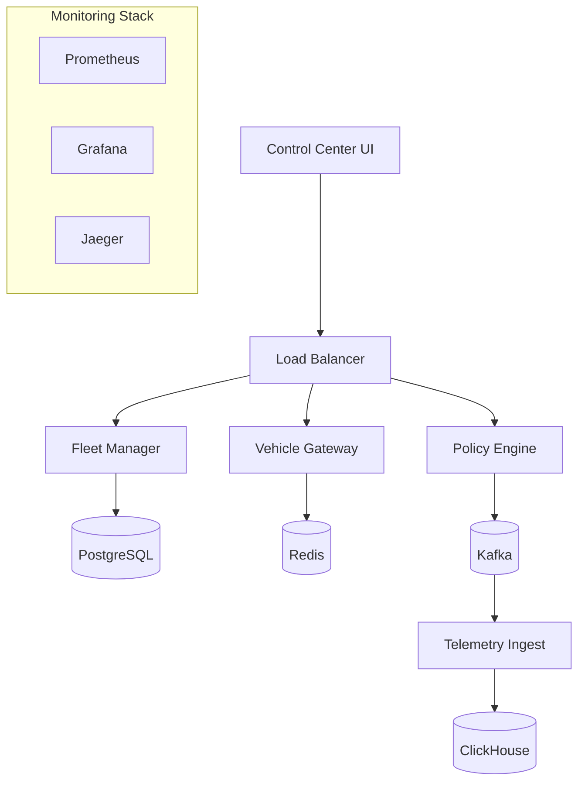

# AtlasMesh Fleet OS - Troubleshooting Guide

## Overview

This comprehensive troubleshooting guide covers common issues, diagnostic procedures, and resolution steps for AtlasMesh Fleet OS across all environments and components.

## Quick Reference

### Emergency Contacts
- **Critical Issues**: +971-50-XXX-XXXX (24/7 On-Call)
- **Operations Team**: ops@atlasmesh.ae
- **Development Team**: dev@atlasmesh.ae
- **Slack Emergency**: #atlasmesh-emergency

### Service Status
- **Status Page**: https://status.atlasmesh.ae
- **Grafana Dashboards**: https://monitoring.atlasmesh.ae
- **Log Aggregation**: https://logs.atlasmesh.ae

## System Architecture Overview



## Common Issues & Solutions

### 1. Service Startup Issues

#### Symptoms
- Pods in `CrashLoopBackOff` state
- Services not responding to health checks
- Connection timeouts

#### Diagnostic Steps
```bash
# Check pod status
kubectl get pods -n atlasmesh-prod

# Describe problematic pod
kubectl describe pod <pod-name> -n atlasmesh-prod

# Check logs
kubectl logs <pod-name> -n atlasmesh-prod --previous

# Check resource usage
kubectl top pods -n atlasmesh-prod
```

#### Common Causes & Solutions

**Database Connection Issues**
```bash
# Test database connectivity
kubectl run db-test --image=postgres:15 --rm -it -- \
  psql -h postgres-service -U postgres -d atlasmesh_fleet

# Check database credentials
kubectl get secret postgres-credentials -o yaml -n atlasmesh-prod

# Verify database service
kubectl get svc postgres-service -n atlasmesh-prod
```

**Memory/CPU Limits**
```yaml
# Update resource limits
resources:
  requests:
    cpu: 500m
    memory: 1Gi
  limits:
    cpu: 2000m
    memory: 4Gi
```

**Configuration Issues**
```bash
# Check ConfigMap
kubectl get configmap fleet-config -o yaml -n atlasmesh-prod

# Validate environment variables
kubectl exec -it <pod-name> -n atlasmesh-prod -- env | grep -E "(DATABASE|REDIS|KAFKA)"
```

### 2. Database Performance Issues

#### Symptoms
- Slow query responses
- High CPU usage on database pods
- Connection pool exhaustion

#### Diagnostic Queries
```sql
-- Check active connections
SELECT count(*) as active_connections 
FROM pg_stat_activity 
WHERE state = 'active';

-- Identify slow queries
SELECT query, calls, total_time, mean_time, rows
FROM pg_stat_statements 
ORDER BY total_time DESC 
LIMIT 10;

-- Check table sizes
SELECT schemaname, tablename, 
       pg_size_pretty(pg_total_relation_size(schemaname||'.'||tablename)) as size
FROM pg_tables 
WHERE schemaname = 'public'
ORDER BY pg_total_relation_size(schemaname||'.'||tablename) DESC;

-- Check index usage
SELECT schemaname, tablename, indexname, idx_scan, idx_tup_read, idx_tup_fetch
FROM pg_stat_user_indexes
ORDER BY idx_scan DESC;
```

#### Solutions

**Query Optimization**
```sql
-- Add missing indexes
CREATE INDEX CONCURRENTLY idx_vehicle_telemetry_vehicle_id_timestamp 
ON vehicle_telemetry (vehicle_id, timestamp DESC);

-- Analyze table statistics
ANALYZE vehicle_telemetry;

-- Update table statistics
VACUUM ANALYZE vehicle_telemetry;
```

**Connection Pool Tuning**
```yaml
# PgBouncer configuration
databases:
  atlasmesh_fleet:
    host: postgres-primary
    port: 5432
    pool_size: 50
    max_client_conn: 200

pool_mode: transaction
default_pool_size: 25
max_client_conn: 1000
```

### 3. Message Queue Issues

#### Symptoms
- Messages not being processed
- High consumer lag
- Kafka partition errors

#### Diagnostic Commands
```bash
# Check Kafka cluster health
kubectl exec -it kafka-0 -n atlasmesh-prod -- \
  kafka-topics.sh --bootstrap-server localhost:9092 --list

# Check consumer group lag
kubectl exec -it kafka-0 -n atlasmesh-prod -- \
  kafka-consumer-groups.sh --bootstrap-server localhost:9092 \
  --group fleet-telemetry-group --describe

# Check topic configuration
kubectl exec -it kafka-0 -n atlasmesh-prod -- \
  kafka-topics.sh --bootstrap-server localhost:9092 \
  --topic vehicle-telemetry --describe
```

#### Solutions

**Consumer Lag Issues**
```bash
# Scale up consumer pods
kubectl scale deployment telemetry-consumer --replicas=5 -n atlasmesh-prod

# Reset consumer group offset (use with caution)
kubectl exec -it kafka-0 -n atlasmesh-prod -- \
  kafka-consumer-groups.sh --bootstrap-server localhost:9092 \
  --group fleet-telemetry-group --reset-offsets --to-latest \
  --topic vehicle-telemetry --execute
```

**Partition Rebalancing**
```bash
# Check partition distribution
kubectl exec -it kafka-0 -n atlasmesh-prod -- \
  kafka-log-dirs.sh --bootstrap-server localhost:9092 \
  --topic-list vehicle-telemetry --describe

# Trigger preferred replica election
kubectl exec -it kafka-0 -n atlasmesh-prod -- \
  kafka-preferred-replica-election.sh --bootstrap-server localhost:9092
```

### 4. Network Connectivity Issues

#### Symptoms
- Service discovery failures
- Intermittent connection timeouts
- DNS resolution errors

#### Diagnostic Steps
```bash
# Test DNS resolution
kubectl run dns-test --image=busybox --rm -it -- \
  nslookup fleet-manager-service.atlasmesh-prod.svc.cluster.local

# Test service connectivity
kubectl run network-test --image=nicolaka/netshoot --rm -it -- \
  curl -v http://fleet-manager-service:8080/health

# Check network policies
kubectl get networkpolicy -n atlasmesh-prod

# Check service endpoints
kubectl get endpoints -n atlasmesh-prod
```

#### Solutions

**DNS Issues**
```bash
# Restart CoreDNS
kubectl rollout restart deployment/coredns -n kube-system

# Check CoreDNS configuration
kubectl get configmap coredns -n kube-system -o yaml
```

**Network Policy Issues**
```yaml
# Allow inter-service communication
apiVersion: networking.k8s.io/v1
kind: NetworkPolicy
metadata:
  name: allow-inter-service
spec:
  podSelector: {}
  policyTypes:
  - Ingress
  ingress:
  - from:
    - podSelector:
        matchLabels:
          app: atlasmesh-fleet-os
```

### 5. Storage Issues

#### Symptoms
- Disk space warnings
- PVC mounting failures
- Slow I/O performance

#### Diagnostic Commands
```bash
# Check PVC status
kubectl get pvc -n atlasmesh-prod

# Check storage class
kubectl get storageclass

# Check disk usage in pods
kubectl exec -it <pod-name> -n atlasmesh-prod -- df -h

# Check I/O statistics
kubectl exec -it <pod-name> -n atlasmesh-prod -- iostat -x 1 5
```

#### Solutions

**Disk Space Issues**
```bash
# Clean up old logs
kubectl exec -it <pod-name> -n atlasmesh-prod -- \
  find /var/log -name "*.log" -mtime +7 -delete

# Resize PVC (if supported by storage class)
kubectl patch pvc postgres-data -n atlasmesh-prod \
  -p '{"spec":{"resources":{"requests":{"storage":"200Gi"}}}}'
```

**Performance Issues**
```yaml
# Use faster storage class
storageClassName: fast-ssd
resources:
  requests:
    storage: 100Gi
```

### 6. Authentication & Authorization Issues

#### Symptoms
- 401 Unauthorized errors
- JWT token validation failures
- RBAC permission denied

#### Diagnostic Steps
```bash
# Check JWT token validity
curl -H "Authorization: Bearer $TOKEN" \
  http://fleet-manager:8080/api/v1/auth/validate

# Check RBAC permissions
kubectl auth can-i get pods --as=system:serviceaccount:atlasmesh-prod:fleet-operator

# Check service account
kubectl get serviceaccount fleet-operator -n atlasmesh-prod -o yaml
```

#### Solutions

**Token Issues**
```bash
# Generate new service account token
kubectl create token fleet-operator -n atlasmesh-prod --duration=24h

# Update token in application
kubectl patch secret fleet-operator-token -n atlasmesh-prod \
  --type='json' -p='[{"op": "replace", "path": "/data/token", "value":"'$(echo -n $NEW_TOKEN | base64)'"}]'
```

**RBAC Issues**
```yaml
# Update role permissions
apiVersion: rbac.authorization.k8s.io/v1
kind: Role
metadata:
  name: fleet-operator
rules:
- apiGroups: [""]
  resources: ["pods", "services", "configmaps", "secrets"]
  verbs: ["get", "list", "watch", "create", "update", "patch"]
```

### 7. Performance Degradation

#### Symptoms
- High response times
- CPU/Memory spikes
- Throughput reduction

#### Monitoring Queries
```promql
# High CPU usage
rate(container_cpu_usage_seconds_total[5m]) * 100

# Memory usage
container_memory_usage_bytes / container_spec_memory_limit_bytes * 100

# Request rate
rate(http_requests_total[5m])

# Error rate
rate(http_requests_total{status=~"5.."}[5m]) / rate(http_requests_total[5m])

# Response time
histogram_quantile(0.95, rate(http_request_duration_seconds_bucket[5m]))
```

#### Solutions

**Auto-scaling**
```yaml
# Horizontal Pod Autoscaler
apiVersion: autoscaling/v2
kind: HorizontalPodAutoscaler
metadata:
  name: fleet-manager-hpa
spec:
  scaleTargetRef:
    apiVersion: apps/v1
    kind: Deployment
    name: fleet-manager
  minReplicas: 3
  maxReplicas: 10
  metrics:
  - type: Resource
    resource:
      name: cpu
      target:
        type: Utilization
        averageUtilization: 70
```

**Resource Optimization**
```yaml
# Update resource requests/limits
resources:
  requests:
    cpu: 1000m
    memory: 2Gi
  limits:
    cpu: 4000m
    memory: 8Gi
```

### 8. Data Consistency Issues

#### Symptoms
- Stale data in UI
- Cache mismatches
- Data synchronization errors

#### Diagnostic Steps
```bash
# Check cache status
kubectl exec -it redis-0 -n atlasmesh-prod -- redis-cli info memory

# Verify data consistency
kubectl exec -it postgres-0 -n atlasmesh-prod -- \
  psql -U postgres -d atlasmesh_fleet -c "
  SELECT COUNT(*) FROM vehicles WHERE status = 'active';"

# Check event processing lag
kubectl logs telemetry-processor -n atlasmesh-prod | grep "processing_lag"
```

#### Solutions

**Cache Invalidation**
```bash
# Clear specific cache keys
kubectl exec -it redis-0 -n atlasmesh-prod -- \
  redis-cli DEL "fleet:*" "vehicle:*"

# Restart cache-dependent services
kubectl rollout restart deployment/fleet-manager -n atlasmesh-prod
```

**Data Synchronization**
```bash
# Trigger manual sync
curl -X POST http://fleet-manager:8080/api/v1/admin/sync \
  -H "Authorization: Bearer $ADMIN_TOKEN"

# Check sync status
curl http://fleet-manager:8080/api/v1/admin/sync/status \
  -H "Authorization: Bearer $ADMIN_TOKEN"
```

## Monitoring & Alerting

### Key Metrics to Monitor

#### System Metrics
```promql
# Node CPU usage
100 - (avg by(instance) (rate(node_cpu_seconds_total{mode="idle"}[5m])) * 100)

# Node memory usage
(1 - (node_memory_MemAvailable_bytes / node_memory_MemTotal_bytes)) * 100

# Disk usage
100 - ((node_filesystem_avail_bytes * 100) / node_filesystem_size_bytes)

# Network I/O
rate(node_network_receive_bytes_total[5m])
rate(node_network_transmit_bytes_total[5m])
```

#### Application Metrics
```promql
# Request rate
sum(rate(http_requests_total[5m])) by (service)

# Error rate
sum(rate(http_requests_total{status=~"5.."}[5m])) by (service) / 
sum(rate(http_requests_total[5m])) by (service)

# Response time P95
histogram_quantile(0.95, sum(rate(http_request_duration_seconds_bucket[5m])) by (le, service))

# Database connections
pg_stat_database_numbackends
```

### Alert Rules
```yaml
groups:
- name: fleet-os-alerts
  rules:
  - alert: HighErrorRate
    expr: rate(http_requests_total{status=~"5.."}[5m]) / rate(http_requests_total[5m]) > 0.05
    for: 5m
    labels:
      severity: critical
    annotations:
      summary: "High error rate detected"
      
  - alert: HighResponseTime
    expr: histogram_quantile(0.95, rate(http_request_duration_seconds_bucket[5m])) > 2
    for: 5m
    labels:
      severity: warning
    annotations:
      summary: "High response time detected"
      
  - alert: DatabaseConnectionsHigh
    expr: pg_stat_database_numbackends / pg_settings_max_connections > 0.8
    for: 5m
    labels:
      severity: warning
    annotations:
      summary: "Database connections approaching limit"
```

## Log Analysis

### Log Locations
```bash
# Application logs
kubectl logs <pod-name> -n atlasmesh-prod

# System logs
kubectl logs -n kube-system <system-pod-name>

# Persistent logs (if using log aggregation)
# Elasticsearch/Fluentd setup
kubectl logs fluentd-<pod-id> -n logging
```

### Common Log Patterns

#### Error Patterns
```bash
# Database connection errors
grep -E "(connection.*refused|timeout.*database)" <log-file>

# Authentication errors
grep -E "(401|unauthorized|authentication.*failed)" <log-file>

# Memory errors
grep -E "(out.*memory|OOM|killed)" <log-file>

# Network errors
grep -E "(connection.*reset|timeout|network.*unreachable)" <log-file>
```

#### Performance Patterns
```bash
# Slow queries
grep -E "(slow.*query|query.*time.*[0-9]{4,})" <log-file>

# High CPU usage
grep -E "(cpu.*usage|high.*load)" <log-file>

# Memory pressure
grep -E "(memory.*pressure|gc.*pause)" <log-file>
```

## Recovery Procedures

### Service Recovery
```bash
# Restart specific service
kubectl rollout restart deployment/<service-name> -n atlasmesh-prod

# Scale service to zero and back
kubectl scale deployment/<service-name> --replicas=0 -n atlasmesh-prod
kubectl scale deployment/<service-name> --replicas=3 -n atlasmesh-prod

# Force pod recreation
kubectl delete pod <pod-name> -n atlasmesh-prod
```

### Database Recovery
```bash
# Restore from backup
kubectl exec -it postgres-0 -n atlasmesh-prod -- \
  pg_restore -U postgres -d atlasmesh_fleet /backups/latest.sql

# Rebuild indexes
kubectl exec -it postgres-0 -n atlasmesh-prod -- \
  psql -U postgres -d atlasmesh_fleet -c "REINDEX DATABASE atlasmesh_fleet;"

# Update statistics
kubectl exec -it postgres-0 -n atlasmesh-prod -- \
  psql -U postgres -d atlasmesh_fleet -c "ANALYZE;"
```

### Cache Recovery
```bash
# Clear all cache
kubectl exec -it redis-0 -n atlasmesh-prod -- redis-cli FLUSHALL

# Restart Redis cluster
kubectl rollout restart statefulset/redis -n atlasmesh-prod

# Warm up cache
curl -X POST http://fleet-manager:8080/api/v1/admin/cache/warmup
```

## Escalation Procedures

### Severity Levels

#### P0 - Critical (System Down)
- **Response Time**: 15 minutes
- **Escalation**: Immediate to on-call engineer
- **Actions**: 
  1. Page on-call engineer
  2. Create incident in PagerDuty
  3. Notify stakeholders
  4. Start war room if needed

#### P1 - High (Major Feature Down)
- **Response Time**: 1 hour
- **Escalation**: On-call engineer within 30 minutes
- **Actions**:
  1. Create incident ticket
  2. Notify team lead
  3. Begin investigation

#### P2 - Medium (Performance Degradation)
- **Response Time**: 4 hours
- **Escalation**: Team lead within 2 hours
- **Actions**:
  1. Create bug report
  2. Schedule fix in next sprint

#### P3 - Low (Minor Issues)
- **Response Time**: 24 hours
- **Escalation**: Team lead within 8 hours
- **Actions**:
  1. Add to backlog
  2. Fix in regular maintenance

### Contact Matrix
```
P0/P1 Issues:
├── On-Call Engineer: +971-50-XXX-XXXX
├── Team Lead: +971-50-XXX-XXXY
├── Engineering Manager: +971-50-XXX-XXXZ
└── CTO: +971-50-XXX-XXXA

P2/P3 Issues:
├── Team Lead: lead@atlasmesh.ae
├── Product Manager: pm@atlasmesh.ae
└── Engineering Manager: em@atlasmesh.ae
```

## Preventive Measures

### Regular Maintenance
```bash
# Weekly tasks
- Update system packages
- Rotate logs
- Check disk usage
- Verify backups

# Monthly tasks
- Update container images
- Review performance metrics
- Conduct disaster recovery tests
- Update documentation

# Quarterly tasks
- Security audit
- Capacity planning review
- Update monitoring rules
- Team training sessions
```

### Health Checks
```bash
# Automated health checks
#!/bin/bash
# health-check.sh

# Check all services
for service in fleet-manager vehicle-gateway policy-engine; do
  if ! curl -f http://$service:8080/health; then
    echo "ALERT: $service is unhealthy"
    # Send alert
  fi
done

# Check database
if ! kubectl exec postgres-0 -n atlasmesh-prod -- pg_isready; then
  echo "ALERT: Database is not ready"
fi

# Check disk space
kubectl exec -it postgres-0 -n atlasmesh-prod -- \
  df -h | awk '$5 > 80 {print "ALERT: Disk usage high on " $6}'
```

## Documentation Updates

This troubleshooting guide should be updated:
- After each incident resolution
- When new services are added
- When monitoring rules change
- Quarterly review and validation

**Last Updated**: December 2023
**Version**: 1.0.0
**Next Review**: March 2024
