# Services

**47 Production-Ready Microservices** for the AtlasMesh Fleet Operating System - each with comprehensive documentation and embedded Mermaid diagrams.

## 📊 **Architecture Overview**

```mermaid
graph TB
    subgraph "Core Operations (12)"
        FleetManager[🚛 Fleet Manager]
        VehicleGateway[🌐 Vehicle Gateway]
        AuthService[🔐 Auth Service]
        PolicyEngine[⚖️ Policy Engine]
        VehicleAgent[🤖 Vehicle Agent]
        ControlCenter[🖥️ Control Center UI]
        TelemetryIngest[📊 Telemetry Ingest]
        APIGateway[🚪 API Gateway]
        EventBus[📨 Event Bus]
        TripService[🗺️ Trip Service]
        DispatchService[🚀 Dispatch Service]
        RoutingService[🗺️ Routing Service]
    end
    
    subgraph "Data & Analytics (8)"
        WeatherFusion[🌤️ Weather Fusion]
        PredictiveMaintenance[🔧 Predictive Maintenance]
        DigitalTwin[🔄 Digital Twin]
        MLPipeline[🤖 ML Pipeline]
        AnalyticsService[📈 Analytics Service]
        TelemetryIngestion[📊 Telemetry Ingestion]
        SensorDataCollector[📡 Sensor Data Collector]
        TelemetryLakehouse[🏞️ Telemetry Lakehouse]
    end
    
    subgraph "Infrastructure & Platform (10)"
        Observability[👁️ Observability]
        FeatureFlags[🚩 Feature Flags]
        CacheManager[💾 Cache Manager]
        MonitoringAlerting[🚨 Monitoring Alerting]
        DataLineage[🔍 Data Lineage]
        SchemaRegistry[📋 Schema Registry]
        ERPIntegration[🏢 ERP Integration]
        TenantEntitlements[🎯 Tenant Entitlements]
        SecurityService[🛡️ Security Service]
        ChaosEngineering[🌪️ Chaos Engineering]
    end
    
    subgraph "Security & Compliance (8)"
        ZeroTrustIAM[🔐 Zero Trust IAM]
        KeySecretManagement[🔑 Key Secret Management]
        EvidenceEngine[📋 Evidence Engine]
        Auditability[📝 Auditability]
        SecurityHardening[🔒 Security Hardening]
        ComplianceAutomation[📋 Compliance Automation]
        PurposeBindingResidency[🛡️ Purpose Binding Residency]
        OncallRunbooks[📖 On-call Runbooks]
    end
    
    subgraph "Specialized Services (9)"
        GarageTools[🏭 Garage Tools]
        DegradedModes[⚠️ Degraded Modes]
        MapDataContract[🗺️ Map Data Contract]
        CommsOrchestration[📡 Comms Orchestration]
        TimeSyncCalibration[⏰ Time Sync Calibration]
        FeatureStoreRegistry[🏪 Feature Store Registry]
        SectorOverlays[🏢 Sector Overlays]
        DigitalTwinSimulation[🎮 Digital Twin Simulation]
        ArabicLocalization[🇦🇪 Arabic Localization]
    end
    
    classDef core fill:#e1f5fe,stroke:#01579b,stroke-width:3px
    classDef data fill:#e8f5e8,stroke:#388e3c,stroke-width:2px
    classDef infra fill:#fff3e0,stroke:#f57c00,stroke-width:2px
    classDef security fill:#ffebee,stroke:#c62828,stroke-width:2px
    classDef specialized fill:#f3e5f5,stroke:#7b1fa2,stroke-width:2px
    
    class FleetManager,VehicleGateway,AuthService,PolicyEngine,VehicleAgent,ControlCenter,TelemetryIngest,APIGateway,EventBus,TripService,DispatchService,RoutingService core
    class WeatherFusion,PredictiveMaintenance,DigitalTwin,MLPipeline,AnalyticsService,TelemetryIngestion,SensorDataCollector,TelemetryLakehouse data
    class Observability,FeatureFlags,CacheManager,MonitoringAlerting,DataLineage,SchemaRegistry,ERPIntegration,TenantEntitlements,SecurityService,ChaosEngineering infra
    class ZeroTrustIAM,KeySecretManagement,EvidenceEngine,Auditability,SecurityHardening,ComplianceAutomation,PurposeBindingResidency,OncallRunbooks security
    class GarageTools,DegradedModes,MapDataContract,CommsOrchestration,TimeSyncCalibration,FeatureStoreRegistry,SectorOverlays,DigitalTwinSimulation,ArabicLocalization specialized
```



## 🎯 **Service Categories**

### **🚛 Core Operations (12 Services)**
Essential services for fleet operations and vehicle management:

| Service | Description | Key Features |
|---------|-------------|--------------|
| [`fleet-manager`](./fleet-manager/) | Fleet and vehicle lifecycle management | Vehicle CRUD, fleet analytics, command dispatch |
| [`vehicle-gateway`](./vehicle-gateway/) | Real-time vehicle communication | WebSocket/MQTT, telemetry ingestion, emergency controls |
| [`auth-service`](./auth-service/) | Authentication and authorization | JWT/OAuth, RBAC/ABAC, session management |
| [`policy-engine`](./policy-engine/) | Policy-as-code evaluation | OPA/Rego, compliance rules, decision logging |
| [`trip-service`](./trip-service/) | Trip planning and execution | Route optimization, real-time tracking, ETA calculation |
| [`dispatch-service`](./dispatch-service/) | Intelligent vehicle dispatch | ML-powered assignment, constraint optimization |
| [`routing-service`](./routing-service/) | Advanced route calculation | Multi-modal routing, traffic integration, A* algorithms |
| [`api-gateway`](./api-gateway/) | Central API entry point | Load balancing, rate limiting, request routing |
| [`event-bus`](./event-bus/) | Kafka messaging backbone | Event streaming, schema registry, DLQ patterns |
| [`telemetry-ingest`](./telemetry-ingest/) | High-throughput data ingestion | Real-time processing, schema validation, alerting |

### **📊 Data & Analytics (8 Services)**
Services for data processing, analytics, and machine learning:

| Service | Description | Key Features |
|---------|-------------|--------------|
| [`analytics-service`](./analytics-service/) | Business intelligence and reporting | Real-time dashboards, KPI tracking, data visualization |
| [`ml-pipeline`](./ml-pipeline/) | End-to-end ML lifecycle | Model training, deployment, drift detection |
| [`predictive-maintenance`](./predictive-maintenance/) | AI-powered maintenance forecasting | RUL prediction, anomaly detection, cost optimization |
| [`weather-fusion`](./weather-fusion/) | Multi-source weather intelligence | Data fusion, confidence scoring, operational impact |
| [`digital-twin`](./digital-twin/) | Virtual fleet simulation | Real-time sync, scenario testing, what-if analysis |
| [`telemetry-ingestion`](./telemetry-ingestion/) | Data ingestion gateway | Schema validation, data routing, quality assurance |
| [`sensor-data-collector`](./sensor-data-collector/) | Multi-sensor data aggregation | Calibration, quality checks, data fusion |
| [`telemetry-lakehouse`](./telemetry-lakehouse/) | Scalable data lakehouse | Hot/cold storage, streaming ETL, cost optimization |

### **🏗️ Infrastructure & Platform (10 Services)**
Platform services for system reliability and operations:

| Service | Description | Key Features |
|---------|-------------|--------------|
| [`observability`](./observability/) | Unified monitoring platform | Metrics, logs, traces, SLO dashboards |
| [`monitoring-alerting`](./monitoring-alerting/) | Intelligent alerting system | ML-powered anomaly detection, smart routing |
| [`feature-flags`](./feature-flags/) | Dynamic feature management | A/B testing, gradual rollouts, kill switches |
| [`cache-manager`](./cache-manager/) | Distributed caching | Redis clustering, cache patterns, performance optimization |
| [`data-lineage`](./data-lineage/) | Data governance and tracking | Provenance tracking, impact analysis, compliance |
| [`schema-registry`](./schema-registry/) | Schema management | Avro schemas, version control, compatibility checking |
| [`erp-integration`](./erp-integration/) | Business systems integration | SAP/Oracle/NetSuite, workflow orchestration |
| [`tenant-entitlements`](./tenant-entitlements/) | Multi-tenant access control | Feature gating, usage limits, subscription management |
| [`chaos-engineering`](./chaos-engineering/) | Resilience testing | Fault injection, failure scenarios, recovery validation |

### **🔐 Security & Compliance (8 Services)**
Security, compliance, and governance services:

| Service | Description | Key Features |
|---------|-------------|--------------|
| [`zero-trust-iam`](./zero-trust-iam/) | SPIFFE/SPIRE identity management | mTLS, service identity, continuous verification |
| [`key-secret-management`](./key-secret-management/) | HashiCorp Vault integration | Dynamic secrets, rotation, PKI management |
| [`security-hardening`](./security-hardening/) | Defense-in-depth strategies | Vulnerability scanning, compliance checking |
| [`compliance-automation`](./compliance-automation/) | Regulatory adherence | ISO 27001, SOC 2, GDPR, UAE compliance |
| [`evidence-engine`](./evidence-engine/) | Automated compliance evidence | Audit bundles, regulatory submissions |
| [`auditability`](./auditability/) | Cryptographic audit trails | Immutable logs, digital signatures, forensics |
| [`purpose-binding-residency`](./purpose-binding-residency/) | Privacy governance | Data residency, purpose binding, DPIA workflows |
| [`oncall-runbooks`](./oncall-runbooks/) | Incident response procedures | Automated runbooks, escalation workflows |

### **🎯 Specialized Services (9 Services)**
Domain-specific and advanced services:

| Service | Description | Key Features |
|---------|-------------|--------------|
| [`garage-tools`](./garage-tools/) | Vehicle maintenance and flashing | OTA updates, SBOM attestation, work orders |
| [`degraded-modes`](./degraded-modes/) | Adaptive system behavior | Graceful degradation, constraint handling |
| [`map-data-contract`](./map-data-contract/) | Map data governance | Lanelet2/OpenDRIVE, provenance, diff pipelines |
| [`comms-orchestration`](./comms-orchestration/) | Multi-path communication | LTE/5G/Wi-Fi/SAT, cost optimization, failover |
| [`time-sync-calibration`](./time-sync-calibration/) | Precision timing | PTP/GNSS, sensor calibration, drift compensation |
| [`feature-store-registry`](./feature-store-registry/) | ML feature management | Feature serving, model registry, drift detection |
| [`sector-overlays`](./sector-overlays/) | Sector customization | Policy tokens, UI themes, workflow adaptations |
| [`digital-twin-simulation`](./digital-twin-simulation/) | Advanced simulation | Scenario banking, fault injection, golden replays |
| [`arabic-localization`](./arabic-localization/) | UAE-specific localization | RTL support, cultural adaptations, Emirati dialect |

## 🏗️ **Architecture Principles**

Each service follows consistent patterns:
- **📋 Diagrammed Documentation**: Every service has embedded Mermaid diagrams showing architecture, flows, and data models
- **🔌 API-First**: OpenAPI 3.0 specifications with auto-generated SDKs
- **📨 Event-Driven**: Event sourcing with Kafka and schema registry
- **👁️ Observability**: Structured logging, Prometheus metrics, Jaeger tracing
- **🛡️ Resilience**: Circuit breakers, retries, timeouts, graceful degradation
- **🔐 Zero-Trust**: mTLS, SPIFFE/SPIRE, cryptographic attestation

## 📁 **Service Structure**

```
service-name/
├── cmd/                 # Main application entry points
├── internal/            # Private application code
├── api/                 # OpenAPI specifications
├── proto/              # gRPC protocol definitions
├── migrations/         # Database migrations
├── README.md           # Service documentation with Mermaid diagrams
├── Dockerfile          # Container image definition
└── go.mod              # Go module dependencies
```

## 🛠️ **Technology Stack**

### **Languages & Frameworks**
- **Go**: High-performance backend services (primary)
- **TypeScript/React**: Frontend applications and UI components
- **Python**: ML pipelines, data processing, automation scripts
- **C++**: ROS2 edge stack components

### **Data & Messaging**
- **PostgreSQL**: Primary transactional database
- **Redis**: Distributed caching and session storage
- **Apache Kafka**: Event streaming and messaging
- **ClickHouse**: Real-time analytics and OLAP
- **MinIO**: Object storage for cold data

### **Infrastructure**
- **Kubernetes**: Container orchestration
- **Helm**: Package management
- **Prometheus**: Metrics collection
- **Grafana**: Dashboards and visualization
- **Jaeger**: Distributed tracing

## 🚀 **Getting Started**

```bash
# Start all core services
make dev

# Start specific service category
make dev.core-operations
make dev.data-analytics
make dev.security-compliance

# Build all services
make build

# Run comprehensive tests
make test

# Generate API documentation
make api-docs

# Deploy to development environment
make deploy.dev
```

## 🔗 **Service Dependencies**

```mermaid
graph LR
    APIGateway[🚪 API Gateway] --> FleetManager[🚛 Fleet Manager]
    APIGateway --> AuthService[🔐 Auth Service]
    APIGateway --> PolicyEngine[⚖️ Policy Engine]
    
    FleetManager --> VehicleGateway[🌐 Vehicle Gateway]
    FleetManager --> TripService[🗺️ Trip Service]
    
    TripService --> DispatchService[🚀 Dispatch Service]
    TripService --> RoutingService[🗺️ Routing Service]
    
    DispatchService --> PolicyEngine
    RoutingService --> WeatherFusion[🌤️ Weather Fusion]
    RoutingService --> MapDataContract[🗺️ Map Data Contract]
    
    VehicleGateway --> TelemetryIngest[📊 Telemetry Ingest]
    TelemetryIngest --> EventBus[📨 Event Bus]
    
    EventBus --> AnalyticsService[📈 Analytics Service]
    EventBus --> MLPipeline[🤖 ML Pipeline]
    EventBus --> MonitoringAlerting[🚨 Monitoring Alerting]
    
    AuthService --> ZeroTrustIAM[🔐 Zero Trust IAM]
    PolicyEngine --> ComplianceAutomation[📋 Compliance Automation]
    
    classDef core fill:#e1f5fe,stroke:#01579b,stroke-width:2px
    classDef data fill:#e8f5e8,stroke:#388e3c,stroke-width:2px
    classDef security fill:#ffebee,stroke:#c62828,stroke-width:2px
    
    class APIGateway,FleetManager,VehicleGateway,TripService,DispatchService,RoutingService core
    class TelemetryIngest,EventBus,AnalyticsService,MLPipeline,WeatherFusion,MapDataContract data
    class AuthService,PolicyEngine,ZeroTrustIAM,ComplianceAutomation,MonitoringAlerting security
```



## 🔐 **Security & Compliance**

All services implement comprehensive security:

### **Zero-Trust Architecture**
- **mTLS**: Mutual TLS for all inter-service communication
- **SPIFFE/SPIRE**: Service identity and attestation
- **Certificate Rotation**: Automated short-lived certificates

### **Authentication & Authorization**
- **JWT**: JSON Web Tokens for user authentication
- **RBAC/ABAC**: Role and attribute-based access control
- **Policy-as-Code**: OPA/Rego for authorization decisions

### **Data Protection**
- **Encryption at Rest**: AES-256 for stored data
- **Encryption in Transit**: TLS 1.3 for all communications
- **PII Protection**: Automated detection and masking
- **Data Residency**: Geographic data placement controls

### **Audit & Compliance**
- **Cryptographic Audit Logs**: Tamper-proof audit trails
- **Compliance Automation**: ISO 27001, SOC 2, GDPR adherence
- **Evidence Collection**: Automated compliance evidence generation
- **Regulatory Reporting**: UAE and international compliance

## 📊 **Monitoring & Observability**

### **Three Pillars of Observability**
- **Metrics**: Prometheus metrics with Grafana dashboards
- **Logs**: Structured JSON logging with centralized aggregation
- **Traces**: Jaeger distributed tracing with correlation IDs

### **SLOs & Performance**
- **Availability**: 99.9%+ uptime targets
- **Latency**: P95 < 200ms for critical operations
- **Throughput**: Designed for 100K+ req/s capacity
- **Error Budget**: Automated SLO monitoring and alerting

## 🎯 **Quality Standards**

### **Documentation**
- **Mermaid Diagrams**: Every service has 3 embedded diagrams
- **API Documentation**: OpenAPI specs with examples
- **Runbooks**: Operational procedures and troubleshooting
- **Architecture Decision Records**: Design rationale tracking

### **Testing**
- **Unit Tests**: >90% code coverage requirement
- **Integration Tests**: End-to-end workflow validation
- **Contract Tests**: API compatibility verification
- **Chaos Engineering**: Resilience and failure testing

### **Performance**
- **Load Testing**: K6-based performance validation
- **Benchmarking**: Continuous performance monitoring
- **Resource Optimization**: Memory and CPU efficiency
- **Scalability**: Horizontal scaling capabilities

---

**🏆 This represents 47 production-ready microservices with world-class documentation, comprehensive security, and operational excellence for autonomous fleet management.**
