# Analytics Service

> **TL;DR:** Real-time and batch analytics service providing business intelligence, operational insights, and data-driven decision support

## 📊 **Architecture Overview**

### 📈 **Where it fits** - Analytics Intelligence Hub

```mermaid
graph TB
    subgraph "Data Sources"
        TelemetryStream[📊 Telemetry Stream]
        EventBus[📨 Event Bus]
        TransactionalDB[🗄️ Transactional DB]
        ExternalAPIs[🌐 External APIs]
    end
    
    subgraph "Analytics Service"
        StreamProcessor[⚡ Stream Processor]
        BatchProcessor[📦 Batch Processor]
        QueryEngine[🔍 Query Engine]
        ReportGenerator[📋 Report Generator]
        AnalyticsAPI[📊 Analytics API]
    end
    
    subgraph "Processing Engines"
        ApacheSpark[⚡ Apache Spark]
        ApacheKafka[📨 Apache Kafka Streams]
        ClickHouse[📊 ClickHouse OLAP]
        ElasticSearch[🔍 Elasticsearch]
    end
    
    subgraph "Analytics Types"
        RealTimeAnalytics[⚡ Real-time Analytics]
        BatchAnalytics[📦 Batch Analytics]
        AdHocQueries[🔍 Ad-hoc Queries]
        ScheduledReports[📅 Scheduled Reports]
    end
    
    subgraph "Business Intelligence"
        FleetKPIs[🚛 Fleet KPIs]
        OperationalMetrics[⚙️ Operational Metrics]
        FinancialAnalytics[💰 Financial Analytics]
        SafetyAnalytics[🛡️ Safety Analytics]
    end
    
    TelemetryStream --> StreamProcessor
    EventBus --> StreamProcessor
    TransactionalDB --> BatchProcessor
    ExternalAPIs --> BatchProcessor
    
    StreamProcessor --> ApacheKafka
    BatchProcessor --> ApacheSpark
    QueryEngine --> ClickHouse
    ReportGenerator --> ElasticSearch
    
    ApacheKafka --> RealTimeAnalytics
    ApacheSpark --> BatchAnalytics
    ClickHouse --> AdHocQueries
    ElasticSearch --> ScheduledReports
    
    RealTimeAnalytics --> FleetKPIs
    BatchAnalytics --> OperationalMetrics
    AdHocQueries --> FinancialAnalytics
    ScheduledReports --> SafetyAnalytics
    
    StreamProcessor --> AnalyticsAPI
    BatchProcessor --> AnalyticsAPI
    QueryEngine --> AnalyticsAPI
    ReportGenerator --> AnalyticsAPI
    
    classDef data fill:#e8f5e8,stroke:#1b5e20,stroke-width:2px
    classDef analytics fill:#e1f5fe,stroke:#01579b,stroke-width:3px
    classDef engine fill:#fff3e0,stroke:#f57c00,stroke-width:2px
    classDef type fill:#f3e5f5,stroke:#7b1fa2,stroke-width:2px
    classDef business fill:#ffebee,stroke:#c62828,stroke-width:2px
    
    class TelemetryStream,EventBus,TransactionalDB,ExternalAPIs data
    class StreamProcessor,BatchProcessor,QueryEngine,ReportGenerator,AnalyticsAPI analytics
    class ApacheSpark,ApacheKafka,ClickHouse,ElasticSearch engine
    class RealTimeAnalytics,BatchAnalytics,AdHocQueries,ScheduledReports type
    class FleetKPIs,OperationalMetrics,FinancialAnalytics,SafetyAnalytics business
```


### ⚡ **How it talks** - Real-time Analytics Pipeline

```mermaid
sequenceDiagram
    autonumber
    participant Vehicle as 🚗 Vehicle Fleet
    participant Telemetry as 📊 Telemetry Ingest
    participant Stream as ⚡ Stream Processor
    participant OLAP as 📊 ClickHouse OLAP
    participant Dashboard as 📊 Dashboard
    participant Alert as 🚨 Alert System
    
    loop Every 10 seconds
        Vehicle->>Telemetry: Vehicle telemetry batch
        Note right of Vehicle: Location, speed, fuel, diagnostics
        
        Telemetry->>Stream: Raw telemetry events
        Note right of Telemetry: Real-time data stream
        
        Stream->>Stream: Process and aggregate
        Note right of Stream: Windowed aggregations, KPIs
        
        Stream->>OLAP: Store aggregated metrics
        Note right of Stream: Time-series analytics storage
        
        Stream->>Dashboard: Real-time KPI updates
        Note right of Stream: Live dashboard refresh
        
        alt Anomaly detected
            Stream->>Alert: Trigger alert condition
            Note right of Stream: Real-time anomaly detection
            
            Alert->>Alert: Send alert notification
            Note right of Alert: Slack, email, PagerDuty
        end
    end
    
    Note over Vehicle,Alert: --- Business Intelligence Queries ---
    
    Dashboard->>OLAP: Query fleet utilization
    Note right of Dashboard: Business intelligence query
    
    OLAP->>OLAP: Execute OLAP query
    Note right of OLAP: Columnar analytics processing
    
    OLAP-->>Dashboard: Aggregated results
    Note right of OLAP: Sub-second query response
    
    Dashboard->>Dashboard: Render visualizations
    Note right of Dashboard: Charts, graphs, tables
    
    Note over Vehicle,Alert: Real-time analytics with business intelligence
```


### 📊 **What it owns** - Analytics Domains & Metrics

```mermaid
flowchart TB
    subgraph "Fleet Analytics"
        FleetUtilization[🚛 Fleet Utilization<br/>Vehicle usage, capacity]
        TripAnalytics[🗺️ Trip Analytics<br/>Routes, duration, efficiency]
        VehiclePerformance[🚗 Vehicle Performance<br/>Speed, fuel, maintenance]
        DriverBehavior[👤 Driver Behavior<br/>Safety, efficiency patterns]
    end
    
    subgraph "Operational Analytics"
        ServiceLevels[📊 Service Levels<br/>SLA compliance, quality]
        ResourceOptimization[⚖️ Resource Optimization<br/>Cost efficiency, allocation]
        CapacityPlanning[📈 Capacity Planning<br/>Demand forecasting, scaling]
        IncidentAnalysis[🚨 Incident Analysis<br/>Root cause, prevention]
    end
    
    subgraph "Financial Analytics"
        CostAnalysis[💰 Cost Analysis<br/>Operating costs, profitability]
        RevenueTracking[💵 Revenue Tracking<br/>Income, pricing optimization]
        ROIAnalysis[📊 ROI Analysis<br/>Investment returns, efficiency]
        BudgetForecasting[📅 Budget Forecasting<br/>Financial planning, variance]
    end
    
    subgraph "Safety Analytics"
        SafetyMetrics[🛡️ Safety Metrics<br/>Incidents, near misses]
        ComplianceTracking[📋 Compliance Tracking<br/>Regulatory adherence]
        RiskAssessment[⚠️ Risk Assessment<br/>Risk scoring, mitigation]
        AuditAnalytics[📝 Audit Analytics<br/>Compliance reporting]
    end
    
    subgraph "Customer Analytics"
        SatisfactionMetrics[😊 Satisfaction Metrics<br/>Ratings, feedback]
        UsagePatterns[📊 Usage Patterns<br/>Demand analysis, trends]
        ChurnAnalysis[📉 Churn Analysis<br/>Customer retention]
        SegmentAnalysis[🎯 Segment Analysis<br/>Customer segmentation]
    end
    
    FleetUtilization --> ServiceLevels
    TripAnalytics --> ResourceOptimization
    VehiclePerformance --> CapacityPlanning
    DriverBehavior --> IncidentAnalysis
    
    ServiceLevels --> CostAnalysis
    ResourceOptimization --> RevenueTracking
    CapacityPlanning --> ROIAnalysis
    IncidentAnalysis --> BudgetForecasting
    
    CostAnalysis --> SafetyMetrics
    RevenueTracking --> ComplianceTracking
    ROIAnalysis --> RiskAssessment
    BudgetForecasting --> AuditAnalytics
    
    SafetyMetrics --> SatisfactionMetrics
    ComplianceTracking --> UsagePatterns
    RiskAssessment --> ChurnAnalysis
    AuditAnalytics --> SegmentAnalysis
    
    classDef fleet fill:#e8f5e8,stroke:#388e3c,stroke-width:2px
    classDef operational fill:#e3f2fd,stroke:#1976d2,stroke-width:2px
    classDef financial fill:#fff3e0,stroke:#f57c00,stroke-width:2px
    classDef safety fill:#ffebee,stroke:#c62828,stroke-width:2px
    classDef customer fill:#f3e5f5,stroke:#7b1fa2,stroke-width:2px
    
    class FleetUtilization,TripAnalytics,VehiclePerformance,DriverBehavior fleet
    class ServiceLevels,ResourceOptimization,CapacityPlanning,IncidentAnalysis operational
    class CostAnalysis,RevenueTracking,ROIAnalysis,BudgetForecasting financial
    class SafetyMetrics,ComplianceTracking,RiskAssessment,AuditAnalytics safety
    class SatisfactionMetrics,UsagePatterns,ChurnAnalysis,SegmentAnalysis customer
```


## 🔗 **API Contracts**

| Endpoint | Method | Description |
|----------|--------|-------------|
| `/api/v1/analytics/kpis` | `GET` | Get key performance indicators |
| `/api/v1/analytics/query` | `POST` | Execute custom analytics query |
| `/api/v1/reports/{id}` | `GET` | Get generated report |
| `/api/v1/dashboards` | `GET` | List available dashboards |

## 🚀 **Quick Start**

```bash
# Start analytics service
make dev.analytics-service

# Get fleet KPIs
curl "http://localhost:8080/api/v1/analytics/kpis?timeframe=24h"

# Execute custom query
curl -X POST http://localhost:8080/api/v1/analytics/query \
  -H "Content-Type: application/json" \
  -d '{"query":"SELECT AVG(speed) FROM trips WHERE date >= today()","format":"json"}'

# Health check
curl http://localhost:8080/health
```

## 📈 **SLOs & Performance**

| Metric | Target | Current |
|--------|--------|---------|
| **Query Latency** | <2s | 1.5s ✅ |
| **Data Freshness** | <5min | 3min ✅ |
| **Dashboard Load Time** | <3s | 2.1s ✅ |
| **Availability** | 99.9% | 99.95% ✅ |

## 📊 **Key Performance Indicators**

### **Fleet Operations KPIs**
```yaml
fleet_kpis:
  utilization_rate: 85%      # Target: >80%
  average_trip_time: 23min   # Efficiency metric
  fuel_efficiency: 12.5km/l  # Cost optimization
  on_time_performance: 94%   # Service quality
```

### **Business KPIs**
- **Revenue per Vehicle** - $2,500/month average
- **Cost per Kilometer** - $0.45 operational cost
- **Customer Satisfaction** - 4.6/5.0 average rating
- **Fleet Availability** - 96% uptime target

### **Safety KPIs**
- **Incident Rate** - 0.02 incidents per 1000km
- **Compliance Score** - 98% regulatory compliance
- **Safety Training** - 100% driver certification
- **Emergency Response** - <3min average response time

## 🛡️ **Data Governance & Privacy**

### **Data Quality**
- **Completeness** - 99.5% data completeness target
- **Accuracy** - Automated data validation rules
- **Timeliness** - Real-time and near real-time processing
- **Consistency** - Cross-system data reconciliation

### **Privacy Compliance**
- **PII Protection** - Automated PII detection and masking
- **Data Retention** - Configurable retention policies
- **Access Control** - Role-based data access
- **Audit Trail** - Complete data lineage tracking

## 📊 **Dashboards & Reporting**

- **Executive Dashboard** - [C-Level KPIs](https://grafana.atlasmesh.com/d/executive)
- **Operations Dashboard** - [Fleet Operations](https://grafana.atlasmesh.com/d/operations)
- **Financial Dashboard** - [Cost & Revenue](https://grafana.atlasmesh.com/d/financial)
- **Safety Dashboard** - [Safety Metrics](https://grafana.atlasmesh.com/d/safety)

## 🆘 **Troubleshooting**

| Issue | Solution |
|-------|----------|
| Slow query performance | Optimize ClickHouse indexes, review query patterns |
| Data pipeline delays | Check Kafka lag, scale stream processors |
| Dashboard timeouts | Implement query caching, optimize visualizations |
| Data quality issues | Review validation rules, check data sources |

---
