# API Gateway

> **TL;DR:** Central API gateway providing unified entry point, authentication, rate limiting, and request routing for all fleet services

## 📊 **Architecture Overview**

### 🚪 **Where it fits** - Central Entry Point

```mermaid
graph TB
    subgraph "External Clients"
        WebUI[🖥️ Control Center UI]
        MobileApp[📱 Mobile App]
        ThirdParty[🔗 Third-party APIs]
        CLITools[⌨️ CLI Tools]
    end
    
    subgraph "API Gateway"
        LoadBalancer[⚖️ Load Balancer]
        AuthMiddleware[🔐 Auth Middleware]
        RateLimiter[⏱️ Rate Limiter]
        RequestRouter[🔀 Request Router]
        ResponseCache[💾 Response Cache]
    end
    
    subgraph "Backend Services"
        FleetManager[🚛 Fleet Manager]
        VehicleGateway[🌐 Vehicle Gateway]
        AuthService[🔐 Auth Service]
        PolicyEngine[⚖️ Policy Engine]
        TelemetryIngest[📊 Telemetry Ingest]
    end
    
    subgraph "Cross-cutting Concerns"
        Monitoring[📊 Monitoring]
        Logging[📝 Logging]
        Tracing[🔍 Distributed Tracing]
        Metrics[📈 Metrics Collection]
    end
    
    WebUI --> LoadBalancer
    MobileApp --> LoadBalancer
    ThirdParty --> LoadBalancer
    CLITools --> LoadBalancer
    
    LoadBalancer --> AuthMiddleware
    AuthMiddleware --> RateLimiter
    RateLimiter --> RequestRouter
    RequestRouter --> ResponseCache
    
    RequestRouter --> FleetManager
    RequestRouter --> VehicleGateway
    RequestRouter --> AuthService
    RequestRouter --> PolicyEngine
    RequestRouter --> TelemetryIngest
    
    AuthMiddleware --> Monitoring
    RateLimiter --> Logging
    RequestRouter --> Tracing
    ResponseCache --> Metrics
    
    classDef client fill:#e8f5e8,stroke:#1b5e20,stroke-width:2px
    classDef gateway fill:#e1f5fe,stroke:#01579b,stroke-width:3px
    classDef service fill:#fff3e0,stroke:#f57c00,stroke-width:2px
    classDef observability fill:#f3e5f5,stroke:#7b1fa2,stroke-width:2px
    
    class WebUI,MobileApp,ThirdParty,CLITools client
    class LoadBalancer,AuthMiddleware,RateLimiter,RequestRouter,ResponseCache gateway
    class FleetManager,VehicleGateway,AuthService,PolicyEngine,TelemetryIngest service
    class Monitoring,Logging,Tracing,Metrics observability
```


### ⚡ **How it talks** - Request Processing Pipeline

```mermaid
sequenceDiagram
    autonumber
    participant Client as 🖥️ Control Center UI
    participant LB as ⚖️ Load Balancer
    participant Auth as 🔐 Auth Middleware
    participant Rate as ⏱️ Rate Limiter
    participant Router as 🔀 Request Router
    participant Cache as 💾 Response Cache
    participant Service as 🚛 Fleet Manager
    
    Client->>LB: HTTPS Request
    Note right of Client: /api/v1/fleets
    
    LB->>Auth: Route to auth middleware
    Note right of LB: SSL termination + load balancing
    
    Auth->>Auth: Validate JWT token
    Note right of Auth: Extract user context
    
    alt Invalid token
        Auth-->>Client: 401 Unauthorized
        Note right of Auth: Authentication failed
    else Valid token
        Auth->>Rate: Forward with user context
        Note right of Auth: Token validated successfully
        
        Rate->>Rate: Check rate limits
        Note right of Rate: Per-user/IP rate limiting
        
        alt Rate limit exceeded
            Rate-->>Client: 429 Too Many Requests
            Note right of Rate: Rate limit protection
        else Within limits
            Rate->>Router: Forward request
            Note right of Rate: Rate limit OK
            
            Router->>Cache: Check response cache
            Note right of Router: Cache lookup by request hash
            
            alt Cache hit
                Cache-->>Client: Cached response
                Note right of Cache: <10ms cache response
            else Cache miss
                Router->>Service: Proxy to backend
                Note right of Router: Route to appropriate service
                
                Service->>Service: Process business logic
                Service-->>Router: Response data
                
                Router->>Cache: Store in cache (TTL: 5min)
                Router-->>Client: Response + headers
                Note right of Router: Cache for future requests
            end
        end
    end
    
    Note over Client,Service: End-to-end latency: <200ms
```


### 🔀 **What it owns** - Request Routing & Policies

```mermaid
flowchart TB
    subgraph "Routing Rules"
        PathRouting[🛤️ Path-based Routing]
        HeaderRouting[📋 Header-based Routing]
        WeightedRouting[⚖️ Weighted Routing]
        CanaryRouting[🐤 Canary Routing]
    end
    
    subgraph "Authentication & Authorization"
        JWTValidation[🎫 JWT Validation]
        APIKeyAuth[🔑 API Key Auth]
        OAuth2[🔐 OAuth 2.0]
        ServiceAuth[🤖 Service-to-Service]
    end
    
    subgraph "Rate Limiting Policies"
        UserLimits[👤 Per-User Limits]
        IPLimits[🌐 Per-IP Limits]
        ServiceLimits[⚙️ Per-Service Limits]
        GlobalLimits[🌍 Global Limits]
    end
    
    subgraph "Response Policies"
        Caching[💾 Response Caching]
        Compression[🗜️ Response Compression]
        CORS[🌐 CORS Headers]
        Security[🛡️ Security Headers]
    end
    
    subgraph "Backend Services"
        Fleet[🚛 /api/v1/fleets/*]
        Vehicles[🚗 /api/v1/vehicles/*]
        Auth[🔐 /api/v1/auth/*]
        Telemetry[📊 /api/v1/telemetry/*]
        Emergency[🚨 /api/v1/emergency/*]
    end
    
    PathRouting --> Fleet
    PathRouting --> Vehicles
    PathRouting --> Auth
    PathRouting --> Telemetry
    PathRouting --> Emergency
    
    HeaderRouting --> CanaryRouting
    WeightedRouting --> CanaryRouting
    
    JWTValidation --> UserLimits
    APIKeyAuth --> ServiceLimits
    OAuth2 --> UserLimits
    ServiceAuth --> ServiceLimits
    
    UserLimits --> Caching
    IPLimits --> Compression
    ServiceLimits --> CORS
    GlobalLimits --> Security
    
    classDef routing fill:#e3f2fd,stroke:#1976d2,stroke-width:2px
    classDef auth fill:#fff3e0,stroke:#f57c00,stroke-width:2px
    classDef limits fill:#ffebee,stroke:#c62828,stroke-width:2px
    classDef response fill:#e8f5e8,stroke:#388e3c,stroke-width:2px
    classDef service fill:#f3e5f5,stroke:#7b1fa2,stroke-width:2px
    
    class PathRouting,HeaderRouting,WeightedRouting,CanaryRouting routing
    class JWTValidation,APIKeyAuth,OAuth2,ServiceAuth auth
    class UserLimits,IPLimits,ServiceLimits,GlobalLimits limits
    class Caching,Compression,CORS,Security response
    class Fleet,Vehicles,Auth,Telemetry,Emergency service
```


## 🔗 **API Contracts**

| Route Pattern | Backend Service | Description |
|---------------|-----------------|-------------|
| `/api/v1/auth/*` | Auth Service | Authentication endpoints |
| `/api/v1/fleets/*` | Fleet Manager | Fleet management APIs |
| `/api/v1/vehicles/*` | Fleet Manager | Vehicle control APIs |
| `/api/v1/telemetry/*` | Telemetry Ingest | Data ingestion APIs |
| `/api/v1/emergency/*` | Vehicle Gateway | Emergency control APIs |

## 🚀 **Quick Start**

```bash
# Start API Gateway locally
make dev.api-gateway

# Test routing
curl -H "Authorization: Bearer <token>" \
  http://localhost:8080/api/v1/fleets

# Health check
curl http://localhost:8080/health

# Check rate limits
curl -I http://localhost:8080/api/v1/fleets
# Look for X-RateLimit-* headers
```

## 📈 **SLOs & Performance**

| Metric | Target | Current |
|--------|--------|---------|
| **P95 Latency** | 50ms | 35ms ✅ |
| **Availability** | 99.99% | 99.995% ✅ |
| **Throughput** | 50K req/s | 42K req/s ✅ |
| **Cache Hit Rate** | >80% | 85% ✅ |

## 🛡️ **Security & Rate Limiting**

### **Authentication Methods**
- **JWT Tokens** - Primary authentication for web/mobile clients
- **API Keys** - Service-to-service authentication
- **OAuth 2.0** - Third-party integrations
- **mTLS** - High-security service communication

### **Rate Limiting Tiers**
```yaml
# Rate Limiting Configuration
rate_limits:
  authenticated_users: 1000/hour
  anonymous_users: 100/hour
  emergency_endpoints: 10/minute
  bulk_operations: 50/hour
```

## 📊 **Monitoring & Observability**

- **Gateway Dashboard** - [API Gateway Metrics](https://grafana.atlasmesh.com/d/api-gateway)
- **Request Tracing** - Distributed tracing with correlation IDs
- **Error Tracking** - Centralized error logging and alerting
- **Performance Metrics** - Latency, throughput, and error rates

## 🆘 **Troubleshooting**

| Issue | Solution |
|-------|----------|
| High latency | Check backend service health, review cache hit rates |
| Rate limit errors | Review rate limit configuration, check for abuse |
| Authentication failures | Verify JWT signing keys, check token expiration |
| Routing errors | Review route configuration, check service discovery |

---

**🎯 Owner:** Platform Infrastructure Team | **📧 Contact:** platform-team@atlasmesh.com
