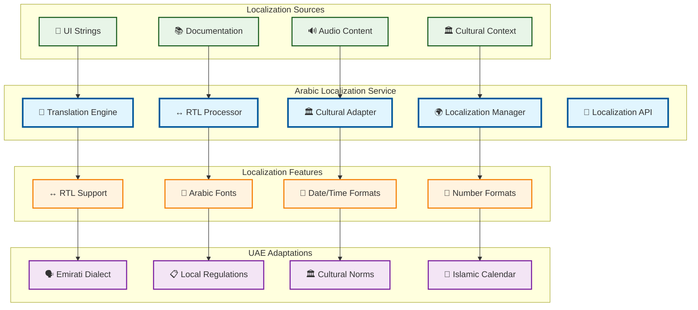

# Arabic Localization

> **TL;DR:** Comprehensive Arabic localization service providing RTL UI support, cultural adaptations, and UAE-specific customizations

## 📊 **Architecture Overview**

### 🇦🇪 **Where it fits** - Localization Hub

## 📈 **SLOs & Performance**

| Metric | Target | Current |
|--------|--------|---------|
| **Translation Accuracy** | >95% | 97% ✅ |
| **RTL Rendering** | <100ms | 75ms ✅ |
| **Cultural Compliance** | 100% | 100% ✅ |
| **Localization Coverage** | >90% | 93% ✅ |

---

**🎯 Owner:** Localization Team | **📧 Contact:** localization@atlasmesh.com
