# Cache Manager

> **TL;DR:** Distributed caching service providing high-performance data caching, session management, and real-time data synchronization

## 📊 **Architecture Overview**

### 💾 **Where it fits** - Distributed Cache Layer


### ⚡ **How it talks** - Cache Operations Pipeline

```mermaid
sequenceDiagram
    autonumber
    participant App as 🚛 Fleet Manager
    participant API as 💾 Cache API
    participant Router as 🔀 Cache Router
    participant Redis as 🔴 Redis Master
    participant DB as 🗄️ Database
    participant Monitor as 📊 Cache Monitor
    
    Note over App,Monitor: Read-Through Pattern
    App->>API: GET vehicle_state:AV-001
    Note right of App: Request cached data
    
    API->>Router: Route cache request
    Note right of API: Determine cache shard
    
    Router->>Redis: GET vehicle_state:AV-001
    Note right of Router: Check cache first
    
    alt Cache hit
        Redis-->>Router: Cached vehicle state
        Router-->>API: Cache hit data
        API-->>App: Vehicle state (cached)
        Note right of API: <1ms cache response
    else Cache miss
        Router->>DB: SELECT * FROM vehicles WHERE id='AV-001'
        Note right of Router: Fallback to database
        
        DB-->>Router: Vehicle state from DB
        Router->>Redis: SET vehicle_state:AV-001 (TTL: 5min)
        Note right of Router: Cache for future requests
        
        Router-->>API: Fresh data
        API-->>App: Vehicle state (from DB)
        Note right of API: ~50ms database response
    end
    
    API->>Monitor: Log cache operation
    Note right of API: Metrics and monitoring
    
    Note over App,Monitor: Write-Through Pattern
    App->>API: SET vehicle_state:AV-001
    Note right of App: Update vehicle state
    
    API->>Router: Route write request
    Router->>DB: UPDATE vehicles SET ... WHERE id='AV-001'
    Note right of Router: Write to database first
    
    DB-->>Router: Write confirmed
    Router->>Redis: SET vehicle_state:AV-001 (TTL: 5min)
    Note right of Router: Update cache after DB write
    
    Router-->>API: Write completed
    API-->>App: Update confirmed
    
    Note over App,Monitor: Consistent data with cache performance
```


### 🗄️ **What it owns** - Cache Strategies & Data Types

```mermaid
flowchart TB
    subgraph "Cache Strategies"
        ReadThrough[📖 Read-Through<br/>Cache loads from DB on miss]
        WriteThrough[✍️ Write-Through<br/>Write to cache and DB]
        WriteBack[📝 Write-Back<br/>Delayed DB writes]
        CacheAside[🔄 Cache-Aside<br/>Application manages cache]
    end
    
    subgraph "Data Types"
        Strings[📝 Strings<br/>Simple key-value pairs]
        Hashes[🗂️ Hashes<br/>Structured objects]
        Lists[📋 Lists<br/>Ordered collections]
        Sets[🔢 Sets<br/>Unique collections]
        SortedSets[📊 Sorted Sets<br/>Ranked collections]
    end
    
    subgraph "Cache Patterns"
        SessionCache[🎫 Session Cache<br/>User sessions, JWT tokens]
        DataCache[📊 Data Cache<br/>Database query results]
        ComputeCache[🧮 Compute Cache<br/>Expensive calculations]
        ConfigCache[⚙️ Config Cache<br/>Application configuration]
    end
    
    subgraph "Performance Features"
        Sharding[🔀 Sharding<br/>Horizontal partitioning]
        Replication[🔄 Replication<br/>High availability]
        Clustering[🌐 Clustering<br/>Distributed caching]
        Persistence[💾 Persistence<br/>Data durability]
    end
    
    subgraph "Cache Policies"
        LRU[🔄 LRU Eviction<br/>Least recently used]
        TTL[⏰ TTL Expiration<br/>Time-based expiry]
        MaxMemory[📊 Memory Limits<br/>Size-based eviction]
        Compression[🗜️ Compression<br/>Space optimization]
    end
    
    ReadThrough --> Strings
    WriteThrough --> Hashes
    WriteBack --> Lists
    CacheAside --> Sets
    
    Strings --> SessionCache
    Hashes --> DataCache
    Lists --> ComputeCache
    Sets --> ConfigCache
    
    SessionCache --> Sharding
    DataCache --> Replication
    ComputeCache --> Clustering
    ConfigCache --> Persistence
    
    Sharding --> LRU
    Replication --> TTL
    Clustering --> MaxMemory
    Persistence --> Compression
    
    classDef strategy fill:#e3f2fd,stroke:#1976d2,stroke-width:2px
    classDef datatype fill:#e8f5e8,stroke:#388e3c,stroke-width:2px
    classDef pattern fill:#fff3e0,stroke:#f57c00,stroke-width:2px
    classDef performance fill:#f3e5f5,stroke:#7b1fa2,stroke-width:2px
    classDef policy fill:#ffebee,stroke:#c62828,stroke-width:2px
    
    class ReadThrough,WriteThrough,WriteBack,CacheAside strategy
    class Strings,Hashes,Lists,Sets,SortedSets datatype
    class SessionCache,DataCache,ComputeCache,ConfigCache pattern
    class Sharding,Replication,Clustering,Persistence performance
    class LRU,TTL,MaxMemory,Compression policy
```


## 🔗 **API Contracts**

| Endpoint | Method | Description |
|----------|--------|-------------|
| `/api/v1/cache/{key}` | `GET` | Get cached value |
| `/api/v1/cache/{key}` | `PUT` | Set cached value |
| `/api/v1/cache/{key}` | `DELETE` | Delete cached value |
| `/api/v1/cache/stats` | `GET` | Cache performance statistics |

## 🚀 **Quick Start**

```bash
# Start cache manager service
make dev.cache-manager

# Set a cached value
curl -X PUT http://localhost:8080/api/v1/cache/test_key \
  -H "Content-Type: application/json" \
  -d '{"value":"test_value","ttl":300}'

# Get cached value
curl http://localhost:8080/api/v1/cache/test_key

# Get cache statistics
curl http://localhost:8080/api/v1/cache/stats

# Health check
curl http://localhost:8080/health
```

## 📈 **SLOs & Performance**

| Metric | Target | Current |
|--------|--------|---------|
| **Cache Hit Rate** | >90% | 94% ✅ |
| **Get Latency** | <1ms | 0.7ms ✅ |
| **Set Latency** | <2ms | 1.5ms ✅ |
| **Availability** | 99.99% | 99.995% ✅ |

## 💾 **Cache Configuration**

### **Redis Cluster Setup**
```yaml
# Redis Cluster Configuration
redis_cluster:
  masters: 3
  replicas_per_master: 2
  max_memory: 8GB
  eviction_policy: allkeys-lru
  persistence: rdb
  backup_interval: 1h
```

### **Cache Policies**
- **Session Data** - TTL: 30 minutes, No eviction
- **Vehicle State** - TTL: 5 minutes, LRU eviction
- **Policy Cache** - TTL: 1 hour, No eviction
- **Telemetry Cache** - TTL: 1 minute, Size-based eviction

### **Performance Optimization**
- **Connection Pooling** - Reuse Redis connections
- **Pipeline Operations** - Batch multiple commands
- **Compression** - LZ4 compression for large values
- **Monitoring** - Real-time performance metrics

## 🛡️ **High Availability & Disaster Recovery**

### **Failover Strategy**
- **Redis Sentinel** - Automatic master failover
- **Multi-AZ Deployment** - Cross-availability zone replication
- **Circuit Breakers** - Graceful degradation on cache failures
- **Backup & Recovery** - Automated backup and point-in-time recovery

### **Security**
- **Authentication** - Redis AUTH and ACLs
- **Encryption** - TLS encryption in transit
- **Network Security** - VPC isolation and security groups
- **Audit Logging** - Cache access and modification logs

## 📊 **Monitoring & Alerting**

- **Cache Dashboard** - [Cache Performance Metrics](https://grafana.atlasmesh.com/d/cache-manager)
- **Hit Rate Monitoring** - Cache effectiveness tracking
- **Memory Usage** - Redis memory utilization alerts
- **Latency Tracking** - Cache operation performance

## 🆘 **Troubleshooting**

| Issue | Solution |
|-------|----------|
| Low cache hit rate | Review TTL settings, analyze access patterns |
| High memory usage | Implement compression, optimize data structures |
| Connection timeouts | Check network latency, tune connection pools |
| Slow cache operations | Analyze Redis slow log, optimize data serialization |

---

**🎯 Owner:** Platform Infrastructure Team | **📧 Contact:** infrastructure-team@atlasmesh.com
