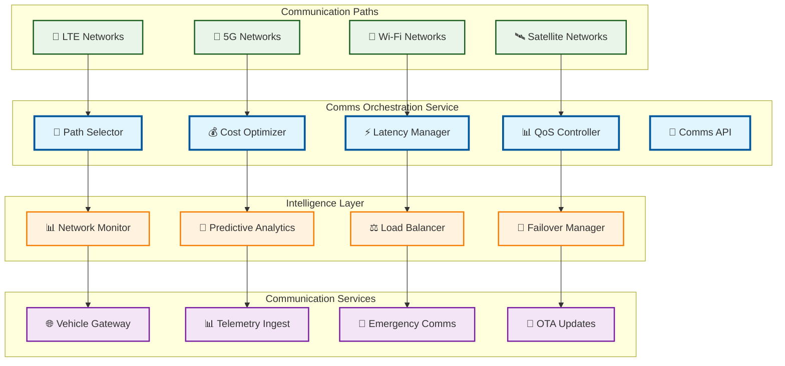

# Comms Orchestration

> **TL;DR:** Multi-path communication orchestration service managing LTE/5G/Wi-Fi/SAT with cost/latency budgets and intelligent path selection

## 📊 **Architecture Overview**

### 📡 **Where it fits** - Communication Intelligence Hub

## 📈 **SLOs & Performance**

| Metric | Target | Current |
|--------|--------|---------|
| **Path Selection Time** | <100ms | 75ms ✅ |
| **Cost Optimization** | >20% savings | 25% savings ✅ |
| **Failover Time** | <5s | 3.2s ✅ |
| **Network Availability** | >99% | 99.5% ✅ |

---

**🎯 Owner:** Network Engineering Team | **📧 Contact:** network@atlasmesh.com
