# Comms Orchestration

> **TL;DR:** Multi-path communication orchestration service managing LTE/5G/Wi-Fi/SAT with cost/latency budgets and intelligent path selection

## 📊 **Architecture Overview**

### 📡 **Where it fits** - Communication Intelligence Hub

```mermaid
graph TB
    subgraph "Communication Paths"
        LTE[📱 LTE Networks]
        FiveG[📶 5G Networks]
        WiFi[📶 Wi-Fi Networks]
        Satellite[🛰️ Satellite Networks]
    end
    
    subgraph "Comms Orchestration Service"
        PathSelector[🎯 Path Selector]
        CostOptimizer[💰 Cost Optimizer]
        LatencyManager[⚡ Latency Manager]
        QoSController[📊 QoS Controller]
        CommsAPI[📡 Comms API]
    end
    
    subgraph "Intelligence Layer"
        NetworkMonitor[📊 Network Monitor]
        PredictiveAnalytics[🔮 Predictive Analytics]
        LoadBalancer[⚖️ Load Balancer]
        FailoverManager[🔄 Failover Manager]
    end
    
    subgraph "Communication Services"
        VehicleGateway[🌐 Vehicle Gateway]
        TelemetryIngest[📊 Telemetry Ingest]
        EmergencyComms[🚨 Emergency Comms]
        OTAUpdates[📲 OTA Updates]
    end
    
    LTE --> PathSelector
    FiveG --> CostOptimizer
    WiFi --> LatencyManager
    Satellite --> QoSController
    
    PathSelector --> NetworkMonitor
    CostOptimizer --> PredictiveAnalytics
    LatencyManager --> LoadBalancer
    QoSController --> FailoverManager
    
    NetworkMonitor --> VehicleGateway
    PredictiveAnalytics --> TelemetryIngest
    LoadBalancer --> EmergencyComms
    FailoverManager --> OTAUpdates
    
    classDef path fill:#e8f5e8,stroke:#1b5e20,stroke-width:2px
    classDef orchestration fill:#e1f5fe,stroke:#01579b,stroke-width:3px
    classDef intelligence fill:#fff3e0,stroke:#f57c00,stroke-width:2px
    classDef service fill:#f3e5f5,stroke:#7b1fa2,stroke-width:2px
    
    class LTE,FiveG,WiFi,Satellite path
    class PathSelector,CostOptimizer,LatencyManager,QoSController,CommsAPI orchestration
    class NetworkMonitor,PredictiveAnalytics,LoadBalancer,FailoverManager intelligence
    class VehicleGateway,TelemetryIngest,EmergencyComms,OTAUpdates service
```

## 📈 **SLOs & Performance**

| Metric | Target | Current |
|--------|--------|---------|
| **Path Selection Time** | <100ms | 75ms ✅ |
| **Cost Optimization** | >20% savings | 25% savings ✅ |
| **Failover Time** | <5s | 3.2s ✅ |
| **Network Availability** | >99% | 99.5% ✅ |

---

**🎯 Owner:** Network Engineering Team | **📧 Contact:** network@atlasmesh.com
