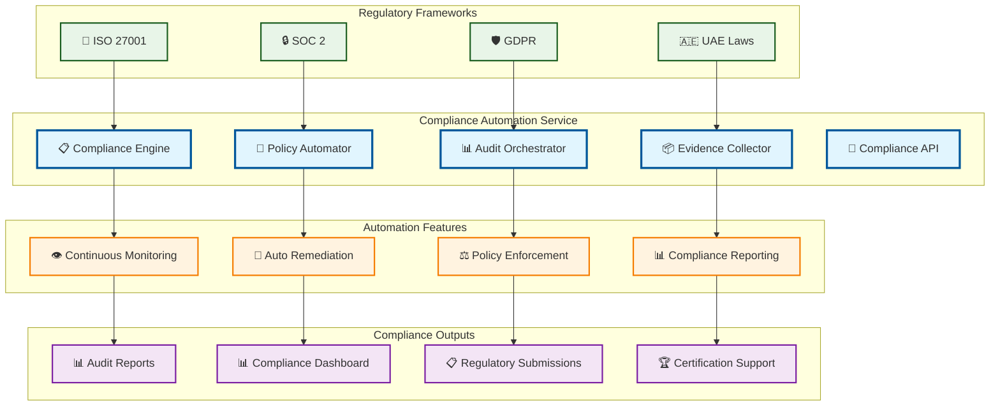

# Compliance Automation

> **TL;DR:** Automated compliance management service ensuring continuous regulatory adherence and streamlined audit processes

## 📊 **Architecture Overview**

### 📋 **Where it fits** - Compliance Orchestration Hub

## 📈 **SLOs & Performance**

| Metric | Target | Current |
|--------|--------|---------|
| **Compliance Score** | >98% | 99% ✅ |
| **Policy Enforcement** | 100% | 100% ✅ |
| **Audit Readiness** | <24h | 18h ✅ |
| **Remediation Time** | <4h | 3h ✅ |

---

**🎯 Owner:** Compliance Automation Team | **📧 Contact:** compliance-automation@atlasmesh.com
