# Compliance Automation

> **TL;DR:** Automated compliance management service ensuring continuous regulatory adherence and streamlined audit processes

## 📊 **Architecture Overview**

### 📋 **Where it fits** - Compliance Orchestration Hub

```mermaid
graph TB
    subgraph "Regulatory Frameworks"
        ISO27001[📜 ISO 27001]
        SOC2[🔒 SOC 2]
        GDPR[🛡️ GDPR]
        UAE_Laws[🇦🇪 UAE Laws]
    end
    
    subgraph "Compliance Automation Service"
        ComplianceEngine[📋 Compliance Engine]
        PolicyAutomator[🤖 Policy Automator]
        AuditOrchestrator[📊 Audit Orchestrator]
        EvidenceCollector[📦 Evidence Collector]
        ComplianceAPI[🔌 Compliance API]
    end
    
    subgraph "Automation Features"
        ContinuousMonitoring[👁️ Continuous Monitoring]
        AutoRemediation[🔧 Auto Remediation]
        PolicyEnforcement[⚖️ Policy Enforcement]
        ComplianceReporting[📊 Compliance Reporting]
    end
    
    subgraph "Compliance Outputs"
        AuditReports[📊 Audit Reports]
        ComplianceDashboard[📊 Compliance Dashboard]
        RegulatorySubmissions[📋 Regulatory Submissions]
        CertificationSupport[🏆 Certification Support]
    end
    
    ISO27001 --> ComplianceEngine
    SOC2 --> PolicyAutomator
    GDPR --> AuditOrchestrator
    UAE_Laws --> EvidenceCollector
    
    ComplianceEngine --> ContinuousMonitoring
    PolicyAutomator --> AutoRemediation
    AuditOrchestrator --> PolicyEnforcement
    EvidenceCollector --> ComplianceReporting
    
    ContinuousMonitoring --> AuditReports
    AutoRemediation --> ComplianceDashboard
    PolicyEnforcement --> RegulatorySubmissions
    ComplianceReporting --> CertificationSupport
    
    classDef framework fill:#e8f5e8,stroke:#1b5e20,stroke-width:2px
    classDef compliance fill:#e1f5fe,stroke:#01579b,stroke-width:3px
    classDef automation fill:#fff3e0,stroke:#f57c00,stroke-width:2px
    classDef output fill:#f3e5f5,stroke:#7b1fa2,stroke-width:2px
    
    class ISO27001,SOC2,GDPR,UAE_Laws framework
    class ComplianceEngine,PolicyAutomator,AuditOrchestrator,EvidenceCollector,ComplianceAPI compliance
    class ContinuousMonitoring,AutoRemediation,PolicyEnforcement,ComplianceReporting automation
    class AuditReports,ComplianceDashboard,RegulatorySubmissions,CertificationSupport output
```

## 📈 **SLOs & Performance**

| Metric | Target | Current |
|--------|--------|---------|
| **Compliance Score** | >98% | 99% ✅ |
| **Policy Enforcement** | 100% | 100% ✅ |
| **Audit Readiness** | <24h | 18h ✅ |
| **Remediation Time** | <4h | 3h ✅ |

---

**🎯 Owner:** Compliance Automation Team | **📧 Contact:** compliance-automation@atlasmesh.com
