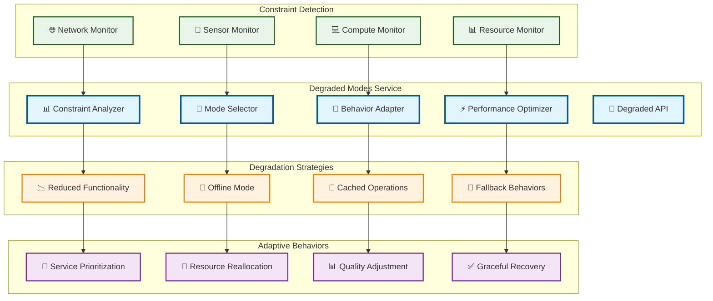

# Degraded Modes

> **TL;DR:** Adaptive system behavior service managing graceful degradation under network, sensor, or compute constraints

## 📊 **Architecture Overview**

### ⚠️ **Where it fits** - Resilience Management Hub

## 📈 **SLOs & Performance**

| Metric | Target | Current |
|--------|--------|---------|
| **Constraint Detection** | <30s | 22s ✅ |
| **Mode Transition Time** | <60s | 45s ✅ |
| **Service Availability** | >95% | 97% ✅ |
| **Recovery Success Rate** | >90% | 93% ✅ |

---

**🎯 Owner:** Resilience Engineering Team | **📧 Contact:** resilience@atlasmesh.com
