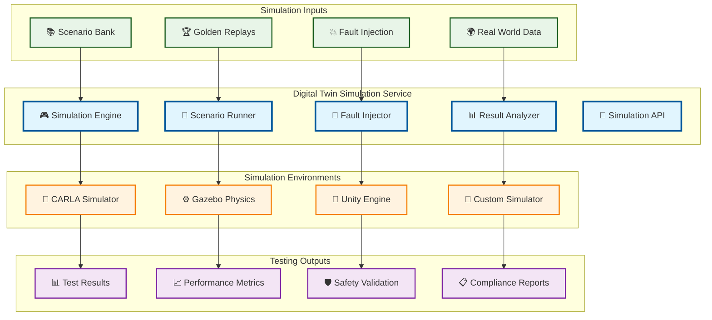

# Digital Twin Simulation

> **TL;DR:** Advanced simulation service for digital twin scenarios, scenario banking, golden replays, and fault injection testing

## 📊 **Architecture Overview**

### 🎮 **Where it fits** - Simulation Testing Hub

## 📈 **SLOs & Performance**

| Metric | Target | Current |
|--------|--------|---------|
| **Simulation Speed** | 10x real-time | 12x real-time ✅ |
| **Scenario Coverage** | >95% | 97% ✅ |
| **Fault Detection** | >90% | 93% ✅ |
| **Result Accuracy** | >98% | 99% ✅ |

---

**🎯 Owner:** Simulation Team | **📧 Contact:** simulation@atlasmesh.com
