# Digital Twin Simulation

> **TL;DR:** Advanced simulation service for digital twin scenarios, scenario banking, golden replays, and fault injection testing

## 📊 **Architecture Overview**

### 🎮 **Where it fits** - Simulation Testing Hub

```mermaid
graph TB
    subgraph "Simulation Inputs"
        ScenarioBank[📚 Scenario Bank]
        GoldenReplays[🏆 Golden Replays]
        FaultInjection[💥 Fault Injection]
        RealWorldData[🌍 Real World Data]
    end
    
    subgraph "Digital Twin Simulation Service"
        SimulationEngine[🎮 Simulation Engine]
        ScenarioRunner[🏃 Scenario Runner]
        FaultInjector[💉 Fault Injector]
        ResultAnalyzer[📊 Result Analyzer]
        SimulationAPI[🔌 Simulation API]
    end
    
    subgraph "Simulation Environments"
        CARLASimulator[🚗 CARLA Simulator]
        GazeboPhysics[⚙️ Gazebo Physics]
        UnityEngine[🎯 Unity Engine]
        CustomSimulator[🔧 Custom Simulator]
    end
    
    subgraph "Testing Outputs"
        TestResults[📊 Test Results]
        PerformanceMetrics[📈 Performance Metrics]
        SafetyValidation[🛡️ Safety Validation]
        ComplianceReports[📋 Compliance Reports]
    end
    
    ScenarioBank --> SimulationEngine
    GoldenReplays --> ScenarioRunner
    FaultInjection --> FaultInjector
    RealWorldData --> ResultAnalyzer
    
    SimulationEngine --> CARLASimulator
    ScenarioRunner --> GazeboPhysics
    FaultInjector --> UnityEngine
    ResultAnalyzer --> CustomSimulator
    
    CARLASimulator --> TestResults
    GazeboPhysics --> PerformanceMetrics
    UnityEngine --> SafetyValidation
    CustomSimulator --> ComplianceReports
    
    classDef input fill:#e8f5e8,stroke:#1b5e20,stroke-width:2px
    classDef simulation fill:#e1f5fe,stroke:#01579b,stroke-width:3px
    classDef environment fill:#fff3e0,stroke:#f57c00,stroke-width:2px
    classDef output fill:#f3e5f5,stroke:#7b1fa2,stroke-width:2px
    
    class ScenarioBank,GoldenReplays,FaultInjection,RealWorldData input
    class SimulationEngine,ScenarioRunner,FaultInjector,ResultAnalyzer,SimulationAPI simulation
    class CARLASimulator,GazeboPhysics,UnityEngine,CustomSimulator environment
    class TestResults,PerformanceMetrics,SafetyValidation,ComplianceReports output
```

## 📈 **SLOs & Performance**

| Metric | Target | Current |
|--------|--------|---------|
| **Simulation Speed** | 10x real-time | 12x real-time ✅ |
| **Scenario Coverage** | >95% | 97% ✅ |
| **Fault Detection** | >90% | 93% ✅ |
| **Result Accuracy** | >98% | 99% ✅ |

---

**🎯 Owner:** Simulation Team | **📧 Contact:** simulation@atlasmesh.com
