# Digital Twin

> **TL;DR:** Real-time digital twin simulation service providing virtual fleet modeling, scenario testing, and predictive analytics

## 📊 **Architecture Overview**

### 🔄 **Where it fits** - Virtual Fleet Mirror

```mermaid
graph TB
    subgraph "Physical Fleet"
        RealVehicles[🚗 Real Vehicles]
        RealSensors[📡 Real Sensors]
        RealEnvironment[🌍 Real Environment]
        RealOperations[🚛 Real Operations]
    end
    
    subgraph "Digital Twin Service"
        TwinEngine[🔄 Twin Engine]
        SimulationCore[🎮 Simulation Core]
        StateSync[🔄 State Synchronization]
        ScenarioRunner[🎬 Scenario Runner]
        TwinAPI[🔗 Twin API]
    end
    
    subgraph "Virtual Fleet"
        VirtualVehicles[🚗💻 Virtual Vehicles]
        VirtualSensors[📡💻 Virtual Sensors]
        VirtualEnvironment[🌍💻 Virtual Environment]
        VirtualOperations[🚛💻 Virtual Operations]
    end
    
    subgraph "Simulation Engines"
        CARLA[🎮 CARLA Simulator]
        Gazebo[🤖 Gazebo Physics]
        Unity3D[🎯 Unity 3D Engine]
        CustomPhysics[⚙️ Custom Physics]
    end
    
    subgraph "Twin Consumers"
        TestingFramework[🧪 Testing Framework]
        TrainingPipeline[🎓 ML Training]
        PolicyValidation[📋 Policy Validation]
        WhatIfAnalysis[🤔 What-If Analysis]
        Dashboard[📊 Twin Dashboard]
    end
    
    subgraph "Data Synchronization"
        RealTimeSync[⚡ Real-time Sync]
        BatchSync[📦 Batch Sync]
        EventSync[📨 Event Sync]
        StateStore[(💾 State Store)]
    end
    
    RealVehicles --> StateSync
    RealSensors --> StateSync
    RealEnvironment --> StateSync
    RealOperations --> StateSync
    
    StateSync --> TwinEngine
    TwinEngine --> SimulationCore
    SimulationCore --> ScenarioRunner
    ScenarioRunner --> TwinAPI
    
    TwinEngine --> VirtualVehicles
    TwinEngine --> VirtualSensors
    TwinEngine --> VirtualEnvironment
    TwinEngine --> VirtualOperations
    
    SimulationCore --> CARLA
    SimulationCore --> Gazebo
    SimulationCore --> Unity3D
    SimulationCore --> CustomPhysics
    
    TwinAPI --> TestingFramework
    TwinAPI --> TrainingPipeline
    TwinAPI --> PolicyValidation
    TwinAPI --> WhatIfAnalysis
    TwinAPI --> Dashboard
    
    StateSync --> RealTimeSync
    StateSync --> BatchSync
    StateSync --> EventSync
    StateSync --> StateStore
    
    classDef physical fill:#e8f5e8,stroke:#1b5e20,stroke-width:2px
    classDef service fill:#e1f5fe,stroke:#01579b,stroke-width:3px
    classDef virtual fill:#f3e5f5,stroke:#7b1fa2,stroke-width:2px
    classDef engine fill:#fff3e0,stroke:#f57c00,stroke-width:2px
    classDef consumer fill:#ffebee,stroke:#c62828,stroke-width:2px
    classDef sync fill:#e0f2f1,stroke:#00695c,stroke-width:2px
    
    class RealVehicles,RealSensors,RealEnvironment,RealOperations physical
    class TwinEngine,SimulationCore,StateSync,ScenarioRunner,TwinAPI service
    class VirtualVehicles,VirtualSensors,VirtualEnvironment,VirtualOperations virtual
    class CARLA,Gazebo,Unity3D,CustomPhysics engine
    class TestingFramework,TrainingPipeline,PolicyValidation,WhatIfAnalysis,Dashboard consumer
    class RealTimeSync,BatchSync,EventSync,StateStore sync
```


### ⚡ **How it talks** - Real-time Twin Synchronization

```mermaid
sequenceDiagram
    autonumber
    participant Physical as 🚗 Physical Vehicle
    participant Sync as 🔄 State Sync
    participant Twin as 🔄 Twin Engine
    participant Sim as 🎮 Simulation Core
    participant Test as 🧪 Testing Framework
    participant ML as 🎓 ML Training
    
    loop Every 100ms
        Physical->>Sync: Real-time telemetry
        Note right of Physical: Position, speed, sensor data
        
        Sync->>Twin: Update virtual state
        Note right of Sync: Synchronize digital twin
        
        Twin->>Sim: Update simulation model
        Note right of Twin: Physics and behavior sync
        
        Sim->>Sim: Run simulation step
        Note right of Sim: Advance virtual time
        
        Twin->>Sync: Virtual telemetry
        Note right of Twin: Predicted future states
    end
    
    Note over Physical,ML: --- Scenario Testing ---
    
    Test->>Twin: Load test scenario
    Note right of Test: Emergency braking scenario
    
    Twin->>Sim: Initialize scenario
    Note right of Twin: Set initial conditions
    
    Sim->>Sim: Run scenario simulation
    Note right of Sim: Execute test case
    
    Sim->>Twin: Scenario results
    Note right of Sim: Performance metrics
    
    Twin->>Test: Test outcomes
    Note right of Twin: Pass/fail results
    
    Note over Physical,ML: --- ML Training ---
    
    ML->>Twin: Request training data
    Note right of ML: Synthetic data generation
    
    Twin->>Sim: Generate scenarios
    Note right of Twin: Diverse training scenarios
    
    Sim->>Twin: Simulation data
    Note right of Sim: Labeled training examples
    
    Twin->>ML: Training dataset
    Note right of Twin: High-quality synthetic data
    
    Note over Physical,ML: Digital twin enables safe testing and training
```


### 🎮 **What it owns** - Simulation Capabilities & Scenarios

```mermaid
flowchart TB
    subgraph "Vehicle Models"
        PhysicsModel[⚙️ Physics Model<br/>Mass, inertia, dynamics]
        SensorModel[📡 Sensor Model<br/>LiDAR, camera, radar]
        ActuatorModel[🎮 Actuator Model<br/>Steering, braking, throttle]
        BehaviorModel[🧠 Behavior Model<br/>Autonomous driving logic]
    end
    
    subgraph "Environment Models"
        RoadNetwork[🛣️ Road Network<br/>HD maps, traffic rules]
        WeatherModel[🌤️ Weather Model<br/>Rain, fog, wind effects]
        TrafficModel[🚦 Traffic Model<br/>Other vehicles, pedestrians]
        InfrastructureModel[🏗️ Infrastructure<br/>Traffic lights, signs]
    end
    
    subgraph "Scenario Categories"
        SafetyScenarios[🛡️ Safety Scenarios<br/>Emergency situations]
        PerformanceScenarios[📊 Performance Scenarios<br/>Efficiency testing]
        EdgeCaseScenarios[⚠️ Edge Case Scenarios<br/>Rare situations]
        ValidationScenarios[✅ Validation Scenarios<br/>Compliance testing]
    end
    
    subgraph "Simulation Outputs"
        PerformanceMetrics[📈 Performance Metrics<br/>Speed, efficiency, safety]
        BehaviorAnalysis[🔍 Behavior Analysis<br/>Decision patterns]
        RiskAssessment[⚠️ Risk Assessment<br/>Safety evaluation]
        OptimizationData[⚖️ Optimization Data<br/>Parameter tuning]
    end
    
    subgraph "Use Cases"
        AlgorithmTesting[🧪 Algorithm Testing<br/>Autonomous driving algorithms]
        PolicyValidation[📋 Policy Validation<br/>Fleet operation policies]
        TrainingDataGen[🎓 Training Data Generation<br/>ML model training]
        WhatIfAnalysis[🤔 What-If Analysis<br/>Scenario exploration]
    end
    
    PhysicsModel --> SafetyScenarios
    SensorModel --> PerformanceScenarios
    ActuatorModel --> EdgeCaseScenarios
    BehaviorModel --> ValidationScenarios
    
    RoadNetwork --> SafetyScenarios
    WeatherModel --> PerformanceScenarios
    TrafficModel --> EdgeCaseScenarios
    InfrastructureModel --> ValidationScenarios
    
    SafetyScenarios --> PerformanceMetrics
    PerformanceScenarios --> BehaviorAnalysis
    EdgeCaseScenarios --> RiskAssessment
    ValidationScenarios --> OptimizationData
    
    PerformanceMetrics --> AlgorithmTesting
    BehaviorAnalysis --> PolicyValidation
    RiskAssessment --> TrainingDataGen
    OptimizationData --> WhatIfAnalysis
    
    classDef vehicle fill:#e8f5e8,stroke:#388e3c,stroke-width:2px
    classDef environment fill:#e3f2fd,stroke:#1976d2,stroke-width:2px
    classDef scenario fill:#fff3e0,stroke:#f57c00,stroke-width:2px
    classDef output fill:#f3e5f5,stroke:#7b1fa2,stroke-width:2px
    classDef usecase fill:#ffebee,stroke:#c62828,stroke-width:2px
    
    class PhysicsModel,SensorModel,ActuatorModel,BehaviorModel vehicle
    class RoadNetwork,WeatherModel,TrafficModel,InfrastructureModel environment
    class SafetyScenarios,PerformanceScenarios,EdgeCaseScenarios,ValidationScenarios scenario
    class PerformanceMetrics,BehaviorAnalysis,RiskAssessment,OptimizationData output
    class AlgorithmTesting,PolicyValidation,TrainingDataGen,WhatIfAnalysis usecase
```


## 🔗 **API Contracts**

| Endpoint | Method | Description |
|----------|--------|-------------|
| `/api/v1/twin/vehicles/{id}/state` | `GET` | Get virtual vehicle state |
| `/api/v1/twin/scenarios` | `POST` | Create simulation scenario |
| `/api/v1/twin/simulations/{id}/run` | `POST` | Execute simulation |
| `/api/v1/twin/results/{id}` | `GET` | Get simulation results |

## 🚀 **Quick Start**

```bash
# Start digital twin service
make dev.digital-twin

# Create a virtual vehicle
curl -X POST http://localhost:8080/api/v1/twin/vehicles \
  -H "Content-Type: application/json" \
  -d '{"physical_vehicle_id":"AV-001","model_type":"sedan"}'

# Run emergency braking scenario
curl -X POST http://localhost:8080/api/v1/twin/scenarios \
  -H "Content-Type: application/json" \
  -d '{"type":"emergency_braking","vehicle_id":"twin-001","initial_speed":60}'

# Health check
curl http://localhost:8080/health
```

## 📈 **SLOs & Performance**

| Metric | Target | Current |
|--------|--------|---------|
| **Simulation Real-time Factor** | 1.0x | 1.2x ✅ |
| **State Sync Latency** | <100ms | 75ms ✅ |
| **Scenario Accuracy** | >95% | 97% ✅ |
| **Availability** | 99.9% | 99.95% ✅ |

## 🎮 **Simulation Capabilities**

### **Supported Simulators**
- **CARLA** - Open-source autonomous driving simulator
- **Gazebo** - Robot simulation with physics engine
- **Unity 3D** - High-fidelity visual simulation
- **Custom Physics** - Domain-specific physics models

### **Scenario Library**
```yaml
# Example Scenario Categories
scenarios:
  safety:
    - emergency_braking
    - obstacle_avoidance
    - intersection_collision
    - pedestrian_crossing
  
  performance:
    - fuel_efficiency
    - route_optimization
    - traffic_flow
    - parking_maneuvers
  
  edge_cases:
    - sensor_failure
    - weather_extremes
    - construction_zones
    - unusual_traffic_patterns
```

### **Validation Metrics**
- **Physics Accuracy** - Real vs. virtual behavior correlation
- **Sensor Fidelity** - Sensor simulation accuracy
- **Behavioral Consistency** - Decision-making alignment
- **Performance Correlation** - Real-world performance prediction

## 🛡️ **Safety & Validation**

### **Twin-Gated CI/CD**
- **Algorithm Validation** - Test autonomous driving algorithms safely
- **Policy Testing** - Validate fleet operation policies
- **Regression Testing** - Ensure system changes don't break functionality
- **Compliance Verification** - Test against regulatory requirements

### **Risk Mitigation**
- **Safe Testing Environment** - Test dangerous scenarios safely
- **Failure Analysis** - Understand failure modes without real-world risk
- **Edge Case Exploration** - Test rare but critical scenarios
- **Performance Optimization** - Optimize without fleet downtime

## 📊 **Monitoring & Analytics**

- **Twin Dashboard** - [Digital Twin Analytics](https://grafana.atlasmesh.com/d/digital-twin)
- **Simulation Performance** - Real-time factor, accuracy metrics
- **Scenario Coverage** - Test scenario execution and results
- **Model Validation** - Twin accuracy vs. real-world performance

## 🆘 **Troubleshooting**

| Issue | Solution |
|-------|----------|
| Poor simulation performance | Optimize physics models, reduce simulation complexity |
| State synchronization lag | Check network latency, optimize data serialization |
| Inaccurate simulation results | Calibrate physics parameters, validate sensor models |
| Scenario execution failures | Debug scenario scripts, check initial conditions |

---

**🎯 Owner:** Simulation & Validation Team | **📧 Contact:** simulation-team@atlasmesh.com
