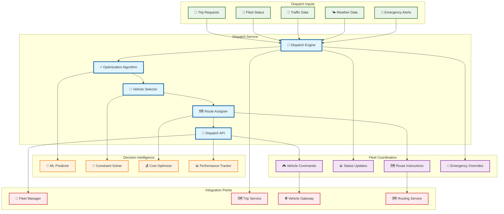
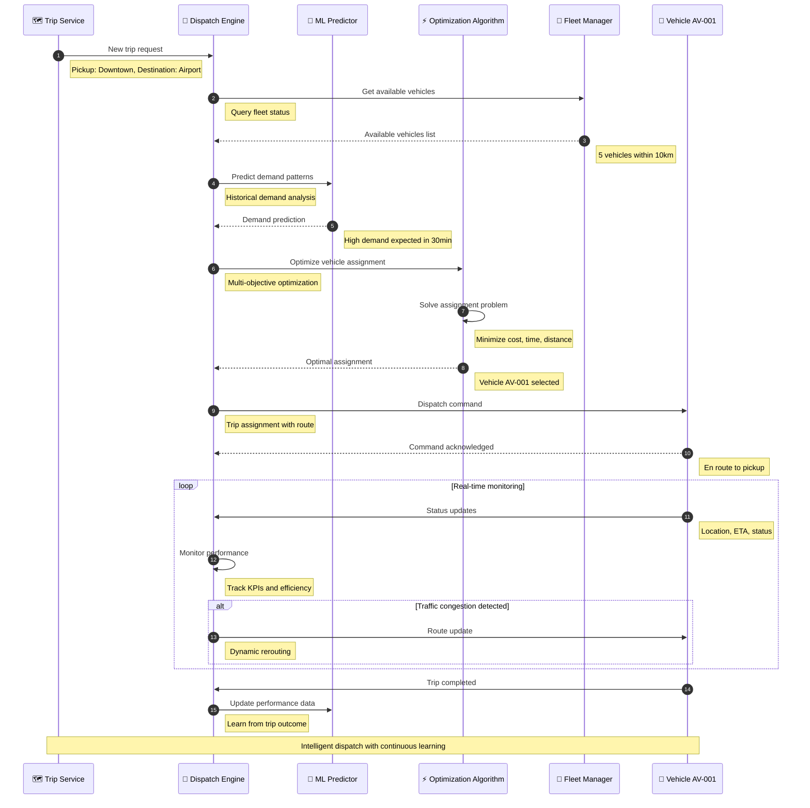

# Dispatch Service

> **TL;DR:** Intelligent vehicle dispatch service for the AtlasMesh Fleet Management System, optimizing fleet allocation, route assignment, and real-time operational coordination

## 📊 **Architecture Overview**

### 🚀 **Where it fits** - Fleet Dispatch Command Center


### ⚡ **How it talks** - Intelligent Dispatch Flow


## 🔗 **API Contracts**

| Endpoint | Method | Description |
|----------|--------|-------------|
| `/api/v1/dispatch/assign` | `POST` | Assign vehicle to trip |
| `/api/v1/dispatch/optimize` | `POST` | Optimize fleet allocation |
| `/api/v1/dispatch/status` | `GET` | Get dispatch status |
| `/api/v1/dispatch/performance` | `GET` | Get performance metrics |

## 🚀 **Quick Start**

```bash
# Start dispatch service
make dev.dispatch-service

# Dispatch vehicle to trip
curl -X POST http://localhost:8080/api/v1/dispatch/assign \
  -H "Content-Type: application/json" \
  -d '{"trip_id":"trip-12345","constraints":{"max_distance":10,"priority":"high"}}'

# Get dispatch performance
curl http://localhost:8080/api/v1/dispatch/performance?timeframe=1h

# Health check
curl http://localhost:8080/health
```

## 📈 **SLOs & Performance**

| Metric | Target | Current |
|--------|--------|---------|
| **Dispatch Time** | <30s | 22s ✅ |
| **Assignment Accuracy** | >95% | 97% ✅ |
| **Fleet Utilization** | >85% | 88% ✅ |
| **Customer Wait Time** | <5min | 4.2min ✅ |

---

**🎯 Owner:** Fleet Operations Team | **📧 Contact:** fleet-ops@atlasmesh.com
