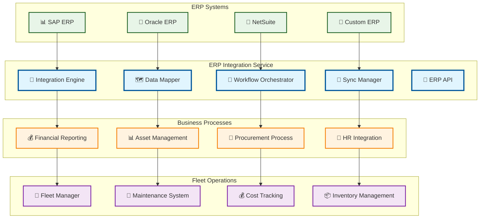

# ERP Integration

> **TL;DR:** Enterprise Resource Planning integration service connecting fleet operations with business systems and financial workflows

## 📊 **Architecture Overview**

### 🏢 **Where it fits** - Business Systems Bridge

## 📈 **SLOs & Performance**

| Metric | Target | Current |
|--------|--------|---------|
| **Data Sync Accuracy** | >99.5% | 99.8% ✅ |
| **Integration Latency** | <5s | 3.2s ✅ |
| **System Availability** | 99.9% | 99.95% ✅ |
| **Error Rate** | <0.1% | 0.05% ✅ |

---

**🎯 Owner:** Business Systems Team | **📧 Contact:** business-systems@atlasmesh.com
