# Event Bus

> **TL;DR:** Kafka-based event streaming platform providing reliable, scalable messaging backbone for the entire fleet ecosystem

## 📊 **Architecture Overview**

### 📨 **Where it fits** - Messaging Backbone

```mermaid
graph TB
    subgraph "Event Producers"
        FleetManager[🚛 Fleet Manager]
        VehicleGateway[🌐 Vehicle Gateway]
        TelemetryIngest[📊 Telemetry Ingest]
        AuthService[🔐 Auth Service]
        PolicyEngine[⚖️ Policy Engine]
    end
    
    subgraph "Event Bus Infrastructure"
        KafkaCluster[📨 Kafka Cluster]
        SchemaRegistry[📋 Schema Registry]
        ConnectCluster[🔌 Kafka Connect]
        KafkaUI[🖥️ Kafka UI]
    end
    
    subgraph "Topic Categories"
        VehicleEvents[🚗 vehicle.events.*]
        FleetEvents[🚛 fleet.events.*]
        TelemetryEvents[📊 telemetry.events.*]
        SafetyEvents[🚨 safety.events.*]
        AuditEvents[📝 audit.events.*]
    end
    
    subgraph "Event Consumers"
        Analytics[📈 Analytics Service]
        MLPipeline[🤖 ML Pipeline]
        Monitoring[📊 Monitoring]
        DataWarehouse[🏢 Data Warehouse]
        Alerting[🚨 Alert System]
    end
    
    subgraph "Dead Letter Queue"
        DLQ[💀 Dead Letter Queue]
        DLQProcessor[🔄 DLQ Processor]
        ErrorAnalysis[🔍 Error Analysis]
    end
    
    FleetManager --> KafkaCluster
    VehicleGateway --> KafkaCluster
    TelemetryIngest --> KafkaCluster
    AuthService --> KafkaCluster
    PolicyEngine --> KafkaCluster
    
    KafkaCluster --> VehicleEvents
    KafkaCluster --> FleetEvents
    KafkaCluster --> TelemetryEvents
    KafkaCluster --> SafetyEvents
    KafkaCluster --> AuditEvents
    
    VehicleEvents --> Analytics
    FleetEvents --> MLPipeline
    TelemetryEvents --> Monitoring
    SafetyEvents --> DataWarehouse
    AuditEvents --> Alerting
    
    KafkaCluster --> DLQ
    DLQ --> DLQProcessor
    DLQProcessor --> ErrorAnalysis
    
    SchemaRegistry --> KafkaCluster
    ConnectCluster --> KafkaCluster
    KafkaUI --> KafkaCluster
    
    classDef producer fill:#e8f5e8,stroke:#1b5e20,stroke-width:2px
    classDef infrastructure fill:#e1f5fe,stroke:#01579b,stroke-width:3px
    classDef topic fill:#fff3e0,stroke:#f57c00,stroke-width:2px
    classDef consumer fill:#f3e5f5,stroke:#7b1fa2,stroke-width:2px
    classDef dlq fill:#ffebee,stroke:#c62828,stroke-width:2px
    
    class FleetManager,VehicleGateway,TelemetryIngest,AuthService,PolicyEngine producer
    class KafkaCluster,SchemaRegistry,ConnectCluster,KafkaUI infrastructure
    class VehicleEvents,FleetEvents,TelemetryEvents,SafetyEvents,AuditEvents topic
    class Analytics,MLPipeline,Monitoring,DataWarehouse,Alerting consumer
    class DLQ,DLQProcessor,ErrorAnalysis dlq
```


### ⚡ **How it talks** - Event Flow Processing


### 📋 **What it owns** - Topic Schema & Governance

```mermaid
flowchart TB
    subgraph "Topic Naming Convention"
        Domain[📂 Domain]
        EventType[📝 Event Type]
        Version[🔢 Version]
        Partition[🗂️ Partition Strategy]
    end
    
    subgraph "Vehicle Topics"
        VehicleState[🚗 vehicle.state.v1]
        VehicleCommands[🎮 vehicle.commands.v1]
        VehicleTelemetry[📊 vehicle.telemetry.v1]
        VehicleAlerts[🚨 vehicle.alerts.v1]
    end
    
    subgraph "Fleet Topics"
        FleetOperations[🚛 fleet.operations.v1]
        TripEvents[🗺️ fleet.trips.v1]
        DispatchEvents[📋 fleet.dispatch.v1]
        CapacityEvents[📊 fleet.capacity.v1]
    end
    
    subgraph "Safety Topics"
        EmergencyEvents[🚨 safety.emergency.v1]
        FallbackEvents[⚠️ safety.fallback.v1]
        ComplianceEvents[📜 safety.compliance.v1]
        AuditEvents[📝 safety.audit.v1]
    end
    
    subgraph "Schema Evolution"
        BackwardCompat[⬅️ Backward Compatible]
        ForwardCompat[➡️ Forward Compatible]
        FullCompat[🔄 Full Compatible]
        Breaking[💥 Breaking Changes]
    end
    
    subgraph "Data Governance"
        DataClassification[🏷️ Data Classification]
        RetentionPolicies[📅 Retention Policies]
        AccessControl[🔐 Access Control]
        Encryption[🔒 Encryption at Rest]
    end
    
    Domain --> VehicleState
    EventType --> VehicleCommands
    Version --> VehicleTelemetry
    Partition --> VehicleAlerts
    
    VehicleState --> BackwardCompat
    FleetOperations --> ForwardCompat
    EmergencyEvents --> FullCompat
    AuditEvents --> Breaking
    
    BackwardCompat --> DataClassification
    ForwardCompat --> RetentionPolicies
    FullCompat --> AccessControl
    Breaking --> Encryption
    
    classDef naming fill:#e3f2fd,stroke:#1976d2,stroke-width:2px
    classDef vehicle fill:#e8f5e8,stroke:#388e3c,stroke-width:2px
    classDef fleet fill:#fff3e0,stroke:#f57c00,stroke-width:2px
    classDef safety fill:#ffebee,stroke:#c62828,stroke-width:2px
    classDef schema fill:#f3e5f5,stroke:#7b1fa2,stroke-width:2px
    classDef governance fill:#fce4ec,stroke:#ad1457,stroke-width:2px
    
    class Domain,EventType,Version,Partition naming
    class VehicleState,VehicleCommands,VehicleTelemetry,VehicleAlerts vehicle
    class FleetOperations,TripEvents,DispatchEvents,CapacityEvents fleet
    class EmergencyEvents,FallbackEvents,ComplianceEvents,AuditEvents safety
    class BackwardCompat,ForwardCompat,FullCompat,Breaking schema
    class DataClassification,RetentionPolicies,AccessControl,Encryption governance
```


## 🔗 **Topic Catalog**

| Topic Name | Schema | Partitions | Retention | Description |
|------------|--------|------------|-----------|-------------|
| `vehicle.state.v1` | VehicleState.avsc | 50 | 7 days | Real-time vehicle status |
| `vehicle.commands.v1` | VehicleCommand.avsc | 50 | 30 days | Vehicle control commands |
| `fleet.operations.v1` | FleetOperation.avsc | 10 | 90 days | Fleet operational events |
| `safety.emergency.v1` | EmergencyEvent.avsc | 5 | 7 years | Emergency safety events |
| `telemetry.raw.v1` | TelemetryBatch.avsc | 100 | 24 hours | Raw telemetry ingestion |

## 🚀 **Quick Start**

```bash
# Start Kafka cluster locally
make dev.event-bus

# Create a new topic
kafka-topics --create --topic test.events.v1 \
  --partitions 3 --replication-factor 1 \
  --bootstrap-server localhost:9092

# Produce test message
echo '{"event_id":"test-001","timestamp":"2024-01-15T10:00:00Z"}' | \
  kafka-console-producer --topic test.events.v1 \
  --bootstrap-server localhost:9092

# Consume messages
kafka-console-consumer --topic test.events.v1 \
  --from-beginning --bootstrap-server localhost:9092
```

## 📈 **SLOs & Performance**

| Metric | Target | Current |
|--------|--------|---------|
| **Throughput** | 1M msg/s | 850K msg/s ✅ |
| **P99 Latency** | 10ms | 8ms ✅ |
| **Availability** | 99.99% | 99.995% ✅ |
| **Data Durability** | 99.999% | 99.9995% ✅ |

## 🛡️ **Reliability & Governance**

### **Message Guarantees**
- **At-least-once delivery** - No message loss
- **Ordering guarantees** - Per-partition message ordering
- **Durability** - Configurable replication factor (min: 3)
- **Idempotency** - Producer idempotence enabled

### **Schema Management**
- **Avro schemas** - Strongly typed message contracts
- **Schema evolution** - Backward/forward compatibility
- **Schema registry** - Centralized schema management
- **Version control** - Git-based schema versioning

## 📊 **Monitoring & Operations**

- **Kafka UI** - [Event Bus Dashboard](http://localhost:8080) (local dev)
- **Cluster Metrics** - [Kafka Cluster Health](https://grafana.atlasmesh.com/d/kafka-cluster)
- **Topic Analytics** - Message rates, consumer lag, partition distribution
- **Schema Registry** - Schema versions, compatibility checks

## 🆘 **Troubleshooting**

| Issue | Solution |
|-------|----------|
| Consumer lag | Scale consumer groups, optimize processing logic |
| Schema evolution errors | Review compatibility rules, update consumer code |
| Partition imbalance | Rebalance partitions, review partition key strategy |
| Message loss | Check replication factor, verify producer acks config |

---

**🎯 Owner:** Data Platform Team | **📧 Contact:** data-team@atlasmesh.com
