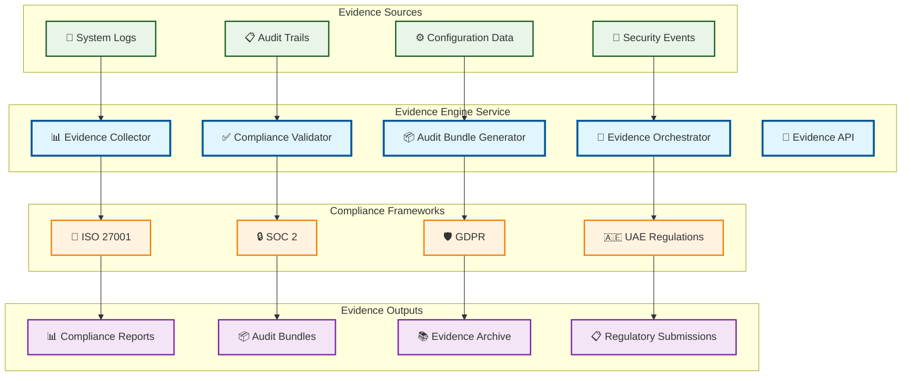

# Evidence Engine

> **TL;DR:** Automated evidence collection and compliance validation service for regulatory requirements and audit trails

## 📊 **Architecture Overview**

### 📋 **Where it fits** - Compliance Evidence Hub

## 📈 **SLOs & Performance**

| Metric | Target | Current |
|--------|--------|---------|
| **Evidence Collection** | 100% | 100% ✅ |
| **Compliance Accuracy** | >99% | 99.5% ✅ |
| **Audit Bundle Generation** | <1h | 45min ✅ |
| **Regulatory Readiness** | 100% | 100% ✅ |

---

**🎯 Owner:** Compliance Team | **📧 Contact:** compliance@atlasmesh.com
