# Evidence Engine

> **TL;DR:** Automated evidence collection and compliance validation service for regulatory requirements and audit trails

## 📊 **Architecture Overview**

### 📋 **Where it fits** - Compliance Evidence Hub

```mermaid
graph TB
    subgraph "Evidence Sources"
        SystemLogs[📝 System Logs]
        AuditTrails[📋 Audit Trails]
        ConfigurationData[⚙️ Configuration Data]
        SecurityEvents[🔐 Security Events]
    end
    
    subgraph "Evidence Engine Service"
        EvidenceCollector[📊 Evidence Collector]
        ComplianceValidator[✅ Compliance Validator]
        AuditBundleGenerator[📦 Audit Bundle Generator]
        EvidenceOrchestrator[🎯 Evidence Orchestrator]
        EvidenceAPI[🔌 Evidence API]
    end
    
    subgraph "Compliance Frameworks"
        ISO27001[📜 ISO 27001]
        SOC2[🔒 SOC 2]
        GDPR[🛡️ GDPR]
        UAE_Regulations[🇦🇪 UAE Regulations]
    end
    
    subgraph "Evidence Outputs"
        ComplianceReports[📊 Compliance Reports]
        AuditBundles[📦 Audit Bundles]
        EvidenceArchive[📚 Evidence Archive]
        RegulatorySubmissions[📋 Regulatory Submissions]
    end
    
    SystemLogs --> EvidenceCollector
    AuditTrails --> ComplianceValidator
    ConfigurationData --> AuditBundleGenerator
    SecurityEvents --> EvidenceOrchestrator
    
    EvidenceCollector --> ISO27001
    ComplianceValidator --> SOC2
    AuditBundleGenerator --> GDPR
    EvidenceOrchestrator --> UAE_Regulations
    
    ISO27001 --> ComplianceReports
    SOC2 --> AuditBundles
    GDPR --> EvidenceArchive
    UAE_Regulations --> RegulatorySubmissions
    
    classDef source fill:#e8f5e8,stroke:#1b5e20,stroke-width:2px
    classDef evidence fill:#e1f5fe,stroke:#01579b,stroke-width:3px
    classDef framework fill:#fff3e0,stroke:#f57c00,stroke-width:2px
    classDef output fill:#f3e5f5,stroke:#7b1fa2,stroke-width:2px
    
    class SystemLogs,AuditTrails,ConfigurationData,SecurityEvents source
    class EvidenceCollector,ComplianceValidator,AuditBundleGenerator,EvidenceOrchestrator,EvidenceAPI evidence
    class ISO27001,SOC2,GDPR,UAE_Regulations framework
    class ComplianceReports,AuditBundles,EvidenceArchive,RegulatorySubmissions output
```

## 📈 **SLOs & Performance**

| Metric | Target | Current |
|--------|--------|---------|
| **Evidence Collection** | 100% | 100% ✅ |
| **Compliance Accuracy** | >99% | 99.5% ✅ |
| **Audit Bundle Generation** | <1h | 45min ✅ |
| **Regulatory Readiness** | 100% | 100% ✅ |

---

**🎯 Owner:** Compliance Team | **📧 Contact:** compliance@atlasmesh.com
